# The1 Data Platform - Data Pipeline Architecture

> **Version:** 1.0.0
> **Last Updated:** 2026-02-20
> **Status:** Production Documentation
> **Scope:** All data pipelines across The1 Data Platform

---

## Table of Contents

1. [Platform Overview](#1-platform-overview)
2. [Pipeline Types](#2-pipeline-types)
3. [Streaming Pipelines (Dataflow)](#3-streaming-pipelines-dataflow)
4. [Batch Pipelines (Dataflow)](#4-batch-pipelines-dataflow)
5. [Cloud Run Pipelines](#5-cloud-run-pipelines)
6. [Customer Profile Pipeline (Insight)](#6-customer-profile-pipeline-insight)
7. [Messaging Pipelines](#7-messaging-pipelines)
8. [Code Architecture Pattern (Hexagonal)](#8-code-architecture-pattern-hexagonal)
9. [Configuration System](#9-configuration-system)
10. [Iceberg Write Path (BLMS REST Catalog)](#10-iceberg-write-path-blms-rest-catalog)
11. [BigQuery Write Patterns](#11-bigquery-write-patterns)
12. [Multi-Table Fan-Out Pattern](#12-multi-table-fan-out-pattern)
13. [Deployment and CI/CD](#13-deployment-and-cicd)
14. [Key Technical Patterns](#14-key-technical-patterns)
15. [Per-Collector Summary](#15-per-collector-summary)
16. [Infrastructure Overview](#16-infrastructure-overview)

---

## 1. Platform Overview

The1 Data Platform ingests, transforms, and stores data from multiple business domains. Each domain has dedicated data collectors that follow consistent architectural patterns while adapting to domain-specific requirements.

### High-Level Platform Architecture

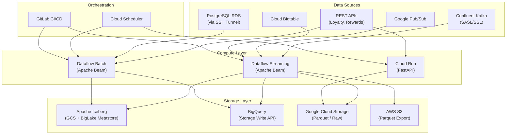

### Domain Organization

```
realproject/
+-- loyalty/           # Loyalty domain (members, tiers, purchases, transactions)
+-- sale/              # Sales domain (sales-collector)
+-- insight/           # Insight domain (customer-profile)
+-- message/           # Messaging domain (messages, communications, templates)
+-- common/            # Shared libraries (common.beam, common_cloudrun)
+-- terraform/         # Infrastructure-as-code
```

---

## 2. Pipeline Types

The platform uses four distinct pipeline patterns, chosen based on data source characteristics and latency requirements.

| Pipeline Type | Runtime | Trigger | Latency | Use Cases |
|---------------|---------|---------|---------|-----------|
| **Streaming (Dataflow)** | Apache Beam | Continuous (Kafka/Pub/Sub) | Seconds-minutes | members, transactions, purchases, sales, customer-profile, messages |
| **Batch (Dataflow)** | Apache Beam | Cloud Scheduler (daily) | Daily | tiers-collector, members-tiers-history |
| **Cloud Run** | FastAPI | Cloud Scheduler (daily) | Daily | rewards-collector |
| **Init Data (Dataflow Batch)** | Apache Beam | GitLab CI manual trigger | One-time | Initial data load for any collector |

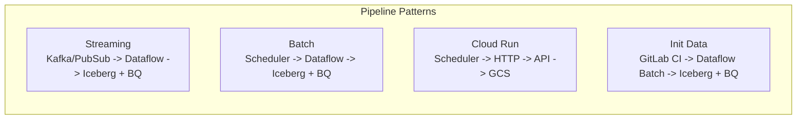

---

## 3. Streaming Pipelines (Dataflow)

### 3.1 General Streaming Pattern

All Kafka-based streaming pipelines follow this pattern:

```
Confluent Kafka (SASL/SSL)
  -> KafkaReaderAdapter (from common.beam library) / ReadFromKafka (native)
  -> ExtractValueDoFn (extract bytes from Kafka record)
  -> DecodeAvroOrJsonDoFn / DecodeParseDoFn (JSON/Avro decode)
  -> AttachEventNameDoFn (add topic name as eventName)
  -> BuildRawEventDoFn (wrap in envelope: eventId, source, eventName, timestamp, payload)
  -> WindowInto(FixedWindows)
  -> Fan-out:
    +-> IcebergSink / GcsIcebergWriter -> managed.Write(ICEBERG) -> GCS (Iceberg via BigLake REST)
    +-> Map/FlatMap transformers -> BigQuerySink / WriteToBigQuery (Storage Write API)
```

### 3.2 Sales Collector (Streaming)

**Source:** Kafka topic `loyalty.sales.created`
**Output:** 1 Iceberg table (raw_sales) + 3 BigQuery tables (sales_receipt, sales_sku, sales_tender)

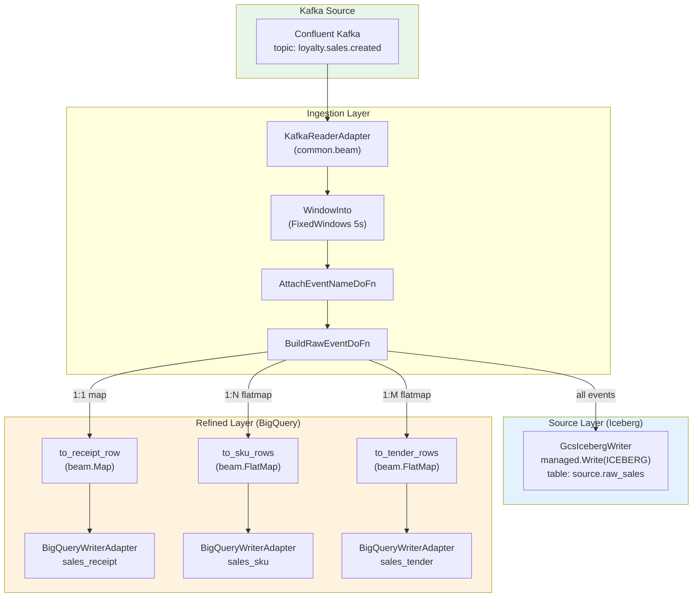

**Key characteristics:**
- Window size: 5 seconds
- Iceberg triggering frequency: 300 seconds (5 minutes)
- Fan-out: 1 receipt per event, N SKU rows per event, M tender rows per event
- BQ partitioning: MONTH on `trans_date`, with clustering on partner_code, member_number

### 3.3 Members Collector (Streaming)

**Source:** 2 Kafka topics (`loyalty.members.upgraded`, `loyalty.members.downgraded`)
**Output:** Up to 4 Iceberg tables + 4 BigQuery tables
**Special:** API enrichment (Loyalty API for member tier + tier maintenance data)

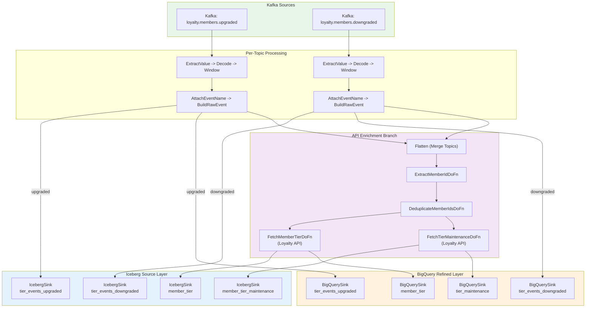

**Key characteristics:**
- Window size: 60 seconds
- Per-topic Iceberg/BQ writes (upgraded vs downgraded have different schemas)
- API enrichment: Extracts member IDs from Kafka events, deduplicates, then calls Loyalty API
- Avro/JSON auto-detection with Confluent Schema Registry support
- Supports CDC mode for member_tier table (prod uses UPSERT with primary key `memberTierId`)
- Initial data load mode: `job_type=initial_data` reads from BQ staging tables

### 3.4 Purchases Collector (Streaming)

**Source:** Kafka topics (2 topics for purchases)
**Output:** 1 Iceberg table + 3 BigQuery tables + Pub/Sub (filtered)

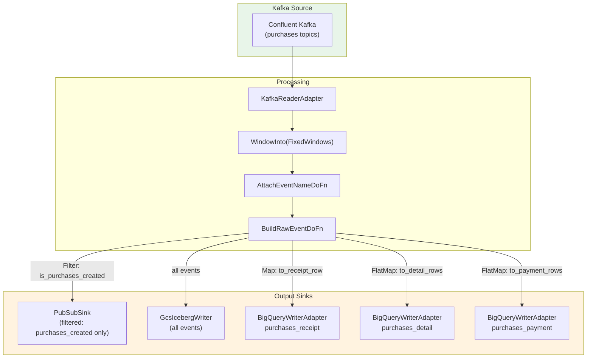

**Key characteristics:**
- Same fan-out pattern as sales-collector (receipt + detail + payment)
- Additional Pub/Sub output for downstream event consumers (filtered to purchases_created events only)
- Uses common.beam shared library for Kafka reader and BigQuery writer

### 3.5 Transactions Collector (Streaming)

**Source:** Kafka topics (3 topics: earned, burned, cancelled)
**Output:** GCS Parquet + RAW BQ + REFINED BQ (topic-routed) + SEM BQ + Iceberg (optional)

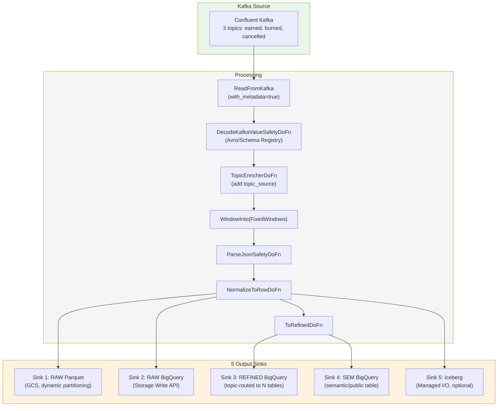

**Key characteristics:**
- Multi-topic with metadata extraction (topic name determines routing)
- Avro deserialization with Confluent Schema Registry
- Topic-based routing: different topics route to different refined BQ tables
- 5 parallel output sinks (most complex pipeline)
- Supports both BigLake REST and Hadoop Iceberg catalog types
- Kafka connectivity validation at startup (DNS resolution + preflight check)

---

## 4. Batch Pipelines (Dataflow)

### 4.1 Tiers Collector (Batch)

**Source:** Loyalty Tiers Master REST API
**Trigger:** Cloud Scheduler (1AM BKK daily)
**Output:** 1 Iceberg table + 1 BigQuery table

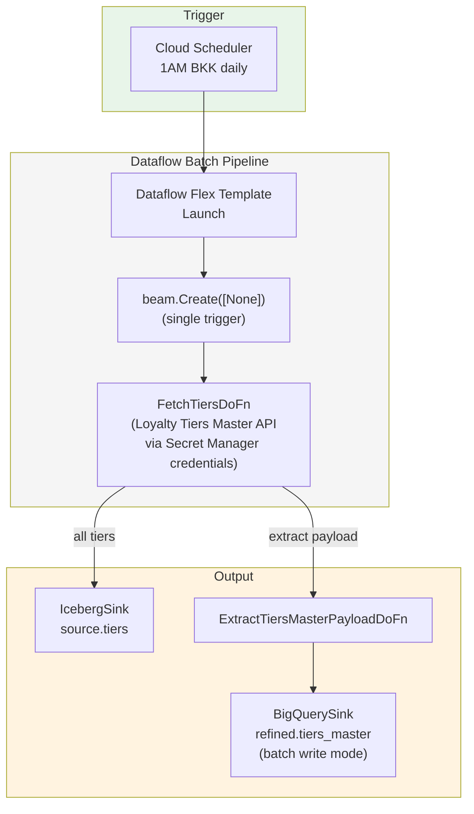

**Key characteristics:**
- Pure batch: no Kafka, no PeriodicImpulse, no streaming
- Single trigger via `beam.Create([None])` -- fetches all tiers once
- API authentication via Secret Manager (clientId/clientSecret)
- Supports both manual (PyIceberg) and managed_io (Beam Managed I/O) Iceberg writers
- BQ refresh (Option B) disabled pending infrastructure readiness

### 4.2 Members Tiers History Collector (Batch)

**Source:** PostgreSQL RDS (via SSH tunnel)
**Trigger:** Cloud Scheduler (1AM BKK daily, with process_date=yesterday)
**Output:** 1 Iceberg table + 1 BigQuery table

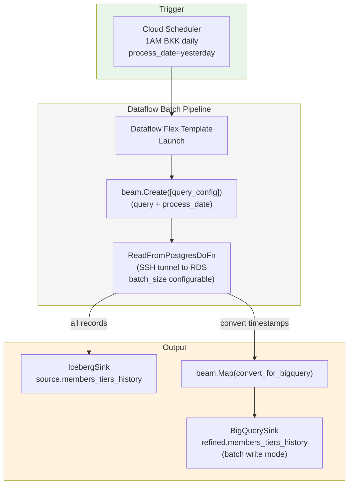

**Key characteristics:**
- SSH tunnel to PostgreSQL RDS (host, port, user, private_key from config)
- SQL query template with `{prev_date}` placeholder resolved to process_date
- process_date: CLI `--process_date` or default to yesterday
- BQ write_disposition configurable (WRITE_APPEND default)
- Initial data load mode: `job_type=initial_data` reads from BQ staging tables

### 4.3 Initial Data Load (Batch, All Collectors)

Used for one-time data backfill. Available for members-collector and members-tiers-history-collector.

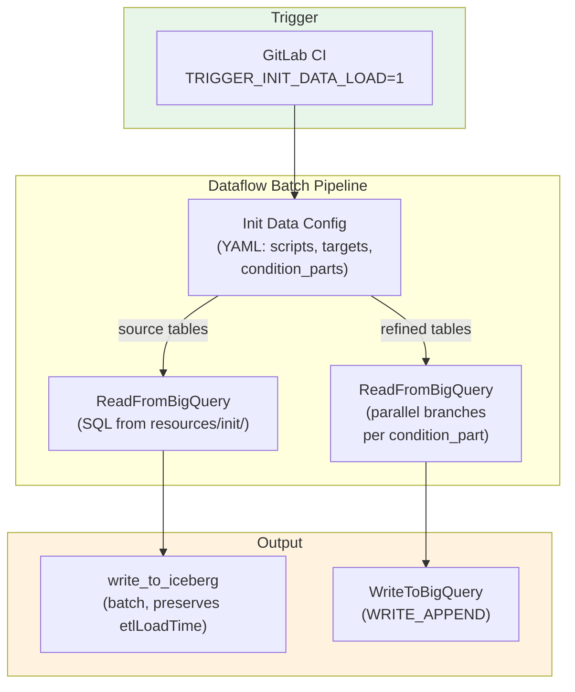

**Key characteristics:**
- SQL files embedded in Docker image (`resources/init/`)
- Supports `condition_parts` for parallel branch splitting (handles large datasets)
- Preserves `etlLoadTime` from source (passthrough, not regenerated)
- Creates BLMS catalog config without triggering_frequency (batch mode)

---

## 5. Cloud Run Pipelines

### 5.1 Rewards Collector (Cloud Run)

**Runtime:** FastAPI on Cloud Run
**Trigger:** Cloud Scheduler (daily HTTP POST)
**Output:** GCS (Parquet files)

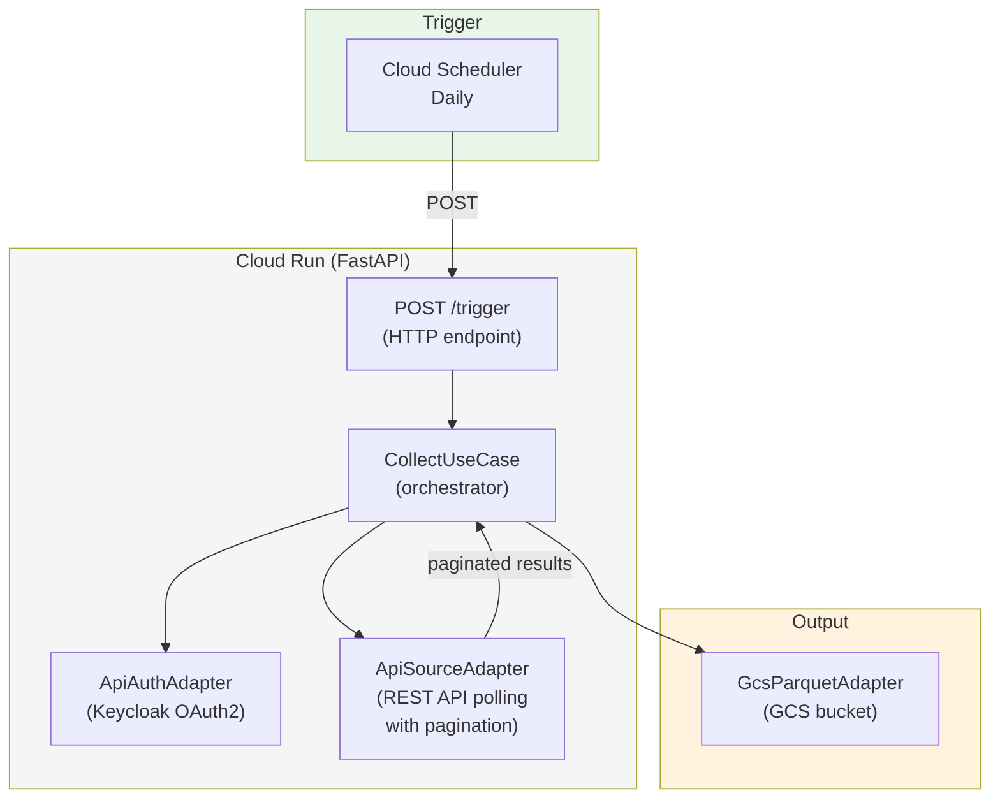

**Key characteristics:**
- Clean Architecture / Hexagonal pattern with Ports and Adapters
- YAML-driven pipeline configuration (sources, destinations, auth profiles)
- Auth via Keycloak (OAuth2 client_credentials flow)
- Secrets from GCP Secret Manager
- Multiple pipelines configurable from single YAML
- Destination type: `gcs_parquet` (writes Parquet files to GCS bucket)
- Uses `common_cloudrun` shared library

---

## 6. Customer Profile Pipeline (Insight)

### 6.1 Overview

The customer profile pipeline is the most complex streaming pipeline, with CDC writes to BigQuery, S3 Parquet exports, Iceberg merge operations, and consent processing.

**Source:** Pub/Sub (ms-personas events) + Bigtable (profiles, consents)
**Output:** BigQuery CDC + AWS S3 (Parquet) + Iceberg (periodic merge)

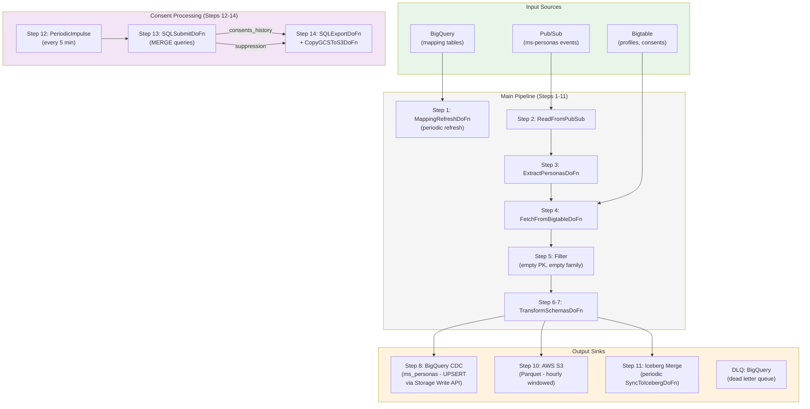

### 6.2 Consent Processing Flow

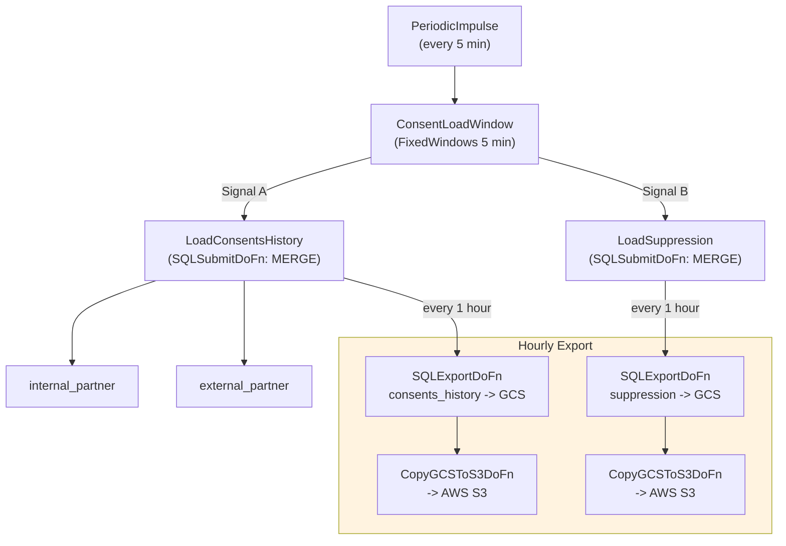

**Key characteristics:**
- V3 architecture: Hexagonal (Ports & Adapters) + V2 DoFn pattern (self-contained)
- Flex Template deployment (Docker-based)
- BigQuery CDC: Storage Write API with UPSERT semantics
- AWS S3: Parquet files, hourly windowed, cross-cloud export
- Iceberg merge: Periodic sync from BQ to BigLake Iceberg history table
- Consent processing: SQL-based MERGE queries, GCS-to-S3 copy
- Rate-limited logging to prevent log quota exhaustion
- SQL source switch: GCS bucket or embedded resources

---

## 7. Messaging Pipelines

### 7.1 Messages Collector (Streaming)

**Source:** Kafka (messaging topics)
**Output:** Iceberg + BigQuery + Bigtable + Pub/Sub

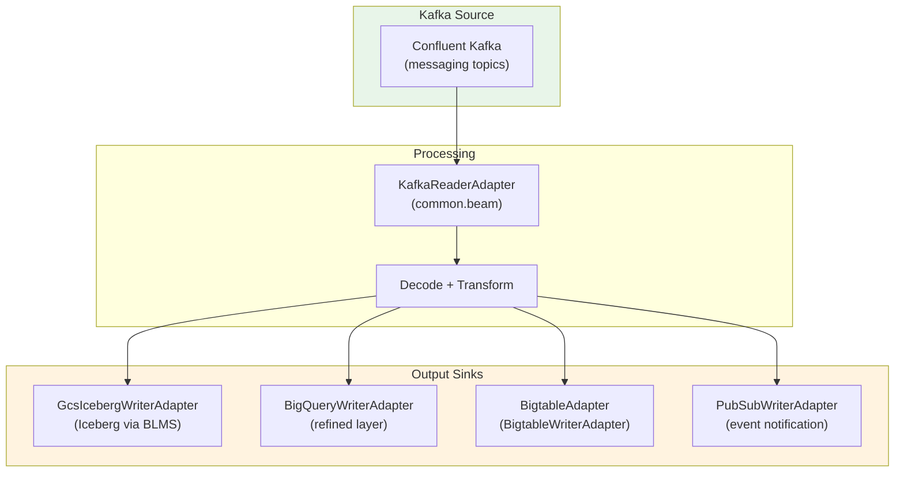

**Key characteristics:**
- 4 output sinks (most diverse output set: Iceberg, BQ, Bigtable, Pub/Sub)
- Bigtable used for real-time lookup/enrichment downstream
- Uses common.beam shared library for Kafka reader, BigQuery writer, and Bigtable writer
- Pub/Sub for downstream event consumers

---

## 8. Code Architecture Pattern (Hexagonal)

ALL Python Dataflow pipelines follow hexagonal architecture (Ports & Adapters), with the Composition Root pattern in `main.py`.

### 8.1 Standard Directory Structure

```
{collector}/
+-- src/
|   +-- main.py                          # Composition Root (wires everything)
|   +-- domain/                          # Pure business logic (no I/O)
|   |   +-- models.py                    # TypedDict data models
|   |   +-- schemas.py                   # PyArrow + BigQuery schemas
|   |   +-- transformers.py              # Pure transform functions
|   |   +-- validators.py               # Validation helpers
|   |   +-- config/
|   |   |   +-- pipeline_config.py       # Runtime config (Pydantic/dataclass)
|   |   |   +-- bigquery_*_config.py     # BQ config with to_table_config() factory
|   |   +-- blms_catalog_config.py       # BLMS REST catalog config (frozen dataclass)
|   |   +-- managed_iceberg_write_config.py  # Iceberg write config (frozen dataclass)
|   +-- adapters/
|   |   +-- input/
|   |   |   +-- configuration/
|   |   |       +-- settings.py          # Pydantic DTOs (validate YAML config)
|   |   |       +-- configuration_adapter.py  # YAML -> PipelineConfig loader
|   |   |       +-- secret_adapter.py    # GCP Secret Manager client
|   |   |       +-- logging_adapter.py   # Structured logging setup
|   |   +-- output/
|   |       +-- gcs/
|   |       |   +-- biglake_metastore_config.py  # BLMS catalog config (frozen)
|   |       |   +-- gcs_biglake_iceberg_writer_config.py  # Iceberg write config
|   |       |   +-- gcs_biglake_iceberg_writer.py  # IcebergIO PTransform
|   |       +-- bigquery/
|   |       |   +-- bigquery_writer_config.py
|   |       |   +-- bigquery_writer.py   # WriteToBigQuery PTransform
|   |       +-- iceberg_sink.py          # IcebergSink(config, schema, row_mapper)
|   |       +-- iceberg_writer.py        # write_to_iceberg() helper
|   |       +-- bigquery_sink.py         # BigQuerySink PTransform
|   +-- application/
|       +-- pipeline/
|           +-- builder.py               # PipelineBuilder orchestration
|           +-- dofns.py                 # DoFn implementations (Beam-specific)
|           +-- transform_dofns.py       # Payload extraction DoFns
|           +-- api_dofns.py             # API fetch DoFns (optional)
+-- config/
|   +-- base.yaml                        # Common settings (all environments)
|   +-- stg.yaml                         # STG overrides
|   +-- prod.yaml                        # PROD overrides
+-- tests/
+-- Dockerfile
+-- pyproject.toml
+-- .gitlab-ci.yml
```

### 8.2 Composition Root Pattern

The `main.py` file is the only place where concrete adapters are instantiated. The PipelineBuilder receives pre-configured PTransforms via dependency injection.

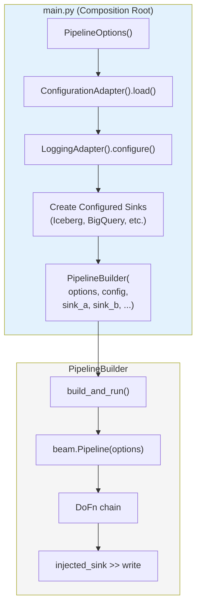

### 8.3 Domain Model Pattern

All events flow through a standard envelope:

```python
class RawEvent(TypedDict):
    eventId: str       # UUID v4, auto-generated
    source: str        # e.g. "sales-collector"
    eventName: str     # e.g. "loyalty.sales" (from topic name)
    timestamp: int     # Unix epoch seconds
    payload: str       # JSON-serialized original payload
```

The `IntermediateEvent` is used between decode and envelope wrapping:

```python
class IntermediateEvent(TypedDict):
    eventName: str
    payload: dict[str, Any]
```

---

## 9. Configuration System

### 9.1 Configuration Loading Flow

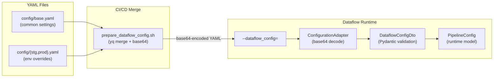

### 9.2 Configuration Hierarchy

```yaml
# base.yaml (common across environments)
secret_name: "sales-collector"
window_size_seconds: 5
kafka_topics: ["loyalty.sales.created"]
kafka_group_id: "the1-sales-collector"
blms_rest_uri: "https://biglake.googleapis.com/iceberg/v1/restcatalog"
blms_namespace: "source"
iceberg_table: "raw_sales"
region: "asia-southeast1"
refined:
  sales_receipt:
    enable: true
    partition_field: "trans_date"
    write_mode: "append"

# stg.yaml (STG overrides)
project_id: "the1-loyalty-data-stg"
iceberg_warehouse: "gs://the1-loyalty-data-stg-pipeline-source"
log_level: "DEBUG"
refined:
  dataset_id: "refined"

# prod.yaml (PROD overrides)
project_id: "the1-loyalty-data-prod"
iceberg_warehouse: "gs://the1-loyalty-data-prod-pipeline-source"
log_level: "ERROR"
refined:
  dataset_id: "refined"
  member_tier:
    write_mode: "cdc"  # Override to CDC in prod
    primary_key: "memberTierId"
```

### 9.3 Secret Management

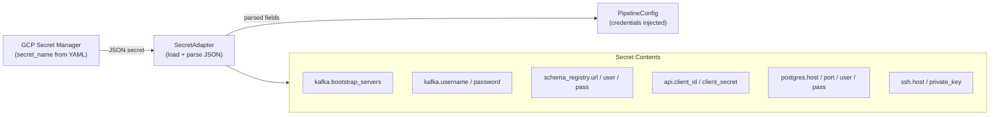

---

## 10. Iceberg Write Path (BLMS REST Catalog)

All Iceberg writes use the BigLake Metastore (BLMS) REST Catalog for metadata management.

### 10.1 BLMS REST Catalog Configuration

```python
@dataclass(frozen=True)
class BlmsCatalogConfig:
    warehouse_path: str   # e.g. "gs://the1-loyalty-data-stg-pipeline-source"
    namespace: str        # e.g. "source"
    rest_uri: str         # "https://biglake.googleapis.com/iceberg/v1/restcatalog"
    project_id: str       # e.g. "the1-loyalty-data-stg"
    catalog_name: str     # Auto-derived from warehouse_path (bucket name)
```

### 10.2 Catalog Properties

```python
catalog_properties = {
    "type": "rest",
    "uri": "https://biglake.googleapis.com/iceberg/v1/restcatalog",
    "warehouse": "gs://{catalog_name}",
    "rest.auth.type": "org.apache.iceberg.gcp.auth.GoogleAuthManager",
    "header.X-Iceberg-Access-Delegation": "vended-credentials",
    "header.x-goog-user-project": "{project_id}",
    "io-impl": "org.apache.iceberg.gcp.gcs.GCSFileIO",
    "rest-metrics-reporting-enabled": "false",
}
```

### 10.3 Write Flow

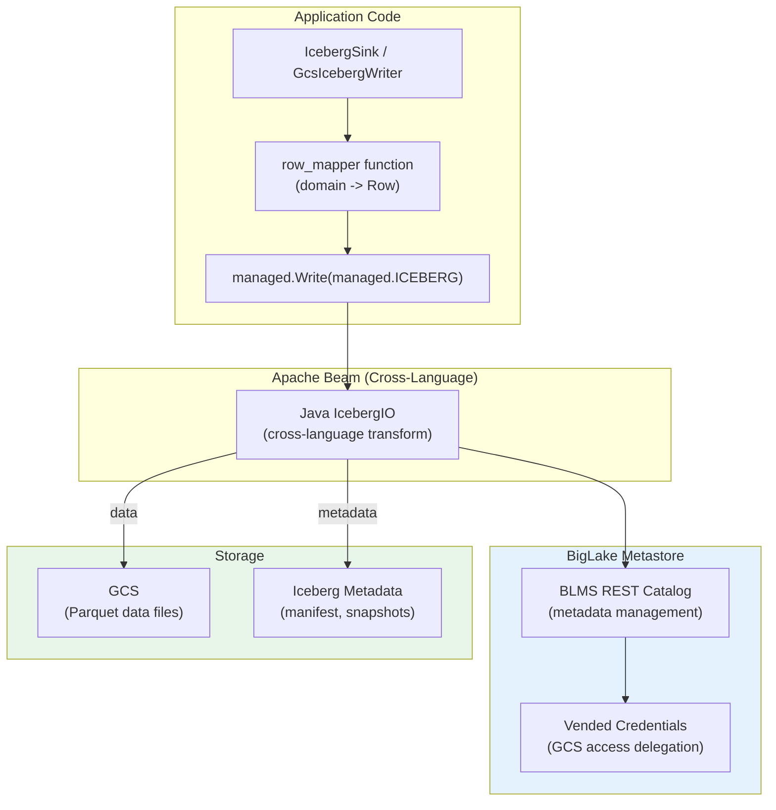

### 10.4 Two Writer Modes

| Mode | Implementation | Usage |
|------|---------------|-------|
| `managed_io` | `IcebergSink` -> `managed.Write(managed.ICEBERG)` | **Active** (all collectors) |
| `manual` | `ManualIcebergSink` -> PyIceberg direct writes | Legacy fallback (preserved as option) |

The managed_io path uses Beam's cross-language Java IcebergIO connector, which handles schema evolution, partition management, and concurrent writes automatically.

---

## 11. BigQuery Write Patterns

### 11.1 Write Modes

| Mode | Method | Semantics | Use Cases |
|------|--------|-----------|-----------|
| `append` | `STORAGE_WRITE_API` / `WRITE_APPEND` | At-least-once | Most collectors (default) |
| `cdc` | Storage Write API with CDC | UPSERT (exactly-once) | members-collector member_tier (prod) |
| `batch` | `WriteToBigQuery` | WRITE_APPEND | tiers-collector, m-t-h (batch mode) |

### 11.2 BigQuery Sink Configuration

```python
BigQuerySink(
    table="project:dataset.table_name",
    schema=SCHEMA_DICT,              # BigQuery schema definition
    write_mode="append",              # append, cdc, batch
    partition_field="etlLoadTime",    # Time partitioning field
    triggering_frequency=60,          # Seconds between writes (streaming)
    primary_key="memberTierId",       # Required for CDC mode
)
```

### 11.3 Timestamp Handling for BigQuery

```python
# CRITICAL: BigQuery Storage Write API requires apache_beam.utils.timestamp.Timestamp
# datetime.datetime WILL FAIL with: AttributeError: 'datetime' object has no attribute 'micros'

from apache_beam.utils.timestamp import Timestamp

# Bangkok timezone offset (+7 hours)
_BANGKOK_OFFSET_SECONDS = 7 * 3600
_BANGKOK_OFFSET_MICROS = _BANGKOK_OFFSET_SECONDS * 1_000_000

# Current time in Bangkok
etlLoadTime = Timestamp(micros=Timestamp.now().micros + _BANGKOK_OFFSET_MICROS)

# Unix timestamp to Bangkok
timestamp_ts = Timestamp(seconds=unix_ts + _BANGKOK_OFFSET_SECONDS)
```

---

## 12. Multi-Table Fan-Out Pattern

Several pipelines use the fan-out pattern where one Kafka event produces rows for multiple output tables.

### 12.1 Fan-Out Examples

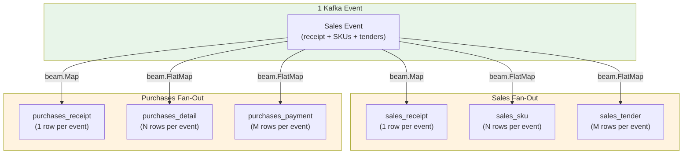

**Mapping rules:**
- `beam.Map` (1:1): One input record produces exactly one output record (receipt)
- `beam.FlatMap` (1:N): One input record produces zero or more output records (SKUs, tenders, details, payments)

---

## 13. Deployment and CI/CD

### 13.1 Deployment Architecture

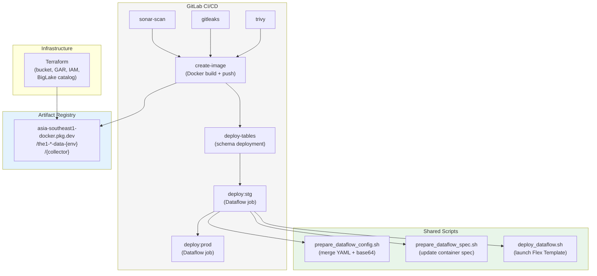

### 13.2 Deployment Script Chain

```bash
# 1. Merge YAML configs and base64 encode
./scripts/prepare_dataflow_config.sh \
  --base config/base.yaml \
  --env config/${ENV}.yaml

# 2. Update container spec with image tag
./scripts/prepare_dataflow_spec.sh

# 3. Deploy Dataflow Flex Template
./scripts/deploy_dataflow.sh
```

### 13.3 Streaming vs Batch Deployment

| Aspect | Streaming (members-collector) | Batch (tiers-collector) |
|--------|------------------------------|------------------------|
| Mode | Continuous | Daily scheduled |
| Deploy | Cancel existing -> launch new | Direct launch |
| Template | Flex Template (Docker) | Flex Template (Docker) |
| Shutdown | Cancel (or drain-then-cancel) | Auto-terminates |
| Scaling | Auto-scaling (Dataflow) | Fixed workers |

---

## 14. Key Technical Patterns

### 14.1 Bangkok Timezone (+7)

ALL timestamps across the platform use Bangkok timezone (UTC+7). This is a hard requirement for consistency.

```
Source (Iceberg):
  iceberg_writer.py -> _BANGKOK_TZ = timezone(timedelta(hours=7))
  etlLoadTime stored as INT64 YYYYMMDDHH in Bangkok time

Refined (BigQuery):
  ALL TIMESTAMP fields have +7h offset baked in
  _BANGKOK_OFFSET_SECONDS = 7 * 3600
  _BANGKOK_OFFSET_MICROS = _BANGKOK_OFFSET_SECONDS * 1_000_000
  etlLoadTime = Timestamp(micros=Timestamp.now().micros + _BANGKOK_OFFSET_MICROS)
```

### 14.2 Iceberg Partitioning

```
etlLoadTime: INT64 (YYYYMMDDHH format in Bangkok time)
Partition: identity(etlLoadTime)
```

### 14.3 Write Mode by Environment

| Setting | STG | PROD |
|---------|-----|------|
| `write_mode` | `append` | `cdc` (for member_tier) |
| `log_level` | `DEBUG` | `ERROR` |
| BLMS Catalog | Same REST endpoint | Same REST endpoint |

### 14.4 Error Handling

- DoFns use metrics counters (seen, ok, errors) for observability
- Failed records are logged (warning level) and dropped (no DLQ yet for most collectors)
- Customer profile pipeline has BigQuery DLQ
- API DoFns have retry logic with exponential backoff
- Pipeline-level exception handling in `main.py` with `logger.exception()`

### 14.5 Shared Libraries

| Library | Location | Used By |
|---------|----------|---------|
| `common.beam` | `common/` | sales, purchases, messages (Kafka reader, BQ writer, Bigtable writer) |
| `common_cloudrun` | `common/` | rewards-collector (config, API source, logging) |

---

## 15. Per-Collector Summary

| Collector | Domain | Type | Source | Iceberg Tables | BQ Tables | Trigger | Architecture |
|-----------|--------|------|--------|---------------|-----------|---------|--------------|
| **members-collector** | loyalty | streaming | Kafka (2 topics) + Loyalty API | 4 (tier_events_upgraded, tier_events_downgraded, member_tier, member_tier_maintenance) | 4 (matching) | continuous | Hexagonal + DI |
| **tiers-collector** | loyalty | batch | Loyalty Tiers Master API | 1 (tiers) | 1 (tiers_master) | Cloud Scheduler 1AM BKK | Hexagonal + DI |
| **members-tiers-history** | loyalty | batch | PostgreSQL RDS (SSH tunnel) | 1 (members_tiers_history) | 1 (members_tiers_history) | Cloud Scheduler 1AM BKK | Hexagonal + DI |
| **transactions-collector** | loyalty | streaming | Kafka (3 topics: earned, burned, cancelled) | 1 (optional) | 3+ (raw, refined per-topic, SEM) | continuous | Hexagonal (legacy flat config) |
| **purchases-collector** | loyalty | streaming | Kafka (2 topics) | 1 | 3 (receipt, detail, payment) + Pub/Sub | continuous | Hexagonal + DI |
| **rewards-collector** | loyalty | cloud-run | Rewards REST API | 0 | 0 (GCS Parquet) | Cloud Scheduler daily | Clean Architecture (FastAPI) |
| **sales-collector** | sales | streaming | Kafka (1 topic: loyalty.sales.created) | 1 (raw_sales) | 3 (receipt, sku, tender) | continuous | Hexagonal + DI |
| **customer-profile** | insight | streaming | Pub/Sub + Bigtable | 1 (periodic merge) | 1 (CDC: ms_personas) + consent tables | continuous | Hexagonal + V2 DoFn |
| **messages-collector** | messaging | streaming | Kafka | 1 | 1 + Bigtable + Pub/Sub | continuous | Hexagonal + DI |

---

## 16. Infrastructure Overview

### 16.1 Per-Collector Infrastructure (Terraform)

```
infrastructure/{collector}/
+-- artifact.tf              # Google Artifact Registry (Docker images)
+-- bucket.tf                # GCS bucket (Iceberg warehouse)
+-- biglake-metastore.tf     # IAM: SA access to source + refined datasets
+-- schemas/
|   +-- deploy.py            # BQ table creation (Option A active, Option B disabled)
|   +-- *.json               # BigQuery schema definitions
+-- templates/
    +-- container_spec.json  # Dataflow Flex Template spec
```

### 16.2 Common Infrastructure

```
common/GCP/
+-- biglake-metastore.tf     # BigLake catalog creation
+-- source-bucket.tf         # Shared source GCS bucket
+-- service-account.tf       # Service account IAM
```

### 16.3 GCP Services Used

| Service | Purpose |
|---------|---------|
| **Dataflow** | Apache Beam pipeline execution (streaming + batch) |
| **Cloud Run** | REST API-based collectors (rewards) |
| **Cloud Scheduler** | Trigger batch pipelines (daily) |
| **Confluent Kafka** | Event streaming source (SASL/SSL) |
| **Pub/Sub** | Event bus (customer-profile source, purchases output) |
| **BigQuery** | Analytical data warehouse (refined layer) |
| **Cloud Storage (GCS)** | Iceberg data files, Parquet raw files |
| **BigLake Metastore** | Iceberg REST catalog (metadata management) |
| **Bigtable** | Real-time key-value store (customer-profile, messages) |
| **Secret Manager** | Credentials storage (Kafka, API, DB) |
| **Artifact Registry** | Docker image storage |
| **Cloud Build / GitLab CI** | CI/CD pipeline |

### 16.4 Network Topology

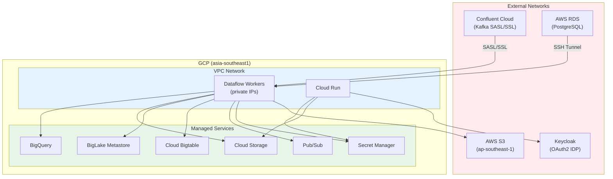

---

## Appendix A: DoFn Processing Chain (Canonical Order)

The standard DoFn chain for Kafka-based streaming pipelines:

```
1. ExtractValueDoFn        - Extract bytes from Kafka record (key, value) tuple
2. DecodeAvroOrJsonDoFn    - Decode Avro (Schema Registry) or JSON bytes
   OR DecodeParseDoFn      - Simpler JSON-only decoder
3. AttachEventNameDoFn     - Attach eventName from topic name
4. BuildRawEventDoFn       - Wrap in RawEvent envelope (eventId, source, eventName, timestamp, payload)
5. [domain-specific]       - Extract payload for refined tables (e.g., ExtractTierEventPayloadDoFn)
```

Each DoFn includes:
- Beam Metrics counters (seen, ok, errors)
- Periodic progress logging (configurable via `log_every_n`)
- Graceful error handling (log warning, drop record)

## Appendix B: Iceberg Schema Convention

All Iceberg source tables follow the same RAW event schema:

```
eventId:     STRING   (UUID v4)
source:      STRING   (collector name)
eventName:   STRING   (Kafka topic / event type)
timestamp:   INT64    (Unix epoch seconds)
payload:     STRING   (JSON-serialized original event)
etlLoadTime: INT64    (YYYYMMDDHH in Bangkok timezone, identity partition)
```

## Appendix C: Configuration Reference

### Environment Variables (Dataflow Workers)

| Variable | Purpose | Set By |
|----------|---------|--------|
| `AVRO_USE_SCHEMA_REGISTRY` | Enable Schema Registry decoding | dataflow_config |
| `AVRO_PAYLOAD_FORMAT` | `avro` or `json` | dataflow_config |
| `AVRO_SCHEMA_REGISTRY_URL` | Confluent Schema Registry URL | dataflow_config |
| `SDK_CONTAINER_IMAGE` | Custom Docker image for Runner V2 | Flex Template |

### CLI Parameters

| Parameter | Purpose | Example |
|-----------|---------|---------|
| `--dataflow_config` | Base64-encoded merged YAML | (auto from CI) |
| `--job_type` | `normal` or `initial_data` | `--job_type=initial_data` |
| `--process_date` | Date to process (batch) | `--process_date=2026-02-19` |
| `--runner` | Beam runner | `DataflowRunner` |
| `--region` | GCP region | `asia-southeast1` |

---

*Document generated from codebase analysis of The1 Data Platform.*
*Last Updated: 2026-02-20*
