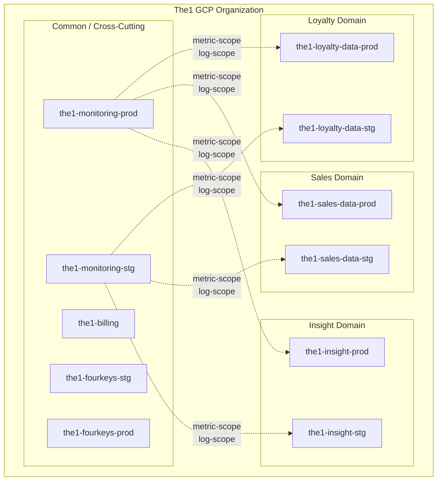
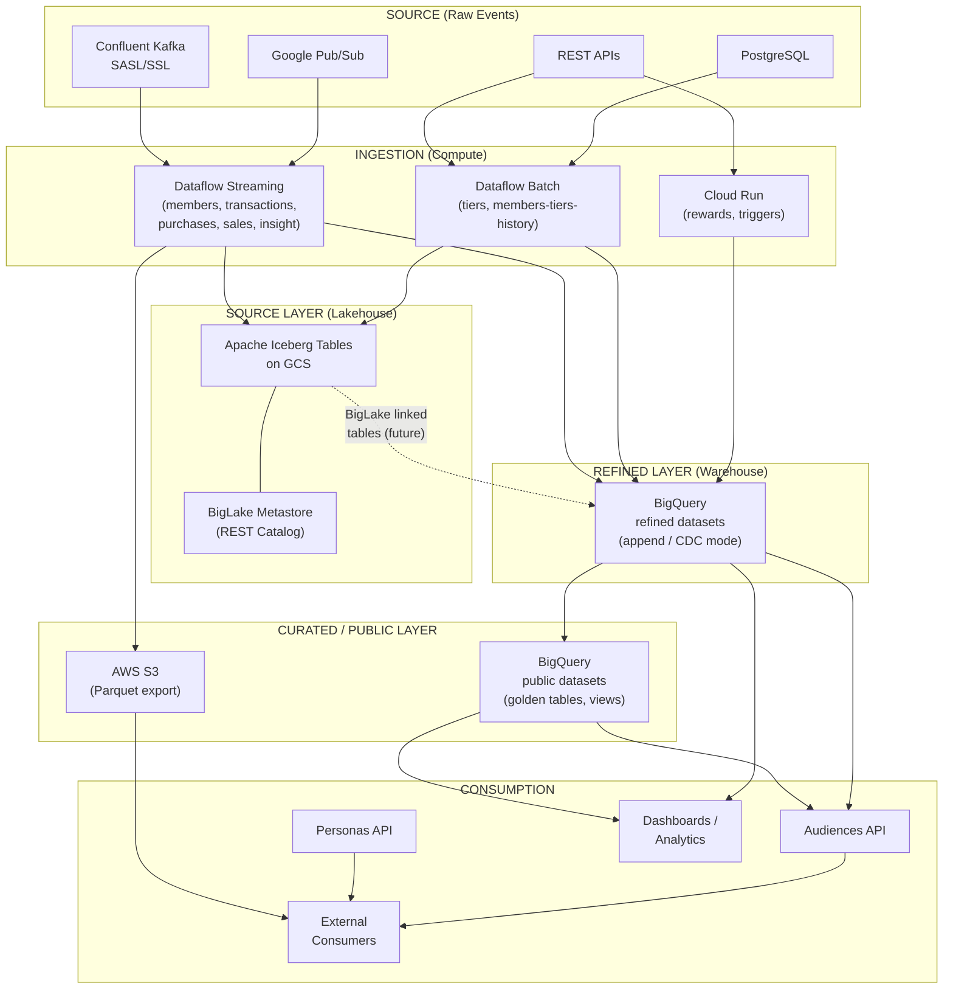
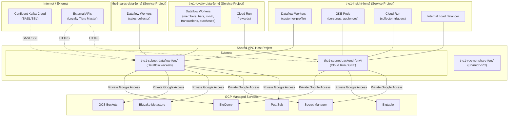
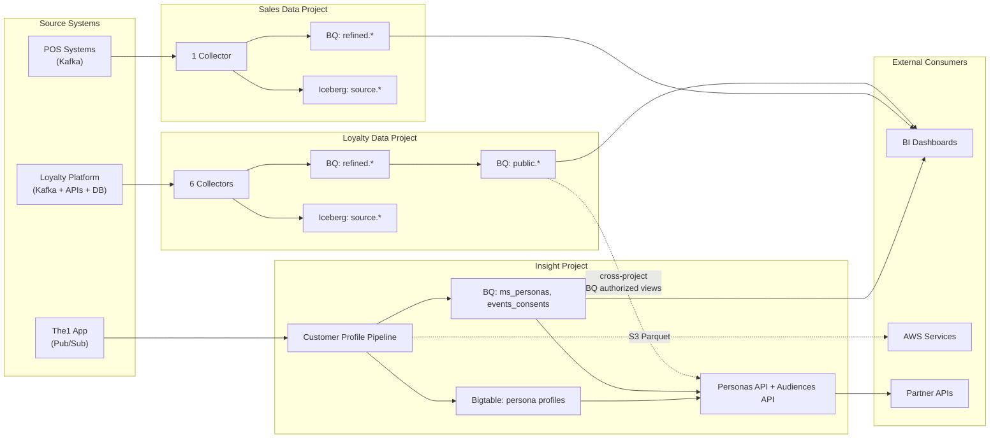

# The1 Data Platform -- High-Level Architecture

> **Version:** 1.0.0
> **Last Updated:** 2026-02-20
> **Status:** Living Document
> **Audience:** New developers, architects, cross-team engineers

---

## Table of Contents

1. [Executive Summary](#1-executive-summary)
2. [GCP Project Organization](#2-gcp-project-organization)
3. [Platform Architecture Overview](#3-platform-architecture-overview)
4. [Domain Deep Dive: Loyalty Data](#4-domain-deep-dive-loyalty-data)
5. [Domain Deep Dive: Sales Data](#5-domain-deep-dive-sales-data)
6. [Domain Deep Dive: Insight](#6-domain-deep-dive-insight)
7. [Data Architecture Layers](#7-data-architecture-layers)
8. [Technology Stack](#8-technology-stack)
9. [Infrastructure Patterns](#9-infrastructure-patterns)
10. [Network Topology](#10-network-topology)
11. [CI/CD Architecture](#11-cicd-architecture)
12. [Cross-Domain Data Flow](#12-cross-domain-data-flow)
13. [Security and IAM](#13-security-and-iam)
14. [References](#14-references)

---

## 1. Executive Summary

The1 Data Platform is a GCP-based enterprise data platform serving Thailand's largest loyalty program. The platform follows a **domain-driven design** with **project-per-service separation**, where each business domain (Loyalty, Sales, Insight) operates within its own GCP project boundary.

The platform ingests data from multiple sources (Confluent Kafka, REST APIs, PostgreSQL, Pub/Sub) through Apache Beam pipelines running on Google Cloud Dataflow. Data flows through a layered storage architecture: **Source Layer** (Apache Iceberg on GCS via BigLake REST Catalog) to **Refined Layer** (BigQuery) to **Curated/Public Layer** (BigQuery views and golden datasets), ultimately serving downstream APIs and analytics workloads.

### Key Design Principles

- **Domain isolation**: Each domain has its own GCP project, service accounts, and infrastructure
- **Lakehouse architecture**: Apache Iceberg provides the open table format for the source layer
- **Streaming-first**: Most collectors process events in real-time via Kafka, with batch collectors for master data
- **Infrastructure as Code**: All resources managed via Terraform with separate workspaces per environment
- **Hexagonal architecture**: Pipeline code follows Ports & Adapters pattern across all domains

---

## 2. GCP Project Organization

The platform uses a multi-project GCP organization where each domain and cross-cutting concern has dedicated projects per environment.



### Project Naming Convention

| Domain | STG Project | PROD Project |
|--------|-------------|--------------|
| Loyalty Data | `the1-loyalty-data-stg` | `the1-loyalty-data-prod` |
| Sales Data | `the1-sales-data-stg` | `the1-sales-data-prod` |
| Insight | `the1-insight-stg` | `the1-insight-prod` |
| Monitoring | `the1-monitoring-stg` | `the1-monitoring-prod` |
| Billing | `the1-billing` | (shared) |
| Four Keys | `the1-fourkeys-stg` | `the1-fourkeys-prod` |

### Terraform Organization

Infrastructure is managed through a centralized Terraform repository (`the1-terraform-gcp`) with the following structure:

```
the1-terraform-gcp/
├── landingzone/         # Organization-level bootstrap
├── modules/             # Reusable Terraform modules (gcs-bucket, etc.)
├── organization/        # Org policies and shared config
├── projects/
│   ├── common/          # Cross-cutting projects (billing, monitoring, fourkeys)
│   ├── nonprod/         # STG environment project configs
│   └── prod/            # PROD environment project configs
└── template/            # Project scaffolding templates
```

Each domain also maintains its own infrastructure-as-code within its repository for domain-specific resources (buckets, schemas, IAM bindings, BigLake catalogs).

---

## 3. Platform Architecture Overview

```mermaid
flowchart TB
    subgraph "External Sources"
        KAFKA["Confluent Kafka<br/>(SASL/SSL)"]
        API["REST APIs<br/>(Loyalty Tiers Master)"]
        PG["PostgreSQL<br/>(Members Tiers History)"]
        PUBSUB_EXT["Google Pub/Sub<br/>(Personas Events)"]
    end

    subgraph "the1-loyalty-data"
        direction TB
        MC["members-collector<br/><i>Streaming Dataflow</i>"]
        TC["tiers-collector<br/><i>Batch Dataflow</i>"]
        MTH["members-tiers-history<br/><i>Batch Dataflow</i>"]
        TXN["transactions-collector<br/><i>Streaming Dataflow</i>"]
        PC["purchases-collector<br/><i>Streaming Dataflow</i>"]
        RC["rewards-collector<br/><i>Cloud Run Batch</i>"]

        LOY_ICE["Iceberg on GCS<br/>(source layer)"]
        LOY_BQ["BigQuery<br/>(refined + public)"]
        LOY_BLMS["BigLake REST Catalog"]
    end

    subgraph "the1-sales-data"
        direction TB
        SC["sales-collector<br/><i>Streaming Dataflow</i>"]

        SALE_ICE["Iceberg on GCS<br/>(source layer)"]
        SALE_BQ["BigQuery<br/>(refined)"]
        SALE_BLMS["BigLake REST Catalog"]
    end

    subgraph "the1-insight"
        direction TB
        CPP["Customer Profile Pipeline<br/><i>Streaming Dataflow</i>"]
        PERS["Personas API<br/><i>Kotlin/Spring Boot</i>"]
        AUD["Audiences API<br/><i>Kotlin/Spring Boot</i>"]
        COLL["Collector<br/><i>Node.js</i>"]
        TRIG["Triggers<br/><i>Cloud Run + Scheduler</i>"]

        INS_BQ["BigQuery<br/>(CDC + analytics)"]
        INS_BT["Bigtable<br/>(personas)"]
        INS_CH["ClickHouse<br/>(OLAP)"]
        INS_REDIS["Redis<br/>(cache)"]
    end

    subgraph "AWS (Cross-Cloud)"
        S3["AWS S3<br/>(Parquet export)"]
    end

    KAFKA --> MC
    KAFKA --> TXN
    KAFKA --> PC
    KAFKA --> SC
    API --> TC
    API --> RC
    PG --> MTH
    PUBSUB_EXT --> CPP

    MC --> LOY_BLMS --> LOY_ICE
    MC --> LOY_BQ
    TC --> LOY_BLMS
    TC --> LOY_BQ
    MTH --> LOY_BLMS
    MTH --> LOY_BQ
    TXN --> LOY_ICE
    TXN --> LOY_BQ
    PC --> LOY_BLMS
    PC --> LOY_BQ

    SC --> SALE_BLMS --> SALE_ICE
    SC --> SALE_BQ

    CPP --> INS_BQ
    CPP --> S3
    CPP --> INS_BT
    PERS --> INS_BT
    PERS --> INS_REDIS
    AUD --> INS_BQ
    AUD --> INS_CH
    AUD --> INS_REDIS
    COLL --> INS_CH
    COLL --> INS_BQ
```



---

## 4. Domain Deep Dive: Loyalty Data

The Loyalty Data domain (`the1-loyalty-data-{env}`) is the largest domain with 6 collectors handling member events, tier changes, transactions, and purchases.

### 4.1 Collectors

| Collector | Type | Source | Sink (Source Layer) | Sink (Refined) | Trigger |
|-----------|------|--------|---------------------|-----------------|---------|
| **members-collector** | Streaming | Kafka: `loyalty.members.upgraded`, `loyalty.members.downgraded` | Iceberg: `raw_member_upgraded`, `raw_member_downgraded`, `raw_member_tier`, `raw_tier_maintenance` | BQ: `refined.member_tier`, `refined.tier_maintenance`, `refined.tier_events_*` | Continuous (Kafka) |
| **tiers-collector** | Batch | Loyalty Tiers Master REST API | Iceberg: `source.raw_tiers_master` | BQ: `refined.tiers_master` | Cloud Scheduler (1 AM BKK daily) |
| **members-tiers-history** | Batch | PostgreSQL database | Iceberg: `source.raw_members_tiers_history` | BQ: `refined.members_tiers_history` | Cloud Scheduler (1 AM BKK daily) |
| **transactions-collector** | Streaming | Kafka: multi-topic (earned/burned/canceled) | Iceberg/Parquet on GCS | BQ: `refined.*`, `public.*` | Continuous (Kafka) |
| **purchases-collector** | Streaming | Kafka: purchase events | Iceberg via BigLake REST | BQ: `refined.purchases` | Continuous (Kafka) |
| **rewards-collector** | Batch | REST API polling | Cloud Run job output | - | Cloud Scheduler |

### 4.2 Loyalty Pipeline Modes

```
STREAMING: Kafka --> members-collector (job_type=normal) --> Iceberg --> BQ
BATCH:     Cloud Scheduler (1AM BKK) --> tiers-collector --> Iceberg --> BQ
           Cloud Scheduler (1AM BKK) --> members-tiers-history --> Iceberg --> BQ
INIT:      GitLab CI (TRIGGER_INIT_DATA_LOAD=1) --> job_type=initial_data --> Iceberg --> BQ
```

### 4.3 Loyalty Storage Architecture

```
the1-loyalty-data-source-{env}/          # GCS - Iceberg warehouse
├── source/                               # BigLake namespace
│   ├── raw_member_upgraded/              # Iceberg table (data + metadata)
│   ├── raw_member_downgraded/
│   ├── raw_member_tier/
│   ├── raw_tier_maintenance/
│   ├── raw_tiers_master/
│   └── raw_members_tiers_history/
│
the1-loyalty-data-{env}-refined/          # GCS - Refined artifacts
the1-loyalty-data-{env}-public/           # GCS - Public/curated artifacts
```

### 4.4 Key Technical Details

- **Write mode**: PROD uses `write_mode: cdc`, STG uses `write_mode: append`
- **Partitioning**: `etlLoadTime` as INT64 `YYYYMMDDHH`, Iceberg `identity(etlLoadTime)`
- **Timezone**: All refined timestamps use Bangkok timezone (+7h offset) -- not UTC
- **Iceberg catalog**: BigLake REST Catalog with vended credentials (`CREDENTIAL_MODE_VENDED_CREDENTIALS`)
- **BQ write**: BigQuery Storage Write API with `apache_beam.utils.timestamp.Timestamp`

---

## 5. Domain Deep Dive: Sales Data

The Sales Data domain (`the1-sales-data-{env}`) handles POS sales data from retail partners.

### 5.1 Sales Collector

| Attribute | Value |
|-----------|-------|
| **Type** | Streaming Dataflow |
| **Source** | Kafka topic: `loyalty.sales.created` |
| **Consumer Group** | `the1-sales-collector` |
| **Source Layer** | Iceberg: `source.raw_sales` on GCS |
| **Refined Layer** | BQ: `refined.sales_receipt`, `refined.sales_sku`, `refined.sales_tender` |
| **Window** | 5-second fixed windows |
| **Triggering** | 300-second Iceberg commit frequency |
| **Region** | `asia-southeast1` |

### 5.2 Refined Table Configuration

All three refined tables share a common pattern:

- **Partitioning**: Monthly on `trans_date`
- **Write mode**: `append`
- **Clustering**: Partner-specific fields (e.g., `partner_code`, `member_number`, `branch_code` for receipts)

### 5.3 Sales Storage Architecture

```
the1-sales-data-source-{env}/            # GCS - Iceberg warehouse
├── source/
│   └── raw_sales/                        # Iceberg table
│
BigQuery (the1-sales-data-{env}):
├── refined/
│   ├── sales_receipt                     # Monthly partitioned, clustered
│   ├── sales_sku                         # Monthly partitioned, clustered
│   └── sales_tender                      # Monthly partitioned, clustered
```

---

## 6. Domain Deep Dive: Insight

The Insight domain (`the1-insight-{env}`) is the most architecturally diverse, combining data pipelines with application APIs. It is also the only domain with cross-cloud (AWS) integration.

### 6.1 Components

| Component | Runtime | Language | Purpose |
|-----------|---------|----------|---------|
| **Customer Profile Pipeline (V3)** | Dataflow (Streaming) | Python / Apache Beam | Pub/Sub events to BQ CDC + S3 Parquet + Iceberg |
| **Personas API** | GKE (Kubernetes) | Kotlin / Spring Boot | Customer persona serving (Bigtable + Redis) |
| **Audiences API** | GKE (Kubernetes) | Kotlin / Spring Boot | Audience segment serving (BigQuery + ClickHouse) |
| **Collector** | Cloud Run | Node.js / Express | Event collection from apps and partners |
| **Triggers** | Cloud Run + Cloud Scheduler | Python / Node.js | Scheduled batch jobs and event-driven triggers |

### 6.2 Customer Profile Pipeline

The Customer Profile Pipeline (V3) is a streaming Dataflow pipeline following hexagonal architecture:

```
Pub/Sub (ms-personas events)
        |
        v
    Bigtable (fetch profiles/consents)
        |
        v
    Transform (mapping reconcile)
        |
        +---> BigQuery CDC (ms_personas, events_consents)  [GCP Branch]
        |
        +---> AWS S3 Parquet (windowed writes)             [AWS Branch]
        |
        +---> BigLake Iceberg (historical merge)           [Iceberg Branch]
```

Key features:
- Flex Template deployment (Docker-based)
- BigQuery Storage Write API with CDC (UPSERT)
- Cross-cloud S3 Parquet writes for AWS consumers
- Periodic Iceberg merge for historical table
- SQL source switch (GCS or embedded resources)
- Consent processing with S3 export

### 6.3 Insight Storage Architecture

| Store | Technology | Use Case |
|-------|------------|----------|
| **BigQuery** | GCP managed | CDC tables, analytics, audience definitions |
| **Bigtable** | GCP managed | Low-latency persona profiles (key-value) |
| **ClickHouse** | Self-managed (clustered) | OLAP queries for audiences, event analytics |
| **Redis** | GCP Memorystore | Caching for API responses, client details |
| **AWS S3** | Cross-cloud | Parquet export for external consumers |
| **GCS** | GCP managed | Iceberg warehouse, Cloud Function source |

### 6.4 Insight Infrastructure

Unlike Loyalty and Sales, Insight manages both GCP and AWS infrastructure:

```
insight-api/infrastructure/
├── common/
│   ├── GCP/              # Artifact Registry, BigQuery, Bigtable, VPC, Secret Manager,
│   │                     # Cloud Armor, Internal Load Balancer, GCS, Cloud Functions
│   └── AWS/              # ECR, EKS Roles, Secret Manager, Service Accounts
├── collector/            # Cloud Run, Pub/Sub, Eventarc, BigFiles processing
├── data-pipeline/        # Dataflow, BigQuery, GCS, Pub/Sub, Dataplex, Composer
├── messaging-collector/  # Cloud Run, Proxy Functions, GCS
├── personas/             # GKE Helm charts (uat/prod)
├── audiences/            # GKE Helm charts (uat/prod)
└── triggers/             # Cloud Run, Cloud Scheduler
```

---

## 7. Data Architecture Layers



### Layer Details

| Layer | Storage | Format | Purpose | Access Pattern |
|-------|---------|--------|---------|----------------|
| **Source** | GCS | Apache Iceberg (Parquet + metadata) | Immutable raw event archive, schema evolution | Batch reads, time-travel queries |
| **Refined** | BigQuery | Native BQ (Storage Write API) | Cleaned, partitioned, clustered for analytics | SQL queries, partitioned scans |
| **Curated/Public** | BigQuery | Views + materialized tables | Business-ready golden datasets | API reads, dashboards |
| **Export** | AWS S3 | Parquet | Cross-cloud data sharing | External batch consumers |

### Iceberg Integration Pattern

All Iceberg writes go through the BigLake Metastore REST Catalog:

```
Pipeline (Beam IcebergIO)
    |
    v
BigLake REST Catalog API
    (https://biglake.googleapis.com/iceberg/v1/restcatalog)
    |
    +---> Vended credentials (auto-scoped to catalog)
    |
    v
GCS Bucket (Iceberg warehouse)
    ├── source/
    │   └── {table_name}/
    │       ├── metadata/        # Iceberg metadata JSON + Avro manifests
    │       └── data/            # Parquet data files
```

Configuration pattern (shared across all collectors):
```yaml
blms_rest_uri: "https://biglake.googleapis.com/iceberg/v1/restcatalog"
blms_namespace: "source"
iceberg_table: "raw_{entity_name}"
```

---

## 8. Technology Stack

### 8.1 Compute

| Service | Use Case | Domains |
|---------|----------|---------|
| **Google Cloud Dataflow** | Apache Beam streaming/batch pipelines | Loyalty, Sales, Insight |
| **Cloud Run** | Batch jobs, event collection, triggers | Loyalty (rewards), Insight |
| **GKE (Kubernetes)** | API workloads (Personas, Audiences) | Insight |
| **Cloud Functions** | Event-driven proxy functions | Insight |

### 8.2 Storage

| Service | Use Case | Access Pattern |
|---------|----------|----------------|
| **BigQuery** | Data warehouse (refined + public layers) | SQL, Storage Write API, CDC |
| **GCS + Apache Iceberg** | Lakehouse (source layer) | Beam IcebergIO via BigLake REST |
| **Cloud Bigtable** | Low-latency key-value (personas) | Single-row reads, column families |
| **ClickHouse** | OLAP analytics (audiences, events) | Analytical SQL |
| **Redis (Memorystore)** | API response caching | Key-value, TTL-based |
| **AWS S3** | Cross-cloud Parquet export | Batch reads from AWS consumers |

### 8.3 Messaging

| Service | Use Case | Auth |
|---------|----------|------|
| **Confluent Kafka** | Primary event streaming (loyalty, sales) | SASL/SSL |
| **Google Pub/Sub** | GCP-native events (insight personas) | IAM |

### 8.4 Metadata and Governance

| Service | Use Case |
|---------|----------|
| **BigLake Metastore** | Iceberg REST Catalog (table metadata, vended credentials) |
| **Secret Manager** | Kafka credentials, API keys, database passwords |
| **Dataplex** | Data governance and quality (future/partial) |

### 8.5 Languages and Frameworks

| Language | Framework | Use Case | Version |
|----------|-----------|----------|---------|
| **Python** | Apache Beam | Dataflow pipelines | Beam 2.62-2.70 |
| **Kotlin** | Spring Boot | APIs (Personas, Audiences) | Spring Boot 6 |
| **Node.js** | Express | Event collection, batch processors | - |
| **HCL** | Terraform | Infrastructure as Code | - |
| **YAML** | GitLab CI | CI/CD pipelines | - |

### 8.6 Build and Deploy

| Tool | Purpose |
|------|---------|
| **GitLab CI/CD** | Pipeline orchestration |
| **Kaniko** | Docker image builds (v1.9.0) |
| **Google Artifact Registry** | Docker image storage (`asia-southeast1-docker.pkg.dev`) |
| **AWS ECR** | Docker image storage for AWS-deployed services |
| **Helm** | Kubernetes manifests (Insight APIs) |
| **uv** | Python dependency management |
| **Gradle** | Kotlin build tool (Insight APIs) |

---

## 9. Infrastructure Patterns

### 9.1 Per-Collector Infrastructure

Each collector in Loyalty and Sales follows a consistent infrastructure pattern:

```
infrastructure/{collector-name}/
├── main.tf                    # Provider config, Terraform state (GCS backend)
├── variables.tf               # Input variables
├── terraform.tfvars           # Environment-specific values
├── artifact-registry.tf       # GAR repository for Docker images
├── gcs-bucket.tf              # GCS bucket for staging/temp files
├── secret-manager.tf          # Secret for Kafka/API credentials
├── biglake-metastore.tf       # BigLake catalog IAM (source + refined datasets)
├── bigquery.tf                # BQ datasets and table schemas
├── templates/
│   └── container_spec.json    # Dataflow Flex Template specification
└── schemas/
    ├── {table1}.json          # BigQuery table schema files
    ├── {table2}.json
    └── deploy.py              # Schema deployment script (register_table)
```

### 9.2 Shared Infrastructure (Loyalty)

```
infrastructure/common/GCP/
├── biglake-metastore.tf       # BigLake Iceberg REST Catalog + per-collector IAM
├── buckets.tf                 # Source bucket (Iceberg warehouse), refined, public
├── service-accounts.tf        # Collector service accounts
├── secret-manager.tf          # Shared secrets
├── main.tf                    # Provider, Terraform state
├── variables.tf               # domain = "loyalty-data"
└── outputs.tf                 # BigLake SA output for downstream IAM
```

### 9.3 Resource Naming Conventions

| Resource | Pattern | Example |
|----------|---------|---------|
| GCP Project | `the1-{domain}-{env}` | `the1-loyalty-data-prod` |
| GCS Bucket (source) | `the1-{domain}-source-{env}` | `the1-loyalty-data-source-prod` |
| GCS Bucket (refined) | `the1-{domain}-{env}-refined` | `the1-loyalty-data-prod-refined` |
| Service Account | `t1-{collector}@the1-{domain}-{env}.iam` | `t1-members-collector@the1-loyalty-data-prod.iam` |
| GAR Repository | `{collector}` in `asia-southeast1-docker.pkg.dev/{project}` | `asia-southeast1-docker.pkg.dev/the1-loyalty-data-prod/members-collector` |
| Dataflow Job | `{collector}` | `members-collector` |
| Secret | `{collector}` | `member-collector` |
| BigLake Catalog | matches GCS bucket name | `the1-loyalty-data-source-prod` |

### 9.4 Terraform State Management

Each infrastructure component stores Terraform state in GCS:

```
State backend: gs://the1-{domain}-{env}-terraform/
Workspace: stg | prod
```

---

## 10. Network Topology



### Network Configuration Details

| Setting | Value | Purpose |
|---------|-------|---------|
| **VPC** | `the1-vpc-net-share-{env}` | Shared VPC across all domain projects |
| **Dataflow Subnet** | `the1-subnet-dataflow-{env}` | Dedicated subnet for Dataflow workers |
| **Backend Subnet** | `the1-subnet-backend-{env}` | Cloud Run, GKE, internal services |
| **Worker IP Mode** | `WORKER_IP_PRIVATE` | All Dataflow workers use private IPs only |
| **Kafka Connection** | SASL/SSL over internet | Confluent Cloud (not peered) |
| **GCP Service Access** | Private Google Access | No public IPs for GCP service calls |

---

## 11. CI/CD Architecture

All domains use GitLab CI/CD with a consistent multi-stage pipeline:

### 11.1 Pipeline Stages

```
build --> create-image --> terraform --> deploy-tables --> deploy
```

| Stage | Purpose | Tools |
|-------|---------|-------|
| **build** | Lint, type-check, test, coverage | `uv`, `ruff`, `mypy`, `pytest` (Python); `gradle` (Kotlin) |
| **create-image** | Build Docker image, push to GAR | Kaniko v1.9.0 |
| **terraform** | Apply infrastructure changes | Terraform |
| **deploy-tables** | Create/update BQ tables and schemas | `deploy.py` (register_table) |
| **deploy** | Deploy Dataflow job / Cloud Run service | `gcloud dataflow flex-template run` |

### 11.2 Security Scanning

| Scanner | Purpose |
|---------|---------|
| **SonarQube** | Static code analysis (`.common-sonar-scan`) |
| **Gitleaks** | Secret detection in source code |
| **Trivy** | Container image vulnerability scanning |

### 11.3 Environment Promotion

```
Feature Branch --> MR --> main --> deploy:stg --> (manual gate) --> deploy:prod
```

- STG deploys automatically on merge to main
- PROD deploys require manual approval (varies by domain)
- Each environment uses separate GCP projects, service accounts, and Terraform workspaces

### 11.4 Dataflow Deployment Scripts

Each collector uses a set of shared deployment scripts:

```
scripts/
├── prepare_dataflow_config.sh    # Generate runtime config from YAML
├── prepare_dataflow_spec.sh      # Generate Flex Template spec
└── deploy_dataflow.sh            # Deploy to Dataflow (create or update)
```

---

## 12. Cross-Domain Data Flow



### Cross-Domain Access Patterns

| From | To | Method | Purpose |
|------|----|--------|---------|
| Insight APIs | Loyalty BQ | Cross-project BQ reads | Persona enrichment with loyalty data |
| Insight Pipeline | AWS S3 | Direct S3 write | Cross-cloud Parquet export |
| Monitoring | All projects | Metric/Log scoping | Centralized observability |
| BI Tools | All BQ datasets | Authorized views | Dashboards and reporting |

---

## 13. Security and IAM

### 13.1 Service Account Strategy

Each collector has a dedicated service account following the principle of least privilege:

| Collector | Service Account | Key Permissions |
|-----------|----------------|-----------------|
| members-collector | `t1-members-collector` | BigLake Editor, Storage Admin (source bucket), BQ DataEditor (refined) |
| tiers-collector | `t1-tiers-collector` | BigLake Editor, Storage Admin (source bucket), BQ DataEditor (refined) |
| members-tiers-history | `t1-members-tiers-his-collector` | BigLake Editor, Storage Admin (source bucket), BQ DataEditor (refined) |
| transactions-collector | `t1-transactions-collector` | BigLake Editor, Storage Admin (source + refined + public buckets), BQ DataEditor |
| sales-collector | `t1-sales-collector` | BigLake Editor (when enabled), Storage Admin, BQ DataEditor |

### 13.2 BigLake Catalog IAM

The BigLake Iceberg REST Catalog uses vended credentials and requires specific IAM bindings:

1. **Catalog SA** (auto-created by BigLake): Gets `roles/storage.objectAdmin` on source GCS bucket
2. **Collector SAs**: Get `roles/biglake.editor` on the catalog resource
3. **Human admins**: Get `roles/biglake.admin` for catalog management

### 13.3 Secrets Management

All sensitive credentials are stored in Google Secret Manager:

- Kafka SASL credentials (per collector)
- API keys and tokens
- Database connection strings
- AWS cross-cloud credentials (Insight domain)

---

## 14. References

### Domain-Specific Documentation

| Document | Path | Description |
|----------|------|-------------|
| Loyalty Knowledge Base | `memory/loyalty_knowledge_base.md` | Complete Loyalty domain reference |
| Loyalty Pipelines Spec | `loyalty/LOYALTY_DATA_PIPELINES_SPEC.md` | Detailed pipeline specifications |
| Insight Architecture | `insight/ARCHITECTURE.md` | Customer Profile Pipeline hexagonal architecture |
| Insight Data Pipeline | `insight/DATA_PIPELINE_ARCHITECTURE.md` | Pipeline V1/V2/V3 comparison |
| Insight V3 Pipeline | `insight/V3_CUSTOMER_PROFILE_PIPELINE.md` | V3 Flex Template documentation |
| Sales Collector README | `sale/sales-data/sales-collector/README.md` | Sales collector setup guide |

### Architecture and Operations

| Document | Path | Description |
|----------|------|-------------|
| CI/CD Comparison | `loyalty/docs/architecture/CICD_COMPARISON_AND_PROD_SAFETY.md` | Cross-collector CI/CD comparison |
| Option B Migration | `loyalty/docs/option-b-migration/OPTION_B_SUMMARY.md` | BigLake REST Catalog migration status |
| DLQ Research | `loyalty/docs/dlq/DLQ_RESEARCH.md` | Dead letter queue patterns |
| Iceberg + BQ Integration | `loyalty/ICEBERG_BIGQUERY_INTEGRATION.md` | Iceberg to BigQuery integration guide |

### Infrastructure

| Document | Path | Description |
|----------|------|-------------|
| Terraform GCP | `terraform/the1-terraform-gcp/` | Organization-level Terraform |
| Loyalty Common Infra | `loyalty/loyalty_paralel/loyalty-data/infrastructure/common/GCP/` | Shared BigLake, buckets, SA |
| Sales Infra | `sale/sales-data/infrastructure/sales-collector/` | Sales collector infrastructure |
| Insight Common GCP | `insight/insight-api/infrastructure/common/GCP/` | Insight GCP infrastructure |
| Insight Common AWS | `insight/insight-api/infrastructure/common/AWS/` | Insight AWS infrastructure |

---

*This document provides a high-level view of the entire The1 Data Platform. For implementation details, refer to the domain-specific documentation linked in the References section.*
