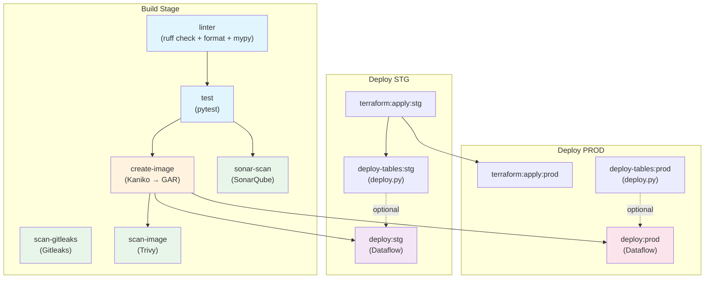
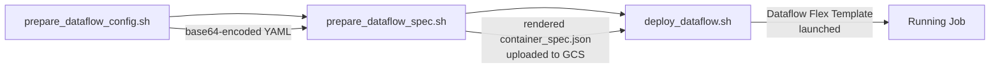
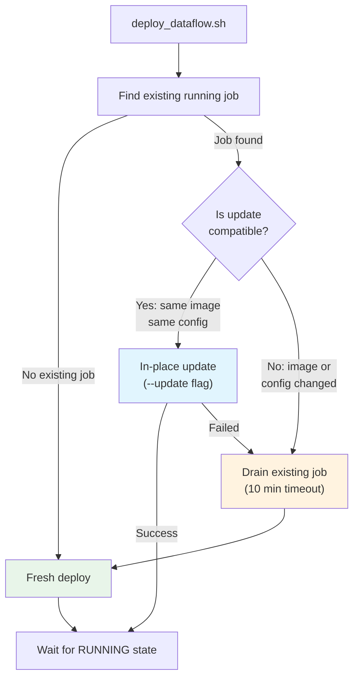
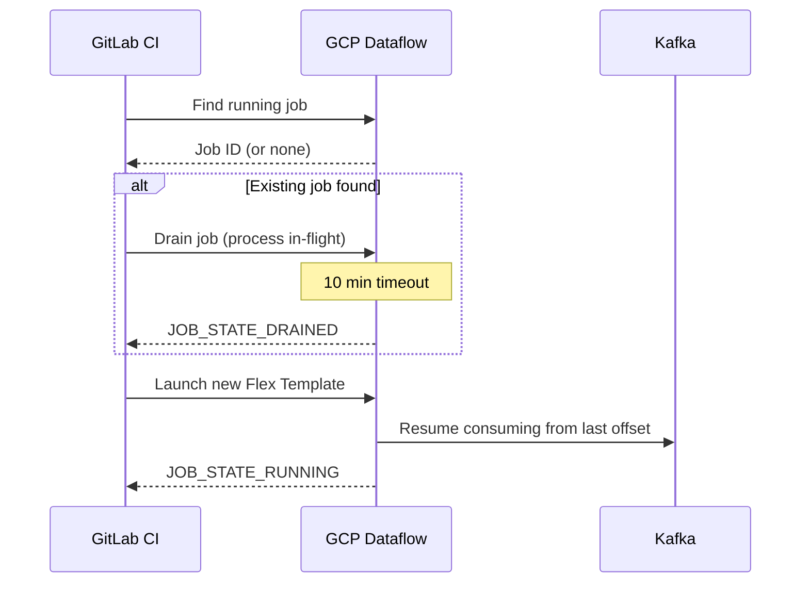
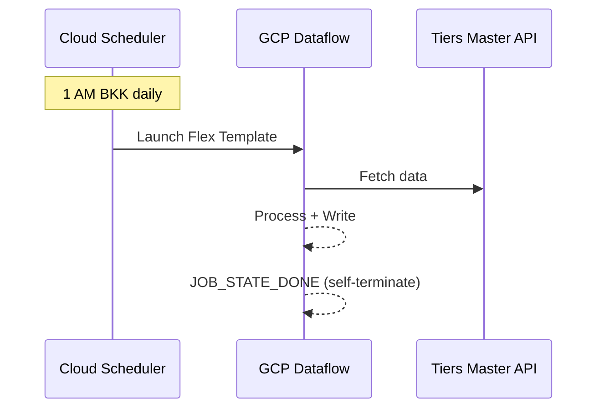

# CI/CD Pipeline Documentation - The1 Data Platform

## Overview

The1 Data Platform uses **GitLab CI/CD** for all build, test, and deployment operations. Each domain (loyalty, sales, messaging, partner) has its own top-level `.gitlab-ci.yml` that includes per-collector CI files. Shared pipeline templates are maintained in `common-data` and included via GitLab's cross-project `include` directive.

All Docker images are built using **Kaniko** (not Docker-in-Docker), and deployments target **Google Cloud Dataflow** via Flex Templates.

---

## CI/CD Architecture

```
GitLab CI/CD
├── common-data/pipeline/common.gitlab-ci.yml   (shared templates, rules, extends)
├── loyalty-data/.gitlab-ci.yml                  (includes per-collector CI files)
│   ├── members-collector/.gitlab-ci.yml
│   ├── tiers-collector/.gitlab-ci.yml
│   ├── members-tiers-history-collector/.gitlab-ci.yml
│   ├── purchases-collector/.gitlab-ci.yml
│   ├── transactions-collector/.gitlab-ci.yml
│   └── rewards-collector/.gitlab-ci.yml
├── sales-data/.gitlab-ci.yml
│   └── sales-collector/.gitlab-ci.yml
├── messaging-data/.gitlab-ci.yml
│   ├── communications-collector/.gitlab-ci.yml
│   ├── messages-collector/.gitlab-ci.yml
│   └── templates-collector/.gitlab-ci.yml
└── partner-data/.gitlab-ci.yml
    ├── branches-collector/.gitlab-ci.yml
    └── companies-collector/.gitlab-ci.yml
```

### Key Architectural Decisions

- **Kaniko** for Docker builds: Runs in unprivileged mode, no Docker daemon required. Uses `gcr.io/kaniko-project/executor:v1.9.0-debug`.
- **Single image, multi-destination**: One Kaniko build pushes to both STG and PROD GAR repositories (4 destinations: arch-tag + latest for each env).
- **Image digest pinning**: Build artifacts include `image-digest-ref.txt` with SHA256 digests. Deploy jobs extract the correct env-specific digest.
- **Shared VPC networking**: Dataflow jobs run inside a shared VPC with dedicated Dataflow subnets per environment.
- **Per-collector isolation**: Each collector has its own GCS bucket, GAR repo, service account, and Terraform workspace.

---

## Pipeline Stages

The top-level `.gitlab-ci.yml` defines six stages:

```yaml
stages:
  - build
  - deploy-stg
  - test-stg
  - deploy-prod
  - test-prod
  - rollback
```

---

## Pipeline Flow



---

## Stage Details

### Build Stage

#### linter

Runs code quality checks using the `uv` package manager.

```yaml
image: ghcr.io/astral-sh/uv:python3.12-bookworm-slim
tags: [nonprod-docker-cicd-x86]
script:
  - cd $SVC_NAME
  - uv sync
  - uv run ruff check .
  - uv run ruff format --check .
  - uv run mypy .
```

#### test

Runs the test suite after linting passes.

```yaml
script:
  - cd $SVC_NAME
  - uv sync
  - uv run pytest
needs: [<collector>:linter]
```

Some collectors (purchases-collector) include coverage reporting:
```yaml
- uv run pytest --cov=src --cov-report=xml:coverage.xml --cov-report=term:skip-covered
```

#### create-image

Builds a Docker image using Kaniko and pushes to **4 GAR destinations** (STG + PROD, each with arch-tag and latest).

```yaml
image: gcr.io/kaniko-project/executor:v1.9.0-debug
tags: [prod-docker-cicd-x86]   # Runs on PROD runner for GAR push access
script:
  - /kaniko/executor \
    --context "$CI_PROJECT_DIR/$SVC_NAME" \
    --dockerfile "$CI_PROJECT_DIR/$SVC_NAME/Dockerfile" \
    --destination "$GAR_BASE/$GCP_PROJECT_ID-$PROD_ENV/$GAR_REPO/$IMAGE:$ARCH-$TAG" \
    --destination "$GAR_BASE/$GCP_PROJECT_ID-$PROD_ENV/$GAR_REPO/$IMAGE:latest" \
    --destination "$GAR_BASE/$GCP_PROJECT_ID-$STG_ENV/$GAR_REPO/$IMAGE:$ARCH-$TAG" \
    --destination "$GAR_BASE/$GCP_PROJECT_ID-$STG_ENV/$GAR_REPO/$IMAGE:latest" \
    --image-name-tag-with-digest-file /workspace/image-digest-ref.txt
```

**Key details:**
- `ARCH` is `amd64` (Dataflow workers are x86)
- `DEPLOYMENT_TAG` is `$CI_COMMIT_SHORT_SHA`
- Digest file is saved as a CI artifact for deploy jobs
- Authentication uses `T1_PIPELINE_SA` (base64-encoded SA key)

#### sonar-scan

SonarQube analysis for code quality metrics.

```yaml
image: sonarsource/sonar-scanner-cli:latest
allow_failure: true   # Does not block pipeline
needs: [<collector>:test]
```

#### scan-gitleaks

Secret detection using Gitleaks.

```yaml
image: zricethezav/gitleaks:latest
script:
  - gitleaks detect --source="$SVC_NAME" --config=".gitleaks.toml" --verbose --redact
```

#### scan-image

Container image vulnerability scanning using Trivy.

```yaml
image: public.ecr.aws/aquasecurity/trivy:0.50.2
script:
  - trivy image --exit-code 1 --severity HIGH,CRITICAL --format json --output result.json $IMAGE_REF
  - trivy convert --format template --template "@html.tpl" --output trivy-report.html result.json
allow_failure: true
needs: [<collector>:create-image]
```

---

### Deploy STG

#### terraform:apply:stg

Provisions infrastructure (GCS buckets, GAR repos, IAM, BigLake catalog entries) using Terraform.

```yaml
tags: [nonprod-docker-cicd-x86]
variables:
  WORKSPACE_ENV: stg
  RUN_PATH: $CI_PROJECT_DIR/$INFRA_PATH
script:
  - !reference [.common-gcp-prepare, script]
  - !reference [.common-terraform-plan, script]
  - !reference [.common-terraform-apply, script]
```

Some collectors (tiers-collector) include additional IAM grants:
```yaml
- gcloud projects add-iam-policy-binding "$PROJECT" \
    --member="serviceAccount:t1-tiers-collector@${PROJECT}.iam.gserviceaccount.com" \
    --role="roles/serviceusage.serviceUsageConsumer"
```

#### deploy-tables:stg

Runs `deploy.py` to create/update BigQuery tables and Iceberg tables.

```yaml
image: google/cloud-sdk:latest
before_script:
  - !reference [.common-gcp-prepare, script]
  - pip install --quiet --break-system-packages pyiceberg[gcs,sql-sqlite] pyarrow gcsfs google-cloud-bigquery
script:
  - cd "$CI_PROJECT_DIR/infrastructure/<collector>/schemas"
  - export ICEBERG_CREATE_METHOD=python
  - python3 deploy.py "$GCP_PROJECT_ID-$STG_ENV" "$STG_ENV"
```

**What deploy.py does:**
- Reads JSON schema definitions from the schemas directory
- Creates BigQuery native tables (refined dataset) with `CREATE TABLE IF NOT EXISTS`
- Creates Iceberg external tables (source dataset) with metadata in GCS
- Smart change detection: skip if no changes, ALTER for additive, migrate for breaking
- Uses `register_table` (not `create_table`) to preserve field IDs and partition specs
- Creates dummy data snapshots so BQ can reference Iceberg tables

#### deploy:stg

Deploys the Dataflow job. Behavior differs between streaming and batch collectors.

**Streaming collectors (members-collector):**
1. Cancel existing running job (wait up to 10 min)
2. Run deployment script chain (see below)
3. Launch new Dataflow Flex Template

**Batch collectors (tiers-collector, members-tiers-history):**
1. Run deployment script chain
2. Launch Dataflow Flex Template (Cloud Scheduler handles lifecycle)

---

### Deploy PROD

#### terraform:apply:prod

Same as STG but runs on PROD runner and targets PROD workspace.

```yaml
tags: [prod-docker-cicd-x86]
variables:
  WORKSPACE_ENV: prod
needs:
  - job: <collector>:terraform:apply:stg   # STG must succeed first (for some collectors)
```

#### deploy-tables:prod

Same as STG but targets PROD project.

#### deploy:prod

Same deployment logic as STG but with PROD-specific parameters.

**members-collector deploy:prod** also supports **initial data load mode:**
```yaml
# Set TRIGGER_INIT_DATA_LOAD=1 in GitLab CI pipeline variables
- |
  if [ "$TRIGGER_INIT_DATA_LOAD" == "1" ]; then
    JOB_TYPE="initial_data"
    JOB_NAME="members-collector-init-$(date +%Y%m%d-%H%M%S)"
    MAX_WORKERS="50"
  else
    JOB_TYPE="normal"
    JOB_NAME="$DATAFLOW_JOB_NAME"
    MAX_WORKERS="1"
  fi
```

---

## Deployment Script Chain

Every deploy job follows a three-step script chain:



### 1. prepare_dataflow_config.sh

Merges base + env YAML configs into a single base64-encoded string.

```bash
# Usage:
DATAFLOW_CONFIG=$(./scripts/prepare_dataflow_config.sh \
  --base "$SVC_NAME/config/base.yaml" \
  --env "$SVC_NAME/config/$ENV.yaml")
```

**How it works:**
- Uses `yq` (kislyuk/yq) to deep-merge two YAML files: `yq -s '.[0] * .[1]'`
- Base config has defaults; env config has overrides (Kafka brokers, GCS paths, etc.)
- Output is `base64 -w 0` encoded (no line wrapping)
- The base64 string is passed as `dataflow_config` pipeline parameter

### 2. prepare_dataflow_spec.sh

Renders the Dataflow Flex Template container spec JSON with the actual image reference.

```bash
# Usage:
./scripts/prepare_dataflow_spec.sh \
  --image-file "image-digest-ref-${ENV}.txt" \
  --template-path "$INFRA/templates/container_spec.json" \
  --output-path "$RENDERED_SPEC" \
  --gcs-destination "$SPEC_GCS_PATH"
```

**How it works:**
- Reads image digest from artifact file
- Substitutes `${IMAGE_FULL}` in container_spec.json template
- Uploads rendered spec to GCS
- The GCS path becomes the `--template-file-gcs-location` for Dataflow

**Container spec template example:**
```json
{
  "sdk_info": { "language": "PYTHON" },
  "image": "${IMAGE_FULL}",
  "metadata": {
    "parameters": [
      { "name": "dataflow_config", "isOptional": false },
      { "name": "job_type", "isOptional": true, "regexes": ["^(normal|initial_data)$"] }
    ]
  },
  "defaultEnvironment": {
    "additionalExperiments": [
      "use_pipeline_version_for_managed_transforms=beam:schematransform:org.apache.beam:iceberg_write:v1"
    ]
  }
}
```

### 3. deploy_dataflow.sh

The main deployment script with smart job management.

```bash
# Usage:
./scripts/deploy_dataflow.sh \
  --project-id "$GCP_PROJECT_ID-$ENV" \
  --region "asia-southeast1" \
  --job-name "$DATAFLOW_JOB_NAME" \
  --template-path "$SPEC_GCS_PATH" \
  --service-account "$SA@$PROJECT.iam.gserviceaccount.com" \
  --network "projects/the1-network-$ENV/global/networks/the1-vpc-net-share-$ENV" \
  --subnetwork ".../subnetworks/the1-subnet-dataflow-$ENV" \
  --staging-location "gs://$BUCKET/dataflow/staging" \
  --temp-location "gs://$BUCKET/dataflow/temp" \
  --max-workers 1 \
  --pipeline-opts "$PIPELINE_OPTS" \
  --sdk-container-image "$IMAGE_REF"
```

**Smart deployment logic:**



**Update compatibility checks:**
1. **Container image**: Compare current worker image vs new image digest
2. **Config hash**: MD5 of pipeline options stored as job label `config-hash`

**Stop strategies:**
- **Drain** (preferred): Processes in-flight messages, 10-min timeout
- **Cancel** (fallback): Immediate termination if drain fails or times out

---

## Dataflow Deployment Parameters

| Parameter | STG | PROD |
|-----------|-----|------|
| project-id | `the1-{domain}-data-stg` | `the1-{domain}-data-prod` |
| region | `asia-southeast1` | `asia-southeast1` |
| max-workers | `1` | `1-2` (init: `50`) |
| network | `the1-vpc-net-share-stg` | `the1-vpc-net-share-prod` |
| subnetwork | `the1-subnet-dataflow-stg` | `the1-subnet-dataflow-prod` |
| staging-location | `gs://{project}-{env}-{collector}/dataflow/staging` | same pattern |
| temp-location | `gs://{project}-{env}-{collector}/dataflow/temp` | same pattern |
| sdk-container-image | GAR image with SHA256 digest | same image (multi-dest build) |

---

## Streaming vs Batch Deployment

### Streaming Pipelines (members-collector, purchases-collector)



**Key differences by collector:**
- **purchases-collector**: Drain first, then cancel as fallback (safest)
- **members-collector**: Cancel directly (should upgrade to drain-first)

### Batch Pipelines (tiers-collector, members-tiers-history)



- Cloud Scheduler triggers at **1 AM Bangkok time** daily
- Job is self-terminating on completion
- CI deploy just launches the template (scheduler handles lifecycle)

---

## Workflow Triggers

The top-level `.gitlab-ci.yml` supports multiple trigger modes via pipeline variables:

| TRIGGER_EVENT | SERVICE_NAME | Behavior |
|---------------|-------------|----------|
| `manual-deploy` | `<collector>` | Build + deploy selected collector |
| `terraform-apply` | `<collector>` | Terraform plan + apply only |
| `terraform-apply` | any | Terraform apply for all |
| `rollback` | `<collector>` | Rollback deployment |
| (git push) | N/A | Standard pipeline (build + deploy) |

**Rule references:**
- `.rules_app_changes` -- triggers on code changes in collector directory
- `.rules_infra_changes` -- triggers on infrastructure file changes
- `.rules_infra_manual_trigger` -- triggers on manual terraform-apply

---

## Environment Variables

### Runner Tags
| Variable | Value | Purpose |
|----------|-------|---------|
| `RUNNER_TAG_STG` | `nonprod-docker-cicd-x86` | STG/build runner |
| `RUNNER_TAG_PROD` | `prod-docker-cicd-x86` | PROD/image build runner |

### Images
| Variable | Value | Purpose |
|----------|-------|---------|
| `UV_IMAGE` | `ghcr.io/astral-sh/uv:python3.12-bookworm-slim` | Linting and testing |
| `GOOGLE_CLOUD_SDK_IMAGE` | `google/cloud-sdk:552.0.0-stable` | Deploy jobs |
| `CONTAINER_BUILD_IMAGE` | `gcr.io/kaniko-project/executor:v1.9.0-debug` | Docker builds |

### Project-Specific
| Variable | Example | Purpose |
|----------|---------|---------|
| `GCP_PROJECT_ID` | `the1-loyalty-data` | GCP project prefix |
| `SVC_NAME` | `members-collector` | Collector directory name |
| `INFRA_PATH` | `infrastructure/members` | Infrastructure directory |
| `DOMAIN_NAME` | `the1-loyalty-data` | Domain for GCS bucket naming |
| `DATAFLOW_JOB_NAME` | `members-collector` | Dataflow job name |
| `GAR_REPOSITORY_NAME` | `members-collector` | GAR repository name |
| `GAR_REPOSITORY_BASE_PATH` | `asia-southeast1-docker.pkg.dev` | GAR base URL |

### Authentication
| Variable | Purpose |
|----------|---------|
| `T1_PIPELINE_SA` | Base64-encoded PROD service account key (for Kaniko GAR push) |
| `T1_PIPELINE_NP_SA` | Base64-encoded nonprod SA key (for Trivy image pull) |
| `GOOGLE_APPLICATION_CREDENTIALS_PATH` | Path to decoded SA key file |

---

## Safety Patterns

### Image Digest Pinning
Images are referenced by SHA256 digest, not tag. This ensures the exact same image is deployed to both STG and PROD.

```bash
# Build saves digest
--image-name-tag-with-digest-file /workspace/image-digest-ref.txt

# Deploy extracts env-specific digest
grep "${GCP_PROJECT_ID}-${ENV}" image-digest-ref.txt | head -n 1 > "image-digest-ref-${ENV}.txt"
DIGEST="$(sed -n 's/.*@\(sha256:.*\)/\1/p' image-digest-ref.txt | head -n 1)"
```

### Terraform Plan Before Apply
All Terraform jobs run plan before apply using shared template references:
```yaml
- !reference [.common-terraform-plan, script]
- !reference [.common-terraform-apply, script]
```

### STG-to-PROD Dependency (purchases-collector pattern)
```yaml
purchases-collector:deploy:prod:
  needs:
    - job: purchases-collector:deploy:stg      # PROD waits for STG success
      optional: true
    - job: purchases-collector:terraform:apply:prod
```

### Credential Cleanup
All deploy jobs clean up credentials in `after_script`:
```yaml
after_script:
  - rm -f $GOOGLE_APPLICATION_CREDENTIALS_PATH
```

### Config Hash Tracking
`deploy_dataflow.sh` stores an MD5 hash of pipeline options as a Dataflow job label:
```bash
CONFIG_HASH=$(echo -n "$PIPELINE_OPTS" | md5sum | cut -d' ' -f1)
# Stored as: --additional-user-labels "config-hash=${CONFIG_HASH}"
```

---

## Known Issues and Gaps

### No STG-to-PROD Gate for Loyalty Collectors
**Risk:** PROD deploy can run in parallel with or before STG deploy.

**Current state:**
- `purchases-collector`: Has `needs: [deploy:stg]` on deploy:prod (correct)
- `members-collector`: No STG dependency on PROD deploy (risk)
- `tiers-collector`: No STG dependency on PROD deploy (risk)
- `members-tiers-history`: No STG dependency on PROD deploy (risk)

**Fix:** Add `needs: [<collector>:deploy:stg]` to deploy:prod jobs.

### Members Cancel vs Purchases Drain
**Risk:** Cancel drops in-flight messages; drain processes them gracefully.

**Current state:**
- `purchases-collector`: Drain first (5 min), then cancel fallback (safest)
- `members-collector`: Cancel directly (risk of message loss)

**Fix:** Upgrade members-collector to drain-first pattern matching purchases-collector.

### No BQ Backup Before deploy-tables:prod
**Risk:** Breaking schema changes could cause data loss.

**Fix:** Add backup step before `deploy.py` runs in PROD for native tables.

### Terraform Validate Cannot Run Locally
Terraform validate requires `terraform init` with backend access, which is only available in CI runners.

---

## Per-Collector CI Variables Summary

| Collector | GCP_PROJECT_ID | DOMAIN_NAME | Service Account |
|-----------|---------------|-------------|-----------------|
| members-collector | the1-loyalty-data | the1-loyalty-data | t1-members-collector |
| tiers-collector | the1-loyalty-data | the1-loyalty-data | t1-tiers-collector |
| members-tiers-history | the1-loyalty-data | the1-loyalty-data | t1-members-tiers-history |
| purchases-collector | the1-loyalty-data | the1-loyalty-data | t1-loy-data-{env}-sa-iac |
| sales-collector | the1-sales-data | the1-sales-data | t1-sales-collector |

---

## File Locations

```
scripts/
├── prepare_dataflow_config.sh    # Merge YAML configs → base64
├── prepare_dataflow_spec.sh      # Render container_spec.json → GCS
└── deploy_dataflow.sh            # Launch Dataflow Flex Template

infrastructure/<collector>/
├── templates/
│   └── container_spec.json       # Flex Template spec (${IMAGE_FULL} placeholder)
├── schemas/
│   ├── deploy.py                 # Table deployer (BQ + Iceberg)
│   └── *.json                    # Table schema definitions
├── artifact.tf                   # GAR repository
├── bucket.tf                     # GCS bucket
└── biglake-metastore.tf          # BigLake catalog IAM

<collector>/
├── .gitlab-ci.yml                # Per-collector CI jobs
├── Dockerfile                    # Container build definition
└── config/
    ├── base.yaml                 # Base config (shared across envs)
    ├── stg.yaml                  # STG overrides
    └── prod.yaml                 # PROD overrides
```
