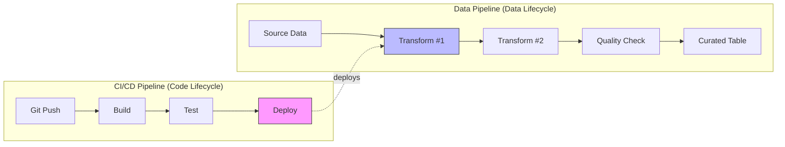
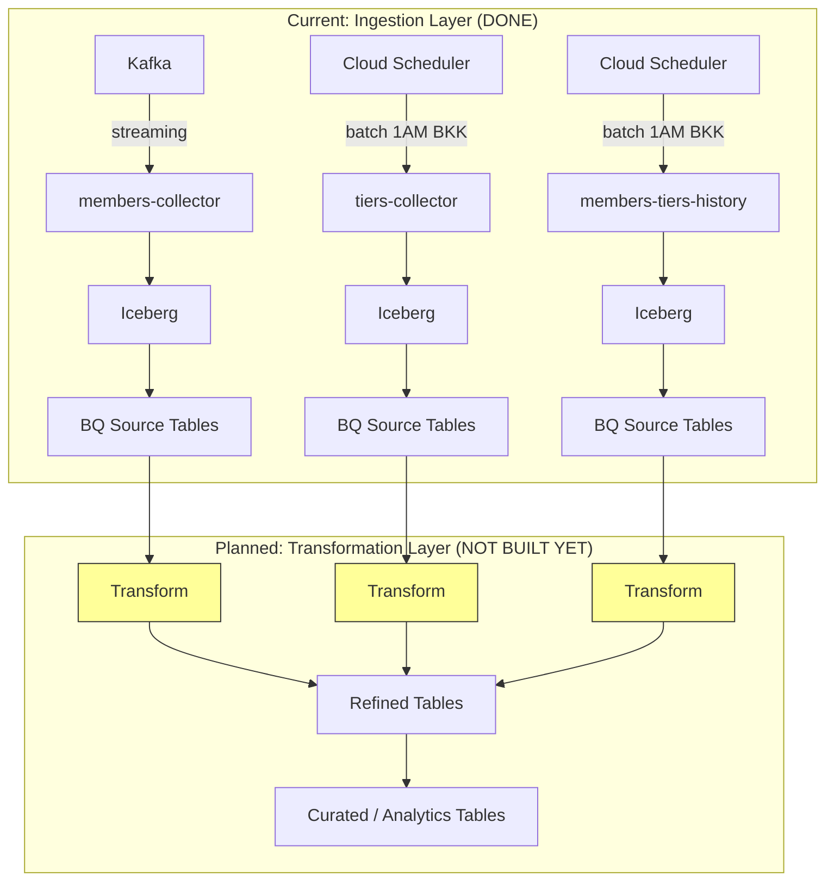
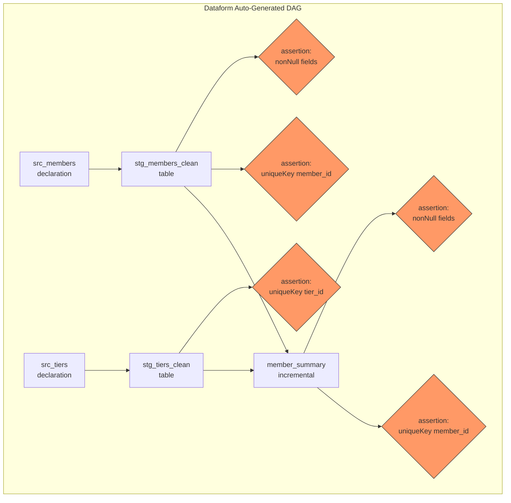
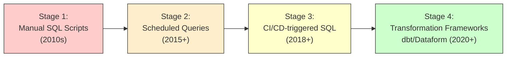
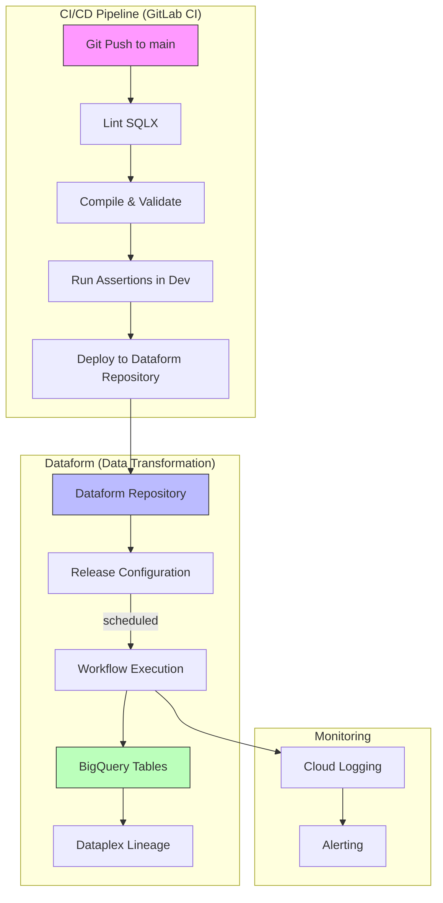

# CI/CD-triggered SQL vs Dataform: Comprehensive Analysis for BigQuery Transformation Layer

> **Author:** Data Engineering Team
> **Date:** 2026-02-21
> **Status:** Discussion Document
> **Audience:** Technical Lead, Data Engineering Team

---

## Table of Contents

1. [Executive Summary](#1-executive-summary)
2. [Data Pipeline vs CI/CD Pipeline -- Definitions](#2-data-pipeline-vs-cicd-pipeline--definitions)
3. [Current Architecture](#3-current-architecture)
4. [Option A: CI/CD-triggered SQL](#4-option-a-cicd-triggered-sql)
5. [Option B: Dataform](#5-option-b-dataform)
6. [Detailed Comparison Table](#6-detailed-comparison-table)
7. [Risk Analysis: CI/CD-only Approach](#7-risk-analysis-cicd-only-approach)
8. [Why Dataform Exists -- The Problems It Solves](#8-why-dataform-exists--the-problems-it-solves)
9. [Compromise: Dataform + CI/CD Together](#9-compromise-dataform--cicd-together)
10. [Recommendations](#10-recommendations)
11. [References](#11-references)
12. [Option C: GitLab CI as Orchestrator + BQ CLI (deploy.py Pattern)](#12-option-c-gitlab-ci-as-orchestrator--bq-cli-deploypypattern) *(Added 2026-02-21)*
13. [Additional References (Section 12)](#13-additional-references-section-12)

---

## 1. Executive Summary

**TL;DR for the Lead:**

| Aspect | CI/CD-triggered SQL | Dataform |
|--------|---------------------|----------|
| Cost of tool | GitLab Runner costs | **Free** (included in GCP) |
| BQ query cost | Same | Same |
| Dependency management | Manual ordering in YAML | **Automatic DAG** |
| Data quality testing | Build from scratch | **Built-in assertions** |
| Incremental processing | Write MERGE SQL manually | **Declarative config** |
| Lineage & observability | None | **Dataplex integration** |
| Backfill support | Manual scripts | **Built-in** |
| Environment isolation | CI/CD variables | **Native workspace overrides** |
| Learning curve | Familiar (GitLab CI) | Low (SQL + SQLX) |
| Long-term maintenance | **High** (grows with tables) | **Low** (framework handles it) |
| Google's recommendation | Not recommended for transformation | **Officially recommended** |

**Bottom line:** Using CI/CD to trigger SQL transformations is building a custom, inferior version of what Dataform already provides for free. It is like writing your own web framework instead of using Django/FastAPI -- technically possible, but the maintenance cost compounds exponentially.

> Google's own documentation explicitly recommends Dataform as the transformation tool for BigQuery ELT pipelines. CI/CD is recommended for **deploying** transformation code, not **executing** transformations.

---

## 2. Data Pipeline vs CI/CD Pipeline -- Definitions

These two concepts solve fundamentally different problems. Conflating them leads to architectural mistakes.

### Data Pipeline (ควบคุมการไหลของข้อมูล)

A **data pipeline** orchestrates the movement and transformation of **data**:
- Input: Raw data (source tables)
- Process: SQL transformations with dependency ordering
- Output: Curated/analytics tables
- Concerns: Data quality, idempotency, incremental processing, lineage, backfill
- Tools: Dataform, dbt, Cloud Composer (Airflow), BigQuery Pipelines

### CI/CD Pipeline (ควบคุมการ deploy code)

A **CI/CD pipeline** orchestrates the deployment of **code**:
- Input: Code changes (git commits/merges)
- Process: Build, test, deploy
- Output: Running services/infrastructure
- Concerns: Code quality, automated testing, rollback, environment promotion
- Tools: GitLab CI, GitHub Actions, Cloud Build



**Key insight:** CI/CD should **deploy** transformation definitions. A data pipeline tool should **execute** them. These are complementary, not interchangeable.

---

## 3. Current Architecture

Our platform currently handles **ingestion only**. The transformation layer is planned but not yet built.



**The question is:** What tool should execute the transformations in the yellow boxes?

---

## 4. Option A: CI/CD-triggered SQL

### How It Works

SQL files are stored in a Git repository. GitLab CI jobs execute them against BigQuery in a defined order using `bq query` commands or a Python script.

```yaml
# .gitlab-ci.yml (simplified example)
stages:
  - transform_layer_1
  - transform_layer_2
  - transform_layer_3

transform_members_clean:
  stage: transform_layer_1
  script:
    - bq query --use_legacy_sql=false < sql/01_members_clean.sql

transform_tiers_clean:
  stage: transform_layer_1
  script:
    - bq query --use_legacy_sql=false < sql/02_tiers_clean.sql

transform_member_summary:
  stage: transform_layer_2
  needs: [transform_members_clean, transform_tiers_clean]
  script:
    - bq query --use_legacy_sql=false < sql/03_member_summary.sql

transform_analytics_report:
  stage: transform_layer_3
  needs: [transform_member_summary]
  script:
    - bq query --use_legacy_sql=false < sql/04_analytics_report.sql
```

### Pros

1. **Familiar to app developers** -- GitLab CI YAML is well-known to the team
2. **Full control** -- Every aspect is explicitly defined
3. **No new tool to learn** -- Leverages existing CI/CD infrastructure
4. **Simple for 1-3 queries** -- Low overhead for trivial cases
5. **Flexible** -- Can mix SQL with Python/shell scripts

### Cons

1. **Manual dependency management** -- Must manually define `needs:` and `stages:` for every query; errors are silent
2. **No data quality testing** -- Must build assertion framework from scratch
3. **No incremental processing support** -- Must write and maintain MERGE/INSERT logic manually
4. **No lineage or observability** -- Zero visibility into data flow; debugging requires reading YAML + SQL
5. **No environment isolation** -- Must manage dev/stg/prod table names via CI/CD variables
6. **Hardcoded table references** -- Renaming a table requires find-and-replace across all SQL files
7. **No idempotency guarantees** -- Re-running a failed pipeline may duplicate data
8. **No backfill support** -- Reprocessing historical data requires custom scripting
9. **GitLab Runner costs** -- Runners must be available to execute transformations
10. **Scheduling limitations** -- GitLab CI schedules are less granular than dedicated schedulers
11. **Stateless execution** -- No awareness of what data has/hasn't been processed
12. **Scales poorly** -- Maintenance burden grows linearly (or worse) with number of transformations

---

## 5. Option B: Dataform

### How It Works

SQL transformations are defined in `.sqlx` files within a Dataform repository (connected to Git). Dataform compiles the SQLX to SQL, builds a dependency DAG automatically, and executes transformations in the correct order against BigQuery.

```sql
-- definitions/staging/stg_members_clean.sqlx
config {
  type: "table",
  schema: "staging",
  description: "Cleaned members data with deduplication",
  assertions: {
    uniqueKey: ["member_id"],
    nonNull: ["member_id", "email", "created_at"]
  }
}

SELECT
  member_id,
  TRIM(LOWER(email)) AS email,
  first_name,
  last_name,
  created_at,
  CURRENT_TIMESTAMP() AS etl_load_time
FROM ${ref("src_members")}
WHERE member_id IS NOT NULL
```

```sql
-- definitions/staging/stg_tiers_clean.sqlx
config {
  type: "table",
  schema: "staging",
  assertions: {
    uniqueKey: ["tier_id"]
  }
}

SELECT
  tier_id,
  tier_name,
  min_points,
  max_points
FROM ${ref("src_tiers")}
```

```sql
-- definitions/curated/member_summary.sqlx
config {
  type: "incremental",
  schema: "curated",
  uniqueKey: ["member_id"],
  bigquery: {
    partitionBy: "DATE(last_updated)",
    updatePartitionFilter: "last_updated >= TIMESTAMP_SUB(CURRENT_TIMESTAMP(), INTERVAL 7 DAY)"
  },
  assertions: {
    uniqueKey: ["member_id"],
    nonNull: ["member_id", "tier_name"]
  }
}

SELECT
  m.member_id,
  m.email,
  m.first_name,
  m.last_name,
  t.tier_name,
  t.min_points,
  CURRENT_TIMESTAMP() AS last_updated
FROM ${ref("stg_members_clean")} m
LEFT JOIN ${ref("stg_tiers_clean")} t
  ON m.tier_id = t.tier_id

${ when(incremental(), `WHERE m.created_at > (SELECT MAX(last_updated) FROM ${self()})`) }
```

### What Happens Automatically

1. **Dependency resolution**: Dataform sees `${ref("stg_members_clean")}` and knows `member_summary` depends on `stg_members_clean`
2. **DAG construction**: Builds execution order automatically -- no manual stage/needs definitions
3. **Incremental logic**: The `when(incremental(), ...)` block handles first-run (full load) vs subsequent runs (incremental) automatically
4. **MERGE generation**: With `uniqueKey`, Dataform auto-generates MERGE statements for idempotent upserts
5. **Assertions run**: After each table is created, assertions verify data quality
6. **Environment handling**: `${ref()}` resolves to different datasets (dev/stg/prod) based on workspace configuration



### Pros

1. **Free** -- No additional cost; you only pay for BigQuery compute (same as CI/CD approach)
2. **Automatic dependency management** -- `ref()` function builds DAG; impossible to have circular or missing dependencies
3. **Built-in data quality assertions** -- uniqueKey, nonNull, custom SQL assertions out of the box
4. **Incremental table support** -- Declarative config; Dataform generates MERGE/INSERT logic
5. **Environment isolation** -- Native workspace overrides for dev/stg/prod; no hardcoded table names
6. **Data lineage** -- Automatic lineage visible in Dataplex Universal Catalog and BigQuery console
7. **Version control** -- Native Git integration (GitHub, GitLab, Azure DevOps, Bitbucket)
8. **Idempotent by design** -- MERGE patterns with uniqueKey ensure safe re-runs
9. **Schema evolution** -- `onSchemaChange` config handles column additions/removals for incremental tables
10. **Hermetic compilation** -- Same code always compiles to same SQL; deterministic and reproducible
11. **Real-time validation** -- Shows compilation errors and estimated bytes before execution
12. **Google's recommended tool** -- Officially recommended for BigQuery ELT transformation
13. **Team collaboration** -- Isolated development workspaces per developer
14. **Documentation** -- Table and column descriptions defined in code, visible in BigQuery catalog

### Cons

1. **New tool to learn** -- Team needs to learn SQLX syntax (though it is a thin layer over SQL)
2. **BigQuery-only** -- Locked to BigQuery (not a concern for us since we are BigQuery-native)
3. **JavaScript templating** -- Uses JavaScript (not Jinja like dbt); unfamiliar to some
4. **Limited execution granularity** -- Cannot easily run a single file during development (must run all or tag-filtered)
5. **No custom unit testing UI** -- Assertions are integration tests; unit tests require external tools
6. **Scheduling depends on other services** -- Needs Cloud Scheduler, Workflows, or Composer for scheduling

---

## 6. Detailed Comparison Table

| Dimension | CI/CD-triggered SQL | Dataform | Winner |
|-----------|---------------------|----------|--------|
| **Cost (tool)** | GitLab Runner costs ($) | Free | Dataform |
| **Cost (BQ queries)** | Same | Same | Tie |
| **Dependency management** | Manual `needs:`/`stages:` in YAML | Automatic via `ref()` DAG | Dataform |
| **Data quality testing** | DIY: write custom assertion scripts | Built-in: uniqueKey, nonNull, custom SQL | Dataform |
| **Incremental processing** | DIY: write MERGE/INSERT manually | Declarative: `type: "incremental"` + uniqueKey | Dataform |
| **Environment isolation** | CI/CD variables + string replacement | Native workspace overrides per environment | Dataform |
| **Observability & lineage** | None (must build custom logging) | Dataplex lineage + BQ console integration | Dataform |
| **Error handling & retry** | DIY: `retry:` in GitLab CI (generic) | Workflow-level retry + per-action error logs | Dataform |
| **Schema evolution** | Manual ALTER TABLE + find-replace | `onSchemaChange: "synchronize"` config | Dataform |
| **Idempotency** | DIY: must ensure every SQL is idempotent | Auto-generated MERGE with uniqueKey | Dataform |
| **Backfill & data repair** | DIY: write custom backfill scripts | Full refresh or partition-targeted re-run | Dataform |
| **Team collaboration** | Shared CI/CD config, merge conflicts | Isolated dev workspaces per developer | Dataform |
| **Version control** | Git (already have) | Git (native integration) | Tie |
| **Documentation** | External docs or comments | In-code descriptions, visible in BQ catalog | Dataform |
| **Scheduling** | GitLab CI schedules / Cloud Scheduler | Cloud Scheduler / Workflows / Composer | Tie |
| **Learning curve** | Low (familiar YAML) | Low-Medium (SQL + thin SQLX layer) | CI/CD (slight) |
| **Vendor lock-in** | GitLab CI | GCP/BigQuery (already locked in) | Tie |
| **Google recommendation** | Not for transformation | Officially recommended | Dataform |
| **Long-term maintenance** | O(n) to O(n^2) with table count | O(1) -- framework handles complexity | Dataform |

**Score: Dataform wins 12/18 dimensions, CI/CD wins 1, Tie on 5.**

---

## 7. Risk Analysis: CI/CD-only Approach

### Scenario 1: Transformation #3 of 10 Fails Mid-Pipeline

**With CI/CD-triggered SQL:**
```
Stage 1: 01_members_clean.sql      -- SUCCESS
Stage 1: 02_tiers_clean.sql        -- SUCCESS
Stage 2: 03_member_summary.sql     -- FAILED (BQ timeout)
Stage 2: 04_purchase_agg.sql       -- SUCCESS (ran in parallel)
Stage 3: 05_analytics_daily.sql    -- SKIPPED (depends on stage 2)
Stage 3: 06_analytics_weekly.sql   -- SKIPPED
Stage 4: 07_final_report.sql       -- SKIPPED
```

**Problems:**
- `04_purchase_agg.sql` succeeded but depends on data from `03_member_summary.sql` -- is the data consistent?
- Re-running the pipeline: does `01_members_clean.sql` run again? If so, is it idempotent? If not, who controls partial re-execution?
- GitLab CI `retry:` retries the entire **job**, not the SQL query -- you pay for runner time even during BQ internal retries
- No visibility into which rows failed or why without custom logging
- (ถ้า 04 ไม่ได้ depend กับ 03 จริงๆ ก็ไม่มีปัญหา แต่ถ้า depend กันแต่ลืมใส่ `needs:` ก็จะได้ข้อมูลผิดแบบเงียบๆ -- silent data corruption)

**With Dataform:**
- Dataform knows the full DAG -- if `member_summary` fails, all downstream dependents are automatically skipped
- Independent branches continue executing (e.g., if `purchase_agg` truly has no dependency on `member_summary`)
- Re-execution can target only failed actions and their dependents
- Detailed error logs per action with exact SQL and BigQuery job ID

---

### Scenario 2: Backfill 6 Months of Historical Data

**With CI/CD-triggered SQL:**
```bash
# Someone writes a backfill script...
for month in 2025-08 2025-09 2025-10 2025-11 2025-12 2026-01; do
  bq query --parameter="target_month::$month" < sql/03_member_summary.sql
done
```

**Problems:**
- Must write custom backfill logic for every transformation
- Must ensure the backfill SQL is different from the daily SQL (date filtering)
- Must handle failures mid-backfill (month 3 of 6 fails -- what now?)
- Must ensure downstream tables are also backfilled in correct order
- No tracking of which months have been successfully backfilled
- Risk of data duplication if backfill SQL is not idempotent
- (ถ้ามี 10 tables ที่ต้อง backfill ตาม dependency order ก็ต้องเขียน script ที่ handle ทุก case เอง)

**With Dataform:**
- For full tables: just trigger a "full refresh" execution
- For incremental tables: use `--full-refresh` flag or configure date range via compilation variables
- Dataform handles dependency ordering automatically during backfill
- Built-in idempotency via MERGE ensures no duplicates

---

### Scenario 3: Upstream Schema Changes

**Situation:** The `src_members` source table adds a new column `phone_number` and renames `email` to `email_address`.

**With CI/CD-triggered SQL:**
```sql
-- Every SQL file that references src_members must be updated manually
-- sql/01_members_clean.sql
SELECT member_id, email, ...  -- BREAKS: column 'email' no longer exists

-- You must find ALL files referencing this column
-- grep -r "email" sql/  -- returns 47 matches across 12 files
-- Which ones are the source column vs derived columns? Manual analysis required.
```

**Problems:**
- No compilation step -- you discover the error only at runtime (in production!)
- No impact analysis -- which downstream tables are affected?
- Find-and-replace is error-prone (changing `email` might affect `email_domain`, `email_verified`, etc.)
- No way to test the change in isolation before deploying

**With Dataform:**
- Compilation fails immediately with clear error message pointing to the broken reference
- DAG visualization shows all downstream tables affected by the change
- Fix in development workspace, verify compilation, test in dev environment, then promote
- `ref()` ensures table name changes propagate automatically

---

### Scenario 4: Debug Data Quality Issues

**Situation:** An analyst reports that `analytics_daily` table shows negative purchase counts for some members.

**With CI/CD-triggered SQL:**
- Open GitLab CI YAML to find which SQL file produces `analytics_daily`
- Read the SQL to find its source tables
- Read those SQL files to find their sources
- Manually trace the data lineage backward through potentially 5-10 files
- No assertions caught the issue because there are none
- Time to debug: hours to days
- (ต้องไล่อ่าน SQL file ทีละไฟล์ ไม่มี graph ให้ดู)

**With Dataform:**
- Open Dataform DAG visualization in BigQuery console
- Click on `analytics_daily` to see all upstream dependencies
- Add an assertion: `SELECT * FROM ${ref("analytics_daily")} WHERE purchase_count < 0`
- Assertion runs automatically on next execution and catches future occurrences
- Data lineage visible in Dataplex for column-level tracing
- Time to debug: minutes to hours

---

### Scenario 5: Add a New Transformation in the Middle of a Chain

**Situation:** Need to add `member_risk_score` between `stg_members_clean` and `member_summary`.

**With CI/CD-triggered SQL:**
```yaml
# Must manually update .gitlab-ci.yml
# 1. Create new SQL file
# 2. Add new job to correct stage
# 3. Update 'needs:' of downstream jobs
# 4. Update all downstream SQL files that now need risk_score data
# 5. Hope you didn't miss any dependencies
# 6. Test in... production? (no dev environment unless you built one)
```

**Problems:**
- Manual YAML surgery -- error-prone
- Must identify ALL downstream jobs that need updating
- No compilation check -- errors discovered at runtime
- No dev environment by default -- must build and maintain it yourself

**With Dataform:**
```sql
-- Just create: definitions/staging/member_risk_score.sqlx
config { type: "table", schema: "staging" }

SELECT
  member_id,
  calculate_risk_score(purchase_history, tier_level) AS risk_score
FROM ${ref("stg_members_clean")}
```

```sql
-- Update member_summary.sqlx to use it
SELECT
  m.*,
  r.risk_score
FROM ${ref("stg_members_clean")} m
LEFT JOIN ${ref("member_risk_score")} r ON m.member_id = r.member_id
```

- Dataform automatically inserts `member_risk_score` into the DAG in the correct position
- No YAML changes needed
- Compilation verifies correctness before execution
- Test in dev workspace first

---

### Scenario 6: Multiple Developers Working Simultaneously

**With CI/CD-triggered SQL:**
- Developer A modifies `03_member_summary.sql`
- Developer B adds `03b_member_segment.sql` and updates the YAML
- Merge conflict in `.gitlab-ci.yml` -- must resolve carefully
- Both developers using same BQ datasets -- may overwrite each other's test data
- No isolation between development work

**With Dataform:**
- Each developer has their own **workspace** with isolated compilation
- Workspace compilation overrides route output to personal dev datasets (e.g., `dev_alice.member_summary`, `dev_bob.member_summary`)
- Git merge is simple -- SQLX files are independent; DAG is auto-generated
- No YAML to conflict on

---

## 8. Why Dataform Exists -- The Problems It Solves

Dataform was created by a team that experienced the exact pain points of managing SQL transformations manually. Google acquired Dataform in 2020 and integrated it into BigQuery because they recognized these problems are universal.

### The Evolution of Data Transformation



Each stage was created because the previous one failed at scale:

| Stage | Works until... | Then breaks because... |
|-------|---------------|----------------------|
| Manual SQL scripts | ~5 queries | No scheduling, no version control |
| Scheduled queries | ~15 queries | No dependencies, no testing, no lineage |
| CI/CD-triggered SQL | ~30 queries | Manual dependency management, no data quality, no incremental support, maintenance burden |
| Dataform/dbt | 1000+ queries | Purpose-built for this exact problem |

### Problems Dataform Specifically Solves

1. **"I don't know which tables depend on which"** -- Automatic DAG from `ref()`
2. **"A table had bad data and I don't know what downstream is affected"** -- Lineage visualization + Dataplex integration
3. **"Re-running the pipeline duplicated data"** -- Idempotent MERGE patterns with uniqueKey
4. **"We need to backfill 3 months but it is too risky"** -- Full refresh + incremental rebuild support
5. **"New developer cannot understand the pipeline"** -- DAG visualization + in-code documentation
6. **"We discovered a bug in production because there is no dev environment"** -- Isolated workspaces with compilation overrides
7. **"Adding a new transformation required updating 5 files"** -- Just add a `.sqlx` file with `ref()` to existing tables
8. **"We do not know if our data is correct"** -- Built-in assertions (uniqueKey, nonNull, custom)

### What Google Says

From [Google Cloud's official documentation](https://docs.cloud.google.com/bigquery/docs/transform-intro):

> "Dataform lets you develop, test, and version control SQL workflows for data transformation in BigQuery."

Google lists Dataform as the **primary** transformation approach for BigQuery alongside DML, materialized views, and BigQuery Pipelines. CI/CD is listed under **deployment** tooling, not transformation tooling.

---

## 9. Compromise: Dataform + CI/CD Together

The best approach is not "Dataform OR CI/CD" but "Dataform AND CI/CD". They solve different problems and work together naturally.

### Architecture: CI/CD Deploys, Dataform Transforms



### How It Works

1. **Developer** writes SQLX transformation in their Dataform workspace
2. **Developer** tests in their isolated dev environment
3. **Developer** pushes to Git (GitLab)
4. **GitLab CI** runs:
   - SQLX compilation check (catches syntax errors)
   - Dry-run validation
   - Code review triggers
5. **Merge to main** triggers Dataform release configuration update
6. **Dataform** scheduled workflow executes transformations against production BigQuery
7. **Assertions** run automatically after each transformation
8. **Dataplex** captures lineage for governance

### GitLab CI for Dataform (Example)

```yaml
# .gitlab-ci.yml
stages:
  - validate
  - deploy

validate_dataform:
  stage: validate
  image: dataformco/dataform:latest
  script:
    - dataform compile
    - dataform test  # Run assertions
  rules:
    - if: $CI_MERGE_REQUEST_ID

deploy_dataform:
  stage: deploy
  script:
    # Trigger Dataform release via API
    - |
      curl -X POST \
        "https://dataform.googleapis.com/v1beta1/projects/${PROJECT}/locations/${LOCATION}/repositories/${REPO}/releaseConfigs/${CONFIG}:create" \
        -H "Authorization: Bearer $(gcloud auth print-access-token)" \
        -H "Content-Type: application/json"
  rules:
    - if: $CI_COMMIT_BRANCH == "main"
  environment:
    name: production
```

### What Each Tool Handles

| Responsibility | GitLab CI | Dataform |
|---------------|-----------|----------|
| Code linting | Yes | -- |
| Compilation validation | Yes (CI step) | Yes (native) |
| Code review gate | Yes | -- |
| Environment promotion | Yes | -- |
| Transformation execution | -- | Yes |
| Dependency ordering | -- | Yes |
| Data quality assertions | -- | Yes |
| Incremental processing | -- | Yes |
| Data lineage | -- | Yes |
| Scheduling | -- | Yes (via Cloud Scheduler/Workflows) |
| Alerting on failure | Yes (CI notifications) | Yes (Cloud Logging) |

This approach gives the lead what they want (CI/CD involvement) while using the right tool for the right job.

---

## 10. Recommendations

### Primary Recommendation: Dataform + CI/CD

Use **Dataform** for transformation execution and **GitLab CI** for code quality and deployment. This is the industry standard approach.

### If the Lead Insists on CI/CD-Only

Ask these questions:

1. **"How will we handle dependencies between 20+ transformations?"**
   - Manual `needs:` in YAML is not scalable and not verifiable at compile time.

2. **"How will we ensure data quality?"**
   - Without assertions, bad data goes to production silently.

3. **"How will we backfill historical data?"**
   - Every transformation needs custom backfill logic -- this is weeks of work that Dataform provides for free.

4. **"How will we debug data quality issues?"**
   - Without lineage, tracing bad data through 10 transformations is manual detective work.

5. **"What is the cost?"**
   - Dataform is **free**. CI/CD runners cost money. The BQ query cost is identical either way.

6. **"What does Google recommend?"**
   - Google explicitly recommends Dataform for BigQuery transformation. This is not our opinion; it is Google's official documentation.

### When CI/CD-Only IS Appropriate

To be fair, CI/CD-triggered SQL works well in specific cases:

- **1-3 simple, independent queries** with no dependencies between them
- **One-off migrations** that run once and are discarded
- **Infrastructure DDL** (CREATE TABLE, ALTER TABLE) -- not data transformation
- **Testing environments** where you need to seed test data
- **Non-BigQuery targets** where Dataform does not apply

Our transformation layer does not fit these criteria. We have multiple source tables, complex dependencies, incremental processing needs, and long-term maintenance requirements.

### Implementation Roadmap

```
Phase 1 (Week 1-2): Setup
  - Create Dataform repository connected to GitLab
  - Configure dev/stg/prod environments
  - Set up CI/CD validation pipeline

Phase 2 (Week 3-4): First Transformations
  - Declare source tables (members, tiers, members-tiers-history)
  - Build staging layer (cleaning, deduplication)
  - Add assertions for data quality

Phase 3 (Week 5-6): Curated Layer
  - Build curated/analytics tables
  - Configure incremental processing
  - Set up scheduled execution

Phase 4 (Ongoing): Operations
  - Monitor via Cloud Logging + alerting
  - Iterate on transformations as business needs evolve
  - Leverage Dataplex lineage for governance
```

---

## 11. References

### Google Cloud Official Documentation

1. [Dataform Overview](https://docs.cloud.google.com/dataform/docs/overview) -- Complete Dataform documentation
2. [Introduction to Data Transformation in BigQuery](https://docs.cloud.google.com/bigquery/docs/transform-intro) -- Google's recommended transformation approaches
3. [Dataform Pricing](https://cloud.google.com/dataform/pricing) -- Dataform is free; only BQ compute costs apply
4. [Test Data Quality with Assertions](https://docs.cloud.google.com/dataform/docs/assertions) -- Built-in data quality testing
5. [Create Tables (incl. Incremental)](https://docs.cloud.google.com/dataform/docs/create-tables) -- Table types and incremental configuration
6. [Best Practices for Workflow Lifecycle](https://cloud.google.com/dataform/docs/managing-code-lifecycle) -- Dev/stg/prod environment management
7. [Overview of Workflows](https://cloud.google.com/dataform/docs/sql-workflows) -- Workflow execution and DAG
8. [About Data Lineage in Dataplex](https://docs.cloud.google.com/dataplex/docs/about-data-lineage) -- Dataplex lineage integration
9. [Schedule Workloads in BigQuery](https://cloud.google.com/bigquery/docs/orchestrate-workloads) -- Google's orchestration recommendations
10. [Dataform Release Notes](https://docs.cloud.google.com/dataform/docs/release-notes) -- Latest features and updates

### Google Cloud Blog Posts

11. [Build SQL Pipelines to BigQuery with Dataform (GA Announcement)](https://cloud.google.com/blog/products/data-analytics/introducing-dataform-in-ga) -- Dataform GA launch blog
12. [2025 Data Integration and Streaming Momentum](https://cloud.google.com/blog/products/data-analytics/2025-data-integration-and-streaming-momentum) -- Google's data platform direction

### Community Articles and Comparisons

13. [BigQuery Dataform vs dbt in 2025 (Medium)](https://medium.com/@hjparmar1944/bigquery-dataform-vs-dbt-in-2025-governance-scheduling-and-developer-ergonomics-190dc1c6481f) -- Detailed 2025 comparison
14. [Dataform vs dbt for BigQuery Workflows (Valiotti Analytics)](https://valiotti.com/blog/dataform-vs-dbt-review/) -- Independent review
15. [dbt vs Dataform: Which Should You Choose in 2026? (The Data Letter)](https://www.thedataletter.com/p/dbt-vs-dataform-which-should-you) -- 2026 comparison
16. [We Save $8k/Year: Why We Picked Dataform over dbt Cloud (Medium)](https://medium.com/plus-minus-one/we-save-8k-year-why-we-picked-bigquery-native-dataform-over-dbt-cloud-d90f78632efe) -- Real-world cost savings
17. [Why Use Dataform with BigQuery (Medium)](https://medium.com/@dhanyav026/article-1-why-use-dataform-with-bigquery-a-game-changer-for-sql-based-data-transformations-34f88b7c0215) -- Benefits overview
18. [Modern Data Pipeline Building with Dataform -- Incremental Tables (Medium)](https://medium.com/google-cloud/modern-data-pipeline-building-with-bigquery-dataform-part-2-incremental-tables-74c4d05db8f2) -- Incremental processing deep-dive
19. [How Dataform Handles Incrementality in BigQuery (Data to Value Blog)](https://datatovalue.blog/how-dataform-handles-incrementality-in-bigquery-c162bba73046) -- MERGE and incremental patterns
20. [A Comprehensive Guide to Error Handling and Alerting in Dataform (Data to Value Blog)](https://datatovalue.blog/a-comprehensive-guide-to-error-handling-and-alerting-in-dataform-44545a81a0c9) -- Error handling patterns
21. [How Does Dataform Work? A Primer on the ref Function (Trevor Fox)](https://trevorfox.com/2023/10/how-does-dataform-work-a-primer-on-the-ref-function/) -- ref() function explained
22. [Configuring Data Pipeline Environments in Dataform (Medium)](https://medium.com/google-cloud/configuring-data-pipeline-environments-in-dataform-f06359ff634c) -- Multi-environment setup
23. [CI/CD and Scheduling for Dataform Pipelines (Medium)](https://medium.com/google-cloud/ci-cd-and-scheduling-for-dataform-pipelines-7103fc10102) -- Dataform + CI/CD integration
24. [Mastering Dataform Execution in GCP with CI/CD (Medium)](https://medium.com/google-cloud/mastering-dataform-execution-in-gcp-a-practical-guide-with-ci-cd-example-26ef411c148d) -- Practical CI/CD guide
25. [Step-by-Step Guide to Migrating Scheduled Queries to Dataform (Measurelab)](https://www.measurelab.co.uk/blog/guide-migrating-scheduled-queries-dataform/) -- Migration from scheduled queries

### Technical Debt and Anti-Patterns

26. [Every Data Transform is Technical Debt (Andrew Jones)](https://andrew-jones.com/daily/2024-01-04-every-data-transform-is-technical-debt/) -- Why transformation frameworks matter
27. [Technical Debt in Data Engineering (DQOps)](https://dqops.com/technical-debt-in-data-engineering/) -- Data engineering tech debt
28. [Data Transformation: Best Practices (dbt Labs)](https://www.getdbt.com/analytics-engineering/transformation) -- Industry best practices from dbt

### CI/CD for BigQuery

29. [CI/CD Your BigQuery Infrastructure (Medium)](https://medium.com/@jplecaille/ci-cd-your-bigquery-infrastructure-with-google-cloud-build-2ac41fd55186) -- CI/CD for BQ infrastructure (not transformation)
30. [Use a CI/CD Pipeline for Data-Processing Workflows (Google Cloud)](https://cloud.google.com/architecture/cicd-pipeline-for-data-processing) -- Google's CI/CD guide (for deployment, not transformation execution)

---

## Appendix A: Quick Reference -- Dataform SQLX Syntax

```sql
-- declarations/src_members.sqlx (declare existing source table)
config {
  type: "declaration",
  database: "my-project",
  schema: "source",
  name: "members"
}

-- definitions/staging/stg_members.sqlx (create a cleaned table)
config {
  type: "table",
  schema: "staging",
  description: "Cleaned and deduplicated members",
  tags: ["daily", "members"],
  assertions: {
    uniqueKey: ["member_id"],
    nonNull: ["member_id", "email"]
  }
}
SELECT * FROM ${ref("src_members")} WHERE member_id IS NOT NULL

-- definitions/curated/dim_members.sqlx (incremental table)
config {
  type: "incremental",
  schema: "curated",
  uniqueKey: ["member_id"],
  bigquery: {
    partitionBy: "DATE(updated_at)",
    clusterBy: ["tier_id"]
  }
}
SELECT * FROM ${ref("stg_members")}
${ when(incremental(), `WHERE updated_at > (SELECT MAX(updated_at) FROM ${self()})`) }

-- definitions/assertions/assert_no_orphan_tiers.sqlx (custom assertion)
config {
  type: "assertion",
  description: "Every member must have a valid tier"
}
SELECT m.member_id
FROM ${ref("dim_members")} m
LEFT JOIN ${ref("dim_tiers")} t ON m.tier_id = t.tier_id
WHERE t.tier_id IS NULL
```

## Appendix B: Cost Comparison Example

Assume 50 transformation queries running daily:

| Cost Item | CI/CD-triggered SQL | Dataform |
|-----------|---------------------|----------|
| Tool license | $0 (GitLab already paid) | **$0** (free) |
| GitLab Runner (shared) | ~$50-100/month | ~$10-20/month (validation only) |
| BigQuery queries (50/day) | ~$X/month | ~$X/month (identical) |
| Developer time: dependency management | ~4-8 hrs/month | ~0 hrs/month |
| Developer time: data quality scripts | ~8-16 hrs/month | ~1-2 hrs/month |
| Developer time: backfill scripts | ~8-16 hrs/month (when needed) | ~0.5 hr/month |
| Developer time: debugging | ~8-16 hrs/month | ~2-4 hrs/month |
| **Total developer overhead** | **~28-56 hrs/month** | **~3.5-6.5 hrs/month** |

The biggest cost is not the tool -- it is **developer time** spent building and maintaining what Dataform already provides for free.

---

*Sections 1-11 and Appendices A-B were researched and compiled on 2026-02-21.*

---

## 12. Option C: GitLab CI as Orchestrator + BQ CLI (deploy.py Pattern)

> **Added:** 2026-02-21
> **Context:** Lead เสนอให้ใช้ GitLab CI เป็น orchestrator/scheduler/trigger โดยเรียก `bq query` CLI หรือ BQ Python Client เพื่อ run SQL transformations — ตามแนวทางเดียวกับ `deploy.py` ที่ทำ DDL อยู่แล้ว

### 12.1 How It Would Work

ขยาย pattern ที่ `deploy.py` ใช้อยู่ (subprocess → `bq query`) ไปทำ data transformation:

```yaml
# .gitlab-ci.yml — transformation pipeline
stages:
  - transform_layer_1
  - transform_layer_2
  - quality_check

transform_members_clean:
  stage: transform_layer_1
  image: google/cloud-sdk:slim
  script:
    - gcloud auth activate-service-account --key-file=$SA_KEY
    - bq query --use_legacy_sql=false --project_id=$PROJECT_ID < sql/01_members_clean.sql
  rules:
    - if: $PIPELINE_TYPE == "transform"

transform_tiers_clean:
  stage: transform_layer_1
  script:
    - bq query --use_legacy_sql=false --project_id=$PROJECT_ID < sql/02_tiers_clean.sql
  rules:
    - if: $PIPELINE_TYPE == "transform"

transform_member_summary:
  stage: transform_layer_2
  needs: [transform_members_clean, transform_tiers_clean]
  script:
    - bq query --use_legacy_sql=false --project_id=$PROJECT_ID < sql/03_member_summary.sql

quality_check_members:
  stage: quality_check
  needs: [transform_member_summary]
  script:
    - python scripts/assert_no_nulls.py --table=member_summary --columns=member_id,email
```

หรือใช้ Python wrapper (แนว deploy.py):

```python
# transform.py — BQ Client approach
from google.cloud import bigquery

client = bigquery.Client(project=PROJECT_ID)

def run_transform(sql_file: str, dry_run: bool = False):
    with open(sql_file) as f:
        sql = f.read()
    job_config = bigquery.QueryJobConfig(dry_run=dry_run)
    job = client.query(sql, job_config=job_config)
    job.result()  # block until done
    print(f"  [OK] {sql_file}: {job.total_bytes_processed} bytes processed")
```

### 12.2 Pros — ข้อดีที่ Lead เห็น

| # | ข้อดี | รายละเอียด |
|---|-------|-----------|
| 1 | **ใช้ tool เดิมที่มีอยู่แล้ว** | ไม่ต้อง adopt Dataform/dbt — ใช้ GitLab CI + `bq` CLI ที่ทีมคุ้นเคย |
| 2 | **Full control ทุกขั้นตอน** | เขียน shell/Python ได้ตามใจ — ไม่ติด framework limitation |
| 3 | **รวม deploy + transform ไว้ที่เดียว** | DDL (deploy.py) + DML (transform SQL) อยู่ใน repo เดียว, pipeline เดียว |
| 4 | **DAG ด้วย `needs:` keyword** | GitLab CI รองรับ DAG visualization ผ่าน `needs:` dependency — [ดู blog post](https://gaborhermann.org/use-cicd-for-orchestration/) |
| 5 | **Scheduling ด้วย Pipeline Schedules** | ตั้ง cron ได้ที่ GitLab UI — รองรับ timezone (เช่น `Asia/Bangkok`) |
| 6 | **Mix SQL + Python ได้** | สลับ SQL query กับ Python validation/notification ใน job เดียว |
| 7 | **Retry + failure notification** | GitLab CI มี `retry:`, `allow_failure:`, webhook/Slack notification ในตัว |
| 8 | **ไม่ต้องเรียนรู้ SQLX** | เขียน plain SQL — ไม่มี `${ref()}`, ไม่มี JavaScript templating |
| 9 | **Self-hosted runner = no egress cost** | ถ้าใช้ runner ใน GCP network เดียวกัน ไม่มี data egress |
| 10 | **Audit trail** | ทุก pipeline run มี log, who triggered, git SHA ครบ |

### 12.3 Cons — ข้อเสียเทียบ Dataform

| # | ข้อเสีย | รายละเอียด | Dataform แก้ได้ยังไง |
|---|---------|-----------|---------------------|
| 1 | **Manual dependency management** | ต้องใส่ `needs:` เองทุก job — ถ้าลืมหรือใส่ผิด = **silent data corruption** (ข้อมูลผิดแบบไม่มี error) | `ref()` สร้าง DAG อัตโนมัติ — compile error ถ้า reference ไม่ถูก |
| 2 | **ไม่มี compilation step** | ถ้า SQL ผิด จะรู้ตอน runtime เท่านั้น (ใน prod!) — ไม่มี dry-run/compile ที่ validate dependency graph | Dataform compile ก่อน execute — catch error ก่อน deploy |
| 3 | **ไม่มี incremental support** | ต้องเขียน MERGE/INSERT logic เอง — `bq query` run SQL ตรงๆ ไม่มี state management | `type: "incremental"` + `uniqueKey` — auto-generate MERGE |
| 4 | **ไม่มี data quality assertions** | ต้อง build assertion framework เอง (Python scripts, custom SQL checks) | Built-in: `uniqueKey`, `nonNull`, custom SQL assertions |
| 5 | **ไม่มี data lineage** | ไม่มี graph view ว่า table ไหน depend table ไหน — debug ต้องไล่อ่าน YAML + SQL | Dataplex lineage + BQ console integration |
| 6 | **Environment isolation ยาก** | ต้อง manage dev/stg/prod table names ผ่าน CI variables + string replace | Native workspace overrides per environment |
| 7 | **Backfill = custom scripts** | ต้องเขียน loop script เอง + handle partial failure | `--full-refresh` flag หรือ date range variables |
| 8 | **Idempotency ไม่ guaranteed** | ถ้า SQL ไม่ idempotent → re-run = duplicate data — ต้อง enforce เอง | Auto MERGE with `uniqueKey` |
| 9 | **Scheduling granularity จำกัด** | Pipeline schedule worker check ทุก **10 นาที** — actual execution อาจ delay ได้ถึง 10 นาทีจาก scheduled time | Cloud Scheduler / Workflows — แม่นยำกว่า |
| 10 | **Runner cost สำหรับ "รอ"** | `bq query` เป็น synchronous — GitLab runner นั่ง **รอ** BQ ทำ query เสร็จ ทั้งที่ไม่ได้ทำอะไรเลย → กิน compute minutes ฟรี | Dataform execute ใน GCP ฝั่ง Google — ไม่ต้องมี runner รอ |
| 11 | **Scale poorly** | 50 tables = 50+ jobs ใน `.gitlab-ci.yml` = YAML file ยาวมาก + merge conflict สูง | แค่ 50 `.sqlx` files — ไม่มี YAML |
| 12 | **No partial re-execution** | ถ้า job #3 of 10 fail → ต้อง retry ทั้ง pipeline หรือ manual trigger แต่ละ job | Retry only failed actions + their dependents |

### 12.4 Technical Limitations — ข้อจำกัดทางเทคนิค

#### GitLab CI Scheduling

| Spec | Value | Source |
|------|-------|--------|
| Schedule worker interval | ทุก 10 นาที (`3-59/10 * * * *`) | [GitLab Docs](https://docs.gitlab.com/ci/pipelines/schedules/) |
| Minimum interval (Free tier) | 1 ชั่วโมง | [GitLab Issue #323066](https://gitlab.com/gitlab-org/gitlab/-/issues/323066) |
| Minimum interval (Premium+) | ไม่จำกัด (แต่ actual execution ยังทุก 10 นาที) | GitLab Docs |
| Max schedules per project (Free) | 10 ต่อวัน | GitLab Docs |
| Max job timeout | 1 เดือน (project-level) | [GitLab Docs - Configure Runners](https://docs.gitlab.com/ee/ci/runners/configure_runners.html) |
| Job killed if no output | 1 ชั่วโมง (ถ้าไม่มี stdout/stderr) | GitLab Docs |
| Timezone support | รองรับ (`Asia/Bangkok`) | GitLab UI |

**ผลกระทบ:** ถ้าตั้ง schedule ที่ 01:00 AM BKK ทุกวัน → actual run อาจเป็น 01:03 หรือ 01:13 ขึ้นกับ worker cycle

#### BigQuery Query Quotas

| Spec | Value | Source |
|------|-------|--------|
| Max query execution time | 6 ชั่วโมง | [BQ Quotas](https://docs.cloud.google.com/bigquery/quotas) |
| Queue timeout (interactive) | 6 ชั่วโมง | BQ Quotas |
| Queue timeout (batch) | 24 ชั่วโมง | BQ Quotas |
| Configurable timeout | 5 นาที – 48 ชั่วโมง (`job_timeout_ms`) | [BQ Configuration](https://cloud.google.com/bigquery/docs/default-configuration) |
| Max query length | 1 MB (unresolved) / 12 MB (resolved) | BQ Quotas |
| Concurrent interactive queries | Dynamic (เคยเป็น ~100/project) | BQ Quotas |
| Max queued interactive queries | 1,000 | BQ Quotas |
| Max queued batch queries | 20,000 | BQ Quotas |

#### GitLab CI Compute Minutes (Cost)

| Plan | Included/month | Additional cost |
|------|---------------|----------------|
| Free | 400 min | $10/1,000 min |
| Premium | 10,000 min | $10/1,000 min |
| Ultimate | 50,000 min | $10/1,000 min |

Source: [GitLab Pricing](https://docs.gitlab.com/ci/pipelines/compute_minutes/)

**Cost calculation example:** 50 transform queries × average 5 min each × 30 days = **7,500 runner minutes/month**
- ส่วนใหญ่เป็นเวลาที่ runner **นั่งรอ** BQ ทำ query — ไม่ได้ใช้ CPU ของ runner เลย
- Premium plan (10,000 min) พอ แต่กิน 75% quota ไปกับการ "รอ"
- Dataform: runner ใช้แค่ validation step (~100 min) — ประหยัด **7,400 min/month**

### 12.5 The "Runner Idle Wait" Problem

นี่คือปัญหาใหญ่ที่สุดของ approach นี้ที่มักถูกมองข้าม:

```
Timeline: GitLab CI + bq query

Runner allocated ──────────────────────────────────── Runner released
|  setup  |          bq query (waiting)            |  cleanup  |
|  ~10s   |          ~3-5 minutes                  |  ~5s      |
|  CPU    |          IDLE (waiting for BQ)          |  CPU      |
|  USED   |          NOT USED                      |  USED     |

☝ Runner ถูก allocate ตลอดเวลาที่ BQ ทำ query
   ทั้งที่ runner ไม่ได้ทำอะไรเลย — แค่ poll/wait
   = เสียเงิน compute minutes ฟรีๆ
```

```
Timeline: Dataform

API call ──> Dataform service (GCP-managed) ──> BigQuery
|  ~1s  |   NO RUNNER NEEDED                 |
|       |   Google runs it for free           |
```

**Workaround ที่เป็นไปได้:** ใช้ `bq query` แบบ async + poll loop:

```bash
# Submit query asynchronously
JOB_ID=$(bq query --synchronous_mode=false --format=json \
  --use_legacy_sql=false < sql/transform.sql | jq -r '.jobReference.jobId')

# Poll until done (แต่ก็ยังกิน runner time อยู่ดี)
while true; do
  STATUS=$(bq show --format=json -j $JOB_ID | jq -r '.status.state')
  if [ "$STATUS" = "DONE" ]; then break; fi
  sleep 30
done
```

แต่ก็ยังกิน runner minutes อยู่ดี — แค่ลด CPU usage ลงเท่านั้น

> **⚠ Critical:** GitLab CI จะ **kill job ที่ไม่มี log output เกิน 60 นาที** (inactivity timeout) — ดังนั้นถ้าใช้ `bq query --synchronous_mode=true` กับ query ที่ใช้เวลานาน **job จะถูก kill โดยไม่มี error ที่ชัดเจน** ต้องใช้ async + poll loop (ด้านบน) พร้อม print status ทุก 30 วินาทีเพื่อหลีกเลี่ยง
>
> Source: [GitLab Runner Configuration](https://docs.gitlab.com/ci/runners/configure_runners/)

### 12.6 Scenario: What 30 Transforms Look Like

#### GitLab CI + BQ CLI (`.gitlab-ci.yml`)

```yaml
# 30 transformation jobs = ~300+ lines of YAML
# Every dependency must be manually specified

stages:
  - layer_1   # 8 jobs
  - layer_2   # 10 jobs
  - layer_3   # 7 jobs
  - layer_4   # 5 jobs

# Layer 1 - Source cleaning (8 jobs)
transform_01_members_clean:
  stage: layer_1
  image: google/cloud-sdk:slim
  script: [bq query ... < sql/01_members_clean.sql]
  rules: [{if: $PIPELINE_TYPE == "transform"}]

transform_02_tiers_clean:
  stage: layer_1
  script: [bq query ... < sql/02_tiers_clean.sql]
  rules: [{if: $PIPELINE_TYPE == "transform"}]

# ... 6 more layer_1 jobs ...

# Layer 2 - Joining (10 jobs)
transform_09_member_tier:
  stage: layer_2
  needs: [transform_01_members_clean, transform_02_tiers_clean]  # ← manual
  script: [bq query ... < sql/09_member_tier.sql]

transform_10_purchase_member:
  stage: layer_2
  needs: [transform_01_members_clean, transform_05_purchases_clean]  # ← manual
  script: [bq query ... < sql/10_purchase_member.sql]

# ... 8 more layer_2 jobs ...
# ... 12 more layer_3 and layer_4 jobs ...

# Q: transform_15 depends on transform_09 and transform_10
#    but developer forgot to add transform_10 to needs:
#    → runs with stale data → SILENT DATA CORRUPTION
#    → discovered 2 weeks later by analyst → manual investigation
```

#### Dataform (30 `.sqlx` files)

```
definitions/
├── staging/
│   ├── stg_members_clean.sqlx     # SELECT ... FROM ${ref("src_members")}
│   ├── stg_tiers_clean.sqlx       # SELECT ... FROM ${ref("src_tiers")}
│   └── ... (6 more files)
├── intermediate/
│   ├── int_member_tier.sqlx       # FROM ${ref("stg_members_clean")} JOIN ${ref("stg_tiers_clean")}
│   ├── int_purchase_member.sqlx   # FROM ${ref("stg_members_clean")} JOIN ${ref("stg_purchases_clean")}
│   └── ... (8 more files)
└── curated/
    ├── dim_member_summary.sqlx    # FROM ${ref("int_member_tier")} JOIN ${ref("int_purchase_member")}
    └── ... (11 more files)

# No YAML. No manual needs:. No stages:.
# Dependencies are automatic from ref().
# Adding a new transform = create 1 file. Done.
```

**YAML Lines:** ~300+ (GitLab CI) vs **0** (Dataform — no orchestration YAML needed)

### 12.7 When GitLab CI + BQ CLI IS Appropriate

เป็นธรรมที่จะบอกว่า approach นี้เหมาะกับบาง use case:

| Use Case | เหมาะ? | เหตุผล |
|----------|--------|--------|
| **DDL deployment** (CREATE/ALTER TABLE) | ✅ ดีมาก | deploy.py ทำอยู่แล้ว — ไม่มี dependency ซับซ้อน |
| **1-3 independent SQL queries** | ✅ โอเค | ไม่มี DAG complexity — overkill ถ้าใช้ Dataform |
| **One-off migration scripts** | ✅ เหมาะ | Run ครั้งเดียวแล้วทิ้ง — ไม่ต้อง maintain |
| **Seed/test data loading** | ✅ เหมาะ | Simple INSERT — ไม่ต้องการ incremental/assertions |
| **10+ transforms with dependencies** | ❌ ไม่เหมาะ | Manual `needs:` = error-prone, ไม่มี compile check |
| **Incremental processing** | ❌ ไม่เหมาะ | ต้องเขียน MERGE logic เอง + manage state |
| **Daily scheduled transforms** | ⚠️ ได้ แต่ costly | Runner idle wait กิน compute minutes |
| **Data quality enforcement** | ❌ ไม่เหมาะ | ต้อง build assertion framework จาก 0 |

### 12.8 Comparison Matrix: GitLab CI + BQ CLI vs Dataform

| Dimension | GitLab CI + BQ CLI | Dataform | Winner |
|-----------|--------------------|----------|--------|
| **Tool cost** | Runner costs ($0.01/min overage) | **Free** | Dataform |
| **BQ query cost** | Same | Same | Tie |
| **Dependency management** | Manual `needs:` (error-prone) | Automatic `ref()` DAG | Dataform |
| **Compile-time validation** | ❌ None — errors at runtime | ✅ SQLX compilation | Dataform |
| **Data quality testing** | DIY scripts | Built-in assertions | Dataform |
| **Incremental processing** | DIY MERGE SQL | Declarative config | Dataform |
| **Data lineage** | ❌ None | ✅ Dataplex integration | Dataform |
| **Environment isolation** | CI variables + string replace | Native workspace overrides | Dataform |
| **Backfill** | Custom scripts | `--full-refresh` | Dataform |
| **Scheduling precision** | ±10 min (worker interval) | Cloud Scheduler (precise) | Dataform |
| **Runner cost for "waiting"** | ❌ Pays for idle wait | ✅ No runner needed | Dataform |
| **Partial re-execution** | Manual per-job trigger | Auto retry failed + dependents | Dataform |
| **YAML maintenance** | O(n) — grows with tables | O(1) — no orchestration YAML | Dataform |
| **Arbitrary code (Python/shell)** | ✅ Full flexibility | ⚠️ JS only in SQLX | GitLab CI |
| **Multi-cloud / non-BQ targets** | ✅ Any CLI tool | ❌ BigQuery only | GitLab CI |
| **Team familiarity** | ✅ YAML is known | ⚠️ SQLX is new | GitLab CI (slight) |
| **Single tool for deploy+transform** | ✅ One `.gitlab-ci.yml` | ❌ Needs both CI + Dataform | GitLab CI |
| **Google's recommendation** | Not for transformation | ✅ Officially recommended | Dataform |
| **Long-term maintenance at scale** | O(n) to O(n²) | O(1) | Dataform |

**Score: Dataform 14/19, GitLab CI 3/19, Tie 2/19**

### 12.9 BigQuery Pipelines & Scripting — ทางเลือกที่ 3 ที่ควรรู้

#### BigQuery Pipelines (GA March 2025)

ถ้า lead ต้องการ "ใช้แต่ GCP, ไม่ต้อง external tool" → BigQuery Pipelines คือ visual DAG builder ที่ built-in ใน BigQuery Studio:

- **GA since March 2025** — ไม่ใช่ preview แล้ว
- **Powered by Dataform** ภายใน — subject to Dataform quotas
- **Visual drag-and-drop** — สร้าง DAG ผ่าน UI, ตั้ง "Run after" dependencies
- **Scheduling** — hourly, daily, weekly, monthly, custom cron + timezone
- **Task types** — Query (SQL), Notebook, Data preparation, Table, View

**ข้อจำกัด:**
- Available **only in Google Cloud Console** — ไม่มี CLI/API สำหรับสร้าง pipeline
- ไม่มี Terraform/IaC support — สร้างและแก้ได้ผ่าน UI เท่านั้น
- ไม่สามารถเปลี่ยน region หลัง create
- Access control เป็น pipeline-level เท่านั้น (ไม่มี per-task ACL)

Source: [BigQuery Pipelines Introduction](https://cloud.google.com/bigquery/docs/pipelines-introduction)

ถ้า lead ต้องการ "แค่ SQL, ไม่ต้อง framework, ไม่ต้อง UI" → BigQuery Scripting อาจเป็นทางเลือกที่ดีกว่า GitLab CI:

```sql
-- BQ Script: run transforms in sequence with error handling
DECLARE success BOOL DEFAULT TRUE;

-- Layer 1
BEGIN
  CREATE OR REPLACE TABLE staging.members_clean AS
  SELECT ... FROM source.members WHERE member_id IS NOT NULL;
EXCEPTION WHEN ERROR THEN
  SET success = FALSE;
  SELECT @@error.message;
END;

-- Layer 2 (only if layer 1 succeeded)
IF success THEN
  CREATE OR REPLACE TABLE curated.member_summary AS
  SELECT ... FROM staging.members_clean m
  JOIN staging.tiers_clean t ON m.tier_id = t.tier_id;
END IF;

-- Assertion
ASSERT (SELECT COUNT(*) FROM curated.member_summary WHERE member_id IS NULL) = 0
  AS 'member_id should not be null';
```

**ข้อดี:** ไม่ต้องมี runner, BQ handle execution เอง, sequential + conditional logic, ASSERT statement
**ข้อเสีย:** ไม่มี DAG visualization, ไม่มี incremental support, ไม่มี lineage, ไม่มี version control (ถ้าใช้ Scheduled Queries), max nesting 50 levels

Source: [BigQuery Procedural Language](https://docs.cloud.google.com/bigquery/docs/reference/standard-sql/procedural-language)

### 12.10 Recommendation

```
                    ┌─────────────────────────────────────────────┐
                    │  Decision Tree: What Tool for What Job?     │
                    └─────────────────────────────────────────────┘

    ┌─────────────────────┐     ┌──────────────────────┐
    │  DDL (CREATE/ALTER)  │     │  DML Transformation  │
    │  Schema deployment   │     │  Source → Curated     │
    └─────────┬───────────┘     └──────────┬───────────┘
              │                            │
              ▼                            ▼
    ┌─────────────────────┐     ┌──────────────────────┐
    │  GitLab CI + BQ CLI  │     │  Dataform            │
    │  (deploy.py pattern) │     │  (free, native BQ)   │
    │  ✅ KEEP DOING THIS  │     │  ✅ USE FOR THIS      │
    └─────────────────────┘     └──────────────────────┘
```

**สิ่งที่ควรทำ:**

1. **เก็บ GitLab CI + deploy.py ไว้สำหรับ DDL** — CREATE TABLE, ALTER TABLE, schema deployment ทำได้ดีอยู่แล้ว ไม่ต้องเปลี่ยน

2. **ใช้ Dataform สำหรับ transformation** — source → staging → curated ให้ Dataform จัดการ dependency + incremental + assertions

3. **ถ้า Lead ยืนยันจะใช้ GitLab CI สำหรับ transformation** → เริ่มด้วย proof-of-concept เล็กๆ (3-5 transforms) แล้ววัด:
   - Runner minutes consumed (idle wait)
   - Time spent maintaining `needs:` dependencies
   - Time spent debugging data quality issues without lineage
   - แล้วเทียบกับ Dataform PoC ที่ทำ 3-5 transforms เดียวกัน

**คำถามสำคัญสำหรับ lead:**

> "ถ้าเรามี 30+ transformations แล้ว developer ลืมใส่ `needs:` ให้ job #15 depend on job #12 → query #15 จะ run ด้วยข้อมูลเก่า → ข้อมูลผิดแบบเงียบๆ ไม่มี error — เราจะ detect ได้ยังไง?"

Dataform แก้ปัญหานี้ด้วย `ref()` — ถ้า reference ผิด → **compile error** ก่อนถึง production

---

## 13. Additional References (Section 12)

### GitLab CI Scheduling & Compute

31. [GitLab Scheduled Pipelines](https://docs.gitlab.com/ci/pipelines/schedules/) -- Cron syntax, worker interval, timezone support
32. [GitLab Compute Minutes](https://docs.gitlab.com/ci/pipelines/compute_minutes/) -- Cost factors, per-plan quotas
33. [GitLab Runner Configuration](https://docs.gitlab.com/ee/ci/runners/configure_runners.html) -- Job timeout limits
34. [GitLab Schedule Frequency Limits](https://gitlab.com/gitlab-org/gitlab/-/issues/323066) -- Free tier limitations

### BigQuery Quotas & Configuration

35. [BigQuery Quotas and Limits](https://docs.cloud.google.com/bigquery/quotas) -- Execution time, concurrent queries, queue limits
36. [BigQuery Default Configuration](https://cloud.google.com/bigquery/docs/default-configuration) -- Configurable timeout (`job_timeout_ms`)
37. [BigQuery Procedural Language](https://docs.cloud.google.com/bigquery/docs/reference/standard-sql/procedural-language) -- Scripting, DECLARE, IF, WHILE, ASSERT
38. [BigQuery Multi-Statement Queries](https://docs.cloud.google.com/bigquery/docs/multi-statement-queries) -- Script execution model

### BigQuery Transformation (Official)

39. [Introduction to Data Transformation in BigQuery](https://docs.cloud.google.com/bigquery/docs/transform-intro) -- Google's official transformation options
40. [Introduction to BigQuery Pipelines](https://docs.cloud.google.com/bigquery/docs/pipelines-introduction) -- BQ Pipelines (powered by Dataform)

### Blog Posts

41. [All You Need is GitLab CI](https://gaborhermann.org/use-cicd-for-orchestration/) -- Blog advocating GitLab CI as orchestrator (with caveats)
42. [We Save $8k/Year: Dataform over dbt Cloud](https://medium.com/plus-minus-one/we-save-8k-year-why-we-picked-bigquery-native-dataform-over-dbt-cloud-d90f78632efe) -- Real-world Dataform adoption

---

*Section 12 added on 2026-02-21. Research includes GitLab Docs, BigQuery Docs, and community articles.*
