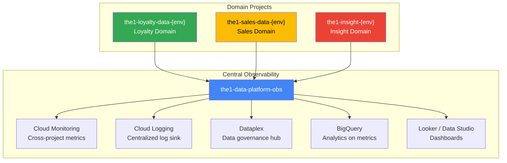
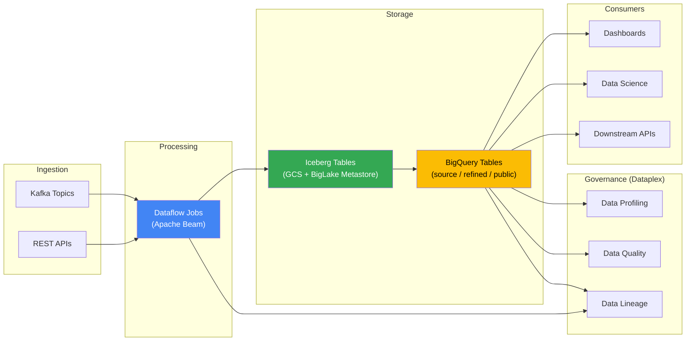
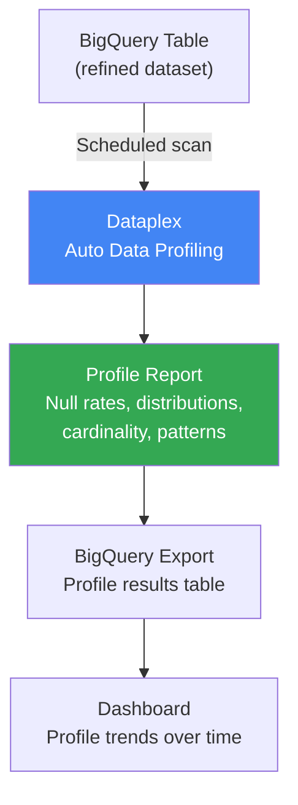
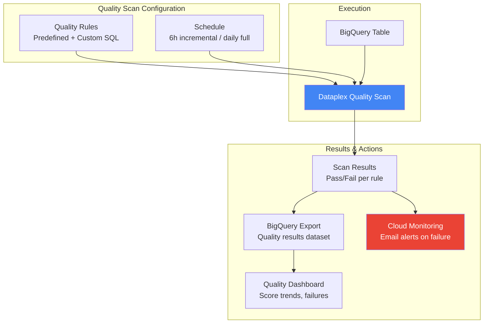
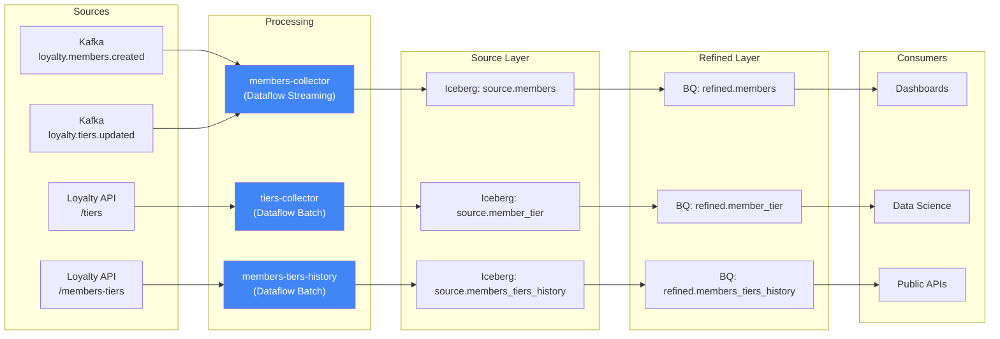
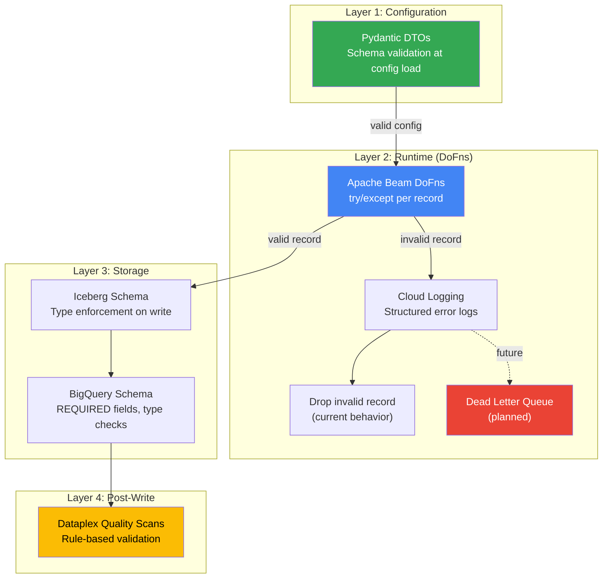
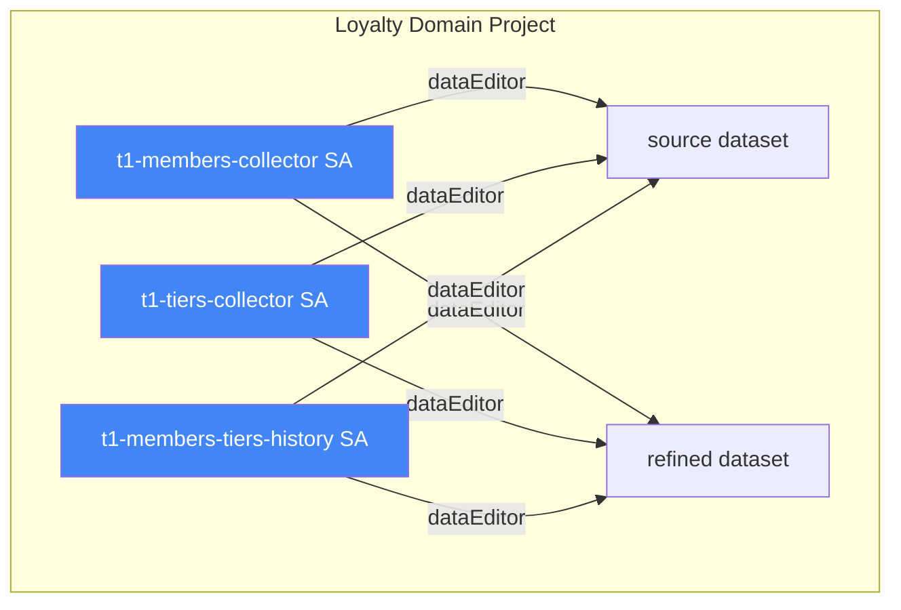
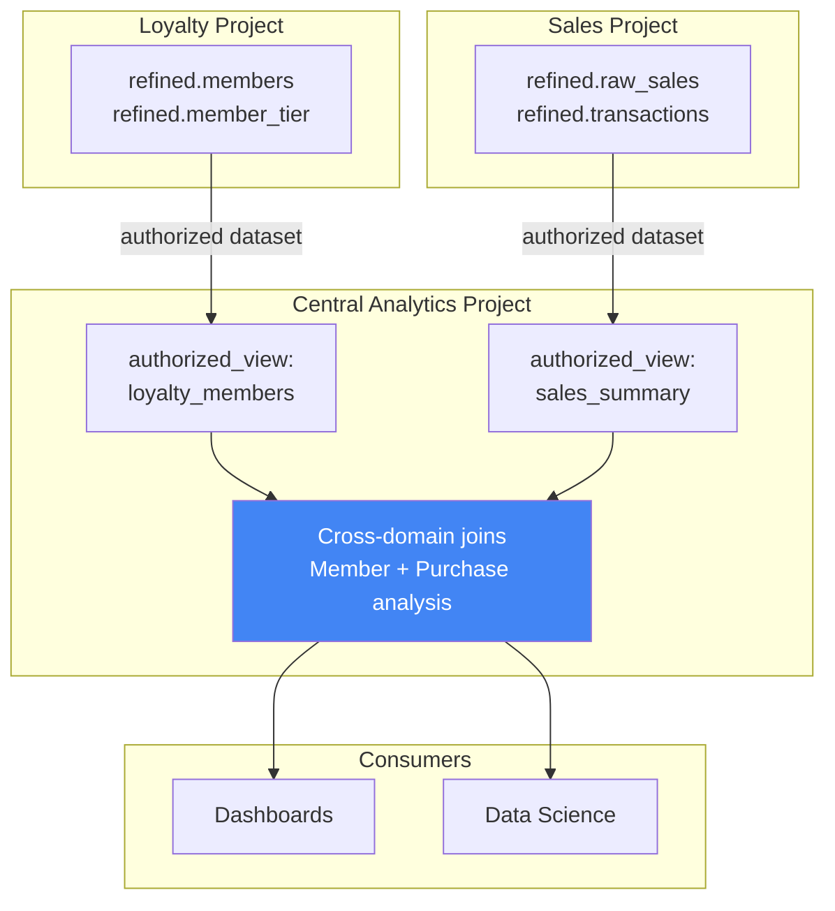
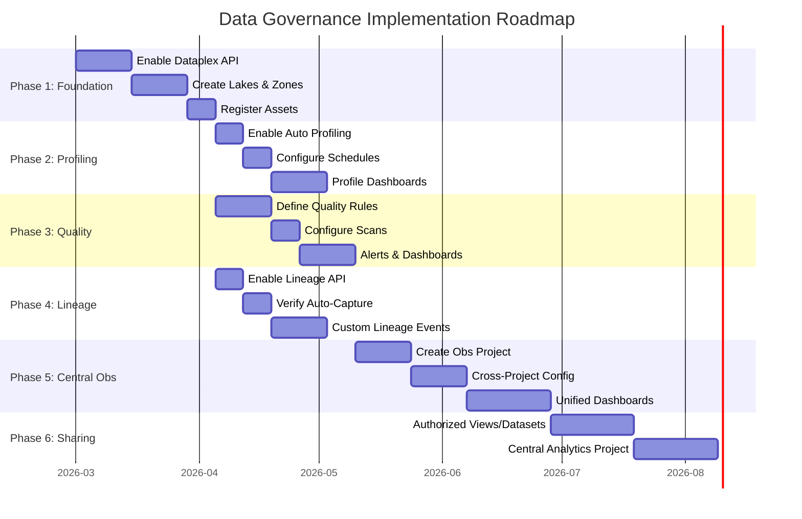

# Data Governance

Comprehensive data governance strategy for The1 Data Platform, covering data profiling, quality, lineage, validation, sharing, and naming conventions across all domain projects.

## Table of Contents

- [Vision](#vision)
- [Platform Architecture](#platform-architecture)
- [Data Governance with Dataplex](#data-governance-with-dataplex)
  - [1. Data Profiling](#1-data-profiling)
  - [2. Data Quality](#2-data-quality)
  - [3. Data Lineage](#3-data-lineage)
  - [4. Data Validation](#4-data-validation)
  - [5. Data Sharing](#5-data-sharing)
- [Naming Conventions](#naming-conventions)
- [Current State](#current-state)
- [Implementation Roadmap](#implementation-roadmap)

---

## Vision

The1 Data Platform is an enterprise-grade data platform built on GCP with three core design principles:

1. **Domain Isolation** -- Each business domain (loyalty, sales, insight) runs in its own GCP project with dedicated service accounts, networking, and IAM boundaries.
2. **Central Observability** -- A cross-domain observability project aggregates metrics, logs, lineage, and quality results for unified monitoring and governance.
3. **Data Governance via Dataplex** -- GCP Dataplex serves as the governance hub for data profiling, quality scanning, lineage tracking, and metadata management across all domains.



---

## Platform Architecture

Each domain project follows a consistent internal architecture for data flow, storage, and governance:



---

## Data Governance with Dataplex

### 1. Data Profiling

Dataplex auto data profiling provides statistical analysis of BigQuery tables without writing any code. It scans table data and produces a profile report covering distributions, null rates, cardinality, min/max values, and more.

#### What Data Profiling Provides

| Metric | Description |
|--------|-------------|
| **Null Rate** | Percentage of NULL values per column |
| **Distinct Count** | Number of unique values (cardinality) |
| **Distribution** | Value frequency histograms for string/numeric columns |
| **Min / Max / Mean** | Statistical bounds for numeric columns |
| **String Length** | Min/max/avg length for string columns |
| **Top N Values** | Most frequent values per column |
| **Pattern Detection** | Regex patterns detected in string columns |

#### Profiling Configuration

- **Scope**: Refined BigQuery tables (the primary consumer-facing layer).
- **Schedule**: Weekly profiling scans (sufficient for analytical tables; daily for high-change tables if needed).
- **Sampling**: Dataplex supports sampling for large tables to reduce cost. Use 10% sampling for tables over 10M rows.
- **Export**: Profile results are stored in Dataplex and can be exported to BigQuery for custom dashboards.

#### Profiling Targets by Collector

| Collector | Table | Priority | Notes |
|-----------|-------|----------|-------|
| members-collector | `refined.members` | HIGH | Core entity, monitor cardinality + null rates |
| tiers-collector | `refined.member_tier` | HIGH | Tier distribution, validity checks |
| members-tiers-history | `refined.members_tiers_history` | MEDIUM | Historical, large volume |
| purchases-collector | `refined.raw_sales` | HIGH | Transaction data, financial accuracy |



---

### 2. Data Quality

Dataplex auto data quality provides rule-based quality scanning for BigQuery tables. Rules are defined declaratively, executed on schedule, and results are exported for monitoring and alerting.

#### Seven Quality Dimensions

| Dimension | Description | Example Rule |
|-----------|-------------|--------------|
| **Freshness** | Data is up-to-date and timely | `etlLoadTime` within last 2 hours (streaming) or 24 hours (batch) |
| **Volume** | Expected data volume is present | Row count > 0 for daily partitions; row count within expected range |
| **Completeness** | Required fields are populated | `member_id` NOT NULL rate >= 99.9% |
| **Validity** | Values conform to expected format/range | `tier_name` IN ('Silver', 'Gold', 'Platinum', 'Diamond') |
| **Consistency** | Data is consistent across sources | `members.count` matches `members_tiers_history.distinct(member_id)` |
| **Accuracy** | Data reflects real-world truth | Cross-validate against source API (sample-based) |
| **Uniqueness** | No unintended duplicates | `(member_id, etlLoadTime)` is unique in append mode |

#### Rule Types

**Predefined Rules** (no SQL required):

| Rule Type | Usage | Example |
|-----------|-------|---------|
| **Range** | Numeric bounds check | `etlLoadTime BETWEEN 2024010100 AND 2030123123` |
| **Null** | Null rate threshold | `member_id` null rate < 0.1% |
| **Set** | Allowed values | `tier_name IN ('Silver', 'Gold', 'Platinum', 'Diamond')` |
| **Regex** | Pattern matching | `member_id MATCHES '^[A-Z0-9]{10,20}$'` |
| **Uniqueness** | Duplicate detection | `event_id` is unique within partition |

**Custom SQL Rules** (for complex logic):

```sql
-- Freshness: latest partition is within expected window
SELECT COUNT(*) = 0 AS rule_passed
FROM `project.refined.members`
WHERE etlLoadTime < FORMAT_TIMESTAMP('%Y%m%d%H', TIMESTAMP_SUB(CURRENT_TIMESTAMP(), INTERVAL 3 HOUR))
  AND _PARTITIONTIME = TIMESTAMP_TRUNC(CURRENT_TIMESTAMP(), DAY)

-- Volume: daily row count within expected range
SELECT COUNT(*) BETWEEN 1000 AND 1000000 AS rule_passed
FROM `project.refined.members`
WHERE DATE(_PARTITIONTIME) = CURRENT_DATE()

-- Consistency: member_id exists in members table
SELECT COUNT(*) = 0 AS rule_passed
FROM `project.refined.members_tiers_history` h
LEFT JOIN `project.refined.members` m ON h.member_id = m.member_id
WHERE m.member_id IS NULL
```

#### Scan Configuration

- **Incremental Scans**: Scan only new data since last scan (recommended for streaming tables). Uses partition filter to process only recent partitions.
- **Full Table Scans**: Scan entire table (recommended for batch tables or periodic deep validation).
- **Schedule**: Streaming tables -- every 6 hours (incremental). Batch tables -- daily after batch job completes.
- **Results Export**: All quality scan results are exported to a dedicated BigQuery dataset for dashboarding.
- **Notifications**: Email alerts sent to data team on quality rule failures via Cloud Monitoring alert policies.

#### Quality Score

Dataplex computes a quality score per scan as: `passed_rules / total_rules * 100`. Target: maintain >= 95% quality score across all tables.



---

### 3. Data Lineage

Dataplex Data Lineage API provides end-to-end visibility into how data flows through the platform -- from source systems through processing to consumption.

#### Auto-Captured Lineage

When the Data Lineage API is enabled, GCP automatically captures lineage from:

| Service | What is Captured | Granularity |
|---------|-----------------|-------------|
| **BigQuery** | Query jobs, copy jobs, load jobs | Table-level (column-level for some operations) |
| **Dataflow** | Pipeline read/write operations | Table-level (source and sink) |
| **Dataproc** | Spark/Hive jobs | Table-level |

#### End-to-End Lineage for The1 Data Platform



#### Custom Lineage Events

For services not automatically tracked (Kafka, REST APIs), custom lineage events can be registered via the Data Lineage API:

```python
from google.cloud import datacatalog_lineage_v1

client = datacatalog_lineage_v1.LineageClient()

# Create a lineage event for Kafka -> Dataflow
process = client.create_process(
    parent=f"projects/{project}/locations/{location}",
    process=datacatalog_lineage_v1.Process(
        display_name="members-collector",
        attributes={"collector": "members-collector", "job_type": "streaming"},
    ),
)

run = client.create_run(
    parent=process.name,
    run=datacatalog_lineage_v1.Run(
        display_name=f"run-{job_id}",
        state=datacatalog_lineage_v1.Run.State.STARTED,
        start_time=timestamp_pb2.Timestamp(seconds=int(time.time())),
    ),
)

event = client.create_lineage_event(
    parent=run.name,
    lineage_event=datacatalog_lineage_v1.LineageEvent(
        source=datacatalog_lineage_v1.EntityReference(
            fully_qualified_name="kafka:loyalty.members.created"
        ),
        target=datacatalog_lineage_v1.EntityReference(
            fully_qualified_name=f"bigquery:projects/{project}/datasets/source/tables/members"
        ),
    ),
)
```

#### Impact Analysis

With lineage in place, you can answer critical operational questions:

- **Upstream impact**: "If Kafka topic `loyalty.members.created` has a schema change, which tables and dashboards are affected?"
- **Downstream impact**: "If I drop the `tier_name` column from `refined.member_tier`, what breaks?"
- **Root cause**: "Dashboard shows stale data -- trace lineage back to find which pipeline is delayed."

---

### 4. Data Validation

Data validation is implemented at multiple layers in the platform to catch errors as early as possible.

#### Validation Layers



#### Layer 1: Configuration Validation (Pydantic)

All collector configurations are validated at startup using Pydantic models. Invalid configuration prevents the pipeline from starting.

- YAML config files (`base.yaml`, `stg.yaml`, `prod.yaml`) are loaded and merged.
- `PipelineSettings` (Pydantic BaseSettings) validates all required fields, types, and constraints.
- `ConfigAdapter` transforms settings into domain-specific frozen dataclasses (`BlmsCatalogConfig`, `ManagedIcebergWriteConfig`, etc.).

#### Layer 2: Runtime Validation (DoFns)

Each processing step (DoFn) wraps its logic in try/except to handle malformed records:

- **Current behavior**: Log the error with structured metadata (record content, step name, error message) and drop the record.
- **Planned behavior**: Route failed records to a Dead Letter Queue (DLQ) for later replay. See [DLQ_STRATEGY.md](./DLQ_STRATEGY.md) for details.

#### Layer 3: Storage Schema Enforcement

- **Iceberg**: PyArrow schema enforces column types on write. Type mismatches raise exceptions caught by Layer 2.
- **BigQuery**: Table schema with `mode: REQUIRED` fields rejects NULL values for mandatory columns. Type mismatches fail the write operation.

#### Layer 4: Post-Write Quality (Dataplex)

After data is written, Dataplex quality scans provide a safety net to catch issues that passed through earlier layers. See [Section 2: Data Quality](#2-data-quality).

---

### 5. Data Sharing

Data sharing controls who can access which data across projects and domains.

#### Current: Per-Collector IAM

Each collector's service account has scoped access to only the datasets it writes to:



IAM is granted via Terraform in each collector's `biglake-metastore.tf`:
- Source dataset: `roles/bigquery.dataEditor` on the BigLake-managed source dataset.
- Refined dataset: `roles/bigquery.dataEditor` on the refined dataset.

#### Future: Cross-Domain Data Sharing

| Mechanism | Use Case | Status |
|-----------|----------|--------|
| **Authorized Views** | Expose filtered subsets of data to other projects | Planned |
| **Authorized Datasets** | Grant read access to entire datasets across projects | Planned |
| **Analytics Hub** | Publish datasets as listings for discovery and subscription | Future |
| **Central Analytics Project** | Dedicated project for cross-domain queries and dashboards | Future |

#### Cross-Domain Sharing Architecture (Future)



---

## Naming Conventions

Consistent naming conventions are critical for governance, discoverability, and automation.

### GCP Projects

| Pattern | Example | Description |
|---------|---------|-------------|
| `the1-{domain}-data-{env}` | `the1-loyalty-data-stg` | Domain data project (with `-data` suffix) |
| `the1-{domain}-{env}` | `the1-insight-prod` | Domain project (no `-data` suffix) |
| `the1-data-platform-obs` | `the1-data-platform-obs` | Central observability (single project) |

Environments: `dev`, `stg`, `prod`

### Service Accounts

| Pattern | Example |
|---------|---------|
| `t1-{service}@the1-{domain}-data-{env}.iam.gserviceaccount.com` | `t1-members-collector@the1-loyalty-data-stg.iam.gserviceaccount.com` |
| `t1-{service}@the1-{domain}-data-{env}.iam.gserviceaccount.com` | `t1-tiers-collector@the1-loyalty-data-prod.iam.gserviceaccount.com` |
| `t1-{service}@the1-{domain}-data-{env}.iam.gserviceaccount.com` | `t1-members-tiers-history@the1-loyalty-data-stg.iam.gserviceaccount.com` |

### GCS Buckets

| Type | Pattern | Example |
|------|---------|---------|
| **Source** | `the1-{domain}-source-{env}` | `the1-loyalty-source-stg` |
| **Per-Collector** | `the1-{domain}-{env}-{collector}` | `the1-loyalty-stg-members-collector` |
| **Config** | `the1-{domain}-config-{env}` | `the1-loyalty-config-prod` |
| **Terraform State** | `devops-terraformstate-nonprod` | Shared across all projects |

### BigQuery Datasets

| Dataset | Purpose | Access |
|---------|---------|--------|
| `source` | Raw/Iceberg-backed tables (BigLake external tables) | Collector SAs (write), analysts (read) |
| `refined` | Transformed analytics-ready tables | Collector SAs (write), analysts (read) |
| `public` | Published/shared tables for downstream consumers | Read-only for consumers |
| `golden` | Curated, deduplicated tables (e.g., purchases) | Read-only, highest quality |
| `dead_letter` | Failed records from DLQ (planned) | Collector SAs (write), ops team (read) |

### Iceberg Tables

| Component | Convention | Example |
|-----------|-----------|---------|
| **Catalog** | BigLake Metastore (BLMS REST) | `projects/{project}/locations/{location}/catalogs/default` |
| **Namespace** | `source` | `source` |
| **Table** | `{entity_name}` (snake_case) | `source.members`, `source.member_tier`, `source.members_tiers_history` |

### Kafka Topics

| Pattern | Example |
|---------|---------|
| `loyalty.{entity}.{event}` | `loyalty.members.created` |
| `loyalty.{entity}.{action}` | `loyalty.tiers.updated` |

### Terraform State

| Pattern | Example |
|---------|---------|
| `devops-terraformstate-nonprod/the1-{domain}/services/{service}/{component}` | `devops-terraformstate-nonprod/the1-loyalty/services/members-collector/infrastructure` |

---

## Current State

Summary of what is implemented versus planned:

| Governance Feature | Status | Details |
|-------------------|--------|---------|
| **Data Profiling** | NOT YET ENABLED | Dataplex API not enabled; profiling scans not configured |
| **Data Quality** | NOT YET ENABLED | Dataplex API not enabled; quality rules not defined |
| **Data Lineage** | NOT YET ENABLED | Dataplex Lineage API not enabled (Dataflow auto-capture available when enabled) |
| **Data Validation (Config)** | IMPLEMENTED | Pydantic DTOs validate all config at startup |
| **Data Validation (Runtime)** | IMPLEMENTED | try/except in DoFns, structured logging, record drop |
| **Data Validation (Schema)** | IMPLEMENTED | Iceberg PyArrow schema + BigQuery REQUIRED fields |
| **Data Sharing (Per-Collector IAM)** | IMPLEMENTED | Each collector SA has scoped dataset access via Terraform |
| **Data Sharing (Cross-Domain)** | NOT YET IMPLEMENTED | Authorized views/datasets planned for future |
| **Naming Conventions** | ESTABLISHED | Followed consistently across all projects and collectors |
| **DLQ** | NOT YET IMPLEMENTED | Research complete; see [DLQ_STRATEGY.md](./DLQ_STRATEGY.md) |

---

## Implementation Roadmap

### Phase 1: Enable Dataplex Foundation

**Prerequisites**: Dataplex API enabled in all domain projects.

| Step | Action | Project(s) | Owner |
|------|--------|-----------|-------|
| 1.1 | Enable Dataplex API | All domain projects | Platform team |
| 1.2 | Create Dataplex Lake per domain | `the1-loyalty-data-{env}`, `the1-sales-data-{env}` | Platform team |
| 1.3 | Create Zones per lake | `source`, `refined`, `curated` per lake | Platform team |
| 1.4 | Register BigQuery datasets as Dataplex assets | All datasets in all projects | Platform team |

### Phase 2: Data Profiling

| Step | Action | Priority |
|------|--------|----------|
| 2.1 | Enable auto data profiling on `refined` tables | HIGH |
| 2.2 | Configure weekly profiling schedule | MEDIUM |
| 2.3 | Export profile results to BigQuery | MEDIUM |
| 2.4 | Build profile trend dashboard | LOW |

### Phase 3: Data Quality

| Step | Action | Priority |
|------|--------|----------|
| 3.1 | Define quality rules per table (freshness, completeness, validity) | HIGH |
| 3.2 | Configure incremental scans for streaming tables (6h) | HIGH |
| 3.3 | Configure daily full scans for batch tables | HIGH |
| 3.4 | Export quality results to BigQuery | MEDIUM |
| 3.5 | Set up email alerts on quality failures | HIGH |
| 3.6 | Build quality score dashboard | MEDIUM |

### Phase 4: Data Lineage

| Step | Action | Priority |
|------|--------|----------|
| 4.1 | Enable Data Lineage API in all projects | HIGH |
| 4.2 | Verify auto-capture from Dataflow and BigQuery | HIGH |
| 4.3 | Register custom lineage events for Kafka sources | MEDIUM |
| 4.4 | Register custom lineage events for REST API sources | MEDIUM |
| 4.5 | Build lineage visualization dashboard | LOW |

### Phase 5: Central Observability

| Step | Action | Priority |
|------|--------|----------|
| 5.1 | Create central observability project (`the1-data-platform-obs`) | HIGH |
| 5.2 | Configure cross-project log sinks | HIGH |
| 5.3 | Configure cross-project metric scopes | HIGH |
| 5.4 | Set up Dataplex governance hub in central project | MEDIUM |
| 5.5 | Build unified dashboards (Looker / Data Studio) | MEDIUM |

### Phase 6: Cross-Domain Data Sharing

| Step | Action | Priority |
|------|--------|----------|
| 6.1 | Define authorized views for cross-domain access | MEDIUM |
| 6.2 | Set up authorized datasets between projects | MEDIUM |
| 6.3 | Create central analytics project | LOW |
| 6.4 | Evaluate Analytics Hub for data marketplace | LOW |



---

## References

- [GCP Dataplex Documentation](https://cloud.google.com/dataplex/docs)
- [Dataplex Data Quality](https://cloud.google.com/dataplex/docs/auto-data-quality-overview)
- [Dataplex Data Profiling](https://cloud.google.com/dataplex/docs/auto-data-profiling-overview)
- [Dataplex Data Lineage](https://cloud.google.com/dataplex/docs/data-lineage)
- [BigQuery Authorized Views](https://cloud.google.com/bigquery/docs/authorized-views)
- [DLQ Strategy](./DLQ_STRATEGY.md)
- [Monitoring & Observability](../operations/MONITORING_OBSERVABILITY.md)
