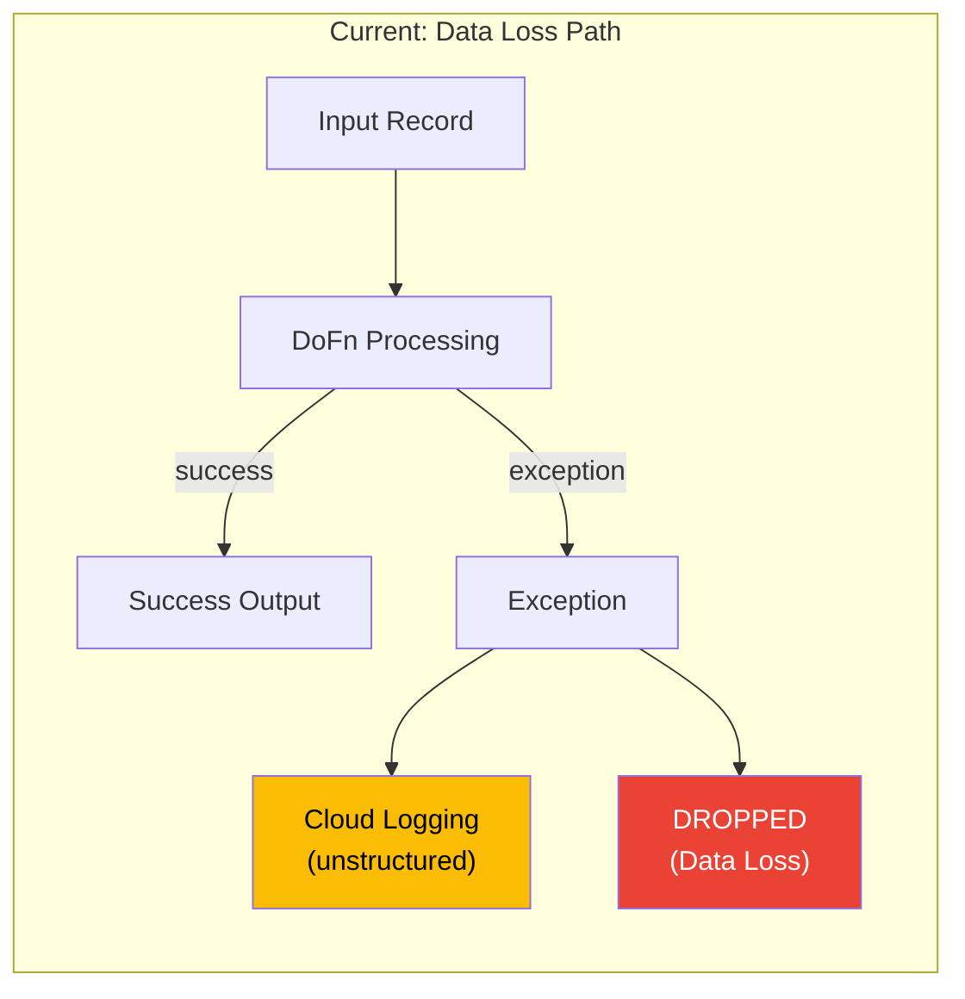
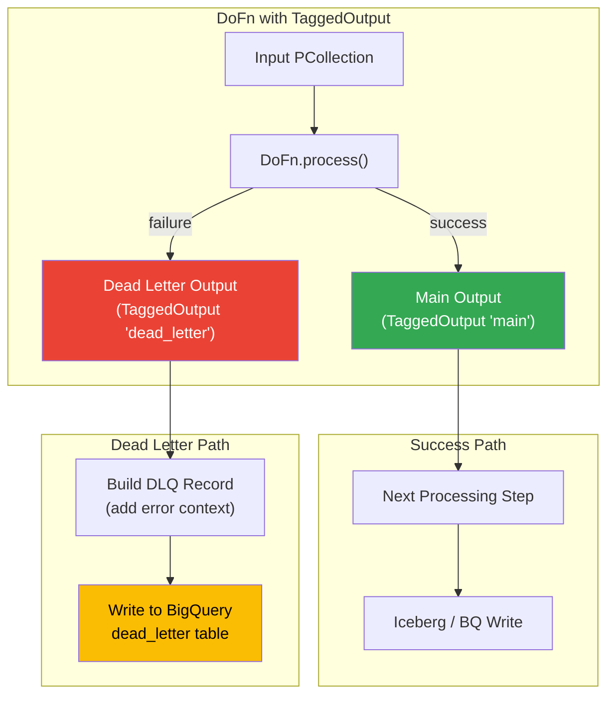
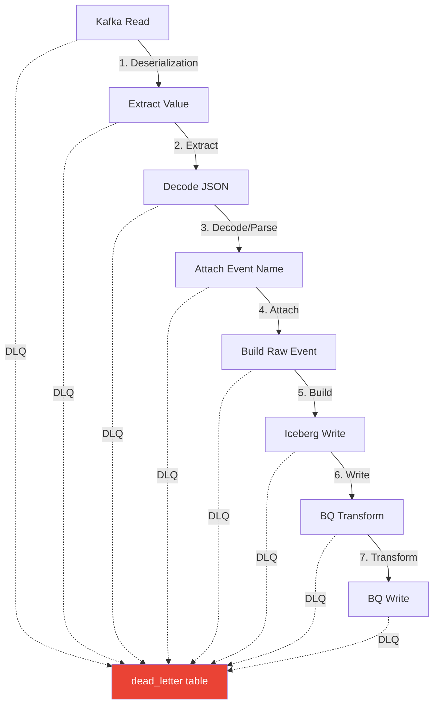
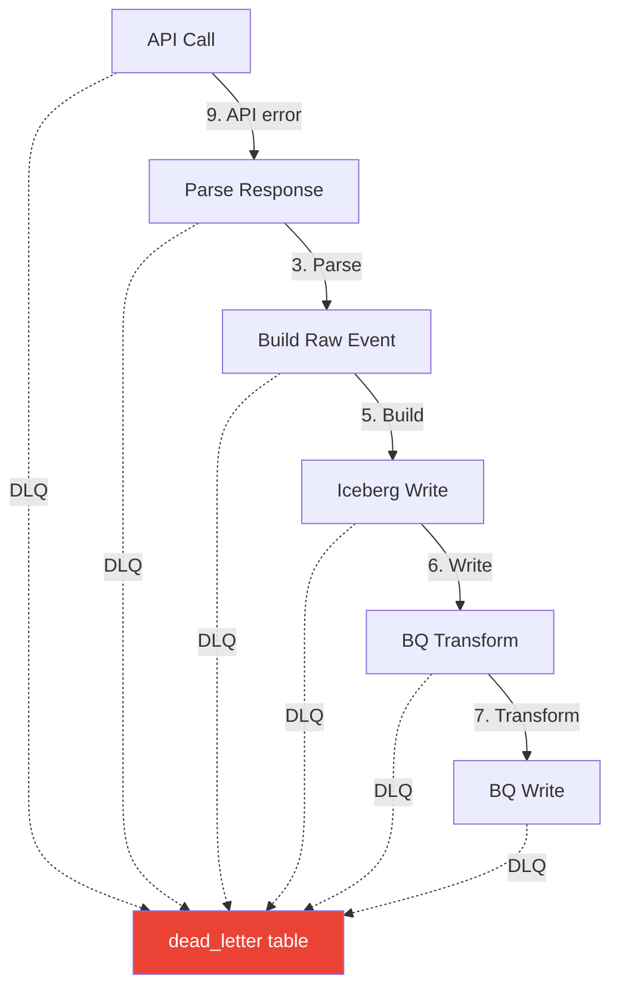
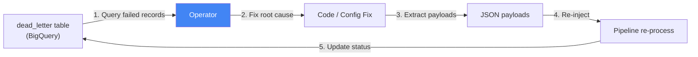
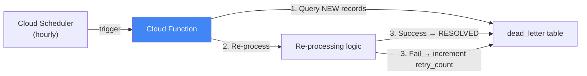
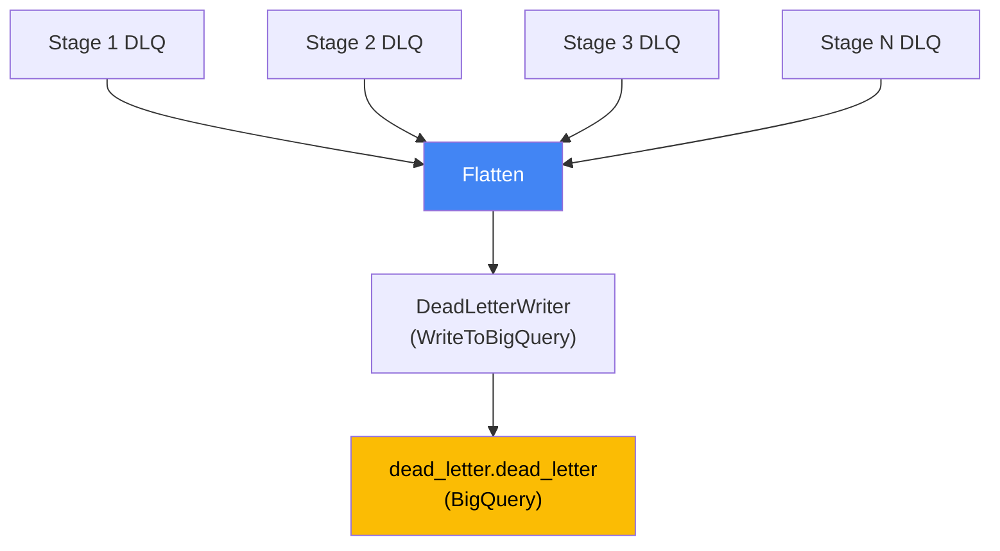
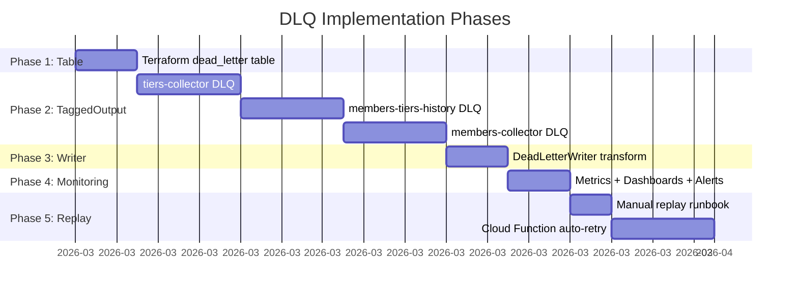

# Dead Letter Queue (DLQ) Strategy

Strategy and implementation plan for Dead Letter Queue handling across all data collectors in The1 Data Platform.

## Table of Contents

- [Current State](#current-state)
- [Problem Statement](#problem-statement)
- [Recommended Pattern: Manual TaggedOutput](#recommended-pattern-manual-taggedoutput)
- [DLQ Message Format](#dlq-message-format)
- [Storage: BigQuery dead_letter Table](#storage-bigquery-dead_letter-table)
- [Error Capture Points](#error-capture-points)
- [Replay Strategies](#replay-strategies)
- [Implementation Phases](#implementation-phases)
- [Monitoring and Alerting](#monitoring-and-alerting)

---

## Current State

All collectors currently use the same error handling pattern:

```
try:
    process(record)
except Exception as e:
    logging.error(f"Failed to process record: {e}")
    # Record is silently dropped -- DATA LOSS
```

| Aspect | Current | Problem |
|--------|---------|---------|
| Error handling | try/except in DoFns | Records are logged and dropped |
| Data loss | YES | Failed records are permanently lost |
| Retry capability | NONE | No mechanism to replay failed records |
| Visibility | Logs only | Errors buried in Cloud Logging, hard to query |
| Root cause analysis | Limited | Original payload not preserved in structured form |
| Metrics | NONE | No count of dropped records, no error rate tracking |



---

## Problem Statement

Data loss from dropped records creates several issues:

1. **Data completeness gaps**: Missing records in downstream tables lead to inaccurate analytics and reporting.
2. **Silent failures**: Errors are only visible in Cloud Logging, which requires active monitoring. No structured alerting exists.
3. **No replay capability**: Once a record is dropped, it cannot be recovered. The only option is a full re-ingestion from the source.
4. **Root cause difficulty**: Without the original payload preserved in a queryable format, debugging is slow and error-prone.
5. **Compliance risk**: For financial data (purchases), dropped records can create audit and reconciliation gaps.

---

## Recommended Pattern: Manual TaggedOutput

Google's official recommendation for Dataflow DLQ is the **Manual TaggedOutput** pattern. Each DoFn declares a dead letter tagged output alongside the main output. Failed records are routed to the dead letter output with full error context.

### Why TaggedOutput

| Pattern | Pros | Cons |
|---------|------|------|
| **TaggedOutput (recommended)** | Preserves full error context; per-stage granularity; works with all Beam runners; no external deps | Requires code changes in each DoFn |
| **Error Sink Transform** | Centralized error handling | Less granular; error context may be lost |
| **Pub/Sub DLQ** | Async replay; managed | Additional infra; ordering complexity; cost |
| **Kafka DLQ Topic** | Source-aligned | Kafka admin overhead; schema management |
| **Retry with backoff** | Handles transient errors | Does not help with bad data; can cause pipeline stall |

### Pattern Architecture



### Code Pattern

```python
import traceback
import uuid
from datetime import datetime, timezone, timedelta

import apache_beam as beam

DEAD_LETTER_TAG = "dead_letter"
MAIN_TAG = "main"
_BANGKOK_TZ = timezone(timedelta(hours=7))


class ProcessWithDLQ(beam.DoFn):
    """Base DoFn that routes failures to dead letter output."""

    STAGE_NAME = "unknown"  # Override in subclass

    def process(self, element, *args, **kwargs):
        try:
            result = self._process(element)
            yield beam.pvalue.TaggedOutput(MAIN_TAG, result)
        except Exception as e:
            dlq_record = {
                "id": str(uuid.uuid4()),
                "job_id": "",  # Populated from RuntimeValueProvider or pipeline options
                "collector_name": self._collector_name(),
                "stage": self.STAGE_NAME,
                "error_type": type(e).__name__,
                "error_message": str(e),
                "error_stacktrace": traceback.format_exc(),
                "original_payload": str(element),
                "kafka_topic": self._extract_kafka_topic(element),
                "kafka_partition": self._extract_kafka_partition(element),
                "kafka_offset": self._extract_kafka_offset(element),
                "event_id": self._extract_event_id(element),
                "event_name": self._extract_event_name(element),
                "created_at": datetime.now(_BANGKOK_TZ).isoformat(),
                "retry_count": 0,
                "status": "NEW",
                "metadata": "{}",
            }
            yield beam.pvalue.TaggedOutput(DEAD_LETTER_TAG, dlq_record)

    def _process(self, element):
        """Override in subclass with actual processing logic."""
        raise NotImplementedError

    def _collector_name(self) -> str:
        raise NotImplementedError

    # Extract methods return None/empty if not applicable
    def _extract_kafka_topic(self, element) -> str:
        return ""

    def _extract_kafka_partition(self, element) -> int:
        return -1

    def _extract_kafka_offset(self, element) -> int:
        return -1

    def _extract_event_id(self, element) -> str:
        return ""

    def _extract_event_name(self, element) -> str:
        return ""
```

### Pipeline Wiring

```python
# In pipeline builder
results = input_pcoll | "ProcessStep" >> beam.ParDo(
    MyProcessDoFn()
).with_outputs(DEAD_LETTER_TAG, main=MAIN_TAG)

# Route main output to next step
results[MAIN_TAG] | "NextStep" >> ...

# Route dead letters to BQ
results[DEAD_LETTER_TAG] | "WriteDLQ" >> beam.io.WriteToBigQuery(
    table=f"{project}:{dataset}.dead_letter",
    schema=DLQ_SCHEMA,
    write_disposition=beam.io.BigQueryDisposition.WRITE_APPEND,
    create_disposition=beam.io.BigQueryDisposition.CREATE_NEVER,
)
```

---

## DLQ Message Format

Every dead letter record captures 17 fields providing full context for debugging and replay:

| # | Field | Type | Description |
|---|-------|------|-------------|
| 1 | `id` | STRING | UUID v4, unique identifier for the DLQ record |
| 2 | `job_id` | STRING | Dataflow job ID that produced this dead letter |
| 3 | `collector_name` | STRING | Which collector: `members-collector`, `tiers-collector`, `members-tiers-history` |
| 4 | `stage` | STRING | Which DoFn/processing step failed (e.g., `decode_json`, `build_raw_event`, `bq_transform`) |
| 5 | `error_type` | STRING | Exception class name (e.g., `ValueError`, `KeyError`, `JSONDecodeError`) |
| 6 | `error_message` | STRING | Exception message text |
| 7 | `error_stacktrace` | STRING | Full Python traceback string |
| 8 | `original_payload` | STRING | Raw input that caused the error (serialized as string) |
| 9 | `kafka_topic` | STRING | Source Kafka topic (empty for batch collectors) |
| 10 | `kafka_partition` | INTEGER | Kafka partition number (-1 if not applicable) |
| 11 | `kafka_offset` | INTEGER | Kafka offset (-1 if not applicable) |
| 12 | `event_id` | STRING | Parsed event ID from the payload (empty if parsing failed before extraction) |
| 13 | `event_name` | STRING | Parsed event name from the payload (empty if parsing failed before extraction) |
| 14 | `created_at` | TIMESTAMP | When the dead letter was created (Bangkok timezone, UTC+7) |
| 15 | `retry_count` | INTEGER | Number of retry attempts (starts at 0) |
| 16 | `status` | STRING | Current status: `NEW`, `RETRIED`, `RESOLVED`, `IGNORED` |
| 17 | `metadata` | STRING | JSON dict for extra context (e.g., API response codes, batch IDs) |

### BigQuery Schema Definition

```json
[
  {"name": "id", "type": "STRING", "mode": "REQUIRED"},
  {"name": "job_id", "type": "STRING", "mode": "REQUIRED"},
  {"name": "collector_name", "type": "STRING", "mode": "REQUIRED"},
  {"name": "stage", "type": "STRING", "mode": "REQUIRED"},
  {"name": "error_type", "type": "STRING", "mode": "REQUIRED"},
  {"name": "error_message", "type": "STRING", "mode": "REQUIRED"},
  {"name": "error_stacktrace", "type": "STRING", "mode": "NULLABLE"},
  {"name": "original_payload", "type": "STRING", "mode": "REQUIRED"},
  {"name": "kafka_topic", "type": "STRING", "mode": "NULLABLE"},
  {"name": "kafka_partition", "type": "INTEGER", "mode": "NULLABLE"},
  {"name": "kafka_offset", "type": "INTEGER", "mode": "NULLABLE"},
  {"name": "event_id", "type": "STRING", "mode": "NULLABLE"},
  {"name": "event_name", "type": "STRING", "mode": "NULLABLE"},
  {"name": "created_at", "type": "TIMESTAMP", "mode": "REQUIRED"},
  {"name": "retry_count", "type": "INTEGER", "mode": "REQUIRED"},
  {"name": "status", "type": "STRING", "mode": "REQUIRED"},
  {"name": "metadata", "type": "STRING", "mode": "NULLABLE"}
]
```

---

## Storage: BigQuery dead_letter Table

### Why BigQuery

| Option | Queryable | Permanent | Cost | Complexity |
|--------|-----------|-----------|------|------------|
| **BigQuery (recommended)** | YES (SQL) | YES | Low (pennies/GB) | Low |
| Cloud Storage (JSON) | Limited | YES | Very low | Medium (need to parse files) |
| Pub/Sub | No (streaming only) | No (7-day retention) | Medium | Medium |
| Kafka DLQ topic | Limited | Configurable | Medium | High (Kafka admin) |
| Firestore | Yes (NoSQL) | Yes | Medium | Medium |

### Table Configuration

- **Project**: Same project as the collector (per-domain isolation)
- **Dataset**: `dead_letter` (dedicated dataset for DLQ records)
- **Table**: `dead_letter` (single table per project, all collectors write to it)
- **Partitioning**: `created_at` (DAY) -- enables efficient time-range queries and cost-effective retention
- **Clustering**: `collector_name`, `stage`, `status` -- optimizes common query patterns
- **Retention**: 90 days (configurable) -- old resolved records auto-deleted

### Terraform Definition

```hcl
resource "google_bigquery_dataset" "dead_letter" {
  dataset_id    = "dead_letter"
  friendly_name = "Dead Letter Queue"
  description   = "Failed records from data collectors for debugging and replay"
  location      = "asia-southeast1"
  project       = var.project_id

  default_table_expiration_ms = null  # No auto-delete at dataset level

  labels = {
    environment = var.environment
    domain      = var.domain
    managed_by  = "terraform"
  }
}

resource "google_bigquery_table" "dead_letter" {
  dataset_id          = google_bigquery_dataset.dead_letter.dataset_id
  table_id            = "dead_letter"
  project             = var.project_id
  deletion_protection = true

  time_partitioning {
    type  = "DAY"
    field = "created_at"
    expiration_ms = 7776000000  # 90 days in milliseconds
  }

  clustering = ["collector_name", "stage", "status"]

  schema = file("schemas/dead_letter.json")

  labels = {
    environment = var.environment
    domain      = var.domain
    managed_by  = "terraform"
  }
}
```

### Common Queries

```sql
-- Count dead letters by collector and stage (last 24 hours)
SELECT
  collector_name,
  stage,
  error_type,
  COUNT(*) as error_count
FROM `project.dead_letter.dead_letter`
WHERE created_at >= TIMESTAMP_SUB(CURRENT_TIMESTAMP(), INTERVAL 24 HOUR)
  AND status = 'NEW'
GROUP BY collector_name, stage, error_type
ORDER BY error_count DESC;

-- View recent failures for a specific collector
SELECT *
FROM `project.dead_letter.dead_letter`
WHERE collector_name = 'members-collector'
  AND status = 'NEW'
ORDER BY created_at DESC
LIMIT 100;

-- Get original payloads for replay
SELECT id, original_payload, kafka_topic, kafka_partition, kafka_offset
FROM `project.dead_letter.dead_letter`
WHERE collector_name = 'members-collector'
  AND stage = 'decode_json'
  AND status = 'NEW'
  AND created_at >= TIMESTAMP('2026-02-20 00:00:00+07:00');

-- Mark records as retried
UPDATE `project.dead_letter.dead_letter`
SET status = 'RETRIED', retry_count = retry_count + 1
WHERE id IN ('uuid1', 'uuid2', 'uuid3');
```

---

## Error Capture Points

There are 9 distinct stages across the collectors where errors can occur. Each stage requires its own DLQ capture point.

### Streaming Collector (members-collector): 8 Stages



### Batch Collectors (tiers-collector, members-tiers-history): 6 Stages



### Stage Details

| # | Stage | Collector(s) | Common Error Types | Example |
|---|-------|--------------|--------------------|---------|
| 1 | **Kafka Read (Deserialization)** | members | `SerializationException`, corrupted bytes | Kafka message with invalid encoding |
| 2 | **Extract Value** | members | `KeyError`, `TypeError` | Missing `value` key in Kafka record |
| 3 | **Decode/Parse (JSON/Avro)** | members, tiers, m-t-h | `JSONDecodeError`, `AvroTypeException` | Malformed JSON payload |
| 4 | **Attach Event Name** | members | `KeyError`, `ValueError` | Missing event type field in payload |
| 5 | **Build Raw Event** | members, tiers, m-t-h | `ValidationError`, `KeyError` | Missing required fields for domain model |
| 6 | **Iceberg Write** | members, tiers, m-t-h | `ArrowInvalid`, `IOError` | Type mismatch with Iceberg schema |
| 7 | **BQ Transform** | members, tiers, m-t-h | `TypeError`, `ValueError` | Timestamp conversion failure |
| 8 | **BQ Write** | members, tiers, m-t-h | `BigQueryWriteError` | Schema mismatch, quota exceeded |
| 9 | **API Call** | tiers, m-t-h | `HTTPError`, `TimeoutError`, `ConnectionError` | Loyalty API returns 500 or times out |

---

## Replay Strategies

Four replay strategies ranked from simplest to most automated:

### Strategy 1: Manual SQL Query and Re-inject (Simplest)



**Process**:
1. Query `dead_letter` table for `status = 'NEW'` records.
2. Identify and fix the root cause (code bug, schema issue, etc.).
3. Export `original_payload` values.
4. Re-inject into the pipeline (via Kafka produce, API re-call, or dedicated batch job).
5. Update DLQ records to `status = 'RETRIED'`.

**Best for**: Low-volume failures, one-off issues, initial implementation phase.

### Strategy 2: Automated Cloud Function Replay



**Process**:
1. Cloud Scheduler triggers a Cloud Function periodically (e.g., hourly).
2. Cloud Function queries `dead_letter` for `status = 'NEW'` and `retry_count < max_retries`.
3. Re-processes each record through the failed stage.
4. On success: updates `status = 'RESOLVED'`.
5. On failure: increments `retry_count`. If `retry_count >= max_retries`, sets `status = 'IGNORED'`.

**Best for**: Transient errors (API timeouts, temporary schema issues), medium-volume failures.

### Strategy 3: Kafka Offset Replay

**Process**:
1. Query `dead_letter` for Kafka-sourced failures to get `kafka_topic`, `kafka_partition`, `kafka_offset`.
2. Use Kafka consumer seek to replay from the earliest failed offset.
3. Re-process through the pipeline (requires idempotent writes or deduplication).

**Best for**: Large-scale Kafka ingestion failures, members-collector.

**Caveat**: Requires Kafka retention to still hold the messages. Default Kafka retention is 7 days.

### Strategy 4: Batch Backfill Pipeline

**Process**:
1. Query `dead_letter` for a batch of failed records.
2. Write `original_payload` values to a GCS file.
3. Run a dedicated batch Dataflow pipeline that reads from GCS and reprocesses.
4. Update DLQ records based on results.

**Best for**: Large-scale failures, historical reprocessing, complex replay logic.

### Strategy Comparison

| Strategy | Complexity | Automation | Volume | Use Case |
|----------|-----------|------------|--------|----------|
| Manual SQL | Low | None | Low | Ad-hoc debugging |
| Cloud Function | Medium | Full | Medium | Transient errors |
| Kafka Offset | Medium | Semi | High | Streaming replay |
| Batch Backfill | High | Full | High | Historical reprocessing |

---

## Implementation Phases

### Phase 1: BigQuery dead_letter Table Creation (Terraform)

**Effort**: 1-2 days | **Risk**: Low | **Dependency**: None

| Task | Details |
|------|---------|
| Create `dead_letter` dataset in Terraform | Per-project dataset |
| Create `dead_letter` table with schema | 17 fields, DAY partitioning, clustering |
| Grant collector SA `dataEditor` on `dead_letter` dataset | Each collector can write dead letters |
| Grant ops team `dataViewer` on `dead_letter` dataset | Operators can query failures |

### Phase 2: TaggedOutput in DoFns (Code Changes)

**Effort**: 3-5 days per collector | **Risk**: Medium | **Dependency**: Phase 1

| Task | Details |
|------|---------|
| Create `ProcessWithDLQ` base class | Shared module in each collector |
| Refactor existing DoFns to extend `ProcessWithDLQ` | Move logic to `_process()`, add `STAGE_NAME` |
| Add `with_outputs()` to pipeline wiring | Route main and dead_letter outputs |
| Add unit tests for DLQ path | Test that exceptions produce dead letter records |

**Implementation order**:
1. `tiers-collector` (simplest, batch, fewest stages)
2. `members-tiers-history` (batch, similar to tiers)
3. `members-collector` (streaming, most stages, highest risk)

### Phase 3: Dead Letter Writer (BQ Sink)

**Effort**: 2-3 days | **Risk**: Low | **Dependency**: Phase 2

| Task | Details |
|------|---------|
| Create `DeadLetterWriter` transform | Beam PTransform that writes to BQ dead_letter table |
| Flatten all dead letter PCollections | Merge DLQ outputs from all stages |
| Configure BQ write with WRITE_APPEND | Append-only, no overwrite |
| Add integration tests | Test end-to-end DLQ flow |



### Phase 4: Monitoring and Alerting (Cloud Monitoring)

**Effort**: 2-3 days | **Risk**: Low | **Dependency**: Phase 3

| Task | Details |
|------|---------|
| Create Beam counter metrics | `records_dead_lettered` counter per stage |
| Create Cloud Monitoring dashboard | DLQ volume by collector, stage, error_type |
| Set up alert policies | Alert if DLQ rate > threshold (e.g., > 1% of input) |
| Email notifications | Send to data team on DLQ spikes |

### Phase 5: Replay Mechanism

**Effort**: 3-5 days | **Risk**: Medium | **Dependency**: Phase 4

| Task | Details |
|------|---------|
| Implement Strategy 1 (Manual SQL) | Document runbook, create saved queries |
| Implement Strategy 2 (Cloud Function) | For transient error auto-retry |
| Create replay tracking | Update `status` and `retry_count` on replay |
| Add max retry limit | Prevent infinite retry loops (default: 3 retries) |

### Phase Summary



---

## Monitoring and Alerting

### Beam Custom Metrics

```python
from apache_beam.metrics import Metrics

class ProcessWithDLQ(beam.DoFn):
    def __init__(self):
        self.dead_letter_counter = Metrics.counter(
            self.__class__.__name__, "records_dead_lettered"
        )
        self.processed_counter = Metrics.counter(
            self.__class__.__name__, "records_processed"
        )

    def process(self, element):
        try:
            result = self._process(element)
            self.processed_counter.inc()
            yield beam.pvalue.TaggedOutput(MAIN_TAG, result)
        except Exception as e:
            self.dead_letter_counter.inc()
            yield beam.pvalue.TaggedOutput(DEAD_LETTER_TAG, self._build_dlq_record(element, e))
```

### Alert Policies

| Alert | Condition | Severity | Notification |
|-------|-----------|----------|-------------|
| **High DLQ Rate** | DLQ records > 1% of input in 1 hour | WARNING | Email |
| **DLQ Spike** | DLQ records > 100 in 15 minutes | CRITICAL | Email + PagerDuty |
| **Persistent Failures** | Same `stage + error_type` > 50 in 1 hour | WARNING | Email |
| **Replay Failures** | `retry_count >= 3` and `status = NEW` | INFO | Email (daily digest) |

### Dashboard Panels

| Panel | Query/Metric | Visualization |
|-------|-------------|---------------|
| DLQ Volume (24h) | `COUNT(*) WHERE created_at >= -24h GROUP BY collector_name` | Bar chart |
| Error Distribution | `COUNT(*) GROUP BY stage, error_type` | Heatmap |
| DLQ Rate (%) | `dead_lettered / (processed + dead_lettered) * 100` | Time series |
| Status Breakdown | `COUNT(*) GROUP BY status` | Pie chart |
| Top Errors | `COUNT(*) GROUP BY error_message ORDER BY count DESC LIMIT 10` | Table |

---

## References

- [Google Cloud Dataflow DLQ Patterns](https://cloud.google.com/blog/products/data-analytics/handling-invalid-inputs-in-dataflow)
- [Apache Beam TaggedOutput](https://beam.apache.org/documentation/programming-guide/#additional-outputs)
- [Data Governance](./DATA_GOVERNANCE.md)
- [Monitoring & Observability](../operations/MONITORING_OBSERVABILITY.md)
