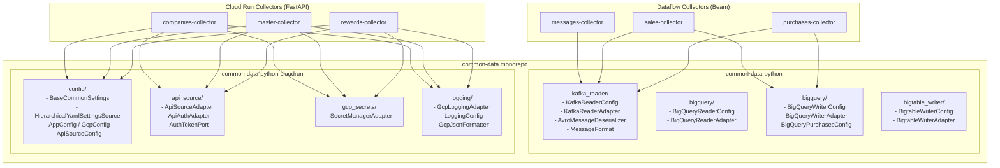
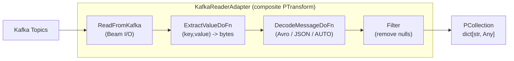
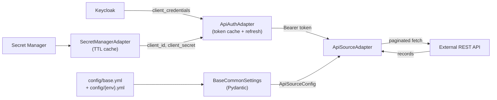
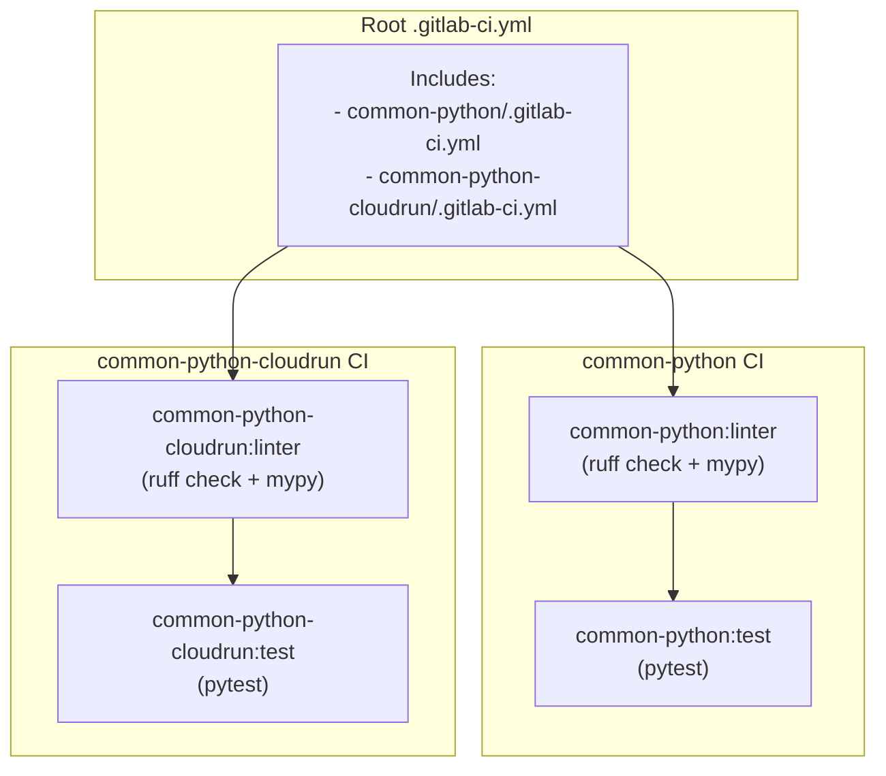

# common-data -- Shared Python Library Monorepo

## 1. Overview

`common-data` is a shared Python library monorepo that provides reusable adapters for the data platform. It lives in its own GitLab repository (`The1central/The1/the1-data/common-data`) and is consumed by downstream collector services as a git-based dependency.

The repository contains **two independent Python packages**, each targeting a different runtime:

| Package | Directory | PyPI Name | Runtime Target | Python |
|---|---|---|---|---|
| common-data-python | `common-python/` | `common-data-python` | Apache Beam / Dataflow | >=3.12 |
| common-data-python-cloudrun | `common-python-cloudrun/` | `common-data-python-cloudrun` | Cloud Run / FastAPI | ==3.12.* |

Both packages follow a **hexagonal architecture** pattern, organizing adapters into `input/` and `output/` directories with typed configuration dataclasses and thin I/O wrappers.

---

## 2. Repository Structure

```
common-data/
├── .gitlab-ci.yml                  # Root CI -- includes per-package CI
├── .pre-commit-config.yaml         # Pre-commit hooks (lint + test per package)
├── .gitignore
├── README.md                       # Original README
├── SETUP.md                        # Setup guide
├── uv.lock                         # Root lockfile
│
├── common-python/                  # Package 1: Beam I/O adapters
│   ├── pyproject.toml
│   ├── uv.lock
│   ├── .gitlab-ci.yml
│   ├── src/common/beam/adapters/
│   │   ├── input/
│   │   │   ├── kafka_reader/       # Kafka source adapter
│   │   │   └── bigquery/           # BigQuery reader adapter
│   │   └── output/
│   │       ├── bigquery/           # BigQuery writer adapter
│   │       └── bigtable_writer/    # Bigtable writer adapter
│   └── tests/
│
├── common-python-cloudrun/         # Package 2: Cloud Run utilities
│   ├── pyproject.toml
│   ├── uv.lock
│   ├── .gitlab-ci.yml
│   ├── src/common_cloudrun/adapters/
│   │   ├── input/
│   │   │   └── config/             # YAML config loading (Pydantic)
│   │   └── output/
│   │       ├── api_source/         # REST API client + OAuth auth
│   │       ├── gcp_secrets/        # Secret Manager adapter
│   │       └── logging/            # GCP-compatible JSON logging
│   └── tests/
│
├── pipeline/
│   └── common.gitlab-ci.yml       # Shared CI templates (terraform, scanning, etc.)
│
└── scripts/
    └── dataflow/                   # Shared Dataflow deployment scripts
        ├── deploy_dataflow.sh
        ├── prepare_dataflow_config.sh
        └── prepare_dataflow_spec.sh
```

---

## 3. Package 1: `common-data-python` (Beam I/O Adapters)

This package provides Apache Beam `PTransform` adapters for reading and writing data in Dataflow pipelines.

**Key dependencies:**
- `apache-beam[gcp]>=2.70.0`
- `pyarrow>=14.0.0,<18.0.0`
- `confluent-kafka[avro,schemaregistry]>=2.8.0`

**Build system:** Hatchling (`src/common` layout)

### 3.1 Input: Kafka Reader (`common.beam.adapters.input.kafka_reader`)

A composite PTransform that reads from Kafka topics, extracts message values, and decodes them (Avro or JSON).

#### Public API (`__init__.py` exports)

| Symbol | Type | Description |
|---|---|---|
| `KafkaReaderConfig` | `@dataclass` | Typed configuration for Kafka connection, topics, auth, and format |
| `MessageFormat` | `Enum` | `AVRO`, `JSON`, `AUTO` -- serialization format selector |
| `KafkaReaderAdapter` | `beam.PTransform` | Composite transform: ReadFromKafka -> ExtractValue -> Decode -> Filter |
| `DecodeMessageDoFn` | `beam.DoFn` | Deserializes messages (Avro via Schema Registry, JSON, or auto-detect) |
| `ExtractValueDoFn` | `beam.DoFn` | Extracts value bytes from Kafka `(key, value)` tuples |
| `build_consumer_config` | `function` | Builds Kafka consumer config dict from `KafkaReaderConfig` |
| `extract_value` | `function` | Extracts payload bytes from various Kafka record formats |
| `is_avro_message` | `function` | Detects Confluent wire format magic byte (`0x00`) |
| `safe_decode_and_parse` | `function` | Safely decodes bytes and parses JSON |

#### Module Breakdown

**`kafka_config.py`** -- Configuration and consumer config builder.

```python
class MessageFormat(Enum):
    AVRO = "avro"
    JSON = "json"
    AUTO = "auto"  # detect based on Confluent wire format magic byte

@dataclass
class KafkaReaderConfig:
    bootstrap_servers: str
    topics: list[str]
    group_id: str
    username: str
    password: str
    message_format: MessageFormat
    schema_registry_url: str | None = None       # required for AVRO/AUTO
    schema_registry_user: str | None = None
    schema_registry_password: str | None = None
    auto_offset_reset: str = "earliest"
    security_protocol: str = "SASL_SSL"
    sasl_mechanism: str = "PLAIN"
```

- Validates required fields in `__post_init__`.
- `__repr__` masks sensitive fields (password, JAAS config).
- `build_consumer_config()` produces the dict for `ReadFromKafka`, using SASL/JAAS auth.

**`kafka_reader_adapter.py`** -- The main composite PTransform.

```python
class KafkaReaderAdapter(beam.PTransform):
    def expand(self, pbegin):
        return (
            pbegin
            | "ReadFromKafka" >> ReadFromKafka(consumer_config, topics)
            | "ExtractValue"  >> beam.ParDo(ExtractValueDoFn())
            | "DecodeMessage" >> beam.ParDo(DecodeMessageDoFn(...))
            | "FilterDecodeFailures" >> beam.Filter(lambda x: x is not None)
        )
```

**`kafka_transforms.py`** -- Beam DoFns for value extraction and message decoding.

- `ExtractValueDoFn`: Extracts value bytes from Kafka records. Tracks Beam metrics (`records_seen`, `records_ok`, `records_errors`).
- `DecodeMessageDoFn`: Deserializes based on `MessageFormat`. Lazy-loads `AvroMessageDeserializer` on worker setup (cannot serialize Schema Registry client). Tracks metrics (`messages_seen`, `messages_ok`, `messages_errors`, `avro_messages`, `json_messages`).

**`avro_deserializer.py`** -- Confluent Schema Registry Avro deserialization.

```python
class AvroMessageDeserializer:
    def __init__(self, schema_registry_url, basic_auth_user=None, basic_auth_password=None)
    def deserialize(self, data: bytes, topic: str | None = None) -> dict[str, Any]
```

- Wraps `confluent_kafka.schema_registry.avro.AvroDeserializer`.
- Handles Confluent wire format: magic byte (0x00) + 4-byte schema ID + Avro binary.
- Supports basic auth for Schema Registry.

**`utils.py`** -- Pure functions (no Beam or I/O dependencies).

- `is_avro_message(data)`: Checks for Confluent wire format magic byte.
- `safe_decode_and_parse(element)`: Safely decodes bytes to UTF-8 and parses JSON.
- `extract_value(record)`: Handles dict (`{"value": bytes}`), tuple/list `(key, value)`, and raw bytes formats.

---

### 3.2 Input: BigQuery Reader (`common.beam.adapters.input.bigquery`)

A PTransform adapter for reading data from BigQuery.

**`bigquery_config.py`**

```python
@dataclass
class BigQueryReaderConfig:
    project_id: str
    dataset_id: str | None = None     # required for table mode
    table_id: str | None = None       # required for table mode
    query: str | None = None          # required for query mode
    use_query: bool = False
    selected_fields: list[str] = field(default_factory=list)
    row_restriction: str | None = None
    kms_key: str | None = None
```

- Two modes: **table read** (project:dataset.table with optional field selection and row restriction) or **query read** (standard SQL).
- Validates that the correct fields are provided for each mode.

**`bigquery_reader.py`**

```python
class BigQueryReaderAdapter(beam.PTransform):
    def expand(self, pbegin) -> PCollection:
        if self._config.use_query:
            return self._read_with_query(pbegin)
        return self._read_from_table(pbegin)
```

- Wraps `apache_beam.io.gcp.bigquery.ReadFromBigQuery`.
- Table mode builds a `project:dataset.table` spec with optional `selected_fields`, `row_restriction`, and `kms_key`.
- Query mode passes the SQL query with `use_standard_sql=True`.

---

### 3.3 Output: BigQuery Writer (`common.beam.adapters.output.bigquery`)

A PTransform adapter for writing data to BigQuery.

**`bigquery_writer_config.py`**

```python
@dataclass
class BigQueryWriterConfig:
    project_id: str
    dataset_id: str
    table_id: str
    schema: str | dict[str, Any] | None = None
    write_disposition: str = "WRITE_APPEND"
    create_disposition: str = "CREATE_IF_NEEDED"
    custom_gcs_temp_location: str | None = None

@dataclass
class BigQueryPurchasesConfig:
    """Dataset-level config for multi-table purchases writes."""
    project_id: str
    dataset_id: str
    write_disposition: str = "WRITE_APPEND"
    create_disposition: str = "CREATE_NEVER"
    custom_gcs_temp_location: str | None = None

    def to_table_config(self, table_id: str) -> BigQueryWriterConfig:
        """Create a per-table config from dataset config."""
```

- `BigQueryPurchasesConfig` is a convenience class for the purchases domain, where a single pipeline writes to multiple tables (receipt, detail, payment).

**`bigquery_writer.py`**

```python
class BigQueryWriterAdapter(beam.PTransform):
    def expand(self, input_or_inputs: PCollection) -> PValue:
        # Builds "project:dataset.table" spec
        # Passes schema, write_disposition, create_disposition, custom_gcs_temp_location
        return input_or_inputs | "WriteToBigQuery_{table}" >> WriteToBigQuery(**params)
```

---

### 3.4 Output: Bigtable Writer (`common.beam.adapters.output.bigtable_writer`)

A thin PTransform wrapper for writing `DirectRow` objects to Cloud Bigtable.

**`bigtable_config.py`**

```python
@dataclass
class BigtableWriterConfig:
    project_id: str
    instance_id: str
    table_id: str
```

- Validates all fields are non-empty. Safe `__repr__` for logging.

**`bigtable_writer_adapter.py`**

```python
class BigtableWriterAdapter(beam.PTransform):
    """Thin I/O wrapper -- accepts PCollection[DirectRow] and writes to Bigtable.
    Business logic (parsing payloads, building row keys, creating DirectRows)
    belongs in each project, not here."""

    def expand(self, pcoll: PCollection) -> None:
        pcoll | "WriteToBigtable" >> WriteToBigTable(
            project_id=..., instance_id=..., table_id=...
        )
```

- Each downstream project is responsible for transforming its data into `DirectRow` objects before piping into this adapter.

---

## 4. Package 2: `common-data-python-cloudrun` (Cloud Run Utilities)

This package provides reusable adapters for Cloud Run / FastAPI services: configuration loading, REST API clients, secret management, and structured logging.

**Key dependencies:**
- `pydantic>=2.0.0`, `pydantic-settings>=2.0.0`
- `pyyaml>=6.0.0`
- `google-cloud-secret-manager>=2.18.0`
- `cachetools>=5.0.0`
- `httpx>=0.27.0`

**Build system:** Hatchling (`src/common_cloudrun` layout)

### 4.1 Input: Config Adapter (`common_cloudrun.adapters.input.config`)

Provides hierarchical YAML configuration loading with Pydantic settings.

**`config_adapter.py`**

Key classes:

| Class | Description |
|---|---|
| `HierarchicalYamlSettingsSource` | Loads `config/base.yml` and deep-merges with `config/{env}.yml` |
| `AppConfig` | Application identity: `name`, `env` (stg/prod), `log_level` |
| `GcpConfig` | GCP identity: `project_id`, optional `secret_name` |
| `BaseCommonSettings` | Base settings class combining all config sources |
| `PaginationConfig` | Pagination strategy config: `page_number`, `offset`, or `none` |
| `BaseSourceConfig` | Base config for data sources with `type` discriminator |
| `ApiSourceConfig` | REST API source config: `base_url`, `endpoint`, `method`, `timeout`, `headers`, `query_params`, `pagination` |

**Configuration priority (highest to lowest):**
1. Init settings (constructor arguments)
2. Environment variables (supports `__` nested delimiter, e.g. `APP__NAME`)
3. Hierarchical YAML files (`base.yml` + `{env}.yml` deep-merged)
4. File secret settings

```python
class BaseCommonSettings(BaseSettings):
    app: AppConfig
    gcp: GcpConfig

    @property
    def is_production(self) -> bool: ...
    @property
    def is_staging(self) -> bool: ...
```

Environment normalization: `"staging"` -> `"stg"`, `"production"` -> `"prod"`.

---

### 4.2 Output: API Source (`common_cloudrun.adapters.output.api_source`)

Generic paginated REST API client with OAuth authentication.

**Public API:**
- `ApiSourceAdapter` -- Async HTTP client with automatic pagination
- `ApiAuthAdapter` -- Keycloak OAuth client_credentials token manager
- `AuthTokenPort` -- Protocol for token providers
- `TokenResponse` -- OAuth token data with expiry tracking

**`api_source_adapter.py`**

```python
class ApiSourceAdapter:
    def __init__(self, config: ApiSourceConfig, auth: AuthTokenPort, ...)
    async def fetch_all(self) -> list[dict[str, Any]]:
        """Fetch all records, handling pagination automatically."""
```

- Supports three pagination strategies: `none`, `page_number`, `offset`.
- Uses `httpx.AsyncClient` with Bearer token auth.
- Extracts nested data from responses using dot-notation field paths (e.g. `"pagination.totalPage"`).

**`api_auth_adapter.py`**

```python
class ApiAuthAdapter:
    def __init__(self, client_id, client_secret, keycloak_url, realm, scope, timeout)
    def get_valid_token(self) -> str:
        """Get a valid token, refreshing if necessary."""
    def fetch_token(self) -> TokenResponse: ...
    def refresh_token(self, refresh_token: str) -> TokenResponse: ...
    def clear_cache(self) -> None: ...
```

- Implements `AuthTokenPort` protocol.
- Keycloak `client_credentials` grant type.
- Auto-caches tokens, auto-refreshes 60 seconds before expiry.
- Falls back to full re-fetch if refresh fails.

---

### 4.3 Output: GCP Secrets (`common_cloudrun.adapters.output.gcp_secrets`)

Adapter for Google Cloud Secret Manager with TTL-based caching.

**`secret_manager_adapter.py`**

```python
class SecretManagerAdapter:
    def __init__(self, project_id=None, cache_ttl=300, cache_maxsize=100)
    def get_secret(self, secret_id, project_id=None, version="latest", use_cache=True) -> str
    def get_secret_json(self, secret_id, ...) -> dict[str, Any]
    def get_secret_model(self, secret_id, model_type: type[T], ...) -> T
```

- Lazy-initializes `SecretManagerServiceClient`.
- TTL cache (`cachetools.TTLCache`) with configurable TTL (default 300s) and max size (default 100).
- `get_secret_json()`: Parses secret value as JSON dict.
- `get_secret_model()`: Validates secret JSON against a Pydantic model.

---

### 4.4 Output: Logging (`common_cloudrun.adapters.output.logging`)

GCP-compatible structured JSON logging.

**`logging_adapter.py`**

```python
class LoggingConfig(BaseModel):
    log_level: LogLevel = "INFO"
    json_output: bool = True
    service_name: str = "service-name"
    logger_levels: dict[str, LogLevel] = {}       # per-logger overrides
    app_loggers: list[str] = ["src"]              # app logger names

class GcpLoggingAdapter:
    def __init__(self, config: LoggingConfig, filters: list[logging.Filter] | None = None)
    def setup(self) -> None:
        """Apply the logging configuration to the global logging system."""
```

- `GcpJsonFormatter`: Outputs JSON with GCP Cloud Logging fields (`severity`, `message`, `timestamp`, `sourceLocation`, `serviceContext`, `stack_trace`).
- `LocalFormatter`: Human-readable format for local development.
- Supports per-logger level overrides and custom filters.

---

## 5. Architecture



### Data Flow: Kafka Reader Adapter



### Data Flow: Cloud Run REST API Adapter



---

## 6. Who Uses What

### common-data-python consumers (Dataflow pipelines)

| Collector | Domain | Tag | Adapters Used |
|---|---|---|---|
| `purchases-collector` | loyalty-data | latest (no tag) | KafkaReaderAdapter, BigQueryWriterAdapter |
| `sales-collector` | sales-data | `0.0.9` | KafkaReaderAdapter, BigQueryWriterAdapter |
| `messages-collector` | messaging-data | `0.0.9` | KafkaReaderAdapter |

### common-data-python-cloudrun consumers (Cloud Run services)

| Collector | Domain | Tag | Adapters Used |
|---|---|---|---|
| `rewards-collector` | loyalty-data | `0.0.7` / `0.0.10` | ConfigAdapter, ApiSourceAdapter, SecretManagerAdapter, GcpLoggingAdapter |
| `master-collector` | partner-data | `0.0.7` | ConfigAdapter, ApiSourceAdapter, SecretManagerAdapter, GcpLoggingAdapter |
| `companies-collector` | partner-data | `0.0.3` | ConfigAdapter, ApiSourceAdapter, SecretManagerAdapter, GcpLoggingAdapter |

---

## 7. Usage / Installation

### 7.1 Adding as a Dependency (via Git SSH)

#### common-data-python (Dataflow collectors)

In `pyproject.toml`:

```toml
[project]
dependencies = [
    "common-data-python",
]

[tool.uv.sources]
common-data-python = { git = "ssh://git@gitlab.com/The1central/The1/the1-data/common-data.git", subdirectory = "common-python", tag = "0.0.9" }
```

Or without a pinned tag (always latest):

```toml
[tool.uv.sources]
common-data-python = { git = "ssh://git@gitlab.com/The1central/The1/the1-data/common-data.git", subdirectory = "common-python" }
```

#### common-data-python-cloudrun (Cloud Run collectors)

```toml
[project]
dependencies = [
    "common-data-python-cloudrun",
]

[tool.uv.sources]
common-data-python-cloudrun = { git = "ssh://git@gitlab.com/The1central/The1/the1-data/common-data.git", subdirectory = "common-python-cloudrun", tag = "0.0.7" }
```

### 7.2 Local Development (Editable Install)

For developing the library alongside a collector, use a path-based editable install:

```toml
[tool.uv.sources]
common-data-python = { path = "../common-data/common-python", editable = true }
```

Then run `uv sync` in the collector project.

### 7.3 Import Examples

#### Kafka Reader (Dataflow)

```python
from common.beam.adapters.input.kafka_reader import (
    KafkaReaderAdapter,
    KafkaReaderConfig,
    MessageFormat,
)

config = KafkaReaderConfig(
    bootstrap_servers="broker:9092",
    topics=["my-topic"],
    group_id="my-consumer-group",
    username="user",
    password="pass",
    message_format=MessageFormat.AVRO,
    schema_registry_url="https://schema-registry:8081",
)

with beam.Pipeline() as p:
    messages = p | "ReadKafka" >> KafkaReaderAdapter(config)
    # messages: PCollection[dict[str, Any]]
```

#### BigQuery Reader (Dataflow)

```python
from common.beam.adapters.input.bigquery.bigquery_config import BigQueryReaderConfig
from common.beam.adapters.input.bigquery.bigquery_reader import BigQueryReaderAdapter

config = BigQueryReaderConfig(
    project_id="my-project",
    dataset_id="my_dataset",
    table_id="my_table",
    selected_fields=["id", "name", "status"],
    row_restriction="status = 'ACTIVE'",
)

with beam.Pipeline() as p:
    rows = p | "ReadBQ" >> BigQueryReaderAdapter(config)
```

#### BigQuery Writer (Dataflow)

```python
from common.beam.adapters.output.bigquery.bigquery_writer_config import BigQueryWriterConfig
from common.beam.adapters.output.bigquery.bigquery_writer import BigQueryWriterAdapter

config = BigQueryWriterConfig(
    project_id="my-project",
    dataset_id="refined",
    table_id="purchases_receipt",
    write_disposition="WRITE_APPEND",
    create_disposition="CREATE_NEVER",
)

transformed | "WriteBQ" >> BigQueryWriterAdapter(config)
```

#### Bigtable Writer (Dataflow)

```python
from common.beam.adapters.output.bigtable_writer import (
    BigtableWriterAdapter,
    BigtableWriterConfig,
)

config = BigtableWriterConfig(
    project_id="my-project",
    instance_id="my-instance",
    table_id="my-table",
)

# Project builds DirectRows, then pipes to adapter
direct_rows | "WriteToBigtable" >> BigtableWriterAdapter(config)
```

#### Config + API Source + Secrets (Cloud Run)

```python
from common_cloudrun.adapters.input.config.config_adapter import BaseCommonSettings
from common_cloudrun.adapters.output.api_source import ApiAuthAdapter, ApiSourceAdapter
from common_cloudrun.adapters.output.gcp_secrets.secret_manager_adapter import SecretManagerAdapter
from common_cloudrun.adapters.output.logging.logging_adapter import GcpLoggingAdapter, LoggingConfig

# 1. Load config from YAML
settings = MySettings()  # extends BaseCommonSettings

# 2. Setup logging
logging_adapter = GcpLoggingAdapter(LoggingConfig(
    log_level="INFO",
    json_output=True,
    service_name="my-service",
))
logging_adapter.setup()

# 3. Fetch secrets
secrets = SecretManagerAdapter(project_id="my-project")
creds = secrets.get_secret_json("my-api-credentials")

# 4. Auth + API call
auth = ApiAuthAdapter(
    client_id=creds["clientId"],
    client_secret=creds["clientSecret"],
    keycloak_url="https://auth.example.com/auth/realms",
    realm="my-realm",
)
api = ApiSourceAdapter(config=api_source_config, auth=auth)
records = await api.fetch_all()
```

---

## 8. Development

### 8.1 Prerequisites

- **Python**: 3.12+
- **uv**: Fast Python package manager ([installation guide](https://github.com/astral-sh/uv))

### 8.2 Setup

```bash
# Clone the repo
git clone git@gitlab.com:The1central/The1/the1-data/common-data.git
cd common-data

# Install pre-commit hooks
pre-commit install

# Install dependencies for a specific package
cd common-python    # or common-python-cloudrun
uv sync
```

### 8.3 Poe Tasks

Both packages share identical `poethepoet` task definitions:

| Task | Command | Description |
|---|---|---|
| `uv run poe test` | `python -m pytest` | Run all unit tests |
| `uv run poe test:cov` | `python -m pytest --cov=src --cov-report=html --cov-report=xml:coverage.xml` | Run tests with coverage (HTML + XML) |
| `uv run poe format` | `python -m ruff format .` | Format code with Ruff |
| `uv run poe check` | `python -m ruff check --fix .` | Lint code with Ruff (auto-fix) |
| `uv run poe typecheck` | `python -m mypy src tests` | Static type checking with MyPy (strict mode) |
| `uv run poe lint` | sequence: format -> check -> typecheck | Run all quality checks |
| `uv run poe clean` | `rm -rf .coverage .mypy_cache .pytest_cache .ruff_cache htmlcov dist build` | Remove build artifacts |

### 8.4 Code Quality Configuration

Both packages use identical settings:

| Tool | Configuration |
|---|---|
| **Ruff** | `line-length = 120`, rules: `E, F, I, UP, B, SIM, C4, RUF` |
| **MyPy** | `python_version = "3.12"`, `strict = true` |
| **Pytest** | `testpaths = ["tests"]`, `pythonpath = ["src"]` |

### 8.5 Pre-commit Hooks

The `.pre-commit-config.yaml` runs the following on every commit:

**Standard hooks:**
- `trailing-whitespace`, `end-of-file-fixer`, `check-yaml`, `check-toml`, `check-merge-conflict`
- `check-added-large-files` (max 1000KB)
- `mixed-line-ending` (enforce LF)

**Security:**
- `gitleaks` (v8.30.0) -- secret detection

**Schema validation:**
- `check-gitlab-ci` -- validates `.gitlab-ci.yml` against GitLab CI schema

**Per-package (local hooks):**
- `lint (common-python)` -- runs `poe lint` on common-python files
- `pytest (common-python)` -- runs `poe test` on common-python files
- `lint (common-python-cloudrun)` -- runs `poe lint` on common-python-cloudrun files
- `pytest (common-python-cloudrun)` -- runs `poe test` on common-python-cloudrun files

---

## 9. CI/CD

### 9.1 Pipeline Structure



### 9.2 Root `.gitlab-ci.yml`

```yaml
default:
  tags:
    - nonprod-docker-cicd-x86

stages:
  - build

include:
  - "common-python/.gitlab-ci.yml"
  - "common-python-cloudrun/.gitlab-ci.yml"

variables:
  UV_IMAGE: "ghcr.io/astral-sh/uv:python3.12-bookworm-slim"
  RUNNER_TAG: "nonprod-docker-cicd-x86"
```

### 9.3 Per-Package CI (identical pattern)

Each package has its own `.gitlab-ci.yml` with two jobs:

**Linter job:**
- Image: `$UV_IMAGE` (uv + Python 3.12)
- Script: `uv sync` -> `uv run poe check` -> `uv run poe typecheck`
- Triggered on changes in the package directory

**Test job:**
- Depends on linter job (`needs:`)
- Script: `uv sync` -> `uv run poe test`
- Same trigger rules

Both use YAML anchors (`&rules_common_python_changes`) to define change-detection rules scoped to their directory.

### 9.4 Shared CI Templates (`pipeline/common.gitlab-ci.yml`)

The `pipeline/common.gitlab-ci.yml` file provides reusable CI templates for downstream collector repositories:

| Template | Purpose |
|---|---|
| `.rules_app_changes` | Triggers on service directory changes or manual deploy |
| `.rules_infra_manual_trigger` | Triggers on terraform apply requests |
| `.rules_infra_changes` | Triggers on infrastructure file changes |
| `.common-gcp-prepare` | Sets up GCP credentials (prod/nonprod SA key decode) |
| `.common-terraform-plan` | Runs `terraform init` + `terraform plan` |
| `.common-terraform-apply` | Runs `terraform init` + `terraform apply -auto-approve` |
| `.resource_lock` | Deployment locking via `resource_group: $SVC_NAME` |
| `.uv_base` | Base config for Python jobs (uv image, git token) |
| `.common-sonar-scan` | SonarQube analysis |
| `.common-scan-gitleaks` | Gitleaks secret detection |
| `.common-scan-image` | Trivy container image scanning |
| `.common-scan-defect-dojo` | DefectDojo vulnerability query |
| `.common-defect-dojo-scan-image-upload` | Upload Trivy results to DefectDojo |
| `.common-defect-dojo-gitleaks-upload` | Upload Gitleaks results to DefectDojo |

Also includes concrete jobs:
- `common-gcp:terraform:apply:stg` -- Apply common GCP Terraform to staging
- `common-gcp:terraform:apply:prod` -- Apply common GCP Terraform to production (depends on stg)

---

## 10. Versioning

Versions are managed through **git tags** on the `common-data` repository. Downstream consumers pin a specific tag in their `pyproject.toml`:

```toml
[tool.uv.sources]
common-data-python = { git = "ssh://...", subdirectory = "common-python", tag = "0.0.9" }
```

**Current versions (as of pyproject.toml):**
- `common-data-python`: `0.1.0` (in pyproject.toml)
- `common-data-python-cloudrun`: `0.0.6` (in pyproject.toml)

**Tags observed in consumer projects:**
- `common-data-python`: `0.0.9` (sales-collector, messages-collector), no tag / latest (purchases-collector)
- `common-data-python-cloudrun`: `0.0.3` (companies-collector), `0.0.7` (master-collector, rewards-collector), `0.0.10` (rewards-collector parallel)

**Note:** The git tag and the `version` field in `pyproject.toml` may differ. The git tag is what consumers use to pin versions; the pyproject.toml version is the package metadata version.

**Workflow for releasing a new version:**
1. Make changes in the common-data repo
2. Ensure CI passes (linter + tests)
3. Create a git tag (e.g. `0.0.10`)
4. Update downstream consumers' `pyproject.toml` to reference the new tag
5. Run `uv sync` in each consumer to update the lockfile
