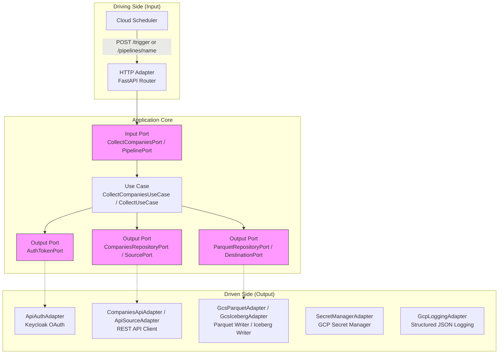
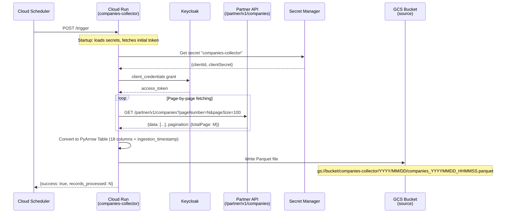
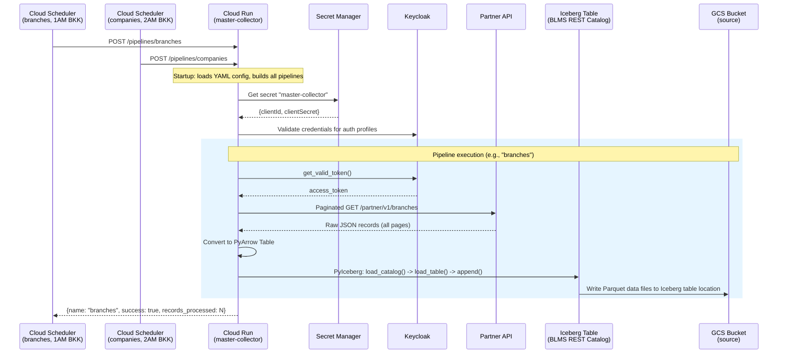
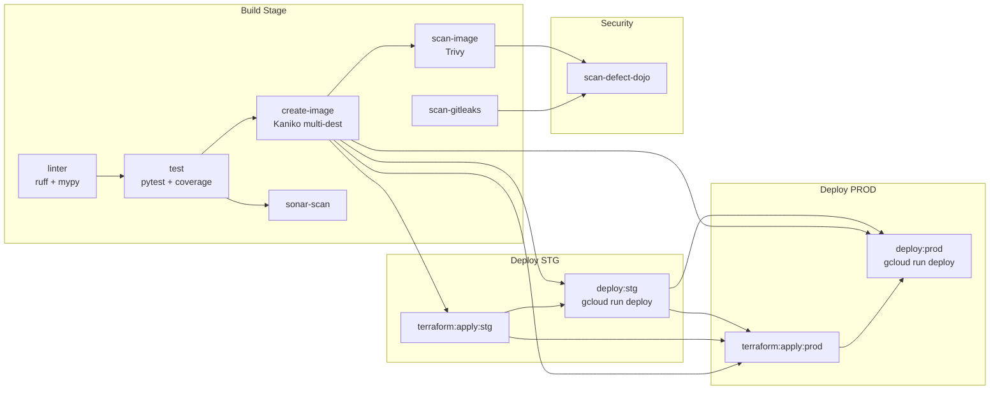
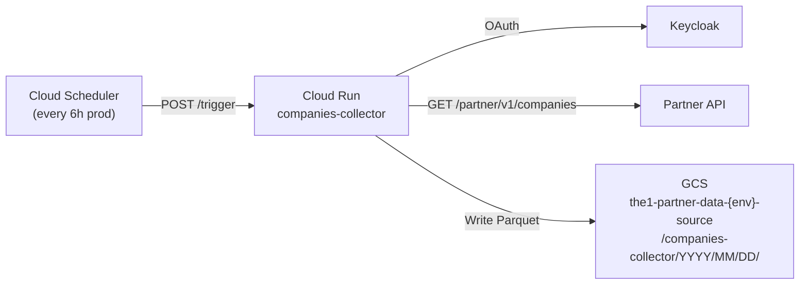
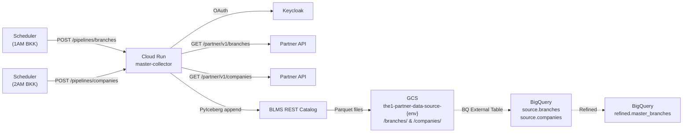

# Partner Data -- Collector Monorepo

## 1. Overview

**Repository:** `The1central/The1/the1-data/partner-data`

Partner-data is a collector monorepo for partner and master data ingestion. It contains multiple microservices (collectors) that fetch data from external REST APIs and persist it to Google Cloud Storage as Parquet files or to Apache Iceberg tables via the BigLake Metastore (BLMS) REST Catalog.

All collectors are **FastAPI-based Cloud Run services** triggered on a schedule by Cloud Scheduler. They follow a **hexagonal architecture** (Ports and Adapters) pattern with clean separation between domain, application, and infrastructure layers.

### Collectors in this Monorepo

| Collector | Status | Runtime | Output | Trigger |
|-----------|--------|---------|--------|---------|
| **companies-collector** | Active | FastAPI on Cloud Run | GCS Parquet | Cloud Scheduler (every 6h prod / 12h stg) |
| **master-collector** | Active | FastAPI on Cloud Run | Iceberg (BLMS REST) + GCS Parquet | Cloud Scheduler (daily 1AM + 2AM BKK) |
| **branches-collector** | Stub | -- | -- | -- |

### Technology Stack

- **Language:** Python 3.12
- **Web Framework:** FastAPI + Uvicorn
- **Config:** Pydantic Settings + hierarchical YAML (base + env overlay)
- **Package Manager:** uv (with `uv.lock`)
- **Linting:** Ruff (format + check) + MyPy (strict)
- **Testing:** pytest + pytest-asyncio + pytest-cov
- **Task Runner:** Poe the Poet (`poe lint`, `poe test`, `poe dev`)
- **Container Build:** Kaniko (multi-stage Dockerfile, Python 3.12 slim-bookworm)
- **CI/CD:** GitLab CI with shared common-data pipeline templates
- **Infrastructure:** Terraform (GCS, GAR, Cloud Run, Secret Manager, BigLake, BigQuery)

---

## 2. Repository Structure

```
partner-data/
├── .gitlab-ci.yml                    # Root CI: stages, variables, workflow rules
├── .pre-commit-config.yaml           # Pre-commit hooks (trailing-whitespace, gitleaks, ruff, pytest)
├── .gitleaks.toml                    # Gitleaks secret scanning config
├── .gitignore
├── uv.lock
│
├── companies-collector/              # Companies data collector (GCS Parquet)
│   ├── .gitlab-ci.yml
│   ├── Dockerfile
│   ├── pyproject.toml
│   ├── config/
│   │   ├── base.yaml
│   │   ├── stg.yaml
│   │   └── prod.yaml
│   ├── src/
│   │   ├── main.py                   # Composition root
│   │   ├── domain/entities/
│   │   ├── application/
│   │   │   ├── ports/input/
│   │   │   ├── ports/output/
│   │   │   └── usecases/
│   │   └── adapters/
│   │       ├── input/config/
│   │       ├── input/http/
│   │       └── output/ (api_auth, companies_api, gcs_parquet, gcp_secrets, logging)
│   └── tests/
│
├── master-collector/                 # Master data collector (Iceberg BLMS REST)
│   ├── .gitlab-ci.yml
│   ├── Dockerfile
│   ├── pyproject.toml
│   ├── config/
│   │   ├── base.yml
│   │   ├── stg.yml
│   │   └── prod.yml
│   ├── src/
│   │   ├── main.py                   # Composition root
│   │   ├── domain/
│   │   │   ├── blms_catalog_config.py
│   │   │   ├── managed_iceberg_write_config.py
│   │   │   └── validators.py
│   │   ├── application/
│   │   │   ├── models.py
│   │   │   ├── ports.py
│   │   │   └── usecases/
│   │   └── adapters/
│   │       ├── input/config/
│   │       ├── input/http/
│   │       └── output/ (gcs_iceberg, gcs_parquet, gcp_secrets)
│   └── tests/
│
├── branches-collector/               # Stub -- minimal, tests directory only
│   └── tests/
│
├── infrastructure/
│   ├── common/GCP/                   # Shared: buckets, service accounts, variables
│   ├── companies-collector/          # Per-collector: GAR, GCS, Cloud Run, Secrets, Scheduler
│   └── master-collector/             # Per-collector: GAR, GCS, Cloud Run, Secrets, BLMS, BQ, Scheduler
│
└── scripts/
    ├── deploy_dataflow.sh
    ├── prepare_dataflow_config.sh
    └── prepare_dataflow_spec.sh
```

---

## 3. Architecture

Both active collectors follow the **hexagonal architecture** (Ports and Adapters) pattern:



### Key Architectural Principles

1. **Dependency Inversion:** Use cases depend on abstract ports (ABCs / Protocols), not concrete adapters.
2. **Composition Root:** `main.py` is the only place where concrete adapters are instantiated and wired together.
3. **Clean Domain:** Domain entities (`Company`, `BlmsCatalogConfig`, etc.) are pure frozen dataclasses with no framework dependencies.
4. **Testability:** Every adapter can be mocked via its port interface, enabling isolated unit tests.

---

## 4. Companies Collector -- Detailed Design

### 4.1 Purpose

Collects company master data from the Partner REST API (`/partner/v1/companies`) and persists it as Parquet files on GCS.

### 4.2 Data Flow



### 4.3 Domain Layer

**Entity: `Company`** (`src/domain/entities/company.py`)

A frozen dataclass representing a company with fields: `company_id`, `company_code`, `company_name` (localized EN/TH), `company_display_name`, `status`, `company_type`, `company_sub_type`, `parent_code`, `internal_code`, `company_category`, `company_roles`, `company_codes`, `created_date`, `created_by`, `updated_date`, `updated_by`.

### 4.4 Application Layer

**Input Port:** `CollectCompaniesPort` -- abstract `execute()` method returning `CollectCompaniesResult`.

**Output Ports:**
- `AuthTokenPort` -- `get_valid_token() -> str`
- `CompaniesRepositoryPort` -- `fetch_companies_page(page_number, page_size) -> (list[Company], total_record, total_page)`
- `ParquetRepositoryPort` -- `save_companies(data: list[Company]) -> str`

**Use Case:** `CollectCompaniesUseCase` -- orchestrates paginated fetch from the API, collects all companies in memory, then saves once to Parquet.

### 4.5 Adapter Layer

| Adapter | Port | Technology |
|---------|------|------------|
| `HttpAdapter` (create_router) | Driving (input) | FastAPI `APIRouter`, endpoints: `GET /health`, `POST /trigger` |
| `Settings` (config adapter) | Input | Pydantic Settings + hierarchical YAML (base + env) |
| `ApiAuthAdapter` | `AuthTokenPort` | httpx sync client, Keycloak `client_credentials` grant, token caching + auto-refresh |
| `CompaniesApiAdapter` | `CompaniesRepositoryPort` | httpx async client, paginated `GET /partner/v1/companies`, converts API models to domain entities |
| `CompaniesParquetAdapter` | `ParquetRepositoryPort` | PyArrow + google-cloud-storage, writes timestamped Parquet to GCS |
| `SecretManagerAdapter` | -- | google-cloud-secret-manager, fetches JSON secrets, validates with Pydantic |
| `GcpLoggingAdapter` | -- | GCP-compatible structured JSON logging with severity mapping |

### 4.6 Parquet Schema

The companies Parquet file has 18 data columns plus `ingestion_timestamp`:

```
company_id (string), company_code (string),
company_name_en (string), company_name_th (string),
company_display_name_en (string), company_display_name_th (string),
status (string), company_type (string), company_sub_type (string),
parent_code (string), internal_code (string), company_category (string),
company_roles (list<string>), company_codes (list<string>),
created_date (string), created_by (string),
updated_date (string), updated_by (string),
ingestion_timestamp (timestamp[us, UTC])
```

---

## 5. Master Collector -- Detailed Design

### 5.1 Purpose

A **config-driven, multi-pipeline** collector for master data. Currently has two pipelines defined in YAML:
1. **branches** -- fetches branch data from `/partner/v1/branches` and writes to Iceberg
2. **companies** -- fetches company data from `/partner/v1/companies` and writes to Iceberg

Each pipeline is exposed as an individual endpoint: `POST /pipelines/{pipeline_name}`.

### 5.2 Data Flow



### 5.3 Config-Driven Pipeline Architecture

Master-collector is fully driven by YAML configuration. The `base.yml` defines:

```yaml
auth:           # Named auth profiles (keycloak config)
sources:        # Named API sources (endpoint, pagination, method)
destinations:   # Named destinations (type, bucket, iceberg config)
pipelines:      # Named pipelines connecting source -> [destinations]
```

This allows adding new data collection pipelines by simply editing YAML -- no code changes needed.

### 5.4 Domain Layer

**`BlmsCatalogConfig`** -- frozen dataclass for BLMS REST Catalog connection. Auto-derives `catalog_name` from `warehouse_path`. Builds PyIceberg catalog properties with Google auth, vended-credentials header, and billing project.

**`ManagedIcebergWriteConfig`** -- frozen dataclass wrapping `BlmsCatalogConfig` + `table_name`. Provides `get_full_table_identifier()` (returns `{namespace}.{table_name}`) and `get_table_location()`.

**`validators.py`** -- shared validation helpers (`require_non_empty_str`, `require_positive_int`).

### 5.5 Application Layer

**Ports (Protocol-based):**
- `PipelinePort` -- input port: `execute() -> PipelineResult`
- `SourcePort` -- output port: `fetch_all() -> list[dict[str, Any]]`
- `DestinationPort` -- output port: `save(rows) -> str`

**Use Case:** `CollectUseCase` -- generic pipeline executor. Fetches all records from source, writes to all configured destinations.

### 5.6 Adapter Layer

| Adapter | Port | Technology |
|---------|------|------------|
| `HttpAdapter` (create_router) | Driving (input) | FastAPI, `GET /health`, `POST /pipelines/{pipeline_name}` |
| `Settings` (config) | Input | Pydantic Settings + hierarchical YAML, extends `common_cloudrun.BaseCommonSettings` |
| `ApiAuthAdapter` | -- (shared lib) | From `common-data-python-cloudrun`, Keycloak client_credentials |
| `ApiSourceAdapter` | `SourcePort` | From `common-data-python-cloudrun`, generic paginated REST source |
| `GcsIcebergAdapter` | `DestinationPort` | PyIceberg: REST catalog, auto-create table, name mapping, append |
| `GcsParquetAdapter` | `DestinationPort` | PyArrow + GCS, timestamped Parquet files (legacy/fallback) |
| `GenericParquetDestination` | `DestinationPort` | Compatibility wrapper around `GcsParquetAdapter` |
| `SecretManagerAdapter` | -- (shared lib) | From `common-data-python-cloudrun` |

### 5.7 Iceberg Write Details

The `GcsIcebergAdapter` performs:

1. **Catalog initialization** -- `load_catalog()` with BLMS REST properties (vended-credentials, Google auth, billing header).
2. **Table load or auto-create** -- loads existing table or creates from inferred PyArrow schema if `NoSuchTableError`.
3. **Name mapping** -- ensures `schema.name-mapping.default` property is set so PyIceberg can resolve column names to field IDs for data written without embedded IDs.
4. **Append** -- `table.append(arrow_table)` writes Parquet data files to the Iceberg table location.

### 5.8 BLMS REST Catalog Properties

```python
{
    "type": "rest",
    "uri": "https://biglake.googleapis.com/iceberg/v1/restcatalog",
    "warehouse": "gs://{catalog_name}",
    "auth.type": "google",
    "header.X-Iceberg-Access-Delegation": "vended-credentials",
    "header.x-goog-user-project": "{project_id}",
    "io-impl": "pyiceberg.io.pyarrow.PyArrowFileIO",
    "token": "{google_auth_token}"
}
```

---

## 6. Branches Collector

The `branches-collector/` directory currently contains only a `tests/` directory. It is a **stub/placeholder** for a potential future standalone branches collector. Currently, branch data collection is handled by the `branches` pipeline within `master-collector`.

---

## 7. Shared Library: common-data-python-cloudrun

Both collectors reference a shared library from GitLab:

```toml
# companies-collector (tag 0.0.3, referenced in uv.sources but not used in imports)
common-data-python-cloudrun = { git = "ssh://...common-data.git", subdirectory = "common-python-cloudrun", tag = "0.0.3" }

# master-collector (tag 0.0.7, actively imported)
common-data-python-cloudrun = { git = "ssh://...common-data.git", subdirectory = "common-python-cloudrun", tag = "0.0.7" }
```

**Master-collector** actively imports from the shared library:
- `common_cloudrun.adapters.input.config.config_adapter` -- `BaseCommonSettings`, `AppConfig`, `GcpConfig`, `ApiSourceConfig`, `PaginationConfig`
- `common_cloudrun.adapters.output.api_source` -- `ApiAuthAdapter`, `ApiSourceAdapter`
- `common_cloudrun.adapters.output.logging.logging_adapter` -- `GcpLoggingAdapter`, `LoggingConfig`
- `common_cloudrun.adapters.output.gcp_secrets.secret_manager_adapter` -- `SecretManagerAdapter`

**Companies-collector** has its own local implementations of these adapters (config loader, auth adapter, secret manager, logging) and does not actively use the shared library at runtime, though it lists the dependency.

---

## 8. Configuration

### 8.1 Hierarchical YAML Loading

Both collectors use a custom `HierarchicalYamlSettingsSource` for Pydantic Settings:

1. Load `config/base.yaml` (or `base.yml`)
2. Load `config/{ENV}.yaml` (or `{ENV}.yml`) where `ENV` is an environment variable
3. Deep-merge: env-specific values override base values
4. Environment variables take highest priority

### 8.2 Companies Collector Config

| Key | Base | STG | PROD |
|-----|------|-----|------|
| `app.name` | companies-collector | -- | -- |
| `app.log_level` | -- | DEBUG | INFO |
| `gcp.project_id` | -- | the1-partner-data-stg | the1-partner-data-prod |
| `gcp.secret_name` | companies-collector | -- | -- |
| `gcp.gcs.bucket` | -- | the1-partner-data-stg-source | the1-partner-data-prod-source |
| `clients.gateways.private-gw.url` | -- | https://private-gateway-stg.the1.co.th | https://private-gateway.the1.co.th |
| `clients.keycloak.url` | https://the1-corporate-iam.cloud-iam.com/auth/realms | -- | -- |
| `clients.keycloak.realm` | -- | integration-np | integration |
| `clients.apis.companies.timeout` | 30.0 | -- | -- |

### 8.3 Master Collector Config

| Key | Base | STG | PROD |
|-----|------|-----|------|
| `app.name` | master-collector | -- | -- |
| `app.log_level` | -- | DEBUG | INFO |
| `gcp.project_id` | -- | the1-partner-data-stg | the1-partner-data-prod |
| `gcp.secret_name` | master-collector | -- | -- |
| `auth.private_gw.realm` | -- | integration-np | integration |
| `sources.branches_api.base_url` | -- | https://private-gateway-stg.the1.co.th | https://private-gateway.the1.co.th |
| `destinations.branches_iceberg.bucket` | -- | the1-partner-data-source-stg | the1-partner-data-source-prod |
| `destinations.branches_iceberg.warehouse_path` | -- | gs://the1-partner-data-source-stg/ | gs://the1-partner-data-source-prod/ |

**Pipelines defined in base.yml:**
- `branches`: source=`branches_api`, destinations=[`branches_iceberg`]
- `companies`: source=`companies_api`, destinations=[`companies_iceberg`]

Both sources use page-number pagination with `pageSize=200`, data field `data`, and total pages field `pagination.totalPage`.

---

## 9. Infrastructure (Terraform)

### 9.1 Architecture Overview

```mermaid
graph TB
    subgraph "Common Infrastructure"
        SA[Service Account<br/>t1-partner-data-{env}-sa-partner]
        SRC_BUCKET[GCS Bucket<br/>the1-partner-data-{env}-pipeline-source]
        REF_BUCKET[GCS Bucket<br/>the1-partner-data-{env}-pipeline-refined]
    end

    subgraph "Companies Collector Infra"
        CC_GAR[Artifact Registry<br/>companies-collector]
        CC_CR[Cloud Run<br/>companies-collector]
        CC_SM[Secret Manager<br/>companies-collector]
        CC_GCS[GCS Bucket<br/>companies-collector-dataflow-config]
        CC_SCHED[Cloud Scheduler<br/>POST /trigger<br/>every 6h prod / 12h stg]
    end

    subgraph "Master Collector Infra"
        MC_GAR[Artifact Registry<br/>master-collector]
        MC_CR[Cloud Run<br/>master-collector]
        MC_SM[Secret Manager<br/>master-collector]
        MC_GCS_SRC[GCS Bucket<br/>the1-partner-data-source-{env}]
        MC_GCS_REF[GCS Bucket<br/>the1-partner-data-refined-{env}]
        MC_BLMS[BigLake Iceberg Catalog<br/>source_catalog]
        MC_BQ_SRC[BigQuery Dataset<br/>source]
        MC_BQ_REF[BigQuery Dataset<br/>refined]
        MC_SCHED1[Cloud Scheduler<br/>POST /pipelines/branches<br/>daily 1AM BKK]
        MC_SCHED2[Cloud Scheduler<br/>POST /pipelines/companies<br/>daily 2AM BKK]
    end

    CC_SCHED --> CC_CR
    MC_SCHED1 --> MC_CR
    MC_SCHED2 --> MC_CR
    MC_CR --> MC_BLMS
    MC_BLMS --> MC_GCS_SRC
```

### 9.2 Common Infrastructure

| Resource | File | Details |
|----------|------|---------|
| Terraform backend | `common/GCP/main.tf` | GCS bucket `devops-terraformstate-nonprod`, prefix `the1-partner-data/common/gcp` |
| Source bucket | `common/GCP/bucket.tf` | `the1-partner-data-{env}-pipeline-source` |
| Refined bucket | `common/GCP/bucket.tf` | `the1-partner-data-{env}-pipeline-refined` |
| Service account | `common/GCP/service-account.tf` | `t1-partner-data-{env}-sa-partner` with Dataflow, Storage, GAR, BQ roles |

### 9.3 Companies Collector Infrastructure

| Resource | File | Details |
|----------|------|---------|
| Artifact Registry | `artifact-registry.tf` | Docker repo `companies-collector` |
| GCS Bucket | `bucket.tf` | `the1-partner-data-{env}-companies-collector-dataflow-config` |
| Cloud Run | `cloud-run.tf` | Internal-only ingress, VPC connector, health probes on `/health` |
| Cloud Scheduler | `cloud-run.tf` | `POST /trigger`, every 6h (prod) / 12h (stg), OIDC auth, 3 retries |
| Secret Manager | `secret-manager.tf` | Secret `companies-collector` with SA accessor |
| Variables | `variable.tf` | CPU 1, Memory 512Mi, max 5 instances, timeout 300s |

### 9.4 Master Collector Infrastructure

| Resource | File | Details |
|----------|------|---------|
| Artifact Registry | `artifact-registry.tf` | Docker repo `master-collector` |
| GCS Buckets | `bucket.tf` | Source: `the1-partner-data-source-{env}`, Refined: `the1-partner-data-refined-{env}` |
| Cloud Run | `cloud-run.tf` | Internal-only, VPC connector, health probes, same sizing as companies |
| Cloud Scheduler (branches) | `cloud-run.tf` | `POST /pipelines/branches`, daily 1AM BKK, OIDC, 3 retries |
| Cloud Scheduler (companies) | `cloud-run.tf` | `POST /pipelines/companies`, daily 2AM BKK, OIDC, 3 retries |
| Secret Manager | `secret-manager.tf` | Secret `master-collector` with SA accessor |
| BigLake Iceberg Catalog | `biglake-metastore.tf` | Catalog type `GCS_BUCKET`, vended-credentials, `roles/biglake.editor` for SA |
| BigQuery Connection | `bigquery.tf` | `partner_data_raw_connection` (cloud_resource) |
| BigQuery Datasets | `bigquery.tf` | `source` dataset + `refined` dataset |
| Schema Deploy | `schemas/deploy.py` | BQ table deployer with Iceberg support, dummy data creation, schema evolution |
| Schema Definition | `schemas/master-branches.json` | Refined `master_branches` table: 12 columns, partitioned by `processedAt` (DAY), clustered by `brandCode`, `status`, `companyCode` |
| Variables | `variable.tf` | Same Cloud Run sizing as companies-collector |

---

## 10. CI/CD Pipeline

### 10.1 Root Pipeline Structure

The root `.gitlab-ci.yml` defines:

**Stages:** `build` -> `deploy-stg` -> `test-stg` -> `deploy-prod` -> `test-prod` -> `rollback`

**Trigger Variables:**
- `TRIGGER_EVENT`: `manual-deploy` | `terraform-apply` | `rollback`
- `SERVICE_NAME`: `Select Option` | `companies-collector` | `master-collector`

**Includes:**
- `common-data/pipeline/common.gitlab-ci.yml` (shared templates)
- `companies-collector/.gitlab-ci.yml`
- `master-collector/.gitlab-ci.yml`

### 10.2 Per-Collector CI/CD Flow



### 10.3 Image Build (Kaniko)

Both collectors push images to **4 destinations** (STG + PROD, each with commit SHA tag + `latest`):

```
asia-southeast1-docker.pkg.dev/the1-partner-data-{stg|prod}/{collector}/{collector}:{arch}-{sha}
asia-southeast1-docker.pkg.dev/the1-partner-data-{stg|prod}/{collector}/{collector}:latest
```

### 10.4 Cloud Run Deploy

Deployment uses `gcloud run deploy` with:
- `--platform managed`
- `--no-allow-unauthenticated`
- Image reference from the `create-image` artifact (digest-pinned)

### 10.5 Dependency Chain

**companies-collector:**
- `deploy:prod` needs: `create-image` (artifacts), `terraform:apply:prod` (optional), `deploy:stg` (optional)

**master-collector:**
- `deploy:prod` needs: `create-image` (artifacts), `terraform:apply:prod` (optional), `deploy:stg` (required -- STG gate)
- `terraform:apply:prod` needs: `terraform:apply:stg` (required)

---

## 11. Pre-commit Hooks

Configured in `.pre-commit-config.yaml`:

| Hook | Scope |
|------|-------|
| trailing-whitespace, end-of-file-fixer, check-yaml, check-toml, check-merge-conflict | All files |
| check-added-large-files (max 1000KB) | All files |
| mixed-line-ending (fix to LF) | All files |
| gitleaks | Secret scanning |
| check-gitlab-ci | GitLab CI schema validation |
| lint (ruff format + ruff check + mypy) | Per-collector (companies-collector/, master-collector/) |
| pytest | Per-collector |

---

## 12. Development

### 12.1 Prerequisites

- Python 3.12
- [uv](https://github.com/astral-sh/uv) package manager
- GCP credentials (for running locally against real services)

### 12.2 Setup

```bash
# Clone the repository
# cd into the collector you want to work on
cd companies-collector  # or master-collector

# Install dependencies
uv sync

# Run the dev server
uv run poe dev
# -> uvicorn src.main:app --reload --port 8080
```

### 12.3 Available Tasks (Poe the Poet)

Both collectors define the same task set:

| Task | Command |
|------|---------|
| `poe test` | `pytest` -- run all tests |
| `poe test:cov` | `pytest --cov=src --cov-report=html --cov-report=xml:coverage.xml` |
| `poe test:unit` | `pytest tests/unit` |
| `poe test:integration` | `pytest tests/integration` |
| `poe format` | `ruff format .` |
| `poe check` | `ruff check --fix .` |
| `poe typecheck` | `mypy src tests` |
| `poe lint` | format + check + typecheck (sequenced) |
| `poe clean` | Remove build artifacts and caches |
| `poe dev` | `uvicorn src.main:app --reload --port 8080` |

### 12.4 Testing

Both collectors use pytest with `asyncio_mode = "auto"`. Test structure:

```
tests/
├── conftest.py              # Shared fixtures (sample data)
├── unit/
│   ├── adapters/input/config/   # Config parsing tests
│   ├── adapters/output/         # Adapter tests with mocks
│   ├── application/usecases/    # Use case tests
│   └── domain/entities/         # Domain entity tests
└── integration/
    └── test_routes.py           # FastAPI TestClient tests
```

### 12.5 Linting and Type Checking

Both collectors enforce:
- **Ruff** with rules: `E`, `F`, `I`, `UP`, `B`, `SIM`, `C4`, `RUF` (line-length 120)
- **MyPy** strict mode with Pydantic plugin

---

## 13. Dockerfile

Both collectors use an identical two-stage build:

```dockerfile
# Stage 1: Builder (uv + Python 3.12)
FROM ghcr.io/astral-sh/uv:python3.12-bookworm AS builder
WORKDIR /app
COPY pyproject.toml uv.lock ./
# Handle GitLab CI token for private dependencies
RUN if [ -n "$CI_JOB_TOKEN" ]; then git config --global ...; fi
RUN uv sync --frozen --no-install-project --no-dev
COPY . .
RUN uv sync --frozen --no-dev
RUN uv run python -m compileall src

# Stage 2: Runtime (slim)
FROM python:3.12-slim-bookworm
COPY --from=builder /app /app
ENV PATH="/app/.venv/bin:$PATH"
CMD ["uvicorn", "src.main:app", "--host", "0.0.0.0", "--port", "8080"]
```

Key points:
- Dependencies are installed first (cache-friendly layer ordering)
- `CI_JOB_TOKEN` build arg rewrites SSH URLs to HTTPS for private GitLab dependencies
- Bytecode is pre-compiled for faster startup
- Runtime image is minimal (no dev dependencies, no build tools)

---

## 14. End-to-End Data Flow Diagrams

### 14.1 Companies Collector (Full Flow)



### 14.2 Master Collector (Full Flow)



---

## 15. Key Differences Between Collectors

| Aspect | companies-collector | master-collector |
|--------|-------------------|-----------------|
| **Output format** | Raw Parquet on GCS | Iceberg tables (BLMS REST) on GCS |
| **Pipeline architecture** | Single hardcoded pipeline | Multi-pipeline, YAML-config driven |
| **Shared library usage** | Local implementations | Imports from `common-data-python-cloudrun` |
| **API endpoint** | `POST /trigger` | `POST /pipelines/{name}` |
| **Port style** | ABC classes | Protocol classes |
| **Domain models** | Company entity | BlmsCatalogConfig, ManagedIcebergWriteConfig |
| **PyIceberg dependency** | No | Yes (`pyiceberg[gcs]>=0.7.0`) |
| **Scheduler frequency** | Every 6h (prod) / 12h (stg) | Daily at 1AM + 2AM BKK |
| **Build system** | setuptools | hatchling |
| **CI prod gate** | deploy:stg optional for prod | deploy:stg required for prod |
| **Shared lib version** | 0.0.3 (referenced, not used at runtime) | 0.0.7 (actively imported) |

---

## 16. Secrets Model

Both collectors use the same `AppSecrets` Pydantic model to validate JSON secrets from GCP Secret Manager:

```json
{
  "private_gw_auth": {
    "clientId": "partner-data",
    "clientSecret": "xxx"
  }
}
```

This maps to:
- `AppSecrets.private_gw_auth.client_id` (alias `clientId`)
- `AppSecrets.private_gw_auth.client_secret` (alias `clientSecret`)

---

## 17. BigQuery Schema (Refined Layer)

The `master-branches.json` schema defines the refined BigQuery table:

**Table:** `refined.master_branches` (native BQ table, not Iceberg)

| Column | Type | Description |
|--------|------|-------------|
| eventId | STRING (REQUIRED) | Unique event identifier (UUID) |
| source | STRING | Event source identifier |
| eventName | STRING | Type of event |
| timestamp | TIMESTAMP | Event timestamp |
| branchId | STRING | Unique branch identifier |
| branchCode | STRING | Branch code |
| status | STRING | Branch status |
| companyCode | STRING | Related company code |
| brandCode | STRING | Brand code |
| branchName | STRING | Branch name |
| displayName | STRING | Display name |
| storeCode | STRING | Company code + branch code |
| processedAt | TIMESTAMP | Processing timestamp |

- **Partitioning:** `processedAt` (DAY)
- **Clustering:** `brandCode`, `status`, `companyCode`

---

## 18. Environment-Specific Values Summary

| Resource | STG | PROD |
|----------|-----|------|
| GCP Project | `the1-partner-data-stg` | `the1-partner-data-prod` |
| Private Gateway | `https://private-gateway-stg.the1.co.th` | `https://private-gateway.the1.co.th` |
| Keycloak Realm | `integration-np` | `integration` |
| Log Level | `DEBUG` | `INFO` |
| Companies GCS Bucket | `the1-partner-data-stg-source` | `the1-partner-data-prod-source` |
| Master Source Bucket | `the1-partner-data-source-stg` | `the1-partner-data-source-prod` |
| Cloud Run Min Instances | 0 | configurable (default 0) |
| Cloud Run Max Instances | 2 | 5 |
| Companies Scheduler | Every 12h | Every 6h |
| Master Scheduler | Daily 1AM + 2AM BKK | Daily 1AM + 2AM BKK |
