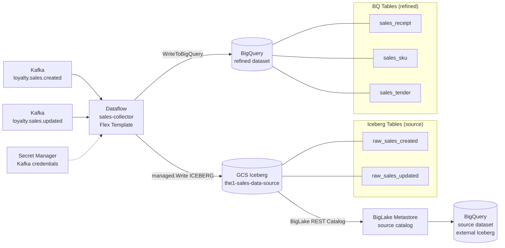
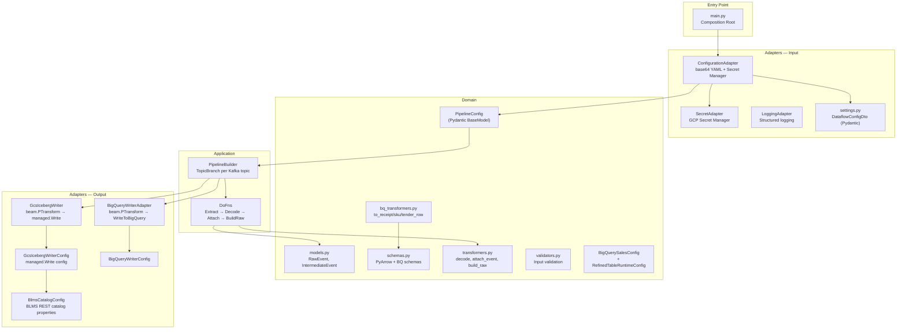
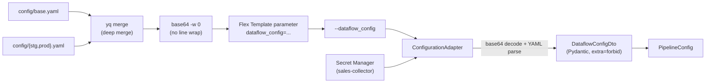
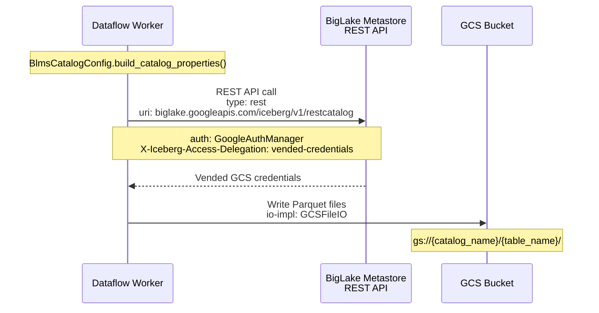

# Architecture — Sales-Collector

[< Back to README](./README.md)

---

## High-Level Architecture



### Infrastructure Resources

| Resource | Name / Pattern | Purpose |
|----------|---------------|---------|
| GCS Bucket (source) | `the1-sales-data-source-{env}` | Iceberg warehouse — Parquet files |
| GCS Bucket (config) | `the1-sales-data-config-{env}` | Dataflow Flex Template spec |
| GAR Repository | `asia-southeast1-docker.pkg.dev/the1-sales-data-{env}/sales-collector` | Docker images |
| BigLake Catalog | `source_catalog` (GCS_BUCKET type, vended-credentials) | Iceberg REST Catalog |
| BQ Dataset (source) | `source` — `externalCatalogDatasetOptions` linked to BigLake | External Iceberg tables |
| BQ Dataset (refined) | `refined` — native BQ | 3 refined tables |
| Secret Manager | `sales-collector` | Kafka bootstrap/credentials |
| Service Account | `t1-sales-collector@the1-sales-data-{env}.iam.gserviceaccount.com` | Dataflow worker identity |

---

## Detailed Architecture

### Hexagonal Architecture Layers



### Source Code Organization

```
sales-collector/src/
├── main.py                                          # Composition root
├── domain/
│   ├── models.py                                    # RawEvent, IntermediateEvent (TypedDict)
│   ├── schemas.py                                   # RAW_SALES_SCHEMA (PyArrow), BQ schemas
│   ├── transformers.py                              # extract_value, safe_decode_and_parse,
│   │                                                  attach_event_name, build_raw_event
│   ├── bq_transformers.py                           # to_receipt_row, to_sku_rows, to_tender_rows
│   ├── validators.py                                # Shared validation helpers
│   └── config/
│       ├── pipeline_config.py                       # PipelineConfig (Pydantic BaseModel)
│       └── bigquery_sales_config.py                 # BigQuerySalesConfig + RefinedTableRuntimeConfig
├── adapters/
│   ├── input/
│   │   └── configuration/
│   │       ├── configuration_adapter.py             # Loads base64 YAML + Secret Manager → PipelineConfig
│   │       ├── settings.py                          # DataflowConfigDto, WriteMode (Pydantic DTOs)
│   │       ├── secret_adapter.py                    # GCP Secret Manager access
│   │       └── logging_adapter.py                   # run_id structured logging
│   └── output/
│       ├── bigquery/
│       │   ├── bigquery_writer.py                   # BigQueryWriterAdapter (WriteToBigQuery wrapper)
│       │   └── bigquery_writer_config.py            # BigQueryWriterConfig dataclass
│       └── gcs/
│           ├── biglake_metastore_config.py          # BlmsCatalogConfig (frozen dataclass)
│           ├── gcs_biglake_iceberg_writer_config.py # GcsIcebergWriterConfig (frozen dataclass)
│           └── gcs_biglake_iceberg_writer.py        # GcsIcebergWriter (beam.PTransform)
└── application/
    └── pipeline/
        ├── builder.py                               # PipelineBuilder + TopicBranch
        └── dofns.py                                 # DoFns (Extract, Decode, Attach, BuildRaw)
```

### Configuration Flow



**Config merge:** `yq -s '.[0] * .[1]'` — env YAML overrides base (deep merge).

**Key env overrides:**

| Key | STG | PROD |
|-----|-----|------|
| `project` | `the1-sales-data-stg` | `the1-sales-data-prod` |
| `iceberg_warehouse` | `gs://the1-sales-data-source-stg` | `gs://the1-sales-data-source-prod` |
| `log_level` | `DEBUG` | `INFO` |

### BLMS REST Catalog Auth Flow



**Catalog properties built by `BlmsCatalogConfig`:**

```python
{
    "type": "rest",
    "uri": "https://biglake.googleapis.com/iceberg/v1/restcatalog",
    "warehouse": "gs://the1-sales-data-source-{env}",
    "rest.auth.type": "org.apache.iceberg.gcp.auth.GoogleAuthManager",
    "header.X-Iceberg-Access-Delegation": "vended-credentials",
    "header.x-goog-user-project": "the1-sales-data-{env}",
    "io-impl": "org.apache.iceberg.gcp.gcs.GCSFileIO",
    "rest-metrics-reporting-enabled": "false",
}
```

### Terraform File Structure

```
infrastructure/sales-collector/
├── main.tf                  # Provider, backend (GCS), locals
├── variables.tf             # region, domain, service_name
├── terraform.tfvars         # asia-southeast1, sales-data, sales-collector
├── artifact-registry.tf     # GAR Docker repo (sales-collector)
├── gcs-bucket.tf            # source + config buckets
├── bigquery.tf              # refined dataset + source (externalCatalogDatasetOptions)
├── secret-manager.tf        # sales-collector secret
├── biglake-metastore.tf     # BigLake catalog (GCS_BUCKET + vended-credentials)
├── pubsub.tf                # Pub/Sub (commented — pending)
├── schemas/
│   ├── deploy.py            # BQ table deployer (native + external_iceberg)
│   ├── raw_sales.json       # Iceberg external table schema
│   ├── sales_receipt.json   # BQ refined table schema
│   ├── sales_sku.json       # BQ refined table schema
│   └── sales_tender.json    # BQ refined table schema
└── templates/
    └── container_spec.json  # Dataflow Flex Template spec
```
