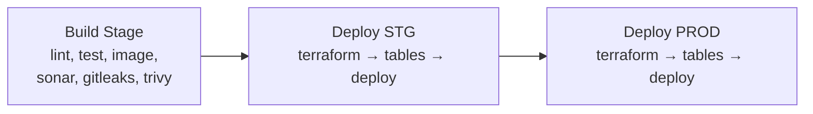
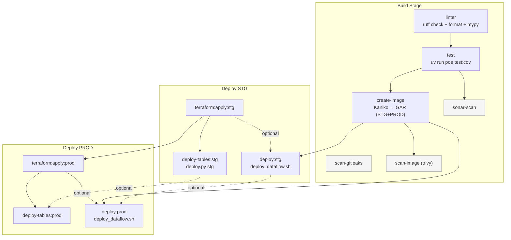
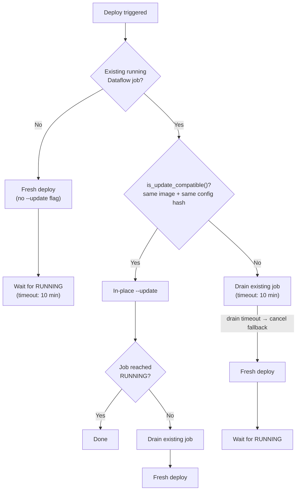
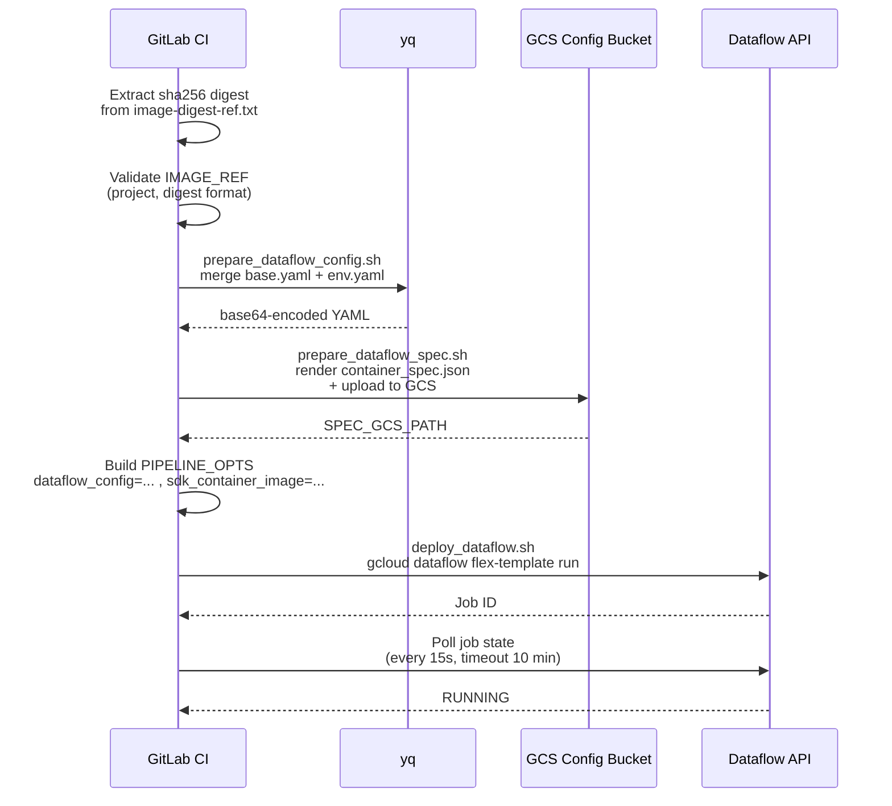

# CI/CD Workflow — Sales-Collector

[< Back to README](./README.md)

---

## High-Level CI/CD



**Stages (in order):** `build` → `deploy-stg` → `test-stg` → `deploy-prod` → `test-prod` → `rollback`

---

## Detailed Job Dependency Graph



**Legend:** Solid arrows = required `needs`. Dashed arrows = `optional: true` (job runs even if dependency skipped).

### Job Details

| Job | Stage | Runner | Key Steps |
|-----|-------|--------|-----------|
| `linter` | build | nonprod | `ruff check`, `ruff format --check`, `mypy` |
| `test` | build | nonprod | `uv run poe test:cov` → `coverage.xml` artifact |
| `create-image` | build | **prod** | Kaniko build → 4 GAR destinations (STG+PROD, tag+latest) |
| `sonar-scan` | build | nonprod | SonarQube analysis (shared `.common-sonar-scan`) |
| `scan-gitleaks` | build | nonprod | Secret scanning (no dependencies — runs in parallel) |
| `scan-image` | build | nonprod | Trivy container scan (after image build) |
| `terraform:apply:stg` | deploy-stg | nonprod | Terraform plan + apply (workspace=stg) |
| `deploy-tables:stg` | deploy-stg | nonprod | `deploy.py the1-sales-data-stg stg` |
| `deploy:stg` | deploy-stg | nonprod | Config merge → Flex Template → `deploy_dataflow.sh` |
| `terraform:apply:prod` | deploy-prod | **prod** | Terraform plan + apply (workspace=prod) |
| `deploy-tables:prod` | deploy-prod | **prod** | `deploy.py the1-sales-data-prod prod` |
| `deploy:prod` | deploy-prod | **prod** | Config merge → Flex Template → `deploy_dataflow.sh` |

### Image Build — 4 Destinations

`create-image` pushes to both STG and PROD GAR simultaneously:

```
asia-southeast1-docker.pkg.dev/the1-sales-data-stg/sales-collector/sales-collector:amd64-{SHA}
asia-southeast1-docker.pkg.dev/the1-sales-data-stg/sales-collector/sales-collector:latest
asia-southeast1-docker.pkg.dev/the1-sales-data-prod/sales-collector/sales-collector:amd64-{SHA}
asia-southeast1-docker.pkg.dev/the1-sales-data-prod/sales-collector/sales-collector:latest
```

Artifact `image-digest-ref.txt` captures `@sha256:...` digest per destination for deploy jobs.

---

## Deploy Strategy

The `deploy_dataflow.sh` script handles streaming job lifecycle:



### Update Compatibility Check

`is_update_compatible()` compares two values:

| Check | Current Job | New Deploy |
|-------|-------------|------------|
| Container image | `workerPools[0].sdkHarnessContainerImages[0].containerImage` | `sdk_container_image` from `PIPELINE_OPTS` |
| Config hash | Label `config-hash` on running job | `MD5(PIPELINE_OPTS)` |

If either differs → incompatible → drain + fresh deploy.

### Drain Strategy

1. Issue `gcloud dataflow jobs drain`
2. Poll every 15s for up to 600s (10 min)
3. Wait for: `JOB_STATE_DRAINED` / `JOB_STATE_CANCELLED` / `JOB_STATE_FAILED` / `JOB_STATE_UPDATED`
4. If drain times out → fallback to `gcloud dataflow jobs cancel` (300s timeout)

---

## Deploy Sequence



---

## STG vs PROD Environment Comparison

| Parameter | STG | PROD |
|-----------|-----|------|
| GCP Project | `the1-sales-data-stg` | `the1-sales-data-prod` |
| `--max-workers` | **1** | **2** |
| Network | `the1-vpc-net-share-stg` | `the1-vpc-net-share-prod` |
| Subnetwork | `the1-subnet-dataflow-stg` | `the1-subnet-dataflow-prod` |
| Service Account | `t1-sales-collector@...stg.iam` | `t1-sales-collector@...prod.iam` |
| Spec GCS Path | `gs://the1-sales-data-config-stg/...` | `gs://the1-sales-data-config-prod/...` |
| Runner Tag | `nonprod-docker-cicd-x86` | `prod-docker-cicd-x86` |
| Log Level | `DEBUG` | `INFO` |
| Config Merge | `base.yaml` + `stg.yaml` | `base.yaml` + `prod.yaml` |

### Pipeline Variables (Manual Trigger)

| Variable | Default | Options |
|----------|---------|---------|
| `TRIGGER_EVENT` | `manual-deploy` | `manual-deploy`, `automated-deploy`, `terraform-apply` |
| `ENVIRONMENT` | `Select Option` | `nonprod`, `prod` |
| `SERVICE_NAME` | `Select Option` | `sales-collector` |
| `MANUAL_DEPLOY_DEPLOYMENT_TAG` | (empty) | Free text — specific commit SHA |

### Dependency Gates

| Gate | Type | Notes |
|------|------|-------|
| `terraform:apply:stg` → `terraform:apply:prod` | **Required** | Hard gate — PROD terraform only after STG |
| `deploy:stg` → `deploy:prod` | **Optional** | Soft gate — PROD can run if STG skipped |
| `deploy-tables:stg` → `deploy-tables:prod` | **Optional** | Soft gate |
