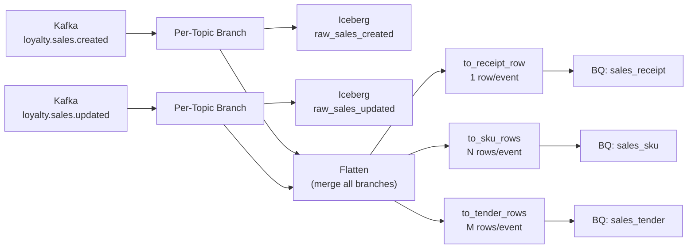
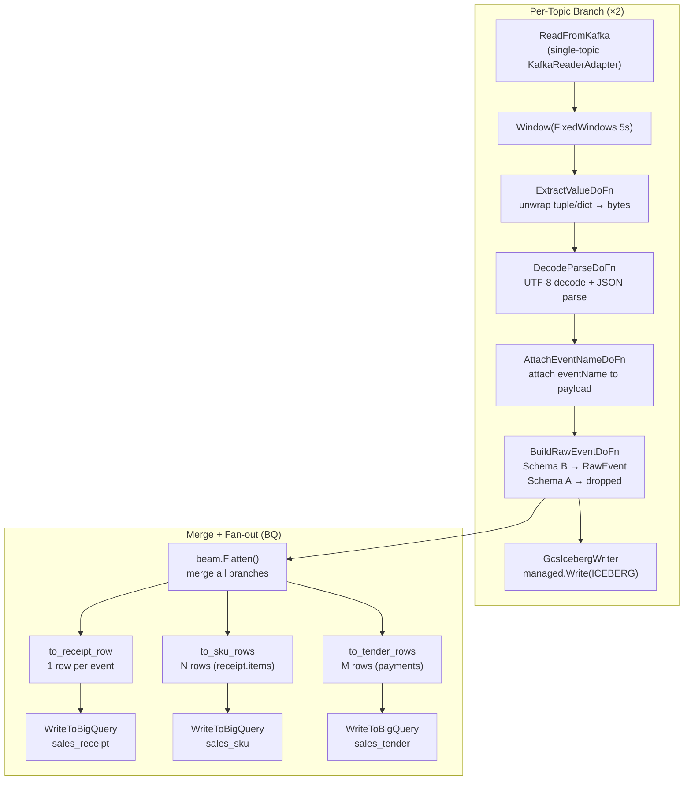
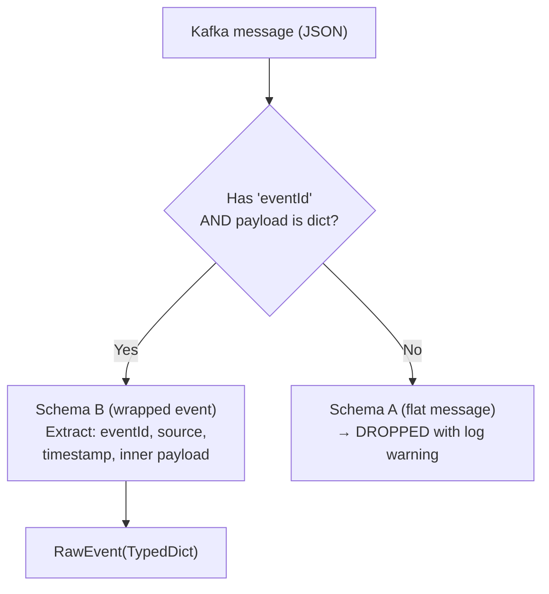

# Data Pipeline Flow — Sales-Collector

[< Back to README](./README.md)

---

## High-Level Pipeline



---

## Detailed Per-Topic Branch

Each Kafka topic follows the same processing pipeline before merge:



### DoFn Pipeline Detail

| DoFn | Input | Output | Metrics | Purpose |
|------|-------|--------|---------|---------|
| `ExtractValueDoFn` | Kafka record | `bytes` | `records_seen`, `records_ok` | Unwrap value from Kafka tuple/dict |
| `DecodeParseDoFn` | `bytes` | `dict` | `records_seen`, `records_ok`, `records_errors` | UTF-8 decode + `json.loads` |
| `AttachEventNameDoFn` | `dict` | `IntermediateEvent` | `records_seen`, `records_ok` | Attach `eventName` to payload |
| `BuildRawEventDoFn` | `IntermediateEvent` | `RawEvent` | `records_seen`, `records_ok`, `records_dropped` | Build raw envelope (Schema B only) |

### PipelineBuilder Structure

```python
@dataclass
class TopicBranch:
    topic: str              # e.g. "loyalty.sales.created"
    reader: beam.PTransform # KafkaReaderAdapter (single-topic)
    iceberg_sink: beam.PTransform  # GcsIcebergWriter

class PipelineBuilder:
    # For each TopicBranch:
    #   raw = Read → Window(5s) → Extract → Decode → Attach → BuildRaw → WriteIceberg
    # After all branches:
    #   merged = beam.Flatten(all raw PCollections)
    #   merged → to_receipt_row → WriteBQ(sales_receipt)
    #   merged → to_sku_rows   → WriteBQ(sales_sku)
    #   merged → to_tender_rows → WriteBQ(sales_tender)
```

---

## Message Format Handling

### Schema B Detection

The pipeline distinguishes two Kafka message formats:



**Schema B detection** (`_is_wrapped_event`):
```python
"eventId" in payload and isinstance(payload.get("payload"), dict)
```

**Schema B structure:**
```json
{
  "eventId": "uuid-1234",
  "source": "pos-system",
  "eventName": "loyalty.sales.created",
  "timestamp": 1740200000,
  "payload": {
    "receiptNumber": "R001",
    "partnerCode": "P01",
    "receipt": { "items": [...], "totalPrice": 1500.00 },
    "payments": [...]
  }
}
```

### Avro Unwrapping

Kafka messages may contain Avro union wrappers that need unwrapping:

```mermaid
flowchart LR
    subgraph "unwrap_avro_value"
        A1["{\"string\": \"abc\"}"] --> A2["\"abc\""]
        A3["{\"int\": 42}"] --> A4["42"]
        A5["null"] --> A6["None"]
        A7["\"plain\""] --> A8["\"plain\" (passthrough)"]
    end

    subgraph "unwrap_avro_array"
        B1["{\"array\": [1,2,3]}"] --> B2["[1,2,3]"]
        B3["[1,2,3]"] --> B4["[1,2,3] (passthrough)"]
        B5["null"] --> B6["[] (empty)"]
    end
```

---

## Timestamp Handling

All timestamps follow Bangkok +7h offset convention.

### Source Layer (Iceberg)

`etlLoadTime` — INT64 format `YYYYMMDDHH` in Bangkok timezone:

```python
_BANGKOK_TZ = timezone(timedelta(hours=7))
etlLoadTime = int(datetime.now(_BANGKOK_TZ).strftime("%Y%m%d%H"))
# Example: 2026022214 = 2026-02-22 14:xx Bangkok
```

Partition: `identity(etlLoadTime)` — each hour is one partition.

### Refined Layer (BigQuery)

All TIMESTAMP fields use `apache_beam.utils.timestamp.Timestamp` (NOT `datetime`):

```python
_BANGKOK_OFFSET_SECONDS = 7 * 3600           # 25200
_BANGKOK_OFFSET_MICROS  = 25200 * 1_000_000  # 25_200_000_000
```

| Field | Formula |
|-------|---------|
| `trans_date` | `Timestamp(seconds=unix_ts + _BANGKOK_OFFSET_SECONDS)` |
| `business_date` | `Timestamp(seconds=unix_ts + _BANGKOK_OFFSET_SECONDS)` |
| `etl_updated_date` | `Timestamp(micros=Timestamp.now().micros + _BANGKOK_OFFSET_MICROS)` |

**Timestamp auto-detection:**

```python
def _parse_timestamp(value):
    raw = unwrap_avro_value(value)
    if isinstance(raw, (int, float)):
        ts = float(raw)
        if ts > 1e12:            # millis detection
            ts = ts / 1000.0     # convert ms → seconds
        return Timestamp(seconds=int(ts) + 25200)  # +7h
    if isinstance(raw, str):
        dt = datetime.fromisoformat(raw.replace("Z", "+00:00"))
        return Timestamp(seconds=int(dt.timestamp()) + 25200)  # +7h
```

### Partition Fields (Derived)

Three string partition fields derived from `trans_date` (Bangkok):

| Field | Format | Example |
|-------|--------|---------|
| `par_month` | `%Y%m` | `"202602"` |
| `par_day` | `%d` | `"22"` |
| `par_hour` | `%H` | `"14"` |

---

## Current Debug Mode

The pipeline is currently in **debug/development mode**:

| Component | Status |
|-----------|--------|
| Kafka Read | Active |
| Iceberg Write (source) | **Active** — `managed.Write(ICEBERG)` via BLMS REST |
| BQ Write (refined) | **Commented out** — `_DebugLogDoFn` logs sample messages instead |

BQ writes (`to_receipt_row`, `to_sku_rows`, `to_tender_rows` → `WriteToBigQuery`) are commented out in `builder.py` pending end-to-end validation on STG.
