# Test Architecture — Sales-Collector

[< Back to Sales-Collector Docs](../README.md) | [General Test Architecture](../../../test/README.md)

---

## High-Level Test Overview

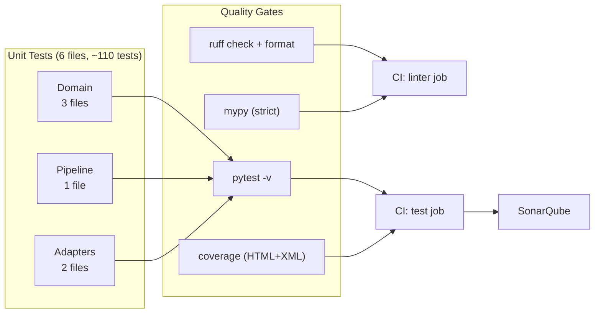

### Test File Map

```
tests/
├── conftest.py                                        # 4 shared fixtures
└── unit/
    ├── adapters/
    │   ├── input/configuration/
    │   │   └── test_settings.py                      # DataflowConfigDto (Pydantic v2)
    │   └── output/bigquery/
    │       └── test_bigquery_writer_config.py         # BigQueryWriterConfig (dataclass)
    ├── domain/
    │   ├── test_transformers.py                       # Core: extract, decode, attach, build
    │   ├── test_bq_transformers.py                    # Fan-out: receipt, sku, tender rows
    │   └── test_validators.py                         # Input validation helpers
    └── pipeline/
        └── test_dofns.py                             # Beam DoFns via TestPipeline
```

---

## Detailed Test Architecture

### Layer-by-Layer Coverage

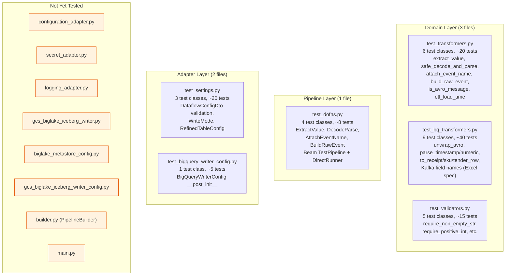

---

## Fixture Architecture

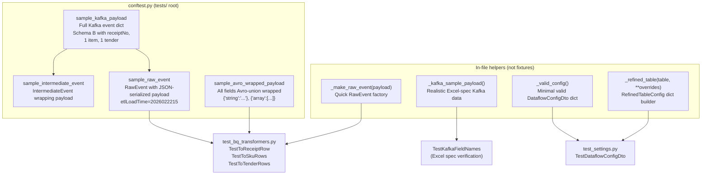

### Fixture Data Flow

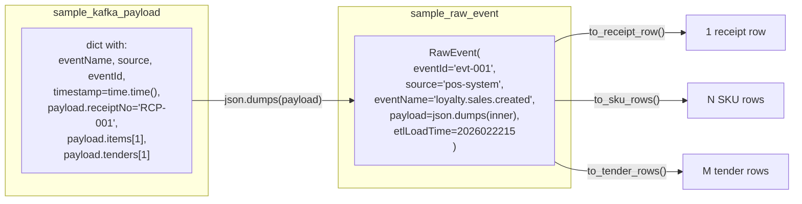

---

## Test Pattern Details

### Pattern 1: Pure Domain Function Tests (no mocks, no Beam)

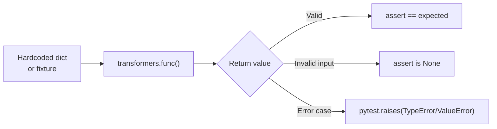

**Example — `test_transformers.py`:**

| Test Class | Function Tested | # Tests | Key Assertions |
|-----------|----------------|:---:|----------------|
| `TestIsAvroMessage` | `is_avro_message(bytes)` | 4 | Magic byte `\x00` + 4-byte schema ID detection |
| `TestExtractValue` | `extract_value(record)` | 7 | Tuple/list/dict/bytes unwrapping, TypeError/ValueError on bad input |
| `TestSafeDecodeAndParse` | `safe_decode_and_parse(bytes)` | 3 | JSON parse success, invalid→None, string input support |
| `TestAttachEventName` | `attach_event_name(dict)` | 2 | Attach eventName, default fallback |
| `TestIsWrappedEvent` | `_is_wrapped_event(dict)` | 4 | Schema B detection: eventId + inner payload dict |
| `TestBuildRawEvent` | `build_raw_event(dict)` | 6 | Schema B→RawEvent, Schema A→None, missing/non-dict payload→None |
| `TestGetEtlLoadTimeBangkok` | `_get_etl_load_time_bangkok()` | 1 | Returns 10-digit int (YYYYMMDDHH) |

### Pattern 2: BQ Transformer Tests (fixtures + helpers)

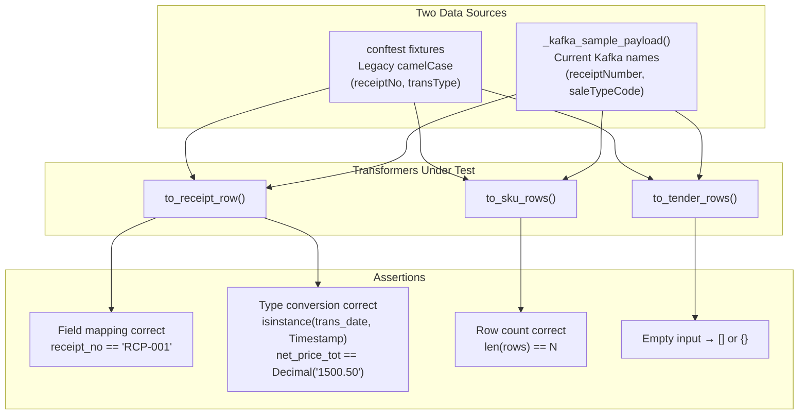

**Example — `test_bq_transformers.py`:**

| Test Class | Function Tested | # Tests | Key Assertions |
|-----------|----------------|:---:|----------------|
| `TestUnwrapAvroValue` | `unwrap_avro_value` | 5 | `{"string":"x"}`→`"x"`, None→None, multi-key passthrough |
| `TestUnwrapAvroArray` | `unwrap_avro_array` | 4 | `{"array":[...]}`→`[...]`, None→`[]` |
| `TestParseTimestamp` | `_parse_timestamp` | 5 | Unix seconds, millis (>1e12), Avro-wrapped, None, invalid |
| `TestParseNumeric` | `_parse_numeric` | 5 | int→Decimal, string→Decimal, Avro→Decimal, None, invalid |
| `TestSafeStr` | `_safe_str` | 4 | String, Avro, None, empty→None |
| `TestExtractSalesPayload` | `_extract_sales_payload` | 3 | Nested payload, flat, invalid JSON |
| `TestExtractHeaderFields` | `_extract_header_fields` | 2 | CamelCase mapping, missing→None |
| `TestToReceiptRow` | `to_receipt_row` | 2 | Full row extraction, empty payload→`{}` |
| `TestToSkuRows` | `to_sku_rows` | 4 | Items extraction, Avro-wrapped, no items→`[]`, multiple |
| `TestToTenderRows` | `to_tender_rows` | 4 | Tenders extraction, Avro-wrapped, no tenders→`[]`, multiple |
| `TestKafkaFieldNames` | All 3 extractors | 7 | Real Kafka names from Excel spec, void info, isAll bool→Y/N |

### Pattern 3: Beam TestPipeline DoFn Tests

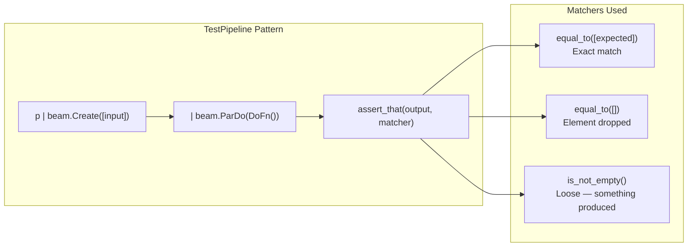

**Example — `test_dofns.py`:**

| Test Class | DoFn | # Tests | Valid Input Matcher | Invalid Input Matcher |
|-----------|------|:---:|-----|------|
| `TestExtractValueDoFn` | `ExtractValueDoFn` | 3 | `equal_to([b"value"])` | `equal_to([])` (dropped) |
| `TestDecodeParseDoFn` | `DecodeParseDoFn` | 2 | `equal_to([{"key":"value"}])` | `equal_to([])` (dropped) |
| `TestAttachEventNameDoFn` | `AttachEventNameDoFn` | 1 | `is_not_empty()` | — |
| `TestBuildRawEventDoFn` | `BuildRawEventDoFn` | 2 | `is_not_empty()` | `equal_to([])` (Schema A dropped) |

**DoFn chaining in tests:**
```python
# BuildRawEvent requires AttachEventName first
output = (
    p
    | beam.Create(input_data)
    | beam.ParDo(AttachEventNameDoFn())
    | beam.ParDo(BuildRawEventDoFn())
)
assert_that(output, is_not_empty())
```

### Pattern 4: Pydantic Model Validation Tests

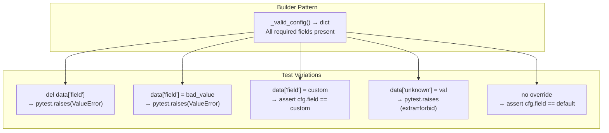

**Example — `test_settings.py`:**

| Test Class | Model | # Tests | Key Validations |
|-----------|-------|:---:|-----------------|
| `TestDataflowConfigDto` | `DataflowConfigDto` | 17 | Required fields, empty lists, invalid enums, extra fields forbidden, kafka_topics↔iceberg_tables cross-validation |
| `TestWriteMode` | `WriteMode` enum + config | 4 | append/cdc modes, CDC requires primary_key |
| `TestRefinedTableConfig` | `RefinedTableConfig` | 4 | Partitioning, clustering, custom trigger freq, defaults |

### Pattern 5: Dataclass Post-Init Validation Tests

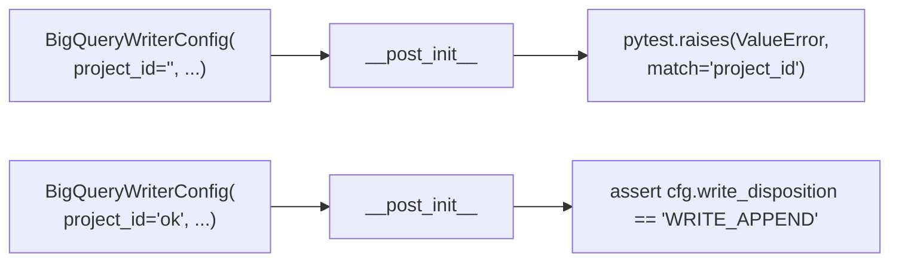

---

## Type Conversion Test Coverage

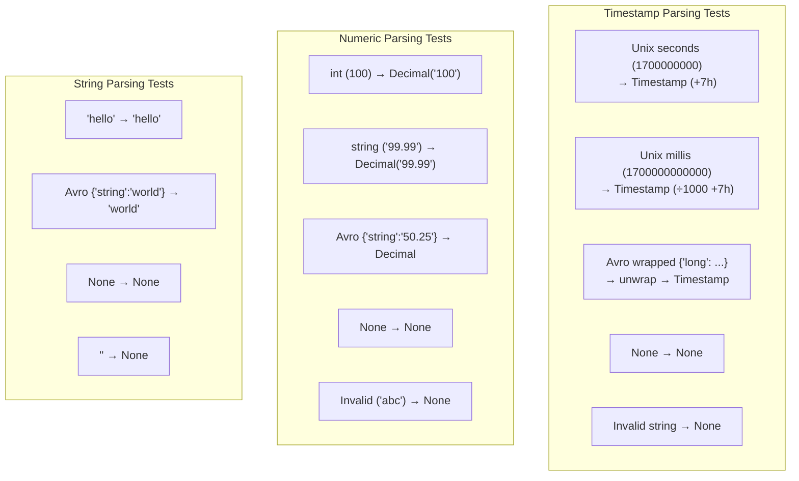

---

## Running Tests

```bash
# All tests
cd sales-collector && uv run pytest

# With coverage
uv run poe test:cov

# Unit only
uv run poe test:unit

# Specific file
uv run pytest tests/unit/domain/test_bq_transformers.py -v

# Specific class
uv run pytest tests/unit/domain/test_bq_transformers.py::TestKafkaFieldNames -v

# Full quality check
uv run poe lint          # ruff format + ruff check + mypy
uv run poe test:cov      # pytest + coverage
```

### CI Quality Gate Flow

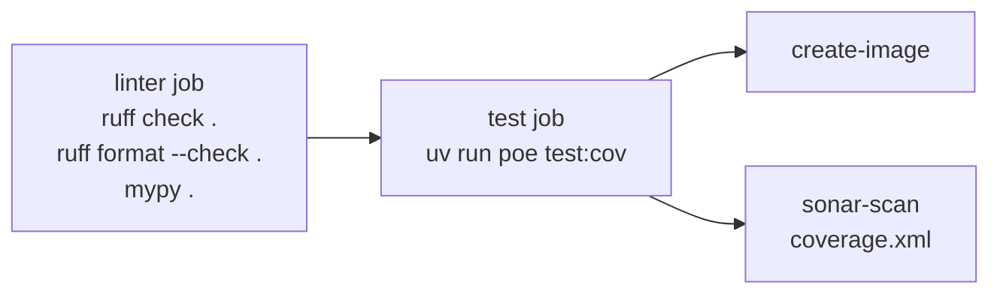

---

## Coverage Summary by Module

| Module | Test File | Coverage Level |
|--------|-----------|:-:|
| `domain/transformers.py` | `test_transformers.py` | High |
| `domain/bq_transformers.py` | `test_bq_transformers.py` | High |
| `domain/validators.py` | `test_validators.py` | High |
| `domain/models.py` | (via other tests) | Indirect |
| `domain/schemas.py` | (via bq_transformer tests) | Indirect |
| `domain/config/pipeline_config.py` | — | None |
| `domain/config/bigquery_sales_config.py` | — | None |
| `adapters/input/configuration/settings.py` | `test_settings.py` | High |
| `adapters/input/configuration/configuration_adapter.py` | — | None |
| `adapters/input/configuration/secret_adapter.py` | — | None |
| `adapters/input/configuration/logging_adapter.py` | — | None |
| `adapters/output/bigquery/bigquery_writer_config.py` | `test_bigquery_writer_config.py` | High |
| `adapters/output/bigquery/bigquery_writer.py` | — | None |
| `adapters/output/gcs/biglake_metastore_config.py` | — | None |
| `adapters/output/gcs/gcs_biglake_iceberg_writer_config.py` | — | None |
| `adapters/output/gcs/gcs_biglake_iceberg_writer.py` | — | None |
| `application/pipeline/dofns.py` | `test_dofns.py` | High |
| `application/pipeline/builder.py` | — | None |
| `main.py` | — | None |
