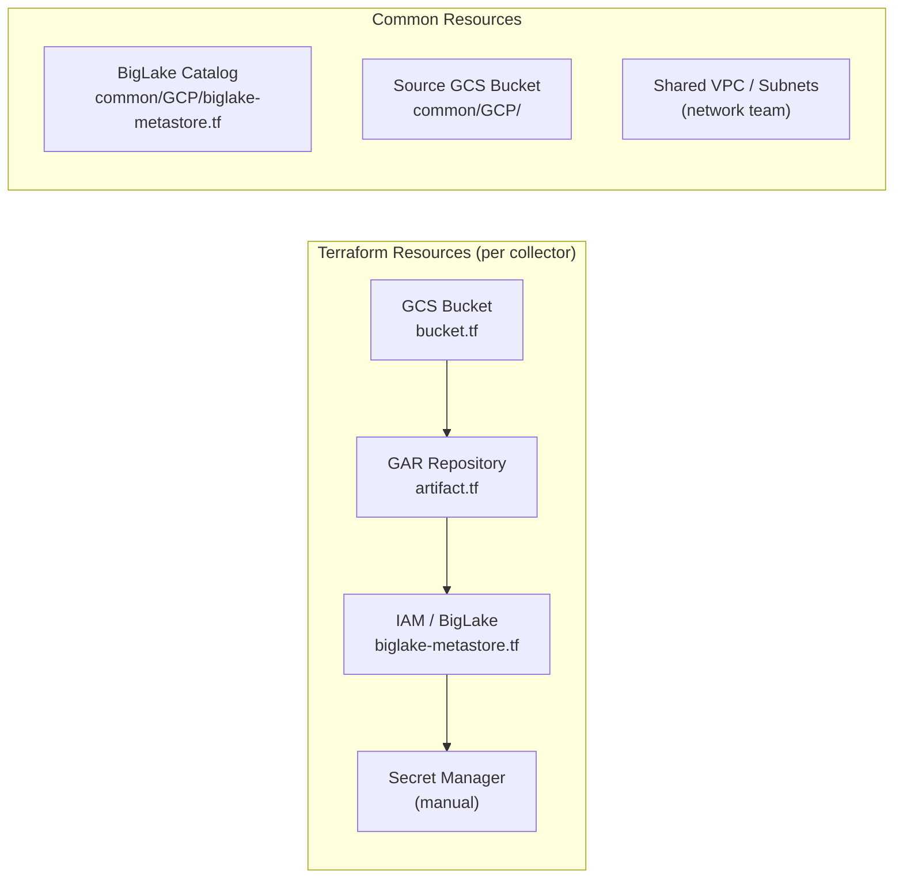
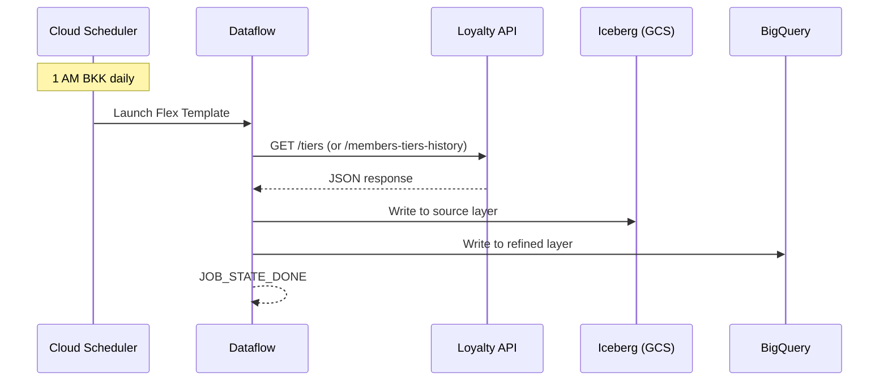
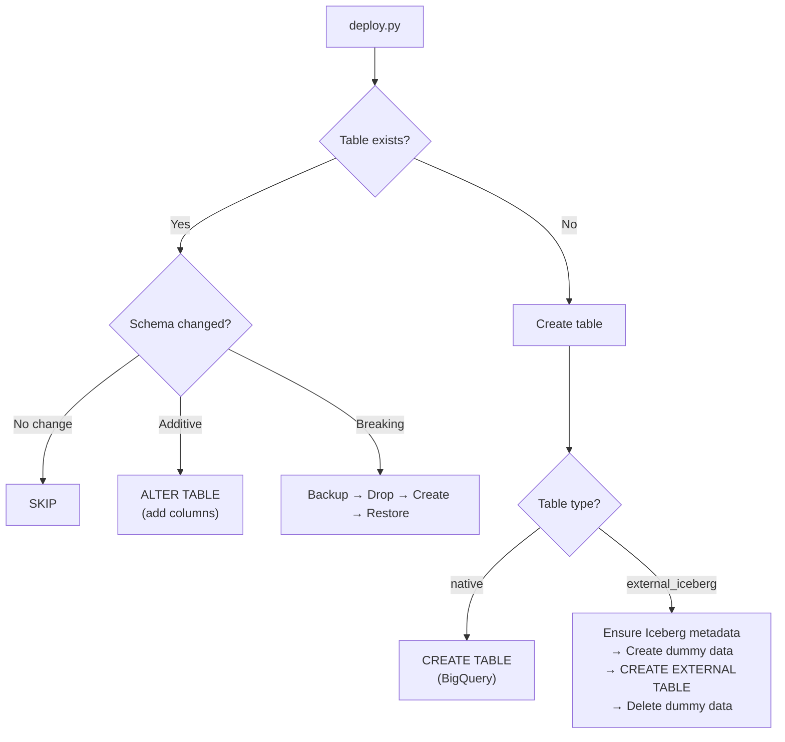
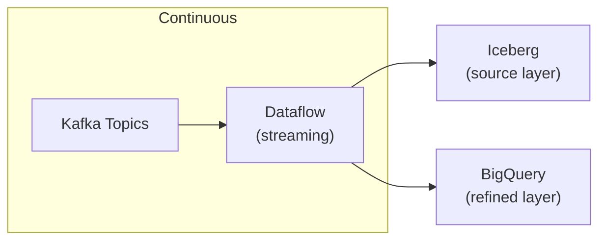
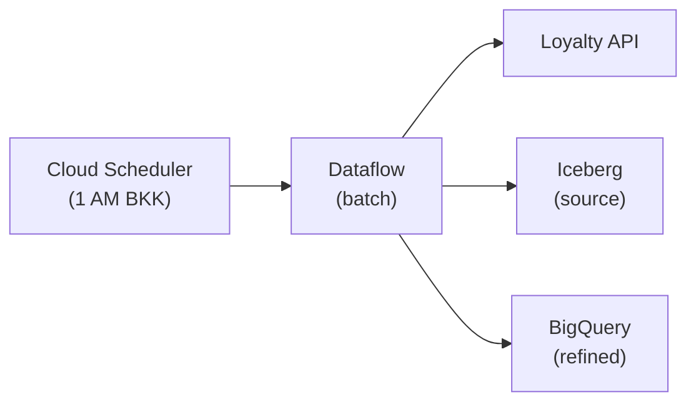
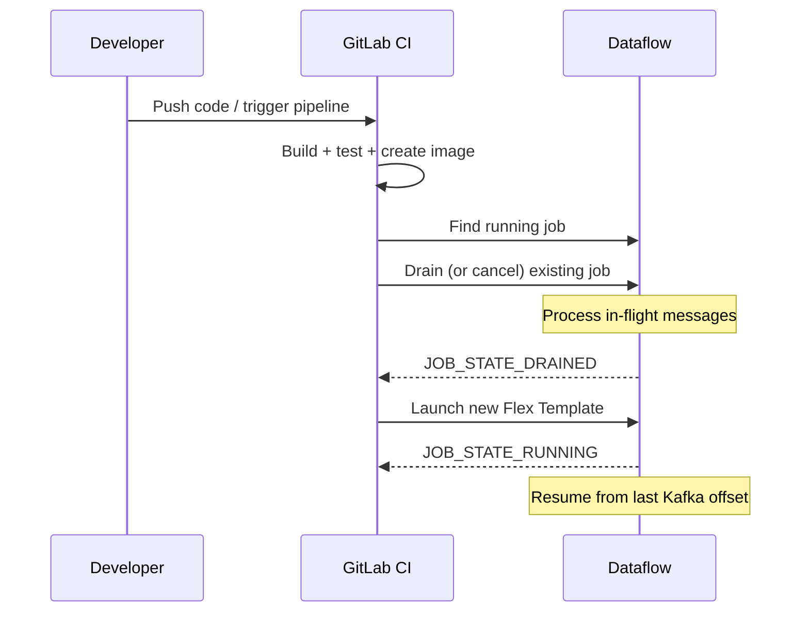
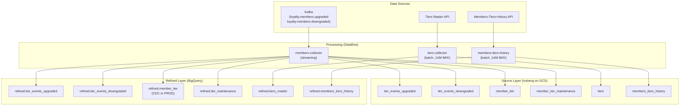

# Data Operations Runbook - The1 Data Platform

## Overview

This runbook covers the operational lifecycle of The1 Data Platform collectors, from initial infrastructure provisioning through ongoing monitoring and troubleshooting. All collectors follow the same architecture: data is ingested via Apache Beam on Dataflow, written to Iceberg (source/raw layer) and BigQuery (refined layer).

---

## 1. Initial Infrastructure Setup

### Terraform Provisioning

Each collector has its own Terraform workspace with per-environment state (stg/prod). Infrastructure is provisioned via GitLab CI (`terraform:apply:stg` / `terraform:apply:prod` jobs).



### Resources Created Per Collector

| Resource | Naming Pattern | Example |
|----------|---------------|---------|
| GCS Bucket | `{project}-{env}-{collector}` | `the1-loyalty-data-stg-members-collector` |
| GAR Repository | `{collector}` in project GAR | `asia-southeast1-docker.pkg.dev/the1-loyalty-data-stg/members-collector` |
| Service Account | `t1-{collector}@{project}-{env}.iam.gserviceaccount.com` | `t1-members-collector@the1-loyalty-data-stg.iam.gserviceaccount.com` |
| Secret Manager | `{collector}` | Secret `members-collector` with API keys/tokens |
| IAM Bindings | BigLake access to source + refined datasets | `roles/biglake.viewer`, `roles/serviceusage.serviceUsageConsumer` |

### Manual Setup Steps

Some resources require manual configuration outside Terraform:

1. **Secret Manager secrets**: API keys, Kafka credentials must be manually populated
2. **Shared VPC subnets**: Network team provisions Dataflow subnets
3. **Cloud Scheduler jobs**: For batch collectors (tiers, members-tiers-history), create triggers at `1 AM BKK`

### Running Terraform Locally (Not Recommended)

Terraform validate/plan requires `terraform init` with remote backend access. This is only available on CI runners. For local validation:

```bash
cd infrastructure/<collector>
terraform init -backend=false  # Skip backend for local validation only
terraform validate
```

---

## 2. Initial Data Load

### Batch Collectors (tiers-collector, members-tiers-history)

Batch collectors are triggered by **Cloud Scheduler** at **1 AM Bangkok time** daily. No special initial data load process is required -- the first scheduled run populates the tables.



### Streaming Collectors (members-collector)

For streaming collectors that need to load **existing historical data** (e.g., initial S3-to-Iceberg migration), use `job_type=initial_data`:

```bash
# Trigger via GitLab CI pipeline variable:
TRIGGER_INIT_DATA_LOAD=1
SERVICE_NAME=members-collector
```

**What happens:**
- GitLab CI detects `TRIGGER_INIT_DATA_LOAD=1`
- Sets `job_type=initial_data` (batch mode instead of streaming)
- Sets `MAX_WORKERS=50` (for large data volumes, e.g., 200GB)
- Uses `n1-highmem-4` worker machine type
- Job name includes timestamp: `members-collector-init-YYYYMMDD-HHMMSS`
- Job is self-terminating (batch mode)

**After init data load:**
- Run normal streaming deploy (`TRIGGER_INIT_DATA_LOAD` unset) to resume Kafka consumption

### DTS (Data Transfer Service) for S3 Migration

For members-collector, the init_data config supports loading from S3 via DTS:
- Source: AWS S3 bucket with historical member data
- Target: Iceberg tables on GCS
- Handled by the same pipeline code with `job_type=initial_data`

---

## 3. Table Deployment (deploy.py)

### Overview

`deploy.py` is the table deployment tool that creates and manages both BigQuery and Iceberg tables. It runs as part of `deploy-tables:stg` and `deploy-tables:prod` CI jobs.



### Running deploy.py

```bash
# Standard deployment (CI does this automatically)
cd infrastructure/<collector>/schemas
export ICEBERG_CREATE_METHOD=python
python3 deploy.py "<project-id>" "<env>"

# Deploy specific table only
python3 deploy.py "<project-id>" "<env>" --table=raw_member_upgraded

# Deploy specific dataset only
python3 deploy.py "<project-id>" "<env>" --dataset=source

# Force recreation (breaking changes)
python3 deploy.py "<project-id>" "<env>" --force

# Enable BigLake catalog registration
python3 deploy.py "<project-id>" "<env>" --enable-biglake-catalog
```

### Table Types

| Type | Layer | Created By | Storage |
|------|-------|------------|---------|
| `native` | refined | `CREATE TABLE` (BigQuery DDL) | BigQuery managed storage |
| `external_iceberg` | source | `CREATE EXTERNAL TABLE` + Iceberg metadata | GCS (Parquet files + Iceberg metadata) |

### Iceberg Table Creation with register_table

**Critical:** deploy.py uses `register_table` (not `create_table`) when Iceberg data already exists in GCS. This preserves:
- **Field IDs**: Existing column IDs in metadata (prevents ClassCastException)
- **Partition spec**: `identity(etlLoadTime)` partition configuration
- **Snapshot history**: All existing data snapshots remain valid

### Schema Change Detection

deploy.py compares the JSON definition against the current BQ table metadata:

| Change Type | Action |
|-------------|--------|
| **No change** | Skip (no-op) |
| **Additive** (new columns) | `ALTER TABLE ADD COLUMN` for native; evolve Iceberg schema + recreate BQ external table |
| **Breaking** (type change, remove column) | Backup → Drop → Create → Restore for native; evolve Iceberg + recreate BQ for external |

### Partition Spec in JSON Definitions

Iceberg tables require partition specs defined in the JSON schema files:

```json
{
  "table_id": "member_tier",
  "dataset_id": "source",
  "table_type": "external_iceberg",
  "partition_spec": {
    "fields": [
      {
        "source_id": 8,
        "field_id": 1000,
        "name": "etlLoadTime_identity",
        "transform": "identity"
      }
    ]
  },
  "schema": [...]
}
```

### CI Dependencies for deploy-tables

```yaml
# PyIceberg must be installed for Iceberg table management
before_script:
  - pip install --quiet --break-system-packages pyiceberg[gcs,sql-sqlite] pyarrow gcsfs google-cloud-bigquery
```

---

## 4. Pipeline Operations (Ongoing)

### Streaming Pipelines

**Collectors:** members-collector, purchases-collector



**Operational characteristics:**
- **Continuous Dataflow jobs** consuming from Kafka
- **Autoscaling**: `THROUGHPUT_BASED` (workers scale based on backlog)
- **Max workers**: STG = 1, PROD = 1-2 (adjustable)
- **Window size**: 60 seconds (configurable via `kafka.window_size_seconds`)
- **Triggering frequency**: 60 seconds for BQ writes (configurable via `refined.triggering_frequency`)
- **Write mode**: Append (STG) or CDC (PROD, for member_tier only)

**Configuration (base.yaml + env.yaml):**
```yaml
kafka:
  topics:
    - "loyalty.members.upgraded"
    - "loyalty.members.downgraded"
  group_id: "loyalty-sem-members"
  window_size_seconds: 60

iceberg:
  writer: "managed_io"
  blms_rest_uri_prefix: "https://biglake.googleapis.com/iceberg/v1/restcatalog"
  blms_namespace: "source"
  triggering_frequency_secs: 60
```

**Code update procedure:**
1. Merge code to main branch
2. GitLab CI builds new image
3. Deploy job drains/cancels old streaming job
4. Launches new job with updated image
5. Job resumes from last committed Kafka offset

### Batch Pipelines

**Collectors:** tiers-collector, members-tiers-history-collector



**Operational characteristics:**
- **Cloud Scheduler** triggers at 1 AM Bangkok time (UTC+7) daily
- **Self-terminating**: Job completes and enters `JOB_STATE_DONE`
- **API fetch interval**: 600 seconds (tiers-collector)
- **Max workers**: 1 (both STG and PROD)
- **No long-running job** to manage -- each run is independent

**Configuration (base.yaml):**
```yaml
secret_name: "tiers-collector"
fetch_interval_seconds: 600

iceberg:
  writer: "managed_io"
  blms_rest_uri_prefix: "https://biglake.googleapis.com/iceberg/v1/restcatalog"
  blms_namespace: "source"
  table: "tiers"

refined:
  enabled: true
  write_mode: "append"
```

### Configuration Management

All pipeline configurations follow a layered YAML merge pattern:

```
base.yaml (shared defaults)
  + stg.yaml (STG overrides: Kafka brokers, GCS paths, write_mode)
  + prod.yaml (PROD overrides: Kafka brokers, GCS paths, CDC mode)
  = merged config → base64 encoded → passed as pipeline parameter
```

**Critical config keys by environment:**

| Key | STG | PROD |
|-----|-----|------|
| Kafka brokers | STG broker endpoints | PROD broker endpoints |
| GCS bucket | `{project}-stg-{collector}` | `{project}-prod-{collector}` |
| Write mode | `append` | `cdc` (for member_tier) |
| Log level | `ERROR` | `ERROR` |
| Secret name | Same (resolved per-project) | Same (resolved per-project) |

### Secrets Management

- All secrets stored in **GCP Secret Manager** (never in code or YAML)
- Secret name configured in `base.yaml` (e.g., `secret_name: "members-collector"`)
- Pipeline reads secrets at runtime using the service account's IAM permissions
- Secret contents: API keys, Kafka credentials, authentication tokens

---

## 5. Monitoring and Logging

### Cloud Logging

All Dataflow pipeline logs are sent to **Cloud Logging** with structured format.

**Useful log filters:**
```
# All logs from a specific Dataflow job
resource.type="dataflow_step"
resource.labels.job_id="<JOB_ID>"

# Error logs only
resource.type="dataflow_step"
severity>=ERROR

# Pipeline-specific logs (Python logging)
resource.type="dataflow_step"
jsonPayload.message=~"members-collector"
```

### Dataflow Console Metrics

Monitor via **GCP Console > Dataflow > Jobs**:

| Metric | What to Watch |
|--------|---------------|
| **Throughput** | Elements/sec processed (should be non-zero for streaming) |
| **Backlog** (streaming) | Kafka consumer lag -- should stay low |
| **System lag** | Time between event creation and processing |
| **Wall time** | Total pipeline execution time (batch) |
| **Workers** | Current worker count vs max-workers |
| **Errors** | Error count and error messages |

### BigQuery Audit

Query BQ audit logs to verify data freshness:

```sql
-- Check latest data in refined layer
SELECT MAX(etlLoadTime) as latest_load
FROM `the1-loyalty-data-{env}.refined.member_tier`;

-- Check row counts per partition
SELECT etlLoadTime, COUNT(*) as row_count
FROM `the1-loyalty-data-{env}.refined.member_tier`
GROUP BY etlLoadTime
ORDER BY etlLoadTime DESC
LIMIT 10;
```

### Alerting

Configure **Cloud Monitoring** alert policies for:

| Alert | Condition | Threshold |
|-------|-----------|-----------|
| Dataflow job failure | Job state = FAILED | Immediate |
| Kafka consumer lag | Backlog > threshold | 5 minutes |
| No data written | etlLoadTime stale | 2 hours (streaming), 26 hours (batch) |
| Worker OOM | Worker logs contain OOM | Immediate |
| Pipeline errors | Error rate > threshold | 5 minutes |

---

## 6. Troubleshooting

### OOM (Out of Memory)

**Symptoms:** Workers crash with OOM errors, job restarts repeatedly.

**Diagnosis:**
```
# Check worker logs for OOM
resource.type="dataflow_step"
resource.labels.job_id="<JOB_ID>"
textPayload=~"OutOfMemoryError|MemoryError|OOM"
```

**Solutions:**
1. **Use batch mode** for large data loads: Set `TRIGGER_INIT_DATA_LOAD=1` with `job_type=initial_data`
2. **Increase workers**: Adjust `--max-workers` in deploy job
3. **Use larger machine type**: Add `--worker-machine-type n1-highmem-4` (init data load already does this)
4. **Reduce batch size**: Lower `iceberg.batch_size` in config
5. **Reduce window size**: Lower `kafka.window_size_seconds`

### Stale Iceberg Entries (BLMS_STALE_ENTRY_FIX)

**Symptoms:** IcebergIO writes fail with "stale entry" or "table not found" errors from BigLake Metastore.

**Diagnosis:** BigLake REST catalog has stale metadata that doesn't match GCS.

**Solutions:**
1. **Re-register table in BigLake catalog:**
   ```bash
   python3 deploy.py "<project-id>" "<env>" --table=<table_name> --enable-biglake-catalog
   ```
2. **Delete and recreate Iceberg metadata:**
   ```bash
   # Delete old metadata
   gsutil -m rm -r "gs://<bucket>/<table>/metadata/"
   # Re-run deploy.py to recreate
   python3 deploy.py "<project-id>" "<env>" --table=<table_name>
   ```

### Schema Mismatch (ClassCastException)

**Symptoms:** `ClassCastException: String cannot be cast to Long` in IcebergIO.

**Root cause:** Iceberg metadata schema doesn't match what the pipeline writes. Common when:
- Manual metadata was created with wrong types
- `create_table` was used instead of `register_table` (field IDs mismatch)

**Solutions:**
1. Verify JSON schema definitions match code models
2. Ensure `etlLoadTime` is `INT64` in JSON (maps to Iceberg `long` with `identity` partition)
3. Re-run deploy.py which uses `register_table` to preserve field IDs:
   ```bash
   # Drop old table and data, then recreate
   # Set create_status: "drop" in JSON, deploy, then set back to "create"
   ```

### Kafka Consumer Lag

**Symptoms:** Growing backlog in Kafka, data arriving late in BQ.

**Diagnosis:**
```bash
# Check consumer group lag (requires Kafka CLI access)
kafka-consumer-groups.sh --bootstrap-server <brokers> \
  --group loyalty-sem-members --describe
```

**Solutions:**
1. **Increase max-workers**: Edit deploy job `--max-workers` parameter
2. **Check for slow transforms**: Review Dataflow step metrics for bottlenecks
3. **Check Kafka topic throughput**: Verify producers are not flooding
4. **Verify network connectivity**: Dataflow workers must reach Kafka brokers via Shared VPC

### Pipeline Fails to Start

**Symptoms:** Job stays in `JOB_STATE_QUEUED` or goes directly to `JOB_STATE_FAILED`.

**Diagnosis:**
```
# Check Dataflow job logs
gcloud dataflow jobs describe <JOB_ID> --region asia-southeast1 --format=json
```

**Common causes:**
| Cause | Fix |
|-------|-----|
| Quota exceeded | Request GCP quota increase for Dataflow workers |
| Invalid image | Verify GAR image exists and digest is correct |
| Permission denied | Check SA has required IAM roles |
| Network error | Verify Shared VPC subnet exists and is accessible |
| Invalid config | Check base64-encoded config decodes correctly |

### BigQuery Write Failures

**Symptoms:** Data appears in Iceberg but not in BigQuery refined tables.

**Solutions:**
1. Check BQ Storage Write API errors in Dataflow logs
2. Verify `Timestamp` usage: Must use `apache_beam.utils.timestamp.Timestamp`, NOT `datetime.datetime`
3. Check Bangkok timezone offset: All refined timestamps must have +7h offset
4. Verify BQ table schema matches pipeline output schema

---

## 7. Configuration Management

### YAML Configuration Structure

```
<collector>/config/
├── base.yaml    # Defaults (shared across all environments)
├── stg.yaml     # STG overrides (Kafka brokers, GCS paths)
└── prod.yaml    # PROD overrides (Kafka brokers, GCS paths, CDC mode)
```

**Merge behavior:** `yq -s '.[0] * .[1]'` -- env.yaml deep-merges over base.yaml. Keys in env.yaml override base.yaml; keys only in base.yaml are preserved.

### Configuration Change Procedure

1. Edit YAML files in the collector's `config/` directory
2. Commit and push to trigger GitLab CI pipeline
3. CI merges configs, base64-encodes, and passes to Dataflow
4. For streaming: old job is drained/cancelled, new job launched with updated config
5. For batch: next scheduled run uses updated config

### Secrets in GCP Secret Manager

**Never store secrets in code or YAML.** All sensitive values go into Secret Manager:

| Secret Name | Contents |
|-------------|----------|
| `members-collector` | Kafka credentials, Loyalty API keys |
| `tiers-collector` | Loyalty Tiers Master API credentials |
| `members-tiers-history` | Loyalty API credentials |

**Access pattern:** Pipeline reads secret at startup using its SA permissions:
```python
# Pseudocode -- actual implementation in collector code
from google.cloud import secretmanager
client = secretmanager.SecretManagerServiceClient()
secret = client.access_secret_version(name=f"projects/{project}/secrets/{secret_name}/versions/latest")
```

### Environment-Specific Overrides

| Setting | base.yaml | stg.yaml | prod.yaml |
|---------|-----------|----------|-----------|
| Kafka brokers | (none) | STG brokers | PROD brokers |
| GCS bucket | (none) | STG bucket | PROD bucket |
| BQ project | (none) | `{project}-stg` | `{project}-prod` |
| Write mode (member_tier) | `append` | (inherit) | `cdc` |
| Log level | `ERROR` | (inherit) | (inherit) |
| Max workers | (none) | 1 | 1-2 |

---

## 8. Operational Procedures

### Redeploying a Streaming Pipeline



### Manually Cancelling a Dataflow Job

```bash
# List running jobs
gcloud dataflow jobs list \
  --project "the1-loyalty-data-<env>" \
  --region "asia-southeast1" \
  --filter="name=members-collector AND state=Running"

# Drain (graceful -- processes in-flight)
gcloud dataflow jobs drain <JOB_ID> \
  --project "the1-loyalty-data-<env>" \
  --region "asia-southeast1"

# Cancel (immediate -- drops in-flight)
gcloud dataflow jobs cancel <JOB_ID> \
  --project "the1-loyalty-data-<env>" \
  --region "asia-southeast1"
```

### Running Initial Data Load

```bash
# Via GitLab CI (recommended):
# Set pipeline variables:
#   TRIGGER_INIT_DATA_LOAD = 1
#   SERVICE_NAME = members-collector
# Then trigger pipeline manually

# The CI job will:
# 1. Set job_type=initial_data (batch mode)
# 2. Set MAX_WORKERS=50
# 3. Use n1-highmem-4 machine type
# 4. Launch with unique job name: members-collector-init-YYYYMMDD-HHMMSS
```

### Recovering from Failed Table Deployment

If `deploy.py` fails midway:

1. **Check current state:**
   ```bash
   bq show --project_id="the1-loyalty-data-<env>" "source.<table>"
   bq show --project_id="the1-loyalty-data-<env>" "refined.<table>"
   ```

2. **Check Iceberg metadata:**
   ```bash
   gsutil ls "gs://<bucket>/<table>/metadata/"
   gsutil cat "gs://<bucket>/<table>/metadata/version-hint.text"
   ```

3. **Re-run deploy.py** (idempotent -- uses CREATE IF NOT EXISTS):
   ```bash
   cd infrastructure/<collector>/schemas
   export ICEBERG_CREATE_METHOD=python
   python3 deploy.py "the1-loyalty-data-<env>" "<env>"
   ```

4. **Force recreate specific table:**
   ```bash
   python3 deploy.py "the1-loyalty-data-<env>" "<env>" --table=<table_name> --force
   ```

### Timezone Handling (Bangkok +7)

All data in the platform uses **Bangkok timezone (UTC+7)** for refined layer timestamps:

```
Source (Iceberg):  etlLoadTime = INT64 YYYYMMDDHH (Bangkok time)
Refined (BigQuery): etlLoadTime = Timestamp with +7h offset baked in

Partition: identity(etlLoadTime) -- partitions by the INT64 value directly
```

**Verification query:**
```sql
-- etlLoadTime should show Bangkok hours (e.g., 2026022007 for 7 AM BKK)
SELECT DISTINCT etlLoadTime
FROM `the1-loyalty-data-<env>.refined.member_tier`
ORDER BY etlLoadTime DESC
LIMIT 5;
```

---

## 9. Data Flow Summary



---

## 10. Quick Reference

### Common Commands

```bash
# Check Dataflow job status
gcloud dataflow jobs list --project "the1-loyalty-data-<env>" --region asia-southeast1

# View job details
gcloud dataflow jobs describe <JOB_ID> --project "the1-loyalty-data-<env>" --region asia-southeast1

# Check Iceberg metadata
gsutil cat "gs://<bucket>/<table>/metadata/version-hint.text"
gsutil ls "gs://<bucket>/<table>/metadata/"

# Check BQ table schema
bq show --project_id="the1-loyalty-data-<env>" --format=json "source.<table>"

# Query latest data
bq query --project_id="the1-loyalty-data-<env>" --use_legacy_sql=false \
  "SELECT MAX(etlLoadTime) FROM refined.member_tier"

# Deploy tables manually
cd infrastructure/<collector>/schemas
export ICEBERG_CREATE_METHOD=python
python3 deploy.py "the1-loyalty-data-<env>" "<env>"
```

### Collector Quick Reference

| Collector | Type | Trigger | Source | Max Workers (PROD) |
|-----------|------|---------|--------|-------------------|
| members-collector | Streaming | Kafka events | Kafka topics | 1 |
| tiers-collector | Batch | 1 AM BKK daily | Tiers Master API | 1 |
| members-tiers-history | Batch | 1 AM BKK daily | M-T-H API | 1 |
| purchases-collector | Streaming | Kafka events | Kafka topics | 2 |

### Emergency Contacts

| System | Owner | Escalation |
|--------|-------|------------|
| Kafka infrastructure | Platform team | Via Slack / incident channel |
| GCP / Dataflow | Cloud ops team | Via GCP Support |
| Loyalty API | Loyalty backend team | Via Slack |
| Network (Shared VPC) | Network team | Via ticketing system |
| Terraform / IAM | Infrastructure team | Via merge request |
