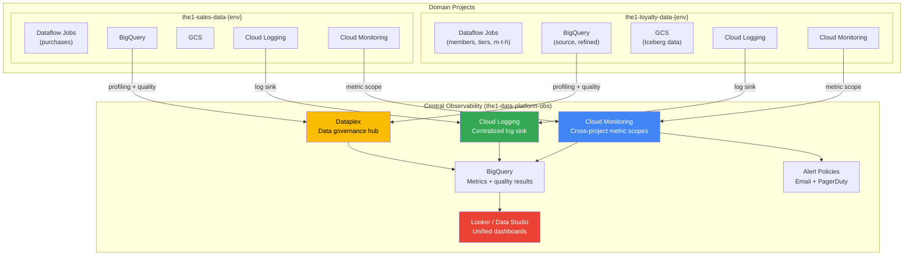
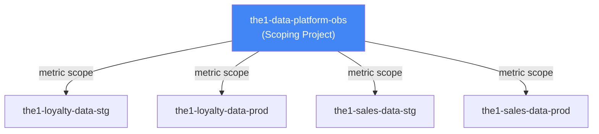
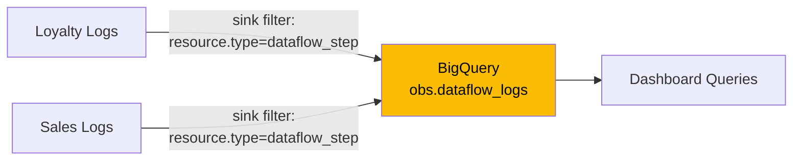
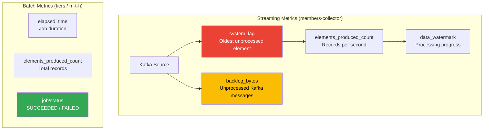
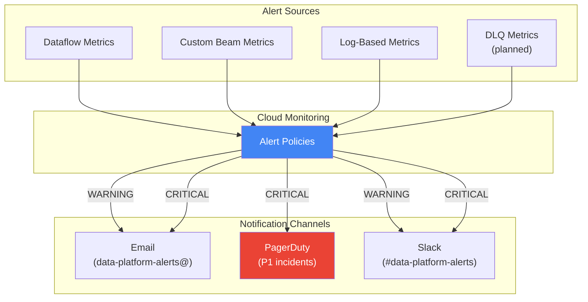
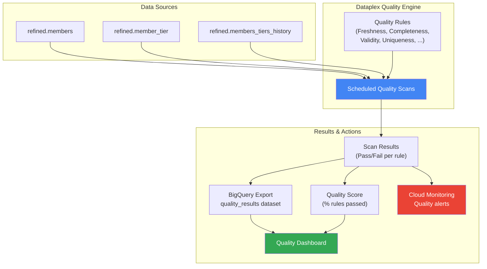
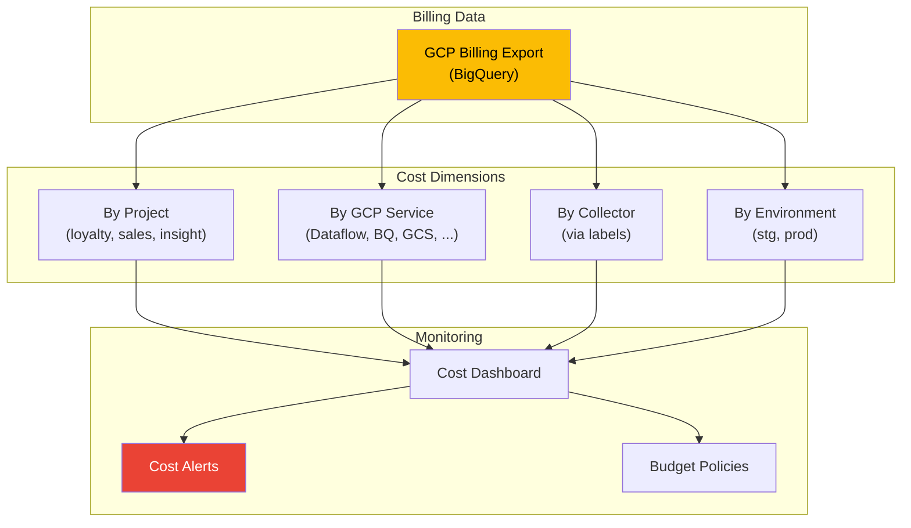
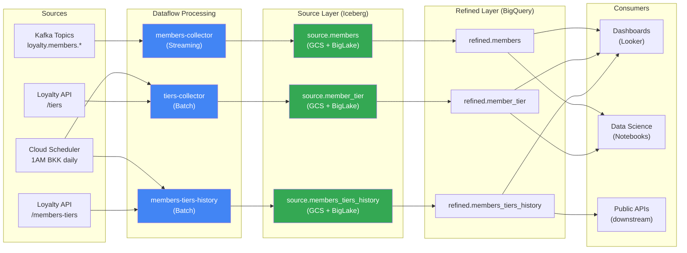
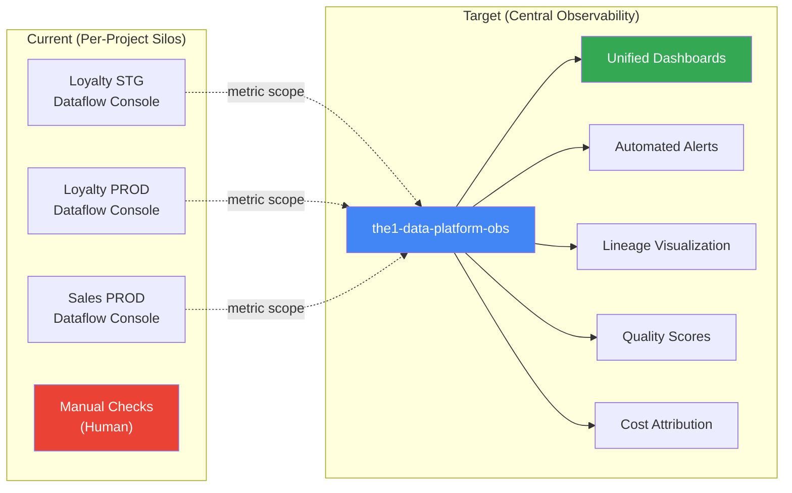
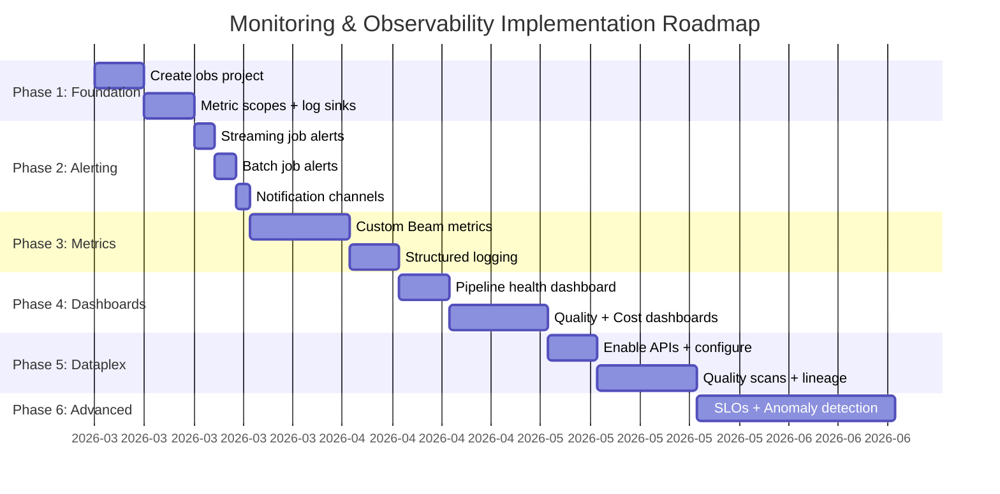

# Monitoring and Observability

Comprehensive monitoring, observability, and operational strategy for The1 Data Platform covering pipeline monitoring, data quality, cost attribution, data lineage, alerting, and dashboards.

## Table of Contents

- [Vision](#vision)
- [Architecture](#architecture)
- [Pipeline Monitoring](#pipeline-monitoring)
  - [Dataflow Metrics](#dataflow-metrics)
  - [Custom Beam Metrics](#custom-beam-metrics)
  - [Structured Logging](#structured-logging)
  - [Alerting](#alerting)
- [Data Quality Monitoring](#data-quality-monitoring)
- [Cost Monitoring](#cost-monitoring)
- [Data Lineage](#data-lineage)
- [Current State vs Target](#current-state-vs-target)
- [Implementation Roadmap](#implementation-roadmap)

---

## Vision

A central observability layer across all data domain projects providing:

1. **Pipeline quality monitoring** -- Real-time visibility into pipeline health, throughput, errors, and latency.
2. **Data quality monitoring** -- Automated quality scans with rule-based validation and scoring.
3. **Cost monitoring** -- Per-project and per-collector cost attribution for budget management.
4. **Data lineage visualization** -- End-to-end visibility from source to consumption.
5. **Data sharing control** -- Governed access across domains with audit trails.

The goal is to move from reactive operations (manual checks, ad-hoc troubleshooting) to proactive operations (automated alerts, dashboards, self-healing pipelines).

---

## Architecture

### Central Observability Project

All domain projects feed into a central observability project that aggregates cross-domain signals:



### Cross-Project Metric Scopes

Cloud Monitoring supports metric scopes that allow one project to view metrics from other projects without copying data:



### Centralized Log Sink

Cloud Logging sinks route logs from all domain projects to a central BigQuery dataset for long-term storage and analysis:



---

## Pipeline Monitoring

### Dataflow Metrics

Dataflow provides built-in metrics accessible via Cloud Monitoring and the Dataflow console.

#### Key Metrics by Collector Type

**Streaming Collectors (members-collector)**:

| Metric | Description | Alert Threshold |
|--------|-------------|-----------------|
| `job/system_lag` | Time the oldest unprocessed element has been waiting | > 5 minutes |
| `job/backlog_bytes` | Bytes of unprocessed input (Kafka lag) | > 100 MB |
| `job/elapsed_time` | Wall-clock time since job started | N/A (informational) |
| `job/elements_produced_count` | Total elements output by the pipeline | Drop to 0 for > 10 min |
| `job/current_num_vcpus` | Current vCPU allocation (autoscaling) | > max expected (cost) |
| `job/per_stage_data_watermark` | Data watermark per pipeline stage | Falling behind > 10 min |

**Batch Collectors (tiers-collector, members-tiers-history)**:

| Metric | Description | Alert Threshold |
|--------|-------------|-----------------|
| `job/elapsed_time` | Total job runtime | > 2x expected duration |
| `job/elements_produced_count` | Total records processed | < expected minimum |
| `job/current_num_vcpus` | Worker allocation | > max expected |
| `job/is_active` | Whether the job is running | Job not started by expected time |
| `job/status` | Final job status | FAILED or CANCELLED |



### Custom Beam Metrics

In addition to Dataflow's built-in metrics, custom Apache Beam metrics provide pipeline-specific observability:

#### Defined Counters

| Counter Name | Namespace | Description |
|-------------|-----------|-------------|
| `records_processed` | `{DoFnClassName}` | Total records successfully processed by this DoFn |
| `records_failed` | `{DoFnClassName}` | Total records that threw exceptions |
| `records_dead_lettered` | `{DoFnClassName}` | Total records routed to DLQ (when implemented) |
| `records_dropped` | `{DoFnClassName}` | Records intentionally filtered/dropped |
| `api_calls` | `{CollectorName}` | Total API calls made (batch collectors) |
| `api_errors` | `{CollectorName}` | API calls that returned errors |
| `iceberg_writes` | `{CollectorName}` | Successful Iceberg write batches |
| `bq_writes` | `{CollectorName}` | Successful BigQuery write batches |

#### Defined Distributions

| Distribution Name | Namespace | Description |
|------------------|-----------|-------------|
| `record_processing_time_ms` | `{DoFnClassName}` | Processing time per record (milliseconds) |
| `batch_size` | `{CollectorName}` | Number of records per write batch |
| `api_response_time_ms` | `{CollectorName}` | API call response time (batch collectors) |

#### Implementation

```python
from apache_beam.metrics import Metrics

class MyDoFn(beam.DoFn):
    def __init__(self):
        self.records_processed = Metrics.counter(self.__class__.__name__, "records_processed")
        self.records_failed = Metrics.counter(self.__class__.__name__, "records_failed")
        self.processing_time = Metrics.distribution(self.__class__.__name__, "record_processing_time_ms")

    def process(self, element):
        import time
        start = time.monotonic()
        try:
            result = self._transform(element)
            self.records_processed.inc()
            elapsed_ms = (time.monotonic() - start) * 1000
            self.processing_time.update(int(elapsed_ms))
            yield result
        except Exception as e:
            self.records_failed.inc()
            logging.error(f"Processing failed: {e}", extra={"element": str(element)})
```

Custom Beam metrics are automatically exported to Cloud Monitoring when running on Dataflow, with a namespace prefix of `custom.googleapis.com/dataflow/`.

### Structured Logging

All collectors use structured logging with consistent fields for queryability:

#### Standard Log Fields

| Field | Description | Example |
|-------|-------------|---------|
| `severity` | Log level | `INFO`, `WARNING`, `ERROR` |
| `collector_name` | Which collector | `members-collector` |
| `job_type` | Streaming or batch | `normal`, `initial_data` |
| `run_id` | Unique pipeline run ID | `2026-02-20T01:00:00Z` |
| `stage` | Processing step | `decode_json`, `bq_transform` |
| `record_id` | Record identifier (if available) | `event_id` or `member_id` |
| `error_type` | Exception class (errors only) | `ValueError` |
| `error_message` | Exception message (errors only) | `Missing required field: member_id` |

#### Log-Based Metrics

Cloud Logging can create metrics from log entries using filters:

```
-- Error rate metric
resource.type="dataflow_step"
severity="ERROR"
jsonPayload.collector_name="members-collector"

-- API error metric (batch collectors)
resource.type="dataflow_step"
jsonPayload.stage="api_call"
jsonPayload.error_type=~"HTTPError|TimeoutError"
```

These log-based metrics feed into Cloud Monitoring dashboards and alert policies.

### Alerting

#### Alert Policies



#### Alert Definitions

**Streaming Pipeline Alerts (members-collector)**:

| Alert | Condition | Severity | Action |
|-------|-----------|----------|--------|
| **Job Failed** | `job/status = FAILED` | CRITICAL | Investigate logs, restart job |
| **High System Lag** | `system_lag > 5 min for 10 min` | WARNING | Check worker scaling, Kafka throughput |
| **Critical System Lag** | `system_lag > 30 min for 5 min` | CRITICAL | Immediate investigation, possible restart |
| **High Backlog** | `backlog_bytes > 100 MB for 15 min` | WARNING | Increase workers, check processing bottleneck |
| **Zero Throughput** | `elements_produced = 0 for 10 min` | CRITICAL | Check Kafka connectivity, pipeline health |
| **High Error Rate** | `records_failed / records_processed > 1%` | WARNING | Check error logs, investigate data quality |
| **High Worker Count** | `current_num_vcpus > 32` | WARNING | Cost alert, check for data spike |

**Batch Pipeline Alerts (tiers-collector, members-tiers-history)**:

| Alert | Condition | Severity | Action |
|-------|-----------|----------|--------|
| **Job Failed** | `job/status = FAILED` | CRITICAL | Investigate logs, re-trigger |
| **Job Not Started** | No job started by 01:30 BKK | WARNING | Check Cloud Scheduler, trigger manually |
| **Long Running** | `elapsed_time > 2h` (tiers) or `> 4h` (m-t-h) | WARNING | Check API response times, data volume |
| **Low Record Count** | `elements_produced < 1000` | WARNING | Check API response, data availability |
| **API Errors** | `api_errors > 10 in 5 min` | WARNING | Check Loyalty API health |

---

## Data Quality Monitoring

Data quality monitoring combines Dataplex auto scans with custom quality checks.

### Dataplex Quality Scans

See [DATA_GOVERNANCE.md](../governance/DATA_GOVERNANCE.md#2-data-quality) for full details on quality dimensions and rule types.

#### Quality Monitoring Architecture



#### Quality Rules per Table

**refined.members**:

| Rule | Dimension | Type | Threshold |
|------|-----------|------|-----------|
| `member_id` NOT NULL | Completeness | Null check | 99.9% |
| `etlLoadTime` within 2h | Freshness | Custom SQL | Latest partition < 2h old |
| `member_id` unique per partition | Uniqueness | Uniqueness | 100% |
| `etlLoadTime` valid range | Validity | Range | Between 2024010100 and 2030123123 |

**refined.member_tier**:

| Rule | Dimension | Type | Threshold |
|------|-----------|------|-----------|
| `tier_name` in allowed set | Validity | Set | 100% |
| Row count > 0 for daily run | Volume | Custom SQL | > 0 rows per day |
| `member_id` NOT NULL | Completeness | Null check | 99.9% |

**refined.members_tiers_history**:

| Rule | Dimension | Type | Threshold |
|------|-----------|------|-----------|
| `member_id` NOT NULL | Completeness | Null check | 99.9% |
| Row count within expected range | Volume | Custom SQL | 1K - 10M per day |
| `start_date` <= `end_date` | Consistency | Custom SQL | 100% |

#### Quality Score Tracking

Target: **>= 95%** quality score across all tables.

```sql
-- Quality score trend (last 30 days)
SELECT
  DATE(scan_time) as scan_date,
  table_name,
  ROUND(passed_rules * 100.0 / total_rules, 2) as quality_score_pct
FROM `obs.quality_results.scan_summary`
WHERE scan_time >= TIMESTAMP_SUB(CURRENT_TIMESTAMP(), INTERVAL 30 DAY)
ORDER BY scan_date DESC, table_name;
```

---

## Cost Monitoring

### Cost Attribution Strategy

Each domain project has its own billing, but the central observability project aggregates cost data for cross-domain analysis and per-collector attribution.



### Cost Breakdown by Service

| GCP Service | Cost Driver | Optimization |
|-------------|------------|--------------|
| **Dataflow** | Worker hours (vCPUs + memory) | Autoscaling min/max, right-size workers, use Dataflow Prime |
| **BigQuery** | Bytes processed (on-demand) or slot-hours (flat-rate) | Partitioning, clustering, materialized views |
| **GCS** | Storage volume + operations | Lifecycle policies, Nearline for cold Iceberg data |
| **Kafka (Confluent)** | Throughput (MB/s) + storage | Retention policies, compression |
| **Artifact Registry** | Image storage + pulls | Image cleanup policy, multi-stage builds |
| **Cloud Logging** | Log volume (ingestion + storage) | Exclusion filters, reduce verbose logging |

### Per-Collector Cost Tracking

GCP resource labels enable per-collector cost attribution:

| Label Key | Label Value | Applied To |
|-----------|------------|------------|
| `collector` | `members-collector` | Dataflow job, GCS bucket, BQ dataset |
| `collector` | `tiers-collector` | Dataflow job, GCS bucket, BQ dataset |
| `collector` | `members-tiers-history` | Dataflow job, GCS bucket, BQ dataset |
| `domain` | `loyalty` | All resources in loyalty project |
| `environment` | `stg` / `prod` | All resources |
| `managed_by` | `terraform` | Terraform-managed resources |

### Cost Queries

```sql
-- Monthly cost by collector (from billing export)
SELECT
  labels.value as collector,
  service.description as gcp_service,
  ROUND(SUM(cost), 2) as total_cost_usd
FROM `billing_export.gcp_billing_export_v1_*`
CROSS JOIN UNNEST(labels) as labels
WHERE labels.key = 'collector'
  AND invoice.month = '202602'
GROUP BY collector, gcp_service
ORDER BY total_cost_usd DESC;

-- Dataflow cost trend by collector (daily)
SELECT
  DATE(usage_start_time) as date,
  labels.value as collector,
  ROUND(SUM(cost), 2) as daily_cost_usd
FROM `billing_export.gcp_billing_export_v1_*`
CROSS JOIN UNNEST(labels) as labels
WHERE labels.key = 'collector'
  AND service.description = 'Cloud Dataflow'
  AND usage_start_time >= TIMESTAMP_SUB(CURRENT_TIMESTAMP(), INTERVAL 30 DAY)
GROUP BY date, collector
ORDER BY date DESC, daily_cost_usd DESC;
```

### Budget Alerts

| Budget Scope | Monthly Budget | Alert at |
|-------------|---------------|----------|
| **Loyalty Project (prod)** | $X,XXX | 50%, 80%, 100%, 120% |
| **Loyalty Project (stg)** | $XXX | 50%, 80%, 100% |
| **Dataflow (per-collector)** | $XXX | 80%, 100% |
| **BigQuery (per-project)** | $XXX | 80%, 100% |

---

## Data Lineage

### Dataplex Data Lineage

When the Data Lineage API is enabled, lineage is automatically captured from Dataflow and BigQuery operations. See [DATA_GOVERNANCE.md](../governance/DATA_GOVERNANCE.md#3-data-lineage) for full details.

### End-to-End Pipeline Lineage



### Impact Analysis Use Cases

| Question | How Lineage Helps |
|----------|-------------------|
| "Kafka topic schema changed -- what breaks?" | Trace forward from Kafka topic to all downstream tables and dashboards |
| "BigQuery column dropped -- who is affected?" | Trace forward from BQ column to all consuming queries, views, dashboards |
| "Dashboard shows stale data -- why?" | Trace backward from dashboard to source pipeline, identify delay |
| "Which collectors write to this table?" | Trace backward from BQ table to source Dataflow jobs |
| "What data flows through this service account?" | Filter lineage by SA identity to audit data access |

### Lineage Metadata

Lineage events include:

| Metadata | Description |
|----------|-------------|
| **Process** | The Dataflow job or BQ query that moved data |
| **Run** | A specific execution of the process (job run ID, timestamps) |
| **Source** | The input entity (Kafka topic, API endpoint, Iceberg table) |
| **Target** | The output entity (Iceberg table, BQ table) |
| **Timestamp** | When the lineage event occurred |
| **Attributes** | Custom key-value pairs (collector name, job type, etc.) |

---

## Current State vs Target

| Feature | Current State | Target State | Gap |
|---------|--------------|-------------|-----|
| **Pipeline metrics** | Dataflow console per-job only | Central dashboard with all collectors | Cross-project metric scopes + unified dashboard |
| **Custom Beam metrics** | Not implemented | Per-DoFn counters and distributions | Code changes in all collectors |
| **Structured logging** | Basic Python logging | Structured JSON with standard fields | Logging format standardization |
| **Pipeline alerting** | Manual checks of Dataflow console | Automated alert policies with notifications | Cloud Monitoring alert policies |
| **Data quality** | None (no Dataplex scans) | Dataplex auto quality scans per table | Enable Dataplex, define rules |
| **Data profiling** | None | Dataplex auto profiling weekly | Enable Dataplex |
| **Cost monitoring** | GCP billing console only | Per-collector cost attribution dashboards | Labels + billing export + dashboard |
| **Data lineage** | None | Dataplex auto lineage (Dataflow + BQ) | Enable Lineage API |
| **DLQ monitoring** | None (no DLQ exists) | DLQ volume and error dashboards | DLQ implementation first |
| **Dashboards** | None | Looker/Data Studio with all metrics | Dashboard creation |
| **Central observability** | None (per-project silos) | Single obs project aggregating all | Create obs project, configure scopes |



---

## Implementation Roadmap

### Phase 1: Foundation -- Central Observability Project

**Effort**: 1-2 weeks | **Priority**: HIGH

| Step | Action | Owner |
|------|--------|-------|
| 1.1 | Create `the1-data-platform-obs` GCP project | Platform team |
| 1.2 | Configure metric scopes for all domain projects | Platform team |
| 1.3 | Create centralized log sink (Dataflow logs to BigQuery) | Platform team |
| 1.4 | Set up billing export to BigQuery | Platform team |

### Phase 2: Pipeline Alerting

**Effort**: 1 week | **Priority**: HIGH

| Step | Action | Owner |
|------|--------|-------|
| 2.1 | Create alert policies for streaming job failures | Data team |
| 2.2 | Create alert policies for batch job failures and missed schedules | Data team |
| 2.3 | Set up notification channels (email, Slack, PagerDuty) | Data team |
| 2.4 | Create on-call runbook for each alert | Data team |

### Phase 3: Custom Metrics and Structured Logging

**Effort**: 2-3 weeks | **Priority**: MEDIUM

| Step | Action | Owner |
|------|--------|-------|
| 3.1 | Add Beam counter/distribution metrics to all DoFns | Data team |
| 3.2 | Standardize structured logging format | Data team |
| 3.3 | Create log-based metrics for error tracking | Data team |
| 3.4 | Verify metrics appear in Cloud Monitoring | Data team |

### Phase 4: Dashboards

**Effort**: 2-3 weeks | **Priority**: MEDIUM

| Step | Action | Owner |
|------|--------|-------|
| 4.1 | Build pipeline health dashboard (all collectors) | Data team |
| 4.2 | Build data quality score dashboard | Data team |
| 4.3 | Build cost attribution dashboard | Platform team |
| 4.4 | Build DLQ monitoring dashboard (after DLQ implementation) | Data team |

#### Dashboard Specifications

**Pipeline Health Dashboard**:

| Panel | Metric/Query | Visualization | Refresh |
|-------|-------------|---------------|---------|
| Job Status (all collectors) | `dataflow.googleapis.com/job/status` | Status table (green/red) | 1 min |
| Streaming Lag | `job/system_lag` | Time series | 1 min |
| Kafka Backlog | `job/backlog_bytes` | Time series | 1 min |
| Throughput | `job/elements_produced_count` rate | Time series | 1 min |
| Error Rate | `records_failed / records_processed` | Time series + threshold line | 1 min |
| Batch Job Duration | `job/elapsed_time` | Bar chart (daily) | 1 hour |
| Worker Count | `job/current_num_vcpus` | Time series | 1 min |

**Cost Dashboard**:

| Panel | Query | Visualization | Refresh |
|-------|-------|---------------|---------|
| Monthly Cost by Project | Billing export | Stacked bar chart | Daily |
| Monthly Cost by Collector | Billing export + labels | Stacked bar chart | Daily |
| Cost by GCP Service | Billing export | Pie chart | Daily |
| Cost Trend (30 days) | Billing export | Line chart | Daily |
| Budget vs Actual | Budget API | Gauge chart | Daily |

### Phase 5: Dataplex Integration

**Effort**: 2-3 weeks | **Priority**: MEDIUM

| Step | Action | Owner |
|------|--------|-------|
| 5.1 | Enable Dataplex API in all projects | Platform team |
| 5.2 | Enable Data Lineage API | Platform team |
| 5.3 | Configure auto data profiling | Data team |
| 5.4 | Define and configure quality scans | Data team |
| 5.5 | Export quality results to BigQuery | Data team |
| 5.6 | Build lineage visualization dashboard | Data team |

### Phase 6: Advanced Monitoring

**Effort**: 3-4 weeks | **Priority**: LOW

| Step | Action | Owner |
|------|--------|-------|
| 6.1 | SLO/SLI definitions per collector | Data team |
| 6.2 | Error budget tracking | Data team |
| 6.3 | Anomaly detection on throughput | Platform team |
| 6.4 | Automated incident response (self-healing) | Platform team |

### Roadmap Timeline



---

## Operational Runbooks

### Runbook: Streaming Job Failed (members-collector)

```
1. Check Dataflow console for error message
2. Check Cloud Logging: resource.type="dataflow_step" severity="ERROR"
3. Common causes:
   a. Kafka connectivity → check Kafka cluster health
   b. Schema mismatch → check Kafka topic schema
   c. GCS permission → check SA IAM
   d. OOM → increase worker memory or reduce bundle size
4. Fix root cause
5. Restart streaming job (cancel and re-deploy, or drain and re-deploy)
6. Verify Kafka backlog is decreasing after restart
```

### Runbook: Batch Job Failed (tiers-collector / members-tiers-history)

```
1. Check Dataflow console for error message
2. Check Cloud Logging for the specific job run
3. Common causes:
   a. Loyalty API down → check API health, retry job
   b. API rate limit → check retry settings, backoff
   c. Schema change → update Pydantic DTO and Iceberg schema
   d. GCS/BQ permission → check SA IAM
4. Fix root cause
5. Re-trigger batch job via Cloud Scheduler or manual gcloud command
6. Verify output tables are updated
```

### Runbook: High DLQ Volume

```
1. Query dead_letter table for error distribution:
   SELECT stage, error_type, COUNT(*) FROM dead_letter GROUP BY 1,2
2. Identify the dominant error pattern
3. Common patterns:
   a. JSON decode errors → upstream sending malformed data
   b. Missing required fields → schema change upstream
   c. Type conversion errors → data type mismatch
4. Fix root cause (coordinate with upstream if needed)
5. Replay failed records (see DLQ_STRATEGY.md for replay options)
6. Verify DLQ rate returns to normal
```

---

## References

- [Cloud Monitoring Documentation](https://cloud.google.com/monitoring/docs)
- [Dataflow Monitoring](https://cloud.google.com/dataflow/docs/guides/monitoring-overview)
- [Apache Beam Metrics](https://beam.apache.org/documentation/programming-guide/#metrics)
- [Cloud Logging](https://cloud.google.com/logging/docs)
- [Dataplex Documentation](https://cloud.google.com/dataplex/docs)
- [Data Governance](../governance/DATA_GOVERNANCE.md)
- [DLQ Strategy](../governance/DLQ_STRATEGY.md)
