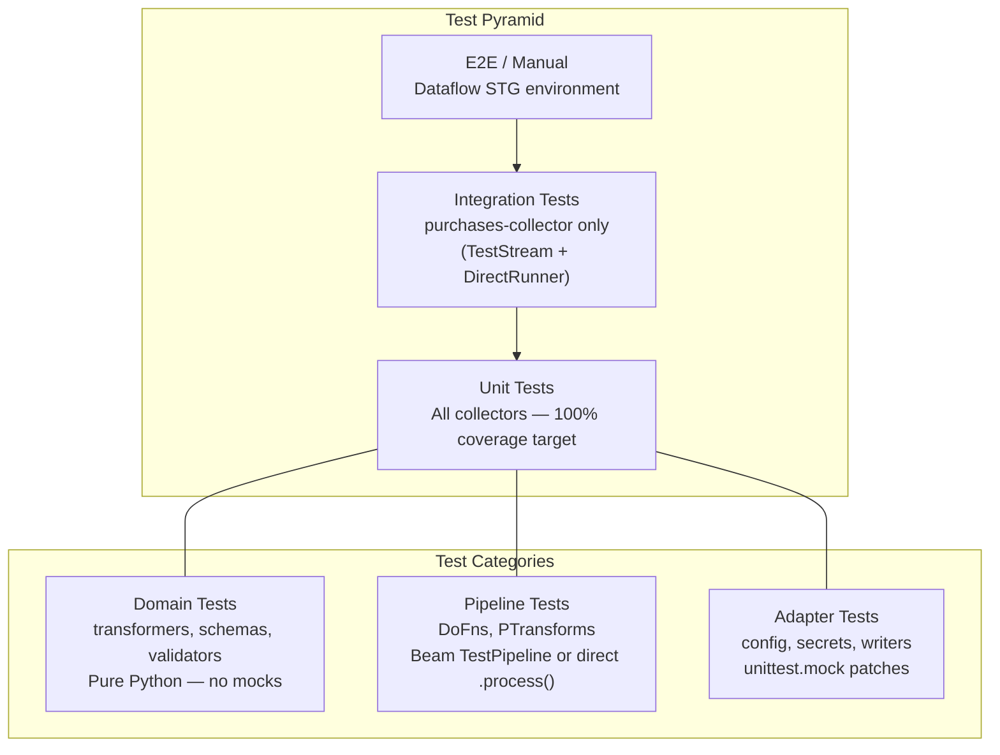
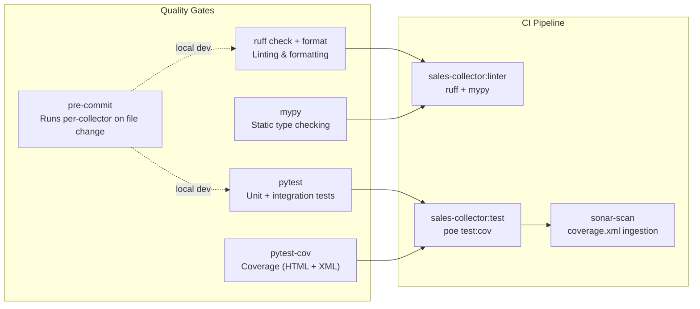
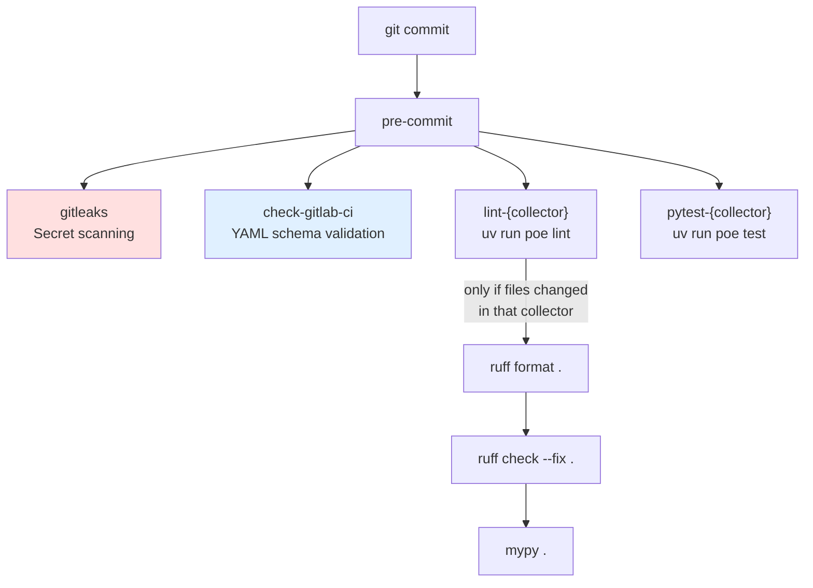
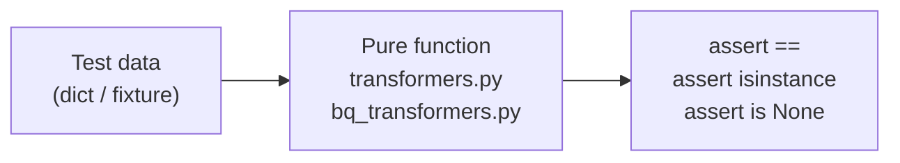
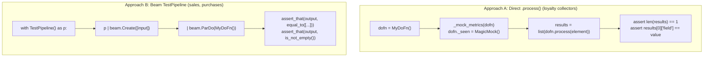
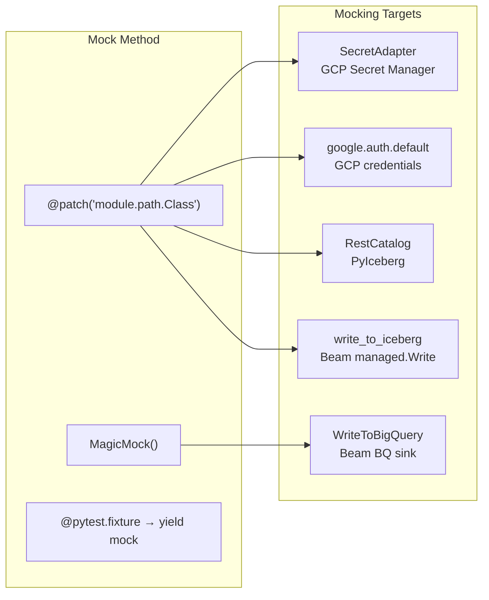
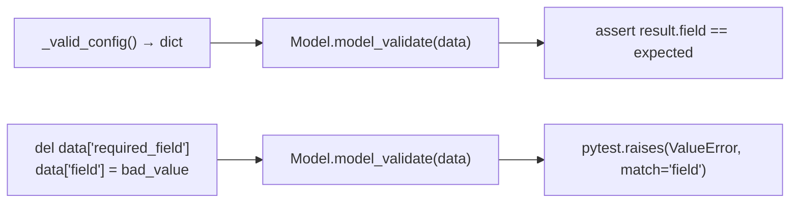
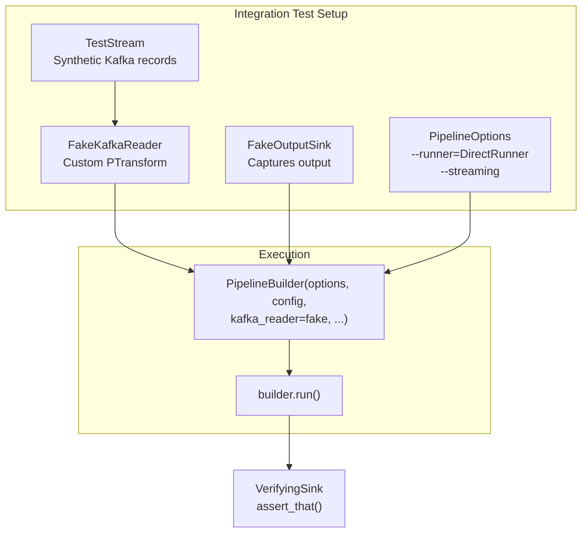
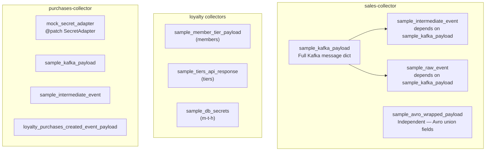
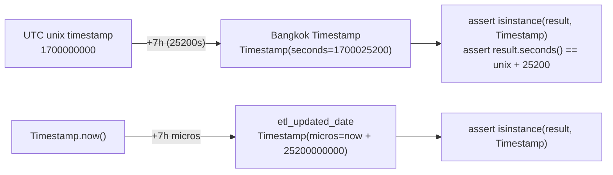

# Test Architecture — Data Platform Collectors

> **Scope:** All collectors: members, tiers, members-tiers-history, purchases (loyalty), sales (sales-data)
> **Last Updated:** 2026-02-22

---

## High-Level Test Architecture



---

## Test Structure Per Collector

All collectors follow identical directory layout:

```
{collector}/tests/
├── __init__.py
├── conftest.py                          # Root fixtures (domain-specific sample data)
├── integration/                         # Integration tests (mostly empty/placeholder)
│   └── pipeline/
└── unit/
    ├── adapters/
    │   ├── input/
    │   │   └── configuration/           # Settings, ConfigAdapter, Logging, Secret
    │   └── output/                      # BigQuery, Iceberg sinks
    ├── domain/                          # Transformers, schemas, validators
    └── pipeline/                        # DoFns, PipelineBuilder
```

### Test File Count by Collector

| Layer | members | tiers | m-t-h | purchases | sales |
|-------|:---:|:---:|:---:|:---:|:---:|
| adapters/input | 6 | 5 | 5 | 4 | 1 |
| adapters/output | 3 | 3 | 3 | 2 | 1 |
| domain | 2 | 2 | 1 | 4 | 3 |
| pipeline | 3 | 2 | 0 | 1 | 1 |
| integration | 0 | 0 | 0 | 1 | 0 |
| **Total** | **14** | **12** | **9** | **12** | **6** |

---

## Test Toolchain



### Shared Configuration (all collectors)

```toml
# pyproject.toml — pytest
[tool.pytest.ini_options]
addopts = "-v"
testpaths = ["tests"]
pythonpath = ["."]       # or ["src"]

# pyproject.toml — poethepoet tasks
[tool.poe.tasks]
test       = "pytest"
"test:cov" = "pytest --cov=src --cov-report=html --cov-report=xml:coverage.xml"
"test:unit" = "pytest tests/unit"
lint       = ["format", "check", "typecheck"]   # sequential chain
```

### Pre-commit Hooks (workspace level)



Each collector has its own `lint-{collector}` and `pytest-{collector}` hook with `files: ^{collector}/` filter and `pass_filenames: false`.

---

## Detailed Test Patterns

### 1. Domain Tests — Pure Python Functions



**Pattern:** Direct function call → assert return value. No mocking, no Beam runtime.

```python
class TestBuildRawEvent:
    def test_schema_b_extracts_wrapper_fields(self):
        payload = {"eventId": "e1", "source": "pos", "timestamp": 1700000000,
                   "payload": {"receiptNo": "R1"}}
        result = build_raw_event(payload)
        assert result["eventId"] == "e1"
        assert result["source"] == "pos"
```

**Tested modules:** `transformers.py`, `bq_transformers.py`, `validators.py`, `schemas.py`

**Private function testing:** Tests import and test `_`-prefixed functions directly:
```python
from src.domain.bq_transformers import _parse_timestamp, _safe_str, _extract_header_fields
```

---

### 2. DoFn Tests — Two Approaches



**Approach A** — Loyalty collectors (members, tiers, m-t-h):
- Call `dofn.process(element)` directly, collect results with `list()`
- Must mock Beam metric counters (`_seen`, `_ok`, `_errors`) because no Beam runtime
- Faster execution, fine-grained assertions

**Approach B** — Sales-collector, purchases-collector DoFn tests:
- Use `with TestPipeline() as p:` context manager (DirectRunner)
- Use `beam.testing.util.assert_that` with matchers: `equal_to([...])`, `is_not_empty()`
- Dropped elements verified with `equal_to([])`
- Runs full Beam pipeline (slower but more realistic)

---

### 3. Adapter Tests — Mock External Dependencies



**Pattern — PTransform sink delegation:**
```python
@patch("src.adapters.output.iceberg_sink.write_to_iceberg")
def test_delegates_to_write(self, mock_write: MagicMock):
    sink = IcebergSink(config=config, schema=SCHEMA, row_mapper=mapper)
    mock_pcoll = MagicMock()
    sink.expand(mock_pcoll)
    mock_write.assert_called_once_with(pcoll=mock_pcoll, config=config, ...)
```

**Pattern — Config adapter with Secret Manager:**
```python
@pytest.fixture
def mock_secret_adapter(self) -> Generator:
    with mock.patch("...configuration_adapter.SecretAdapter") as mock_cls:
        mock_instance = MagicMock()
        mock_cls.return_value = mock_instance
        yield mock_instance
```

---

### 4. Pydantic / Dataclass Validation Tests



**Pattern — Pydantic v2 model testing:**
```python
def _valid_config() -> dict:
    return {"project": "my-project", "secret_name": "my-secret", ...}

class TestDataflowConfigDto:
    def test_valid(self):
        cfg = DataflowConfigDto.model_validate(_valid_config())
        assert cfg.project == "my-project"

    def test_missing_project_raises(self):
        data = _valid_config()
        del data["project"]
        with pytest.raises(ValueError, match="project"):
            DataflowConfigDto.model_validate(data)
```

**Pattern — Dataclass `__post_init__` validation:**
```python
def test_empty_project_id_raises(self):
    with pytest.raises(ValueError, match="project_id"):
        BigQueryWriterConfig(project_id="", dataset_id="refined", table_id="tbl")
```

---

### 5. Integration Tests (purchases-collector only)



This is the only collector with actual integration tests. Uses DirectRunner with `--streaming` to simulate real Dataflow behavior.

---

## Fixture Architecture

### Shared Fixtures (conftest.py at tests/ root)



### Local Test Helpers (in-file, not fixtures)

Pattern used across collectors — module-level helper functions:

```python
# In test files (not conftest)
def _make_raw_event(payload: dict) -> RawEvent:
    return RawEvent(eventId="test-id", source="test", ...)

def _valid_config() -> dict:
    return {"project": "test", ...}

def _mock_metrics(dofn: Any) -> None:
    dofn._seen = MagicMock()
    dofn._ok = MagicMock()
    dofn._errors = MagicMock()
```

---

## Bangkok Timezone Testing

All collectors verify +7h offset handling:



**Key assertion:** All TIMESTAMP fields must be `apache_beam.utils.timestamp.Timestamp`, NOT `datetime.datetime`.

---

## Coverage Gaps (Common Across Collectors)

| Module | Typically Tested | Notes |
|--------|:---:|-------|
| `domain/transformers.py` | Yes | Pure functions, thorough |
| `domain/bq_transformers.py` | Yes | Field mappings, type conversions |
| `domain/validators.py` | Yes | Validation edge cases |
| `domain/schemas.py` | Partial | Schema structure, not content |
| `adapters/input/configuration/settings.py` | Yes | Pydantic validation |
| `adapters/input/configuration/configuration_adapter.py` | Yes (loyalty) / No (sales) | Secret Manager mocked |
| `adapters/output/iceberg_sink.py` | Yes (loyalty) / No (sales) | Delegation mocked |
| `adapters/output/bigquery_writer.py` | Partial | Config tested, writer mocked |
| `application/pipeline/builder.py` | No (all) | Complex wiring — integration-level |
| `main.py` | No (all) | Entry point — E2E level |
