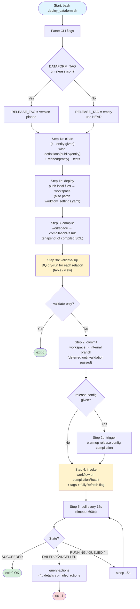
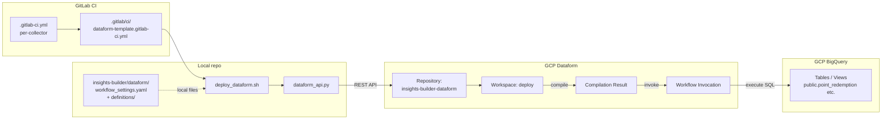

# `deploy_dataform.sh` — Reference Guide

เอกสารนี้อธิบาย flow ของ [`scripts/deploy_dataform.sh`](../loyalty/scripts/deploy_dataform.sh) ซึ่งทำหน้าที่ deploy Dataform สำหรับ insights-builder ทั้ง STG / PROD ผ่าน GitLab CI

## สรุปสั้น (TL;DR)

`deploy_dataform.sh` เป็น script ขั้นตอนเดียว (single shell script) ที่ทำ Dataform deploy ครบ cycle:

1. **Push** ไฟล์ Dataform ขึ้น Dataform workspace บน GCP (REST API)
2. **Compile** workspace → ได้ compilation result (compiled SQL graph)
3. **Validate** compiled SQL ด้วย BQ dry-run (กัน schema/syntax error)
4. **Commit** workspace ลง internal branch ของ Dataform repo (เพื่อ audit trail)
5. **Invoke** workflow → BQ จะรัน SQL จริง (incremental หรือ full-refresh)
6. **Poll** จนเสร็จ (SUCCEEDED / FAILED / CANCELLED)

ทุก step เรียก [`scripts/dataform_api.py`](../loyalty/scripts/dataform_api.py) ซึ่งคุยกับ Dataform v1beta1 REST API

---

## CLI Flags

```bash
bash scripts/deploy_dataform.sh [OPTIONS]
```

| Flag | คำอธิบาย |
|---|---|
| `--entity <name>` | Scope ที่ entity เดียว (เช่น `point_redemption`, `purchases`). ถ้าไม่ใส่ → deploy ทุก definitions |
| `--validate-only` | หยุดหลัง validate (Step 3b) — ไม่ commit, ไม่ invoke. ใช้เป็น guard ใน MR pipeline |
| `--full-refresh` | สั่ง invoke workflow แบบ full refresh — incremental tables ถูก rebuild จาก scratch (DROP + CREATE จริงๆ คือ `CREATE OR REPLACE`) |
| `--vars k=v,...` | Override `vars` ใน `workflow_settings.yaml` ตอน push (เช่นเปลี่ยน source project ตาม env) |
| `--release-config <id>` | Trigger release config warmup (Step 2b) — สำหรับ scheduled execution |

## Required Environment Variables

ตั้งโดย `.gitlab-ci.yml` ก่อนเรียก script:

| Variable | ตัวอย่าง |
|---|---|
| `PY` | `/usr/lib/google-cloud-sdk/platform/bundledpythonunix/bin/python3` |
| `GCP_PROJECT_ID` | `the1-loyalty-insights` (base, ไม่มี suffix env) |
| `WORKSPACE_ENV` | `stg` หรือ `prod` |
| `DATAFORM_REGION` | `asia-southeast1` |
| `DATAFORM_REPO` | `insights-builder-dataform` |
| `DATAFORM_WORKSPACE` | `deploy` (workspace ที่ CI push ไป) |
| `DATAFORM_SOURCE_DIR` | `insights-builder/dataform` (local path) |
| `DATAFORM_SA` | `t1-insights-builder@the1-loyalty-insights-stg.iam.gserviceaccount.com` |
| `DATAFORM_TAG` (optional) | git tag override สำหรับ version-pinned PROD deploy |

---

## High-Level Flow Diagram



---

## Detailed Step-by-Step

### Pre-flight: Resolve Release Tag

```bash
RELEASE_TAG=""
if DATAFORM_TAG env var is set
  → RELEASE_TAG = $DATAFORM_TAG
elif release.json exists AND --entity given
  → parse release.json[$WORKSPACE_ENV].entities[].tag matching $ENTITY
  → RELEASE_TAG = tag
else
  → RELEASE_TAG = "" (use HEAD)
```

**Purpose**: support version-pinned PROD deploys — STG อาจรัน HEAD, PROD รัน specific git tag

### Step 1a — `clean` (Conditional)

ถ้ามี `--entity`:

```bash
$PY scripts/dataform_api.py clean \
  $PROJECT $REGION $REPO $WORKSPACE \
  definitions/public/$ENTITY \
  definitions/refined/$ENTITY \
  definitions/tests
```

ลบไฟล์ใน workspace ที่ path เหล่านี้ — ป้องกัน ghost files ค้างจาก deploy ก่อนหน้า  
`clean` ไม่กระทบ entity อื่น (เช่น clean point_redemption ไม่ลบ point_balance)

### Step 1b — `deploy` (push local files → workspace)

**กรณีมี RELEASE_TAG**:
1. Push **`workflow_settings.yaml`** จาก HEAD (config ใช้ปัจจุบันเสมอ)
2. Push definition files **จาก git tag** (`deploy-tag` command)

**กรณีไม่มี tag**:
- Push ทุกไฟล์จาก local `$DATAFORM_SOURCE_DIR` ขึ้น workspace

**`deploy` ทำอะไร**:
- อ่านทุก `.sqlx` / `.js` / `.yaml` ใน source dir
- POST `:writeFile` ไปยัง workspace
- Patch `workflow_settings.yaml` runtime override:
  - `defaultProject` = `$PROJECT` (เช่น `the1-loyalty-insights-stg`)
  - `vars.*` = override ตาม env (`-stg` / `-prod` suffix replace)

ตัวอย่าง transform `workflow_settings.yaml`:
```yaml
# เก็บใน repo:
defaultProject: "the1-loyalty-insights-stg"
vars:
  loyalty_data_project: "the1-loyalty-data-stg"

# หลัง patch ตอน deploy:prod:
defaultProject: "the1-loyalty-insights-prod"
vars:
  loyalty_data_project: "the1-loyalty-data-prod"
```

### Step 1c — `sync` (Ghost File Cleanup)

```bash
$PY scripts/dataform_api.py sync \
  $PROJECT $REGION $REPO $WORKSPACE $SOURCE_DIR \
  definitions/public/$ENTITY \
  definitions/refined/$ENTITY \
  definitions/tests
```

เปรียบ remote workspace กับ local — ลบไฟล์ที่ remote มีแต่ local ไม่มีแล้ว (เช่น เคยมี `redemption.sqlx` แล้วลบออกจาก git) เพื่อป้องกัน workspace contains stale files

### Step 3 — `compile`

```bash
COMPILATION_RESULT=$($PY $API compile \
  $PROJECT $REGION $REPO $WORKSPACE $PROJECT $VARS_ARG)
```

POST ไปยัง `:compilationResults` พร้อม:
- `workspace` reference
- `codeCompilationConfig.defaultDatabase` = `$PROJECT`
- `codeCompilationConfig.vars` = parse แล้วเป็น dict

Output = `compilationResult` resource path (เช่น `projects/.../compilationResults/abc123`)

> **หมายเหตุ**: compilation result คือ snapshot ของ compiled SQL graph — มี actions list (table, view, assertion, declaration) พร้อม compiled SQL สำหรับแต่ละ action

### Step 3b — `validate-sql` (BQ Dry-Run)

```bash
$PY $API validate-sql $PROJECT $REGION $REPO $COMPILATION_RESULT
```

Logic ภายใน:
1. Fetch compilation result actions
2. Filter เฉพาะ relations (skip declarations / assertions / operations)
3. สำหรับแต่ละ action:
   - Extract compiled `selectQuery`
   - Run BQ `dryRun: true` กับ SQL นั้น
4. **Smart skip** ถ้า dry-run fail ด้วย "Not found: Table X" และ X เป็น sibling target ใน compilation เดียวกัน → warn ไม่ fail (chicken-and-egg: view dry-run ก่อน table ถูกสร้างใน step 4)

ถ้ามี error จริง → `exit 1` ทันที

### Optional: `--validate-only`

ถ้า flag นี้มา → exit 0 หลัง validate ผ่าน (ไม่ commit, ไม่ invoke)  
ใช้เป็น guard ใน MR pipeline / assertion stage

### Step 2 — `commit`

```bash
$PY $API commit $PROJECT $REGION $REPO $WORKSPACE "CI deploy: ..."
```

Commit workspace files → internal Dataform branch (audit trail)  
**Deferred ไปทำหลัง validation** เพื่อกัน bad code ไม่ให้ค้างใน Dataform branch

### Step 2b — `trigger` (Optional)

ถ้ามี `--release-config <id>`:
```bash
$PY $API trigger $PROJECT $REGION $REPO $RELEASE_CONFIG_ID
```

Force compile release config ตาม schedule — ใช้เมื่อมี Cloud Scheduler ที่ trigger Dataform release config เป็น cron

### Step 4 — `invoke`

```bash
INVOKE_EXTRA_ARGS=""
[[ -n "$ENTITY" ]] && INVOKE_EXTRA_ARGS="--tags $ENTITY"
$FULL_REFRESH && INVOKE_EXTRA_ARGS+=" --full-refresh"

INVOCATION=$($PY $API invoke \
  $PROJECT $REGION $REPO $COMPILATION_RESULT $DATAFORM_SA \
  $INVOKE_EXTRA_ARGS)
```

POST `:workflowInvocations` พร้อม:
- `compilationResult` = path จาก step 3
- `invocationConfig.serviceAccount` = `$DATAFORM_SA`
- `invocationConfig.includedTags` = `[$ENTITY]` (ถ้ามี)
- `invocationConfig.fullyRefreshIncrementalTablesEnabled` = `true` (ถ้ามี `--full-refresh`)

Output = invocation resource path

> **Full-refresh impact**: Dataform จะใช้ `CREATE OR REPLACE TABLE` แทน `INSERT INTO` ทำให้ rebuild ทั้ง table

### Step 5 — `poll`

```bash
TIMEOUT=600  # 10 นาที
INTERVAL=15  # poll ทุก 15 วิ
ELAPSED=0

while [ $ELAPSED -lt $TIMEOUT ]; do
  STATE=$($PY $API poll $PROJECT $REGION $REPO $INVOCATION)
  case $STATE in
    SUCCEEDED)        exit 0 ;;
    FAILED|CANCELLED) call query-actions; exit 1 ;;
    *)                sleep 15; ELAPSED=$((ELAPSED + 15)) ;;
  esac
done
exit 1  # timeout
```

ถ้า fail → call `query-actions` เพื่อดึง details ของ failed actions (action name, error message, SQL snippet)

---

## CI/CD Integration

`deploy_dataform.sh` ถูกเรียกจาก `.gitlab/ci/dataform-template.gitlab-ci.yml` 3 templates:

| Template | Stage | Flag เพิ่ม | ใช้เมื่อ |
|---|---|---|---|
| `.dataform-build-template` | `build` | `--validate-only` | เป็น guard บน push (validate ก่อน deploy) |
| `.dataform-deploy-stg-template` | `deploy-stg` | (none หรือ `--full-refresh`) | Deploy STG หลัง validate ผ่าน |
| `.dataform-deploy-prod-template` | `deploy-prod` | (none หรือ `--full-refresh`) | Deploy PROD หลัง STG ผ่าน |

**Flow ใน GitLab CI**:
1. Push to branch → `*-dataform:build` (--validate-only) ผ่าน
2. → `*-dataform:deploy:stg` (full deploy + invoke)
3. → `*-dataform:deploy:prod` (manual or auto trigger)

### CI Variable: `TRIGGER_FULL_REFRESH`

`dataform-template.gitlab-ci.yml` มี:
```yaml
script:
  - |
    DEPLOY_ARGS=(--entity "$DATAFORM_ENTITY")
    [[ "${TRIGGER_FULL_REFRESH:-0}" == "1" ]] && DEPLOY_ARGS+=(--full-refresh)
    bash scripts/deploy_dataform.sh "${DEPLOY_ARGS[@]}"
```

→ ตั้ง `TRIGGER_FULL_REFRESH=1` ตอน manual pipeline เพื่อ rebuild incremental tables

---

## Limitations & Pitfalls

### 1. Partition spec change → MUST DROP table

BigQuery ไม่ยอมให้ `CREATE OR REPLACE TABLE` เปลี่ยน partition spec ของ existing table  
Error: `Cannot replace a table with a different partitioning spec. Instead, DROP the table, and then recreate it.`

**ทางแก้**:
- DROP table มือ (ผ่าน `bq query 'DROP TABLE ...'` — ทำเอง ไม่ผ่าน script)
- จากนั้น push + `--full-refresh` → first run จะสร้าง table ใหม่ตาม spec

### 2. Cluster spec change → MUST DROP หรือ ALTER metadata

**สาเหตุเดียวกับ partition** — BQ reject `CREATE OR REPLACE` ถ้า cluster spec ต่าง  
**ต่างจาก partition**: cluster เปลี่ยน metadata ได้ผ่าน `bq update --clustering_fields=col1,col2 dataset.table` (ไม่ destructive)  
ปัจจุบัน `deploy_dataform.sh` **ไม่มี logic ทำ pre-flight `bq update`** — ดังนั้น first deploy ที่เปลี่ยน cluster ต้องทำมือก่อน

> Future enhancement: เพิ่ม pre-flight step ที่อ่าน existing cluster spec แล้ว `bq update` ก่อน Step 4

### 3. Schema column add — Dataform จัดการได้

ใส่ใน sqlx config:
```yaml
config {
  type: "incremental",
  onSchemaChange: "EXTEND"   // ALTER TABLE ADD COLUMN auto
}
```

`EXTEND` = ALTER เพิ่ม column ใหม่อัตโนมัติ  
`FAIL` (default) = error ถ้าเจอ column ที่ table ไม่มี

### 4. Schema column drop — Dataform ไม่ handle

ต้อง ALTER TABLE DROP COLUMN เอง

### 5. Stale data ใน partition เก่า (incremental ไม่แตะ)

`pre_operations` DELETE แค่ recent partition (ตาม `updatePartitionFilter`) — partition เก่ายังค้าง  
ถ้าต้องการล้าง stale dups → ต้อง `--full-refresh` (ผ่าน `TRIGGER_FULL_REFRESH=1` ใน manual CI pipeline)

### 6. `--full-refresh` กับ partition/cluster mismatch

ถ้า config sqlx เปลี่ยน partition/cluster แล้วสั่ง `--full-refresh` → fail ที่ Step 4 (Dataform invoke ทำ `CREATE OR REPLACE` ไม่ได้)  
**Sequence ที่ถูก**:
1. DROP table มือ (ทำเอง ผ่าน bq CLI)
2. Push code ใหม่
3. Trigger pipeline (ไม่ต้องใส่ `--full-refresh` ก็ได้ — first run = full SELECT อยู่แล้ว)

---

## Component Map



---

## ตัวอย่างการใช้งานจริง

### Scenario 1: Push code ปกติ (incremental)

```bash
# เกิดอัตโนมัติเมื่อ push to branch
# .gitlab-ci.yml call:
bash scripts/deploy_dataform.sh \
  --entity point_redemption \
  --release-config ""
```

→ STG: clean + push + compile + validate + commit + invoke (incremental)  
→ PROD: same (after STG passes, manual approve)

### Scenario 2: Full-refresh เพื่อล้าง stale dups

GitLab UI → Run pipeline:
- `TRIGGER_MANUAL_DEPLOY=1`
- `SERVICE_NAME=insights-builder`
- `TRIGGER_FULL_REFRESH=1`

```bash
# script เรียกด้วย:
bash scripts/deploy_dataform.sh \
  --entity point_redemption \
  --release-config "" \
  --full-refresh
```

→ Step 4 invoke ส่ง `fullyRefreshIncrementalTablesEnabled: true`  
→ BQ ใช้ `CREATE OR REPLACE TABLE ... AS SELECT ...` — full rebuild

### Scenario 3: Validate only (CI guard)

```bash
bash scripts/deploy_dataform.sh \
  --entity point_redemption \
  --release-config "" \
  --validate-only
```

→ หยุดหลัง Step 3b (validate-sql) — ไม่ commit ไม่ invoke

### Scenario 4: Version-pinned PROD deploy

```bash
DATAFORM_TAG="point_redemption-dataform/v1.2.0" \
bash scripts/deploy_dataform.sh --entity point_redemption
```

→ Push definition files จาก git tag, แต่ `workflow_settings.yaml` ใช้ HEAD

---

## ไฟล์ที่เกี่ยวข้อง

| Path | Role |
|---|---|
| [`loyalty/scripts/deploy_dataform.sh`](../loyalty/scripts/deploy_dataform.sh) | Main orchestration script |
| [`loyalty/scripts/dataform_api.py`](../loyalty/scripts/dataform_api.py) | REST API helper (deploy/clean/sync/compile/commit/invoke/poll/validate-sql/etc.) |
| [`loyalty/.gitlab/ci/dataform-template.gitlab-ci.yml`](../loyalty/.gitlab/ci/dataform-template.gitlab-ci.yml) | Hidden CI templates (`.dataform-build-template` / `.dataform-deploy-stg/prod-template`) |
| [`loyalty/insights-builder/.gitlab-ci.yml`](../loyalty/insights-builder/.gitlab-ci.yml) | Per-service CI ที่ extends template |
| [`loyalty/insights-builder/dataform/workflow_settings.yaml`](../loyalty/insights-builder/dataform/workflow_settings.yaml) | Dataform default project + vars |
| [`loyalty/insights-builder/dataform/release.json`](../loyalty/insights-builder/dataform/release.json) | (optional) Per-entity git tag pinning สำหรับ PROD |

---

## คำถามที่พบบ่อย (FAQ)

**Q: ทำไมต้อง `clean` + `sync` ก่อน `deploy`?**
A: ป้องกัน ghost files — ถ้าเคยมี sqlx แล้วลบออกจาก git, workspace บน remote ยังเก็บไฟล์เก่าอยู่ ต้อง explicit ลบ

**Q: `compile` กับ `commit` ลำดับไหนก่อน?**
A: **compile ก่อน commit** — เพื่อให้ validate-sql ตรวจ SQL ที่ยังไม่ commit. ถ้า validation fail → ไม่ commit (กันไม่ให้ bad code ค้างใน Dataform branch)

**Q: invocation timeout 600s พอไหม?**
A: ส่วนใหญ่พอ (incremental ใช้ ~30-90s). ถ้า full-refresh กับ table ใหญ่หลาย GB → อาจไม่พอ ต้องเพิ่ม TIMEOUT ใน script

**Q: `--full-refresh` ลบ data จริงๆ ไหม?**
A: Dataform invoke ส่ง `fullyRefreshIncrementalTablesEnabled: true` → BQ ทำ `CREATE OR REPLACE TABLE` ซึ่ง atomic (ไม่มี downtime ระหว่างเก่า/ใหม่ — REPLACE swap atomic). แต่ถ้า partition/cluster spec ต่าง → REPLACE fail (ดู Limitations)

**Q: ถ้า validate-sql fail ที่ view เพราะ underlying table ยังไม่ถูกสร้าง?**
A: Script handle case นี้แล้ว — ถ้า "Not found: Table X" และ X เป็น sibling target ใน compilation เดียวกัน → warn ไม่ fail (table จะถูกสร้างใน Step 4 invoke ตามลำดับ dependency)
