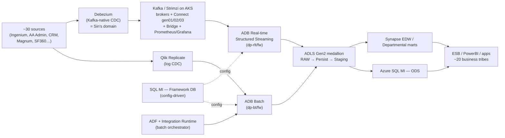
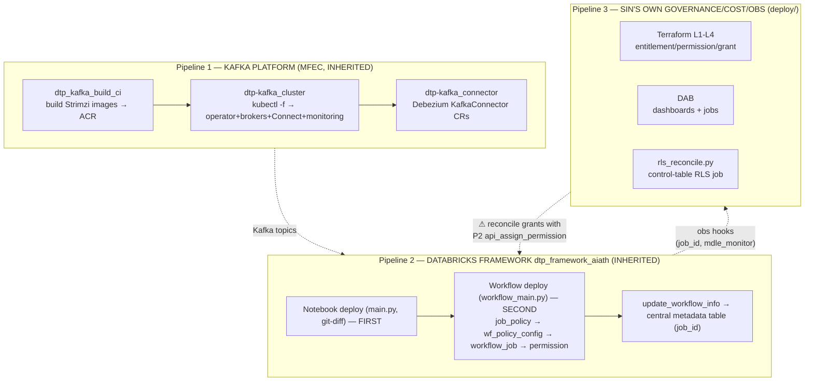
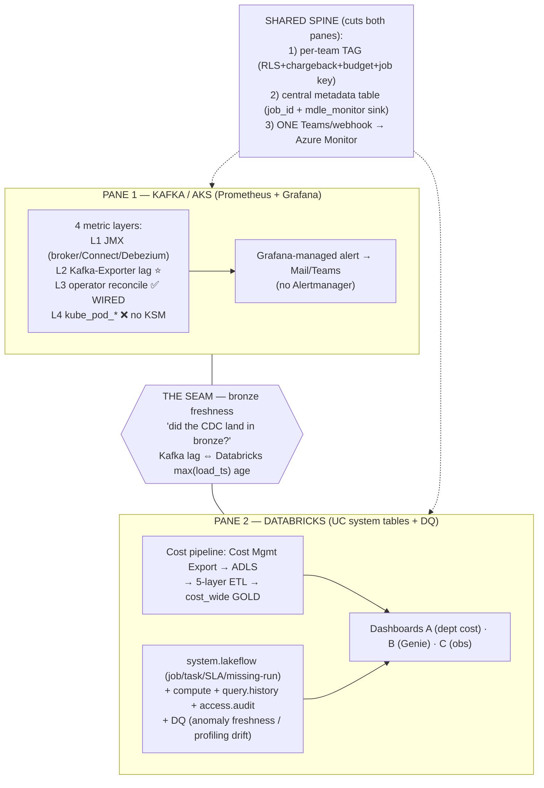
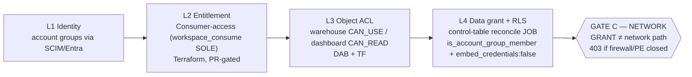
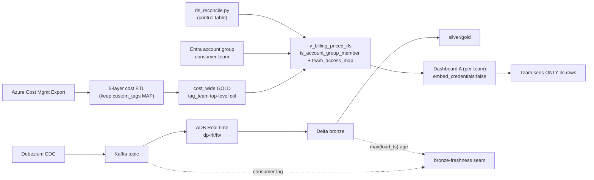

# AIA Data Platform — Master Architecture & Relationships

> The single "read-this-first" document that ties together runtime, the three deploy pipelines,
> observability, and governance. Diagrams are inline (Mermaid, renders in VSCode/GitHub) + the
> detailed drawio files. 🔒 private KB. Date: 2026-07-26.

## 0. Document map (what to read for what)
| Concern | Detailed doc | Diagram (.drawio) |
|---|---|---|
| **Runtime** (data flow) | `raw_architect.md` | `aia-data-platform.drawio` |
| **Deploy / code** (Kafka 3 repos + Databricks framework) | `deploy-framework_raw.md` | `aia-deploy-framework.drawio` |
| **Observability & monitoring** (the current work) | `observability-synthesis.md` | `aia-observability.drawio` |
| **Governance / access** (4 layers) | `../../knowledge/governance-management-deployment-options.md` | (in obs drawio, LANE G) |
| **Confirmed platform facts** | `../../knowledge/data-platform-architecture.md` | — |
| **This master (relationships)** | *(this file)* | (Mermaid inline below) |

---

## 1. The platform in one narrative (RUNTIME spine)

~30 insurance source systems → **dual CDC** (Qlik Replicate log-based + Debezium Kafka-native) →
**Kafka/Strimzi on AKS** (Sin's producer domain) → **Azure Databricks** (real-time Structured Streaming +
batch, config-driven by an Azure SQL MI "Framework DB") → **ADLS Gen2 medallion** (RAW→Persist→Staging) →
serving (**Azure SQL MI ODS** + **Synapse EDW/marts**) → **ESB / PowerBI / apps**. Orchestrated by **ADF+IR**,
governed by **Purview + Data360**.

---

## 2. The THREE deploy pipelines (never conflate — different owners, different obs hooks)

**Rule:** you (Sin) **own P3**, **consume P2's hooks**, **MFEC owns P1**. The obs hooks live in P2 but you build
in P3 → **reconcile your `rls_reconcile` desired-state with P2's `api_assign_permission`/`wf_policy_config`** or
two reconcilers fight over the same grants.

---

## 3. Observability model — 2 panes · 1 spine · 1 seam (the current work)

**Sequencing = packaging not effort:** the one question that decides everything — is Prometheus scrape config
**PodMonitor/ServiceMonitor** (light edit → Kafka-Exporter+JMX are quick wins) or **baked image** (rebuild →
paused, same wall as kube-state-metrics). Full phased plan P0–P4 in `observability-synthesis.md §3`.

---

## 4. Governance / access — 4 layers (applies to the cost dashboard)

Churn-based modality: **SCIM** (identity) · **Terraform** (entitlement, structural grant) · **DAB** (dashboard,
object ACL) · **reconcile-job** (high-churn RLS). Detail: `governance-management-deployment-options.md`.

---

## 5. Master relationship map (how a single team's cost view is produced end-to-end)

---

## 6. Status & gates (what's done / pending / blocked)
| Item | Status |
|---|---|
| Runtime + deploy architecture captured | ✅ done (4 drawio + 4 md) |
| Kafka interim reconcile alert | ✅ wired (Sin has email working) |
| Grafana alert enrichment (issue detail + deep-link) | 📄 manual written (`grafana-alert-user-manual.md`) |
| RLS-correct cost Dashboards A+B | ⚠️ deployed SQL has 2 bugs to fix (Genie GROSS/NET, usage_unit) |
| Genie cost SQL | 🔎 verifying (GROSS+floor, usage_unit) |
| Entitlement migration (2026-07-27) | 🔎 verifying necessity/impact |
| GATE C network path (D+) | ⏳ PoC pending at coredata UAT |
| Kafka Exporter (lag) + JMX | ❓ blocked-or-not depends on Prometheus packaging (Q1) |
| kube-state-metrics (L4) | ⛔ paused (needs image rebuild) |
| Observability Dashboard C (Topic 3) | ⏸️ deferred (needs metadata-table schema + system tables) |
| Open questions to Sin | 📋 14 in `observability-synthesis.md §6` |

---

## 7. The 5 hard truths to keep front-of-mind
1. **A UC GRANT is not a network path** — GATE C (firewall/PE) is independent and make-or-break for D+.
2. **Packaging, not effort, blocks Kafka metrics** — resolve PodMonitor-vs-baked before assuming lag/JMX are stuck.
3. **RLS fails silently in 4 ways** — ship `is_account_group_member()` + 4 grants (incl EXECUTE) + `embed_credentials:false` + right group, as one unit; test as a real consumer.
4. **Three deploy pipelines, three owners** — you consume P2's hooks, own P3; reconcile the two grant-appliers.
5. **The tag is the spine** — one `MAP→column` team tag = RLS + chargeback + budget + job-pipeline key; keeping it (vs บูม dropping it) is what makes everything per-team possible.
