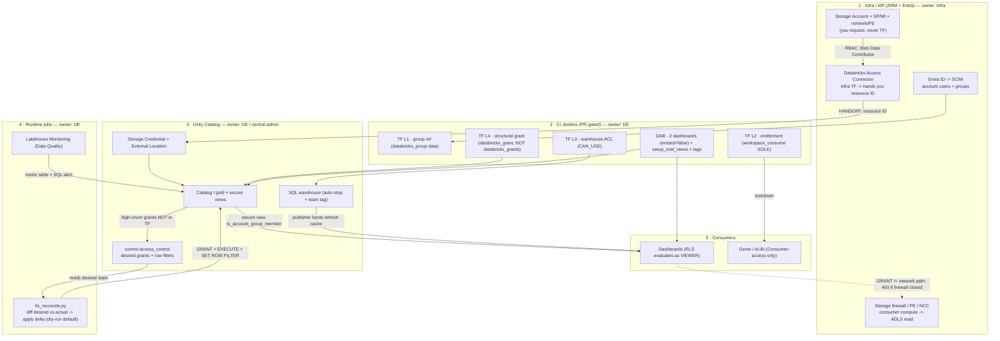

# Deployment Flow — governance + monitoring (Mermaid)

> Companion to [governance-management-deployment-options.md](../knowledge/governance-management-deployment-options.md) (Doc 2).
> Interactive version (decision matrix + flow, color-coded): published as a Claude artifact.
> Verified via 4-agent research + adversarial audit (confidence: high, 2026-07-21).

## Decision matrix — deploy vs job · shell vs TF

| Item | Delivery | Mechanism | Shell/TF | Owner | Churn |
|---|---|---|---|---|---|
| 1.1a Identity — Users | Managed sync | **SCIM** | N/A | Infra/IdP | constant |
| 1.1b Identity — Group shells | Hybrid | SCIM + TF ref | Terraform | Shared | low |
| **1.2 Entitlement ★** | CI deployment | **Terraform** | Terraform | DE | low · high blast |
| 1.3 Object/Asset ACL | Hybrid | DAB + TF | Terraform | DE | moderate |
| 1.4a Data — structural grant | CI deployment | **Terraform** (`databricks_grant`) | Terraform | DE | low |
| **1.4b Data — per-team RLS ★** | Runtime job | **Scheduled Job** | SQL DDL via job | DE | high |
| **2.1a Cost — dept dashboard ★** | Build-once | **DAB** | N/A | DE | build-once |
| **2.1b Cost — Genie AI ★** | Build-once | **DAB** | N/A | DE | build-once |
| 2.2a Obs — Infra tag *(deferred)* | Hybrid | Terraform | Terraform | DE | low |
| 2.2b Obs — Job-pipeline tag *(deferred)* | CI deployment | DAB | N/A | DE | low |
| 2.2c Obs — Data Quality *(deferred)* | Runtime job | Scheduled Job | N/A | DE | moderate |
| — SA / SP / network | Infra's TF | **Infra TF** | not yours | Infra | — |

**Shell/CLI = escape hatch only** (bootstrap before CI, SCIM entitlement PATCH, row-filter DDL) — never the primary declarative layer.

## Flow

## The 3 critical handoffs (don't miss)
1. **Access Connector boundary** — infra provisions ARM (SA/SP/connector/network) → hands you the connector resource ID → from there up is UC (yours / central admin).
2. **control-table → reconcile job** — high-churn per-team RLS is data-driven, NOT TF; the run-as SP must OWN the securables.
3. **RLS at consumption** — dashboards publish `embed_credentials:false` so the row filter evaluates as the viewer; default `true` runs as publisher and leaks every row. And a GRANT is control-plane only — a closed firewall/PE 403s despite a valid grant (→ back to infra).
