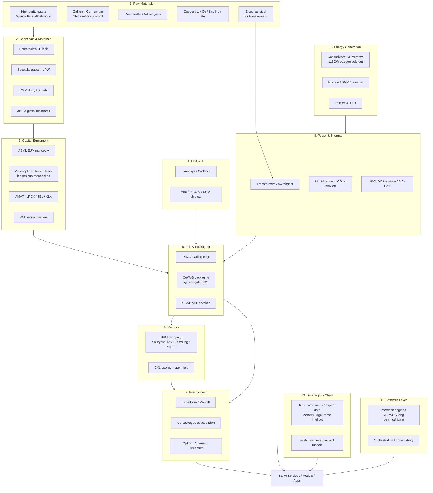

# 02 — Ecosystem INPUT Resources: Flow, Relationships, Stock Universe
> Tier: ต้นน้ำ (invest-only per Sin's model). Sources: 2025–2026 research (SemiAnalysis, TrendForce, company filings, IEA). Stock lists are a REFERENCE UNIVERSE for further agent analysis — not buy recommendations.

## A. Flow diagram (upstream → downstream)

**Moving bottleneck sequence (watch this, it decides which layer reprices next):**
GPU (2023-24, easing) → HBM (2025-26, sold out) → CoWoS packaging (2026, tightest) → optical interconnect (2026-28) → power/grid (2027+, US headroom negative) → cooling components → construction labor/permits → **data/RL environments (rising, cognitive bottleneck)**

## B. Relationship checklist (layer × dependency × entry)

| Layer | Depends on | Bottleneck severity | Concentration | Public invest? | Solo build entry? |
|---|---|---|---|---|---|
| Raw materials | Geology, geopolitics (China export controls) | High, episodic | Extreme (single-site/single-country) | Partial (miners) | ❌ (monitoring services only) |
| Chemicals | Raw materials, JP suppliers | Med-High | High (JP lock) | Yes (JP listed) | ❌ |
| Capital equipment | Chemicals, sub-suppliers (Zeiss/Trumpf/VAT) | High | Extreme (monopoly chains) | ✅ Excellent | ❌ |
| EDA/IP | Talent | Low-Med | Duopoly+ | ✅ | ⭕ RISC-V/chiplet tooling |
| Fab/Packaging | Equipment, chemicals, power, water | **Extreme (CoWoS)** | TSMC-dominant | ✅ | ❌ (allocation-intel services) |
| Memory/HBM | Fab, TSV, foundry base die | **Extreme (sold out '26)** | 3-vendor oligopoly | ✅ | ⭕ CXL/KV-cache software |
| Interconnect | Fab, optics | High, rising | Med (Broadcom/Marvell + startups) | ✅ | ⭕ network telemetry SW |
| Power/Thermal | Electrical steel, copper, labor | High 2027+ | Med | ✅ | ⭕ DCIM / tokens-per-watt SW |
| Energy gen | Turbine mfg capacity, fuel, permits | **Extreme (decade backlog)** | Few OEMs | ✅ | ❌ (siting/PPA data services) |
| Data/RL envs | Domain experts, verifiers | Rising fast, $1B+ lab budgets | Fragmented, forming | ❌ (private) | ✅✅ **PRIME ENTRY for Sin** |
| Software | Open source | Low (commoditizing) | Fragmented | Partial | ✅ but fast decay |

## C. Stock universe by category (reference only — agent to score)

### C1. Capital equipment & sub-monopolies
| Ticker | Name | Why |
|---|---|---|
| ASML (AMS/NASDAQ) | ASML | EUV monopoly |
| AMAT | Applied Materials | Deposition/etch breadth |
| LRCX | Lam Research | Etch/deposition |
| KLAC | KLA | Metrology near-monopoly |
| 8035.T | Tokyo Electron | JP equipment |
| VACN.SW | VAT Group | Vacuum valve monopoly |
| 6963.T | Rohm / 6857.T Advantest | Test/power adjacent |

### C2. Fab / packaging / OSAT
TSM (TSMC — also CoWoS), ASX (ASE), AMKR (Amkor), 5347.TWO (Vanguard), UMC

### C3. Memory (HBM oligopoly)
000660.KS (SK hynix — 56.4% HBM rev share Q1'26), 005930.KS (Samsung), MU (Micron — 2026 output sold out)

### C4. Interconnect / optics
AVGO (Broadcom), MRVL (Marvell), COHR (Coherent), LITE (Lumentum), ALAB (Astera Labs), CRDO (Credo), ANET (Arista)

### C5. Power / thermal / electrical
VRT (Vertiv — cooling/power), ETN (Eaton), SBGSY (Schneider), ABBNY (ABB), GEV (GE Vernova — turbine backlog 116GW), SMEGF (Siemens Energy), HUBB (Hubbell), PWR (Quanta — grid construction), MYRG (MYR Group)

### C6. Energy generation / nuclear / fuel
CEG (Constellation), VST (Vistra), TLN (Talen), OKLO, SMR (NuScale), BWXT, CCJ (Cameco — uranium), LEU (Centrus — HALEU), BE (Bloom fuel cells)

### C7. Chemicals / materials (JP-heavy)
4185.T (JSR), 4186.T (Tokyo Ohka), 4063.T (Shin-Etsu), 3436.T (SUMCO wafers), IBIDF (Ibiden ABF), MKTAY (Merck KGaA)

### C8. Raw materials (limited public access)
MP (MP Materials — rare earths US), LYSCF (Lynas), SGML/ALB (lithium), FCX (copper), note: HPQ quartz = private (Sibelco, Quartz Corp)

### C9. EDA / IP
SNPS (Synopsys), CDNS (Cadence), ARM

### C10. Data centers / cloud landlords
EQIX, DLR (REITs), CRWV (CoreWeave — high debt, MSFT concentration), NBIS (Nebius)

### C11. ETFs (diversified access)
SMH / SOXX (semis), NUKZ (nuclear), GRID (grid/electrification), XLU (utilities), CIBR (cyber), and broad core VWRA/ACWI per existing portfolio plan

### Category tags for agent scoring
Each name should be scored on: `chokepoint_severity`, `competitor_count`, `backlog_evidence`, `valuation_vs_growth`, `position_in_moving_bottleneck (before/after repricing)`, `UCITS_accessible_from_TH`
