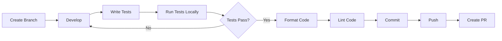

# 07 - Development Guide

> Development workflow และ best practices

## 📖 Table of Contents

- [Development Setup](#development-setup)
- [Creating New Steps](#creating-new-steps)
- [Development Workflow](#development-workflow)
- [Code Style](#code-style)
- [Testing](#testing)
- [Debugging](#debugging)

---

## Development Setup

### 1. Local Environment

```bash
# Clone repo
git clone <repo-url>
cd new_project_data_platform_the1_v4

# Create venv
python3.11 -m venv venv
source venv/bin/activate

# Install dependencies
pip install -r requirements.txt
pip install -r requirements-dev.txt
```

### 2. Development Dependencies

```txt
# requirements-dev.txt
pytest>=7.4.0
pytest-cov>=4.1.0
black>=23.7.0
flake8>=6.1.0
mypy>=1.5.0
pre-commit>=3.3.3
```

### 3. Pre-commit Hooks

```bash
# Install pre-commit
pip install pre-commit

# Setup hooks
pre-commit install

# Run manually
pre-commit run --all-files
```

---

## Creating New Steps

### Step 1: Define Step Class

```python
# data/processor/dataflow/common/steps/my_steps.py

from dataflow_common.core import BaseStep
import apache_beam as beam
import logging

LOGGER = logging.getLogger(__name__)


class MyCustomStep(BaseStep):
    """Custom step description.

    Config params:
        param1 (str): Description of param1
        param2 (int): Description of param2
        in (str): Input PCollection name
        out (str): Output PCollection name
    """

    def execute(self, pipeline: beam.Pipeline) -> beam.PCollection:
        # 1. Get input
        input_key = self.spec.get("in")
        pcoll = self.state[input_key]

        # 2. Get parameters
        param1 = self.spec.get("param1")
        param2 = self.spec.get("param2", 10)  # Default value

        LOGGER.info(f"[{self.step_id}] Processing with param1={param1}")

        # 3. Apply transformation
        result = (
            pcoll
            | f"{self.step_id}_Transform" >> beam.Map(
                lambda x: self._transform(x, param1, param2)
            )
        )

        # 4. Return output
        return result

    def _transform(self, element, param1, param2):
        """Helper method for transformation logic."""
        # Implement transformation
        return transformed_element
```

### Step 2: Register Step

```python
# data/processor/dataflow/common/registry.py

from dataflow_common.steps.my_steps import MyCustomStep

STEP_REGISTRY = {
    # ... existing steps
    "MyCustomStep": MyCustomStep,
}
```

### Step 3: Export Step

```python
# data/processor/dataflow/common/steps/__init__.py

from dataflow_common.steps.my_steps import MyCustomStep

__all__ = [
    # ... existing exports
    "MyCustomStep",
]
```

### Step 4: Use in Config

```yaml
# configs/my_pipeline.yaml
plan:
  - step: MyCustomStep
    id: custom_transform
    in: input_data
    params:
      param1: "value1"
      param2: 20
    out: output_data
```

### Step 5: Write Tests

```python
# tests/unit/test_my_steps.py

import pytest
import apache_beam as beam
from apache_beam.testing.test_pipeline import TestPipeline
from apache_beam.testing.util import assert_that, equal_to

from dataflow_common.steps.my_steps import MyCustomStep


def test_my_custom_step():
    """Test MyCustomStep transformation."""
    with TestPipeline() as p:
        # Create test input
        input_data = p | beam.Create([
            {'id': 1, 'value': 10},
            {'id': 2, 'value': 20},
        ])

        # Setup step
        spec = {
            'step': 'MyCustomStep',
            'in': 'input',
            'param1': 'test',
            'param2': 5,
        }
        state = {'input': input_data}
        config = ...  # Mock config

        # Execute step
        step = MyCustomStep(spec=spec, config=config, state=state)
        output = step.execute(p)

        # Assert output
        assert_that(output, equal_to([
            {'id': 1, 'value': 15},  # Expected transformation
            {'id': 2, 'value': 25},
        ]))
```

---

## Development Workflow

### Branch Strategy

```bash
# Create feature branch
git checkout -b feature/my-new-feature

# Or fix branch
git checkout -b fix/bug-description
```

### Workflow Steps



### 1. Development

```bash
# Edit code
vim data/processor/dataflow/common/steps/my_steps.py

# Run locally
python scripts/my_pipeline.py \
  --config_path=configs/test.yaml \
  --runner=DirectRunner
```

### 2. Testing

```bash
# Run tests
pytest tests/unit/test_my_steps.py -v

# Run with coverage
pytest --cov=data/processor/dataflow --cov-report=html

# View coverage
open htmlcov/index.html
```

### 3. Code Formatting

```bash
# Format with black
black data/processor/dataflow/common/steps/

# Check formatting
black --check data/processor/dataflow/
```

### 4. Linting

```bash
# Run flake8
flake8 data/processor/dataflow/

# Run mypy (type checking)
mypy data/processor/dataflow/common/
```

### 5. Commit

```bash
# Add files
git add .

# Commit with conventional commit message
git commit -m "feat: add MyCustomStep for data transformation"

# Commit message format:
# feat: New feature
# fix: Bug fix
# docs: Documentation changes
# test: Test changes
# refactor: Code refactoring
```

### 6. Push & PR

```bash
# Push branch
git push origin feature/my-new-feature

# Create PR on GitLab
# Title: feat: Add MyCustomStep for data transformation
# Description: Detailed description of changes
```

---

## Code Style

### Python Style Guide

Follow PEP 8 with these additions:

```python
# 1. Use type hints
def transform_data(input: Dict[str, Any], config: PipelineConfig) -> Dict[str, Any]:
    """Transform data based on config."""
    pass

# 2. Add docstrings
class MyStep(BaseStep):
    """One-line description.

    Longer description if needed.

    Attributes:
        attr1: Description
        attr2: Description
    """

# 3. Use logging instead of print
LOGGER = logging.getLogger(__name__)
LOGGER.info(f"Processing {count} records")

# 4. Handle errors gracefully
try:
    result = process_data(input)
except ValueError as e:
    LOGGER.error(f"Invalid data: {e}")
    raise

# 5. Use f-strings for formatting
message = f"Processed {count} records in {duration}s"
```

### Naming Conventions

```python
# Classes: PascalCase
class MyCustomStep(BaseStep):
    pass

# Functions: snake_case
def transform_record(record):
    pass

# Constants: UPPER_CASE
MAX_RETRIES = 3
DEFAULT_TIMEOUT = 60

# Variables: snake_case
input_data = ...
transformed_result = ...
```

### Import Organization

```python
# 1. Standard library
import logging
import json
from typing import Any, Dict, List

# 2. Third-party
import apache_beam as beam
import pandas as pd

# 3. Local imports
from dataflow_common.core import BaseStep
from dataflow_common.config import PipelineConfig
```

---

## Testing

### Unit Tests

```python
# Test individual components
def test_transform_function():
    input_data = {'id': 1, 'value': 10}
    result = transform_function(input_data)
    assert result == {'id': 1, 'value': 20}
```

### Integration Tests

```python
# Test full pipeline flow
def test_pipeline_integration():
    config = load_config("configs/test.yaml")
    orchestrator = Orchestrator(config)
    # Run pipeline and verify outputs
```

### Test Coverage

```bash
# Aim for >80% coverage
pytest --cov=data/processor/dataflow \
  --cov-report=term \
  --cov-report=html

# View coverage report
open htmlcov/index.html
```

---

## Debugging

### Local Debugging

```python
# Add breakpoints
import pdb; pdb.set_trace()

# Or use logging
LOGGER.debug(f"Input data: {input_data}")
LOGGER.debug(f"After transform: {result}")
```

### Dataflow Debugging

```bash
# 1. Check job logs
gcloud logging read \
  "resource.type=dataflow_step AND resource.labels.job_id=<job-id>" \
  --limit=100

# 2. View worker logs
gcloud logging read \
  "resource.type=dataflow_step AND severity>=ERROR" \
  --limit=50

# 3. Describe job
gcloud dataflow jobs describe <job-id> \
  --region=asia-southeast1
```

### Common Issues

**Issue**: PCollection not found in state

```python
# Check state keys
LOGGER.info(f"Available state keys: {list(self.state.keys())}")

# Verify input reference
input_key = self.spec.get("in")
if input_key not in self.state:
    raise KeyError(f"Input '{input_key}' not found in state")
```

**Issue**: Config placeholder not resolved

```python
# Check config formatting
LOGGER.debug(f"Raw spec: {self.spec}")
LOGGER.debug(f"Formatted value: {_format_value(value, self.config)}")
```

---

## Next Steps

📖 Continue reading:
- [08-TESTING](./08-TESTING.md) - Testing guide
- [09-DEPLOYMENT](./09-DEPLOYMENT.md) - Deployment procedures
- [10-TROUBLESHOOTING](./10-TROUBLESHOOTING.md) - Troubleshooting guide

---

**Document Version**: 1.0
**Last Updated**: 2024-01-15
**Author**: Data Engineering Team
